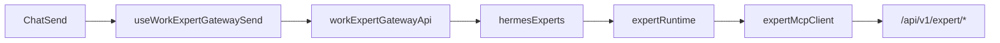

# v7.5.1 Runtime Skill 固定路由 Hotfix 实施计划

## 问题根因

v7.5 在错误链路上完成了 Stream Adapter，Chat 仍走：



导致 Runtime Skill 收到 OpenAI-compatible `arguments`（`model/messages/stream`），NoDeskClaw 返回 **`prompt is required`**。

v7.5.1 要求 **新增独立 `nodeskclaw` 域**，Chat Runtime Skill **禁止**再进入 `hermes-experts` / `expert-runtime.ts` / `expert-mcp-client.ts`。

## 目标架构

```mermaid
flowchart LR
  ChatSend --> useRuntimeSkillSend
  useRuntimeSkillSend --> runtimeSkillApi
  runtimeSkillApi --> nodeskclawPreload["window.nodeskclawRuntimeSkillAPI"]
  nodeskclawPreload --> nodeskclawIPC["nodeskclaw:* IPC"]
  nodeskclawIPC --> runtimeSkillClient
  runtimeSkillClient --> mcpGateway["POST /api/v1/hermes/mcp/skill-gateway"]
  mcpGateway --> structuredContent["structuredContent: task_id / event_stream"]
  structuredContent --> taskStreamProxy
  taskStreamProxy --> nodeskclawEvent["nodeskclaw:task-event"]
  nodeskclawEvent --> useNodeskclawTaskStream
  useNodeskclawTaskStream --> TimelineUI
```



## 可复用 vs 禁止复用

| 来源 | 策略 |
|------|------|
| [`src/main/hermes-experts/expert-task-stream.ts`](src/main/hermes-experts/expert-task-stream.ts) | **参考** SSE 代理模式，复制到 `nodeskclaw-task-stream.ts`，改 IPC 通道 + `/hermes/tasks/` 校验 |
| [`src/main/hermes-experts/expert-artifact-client.ts`](src/main/hermes-experts/expert-artifact-client.ts) | **参考** preview/download 模式，复制到 `nodeskclaw-artifact-client.ts` |
| [`src/main/mcp-skill-gateway-runtime/mcp-token-provider.ts`](src/main/mcp-skill-gateway-runtime/mcp-token-provider.ts) | **直接复用** `getMcpAccessToken()` |
| [`src/main/mcp-skill-gateway-runtime/mcp-skill-gateway-config.ts`](src/main/mcp-skill-gateway-runtime/mcp-skill-gateway-config.ts) + [`mcp-backend-descriptor.ts`](src/main/mcp-skill-gateway-runtime/mcp-backend-descriptor.ts) | **直接复用** backend URL / MCP endpoint 解析 |
| [`src/main/genehub/device-identity.ts`](src/main/genehub/device-identity.ts) | **直接复用** `getDeviceIdentity()` 注入 `x-device-id` |
| v7.5 UI：`ExpertTaskTimelineBlock` / `ExpertTaskArtifactCard` / `WorkExpertOutputPanel` | **复制改名** 为 `RuntimeSkill*` 组件，类型改绑 `nodeskclaw` contract |
| `workExpertGatewayApi` / `useWorkExpertGatewaySend` / `useExpertTaskStream` | Chat **停止使用**；文件保留给 legacy Expert Gateway（Workbench 等） |

**当前仓库尚无** `src/main/nodeskclaw/`、`src/shared/nodeskclaw/`（需从零新建）。

---

## 实施阶段（对齐 PRD §22）

### Task 1 — Shared Contract + Guards

新建：

- [`src/shared/nodeskclaw/runtime-skill-contract.ts`](src/shared/nodeskclaw/runtime-skill-contract.ts) — `McpTool`、`RuntimeSkillCallArguments`、`RuntimeSkillStructuredContent`、`CallRuntimeSkillInput` 等（按 PRD §12.2）
- [`src/shared/nodeskclaw/runtime-skill-guards.ts`](src/shared/nodeskclaw/runtime-skill-guards.ts) — `isRuntimeSkillTool()`、`assertRuntimeSkillTool()`、`assertNoRouteOverride()`、`assertNoHermesRunEventStream()`（PRD §6、§8.3）
- [`src/shared/nodeskclaw/task-stream-contract.ts`](src/shared/nodeskclaw/task-stream-contract.ts) — `NodeskclawTaskEvent`、subscribe/unsubscribe 输入输出
- [`src/shared/nodeskclaw/artifact-contract.ts`](src/shared/nodeskclaw/artifact-contract.ts) — preview/download 契约

验收：`forbidden keys` 同时校验 `arguments` 根与 `context`；`/v1/runs/` event stream 被拦截。

### Task 2 — Main MCP Client + Auth

新建：

- [`src/main/nodeskclaw/nodeskclaw-auth.ts`](src/main/nodeskclaw/nodeskclaw-auth.ts) — 薄封装：`getGatewayUrl()`（复用 `resolveRemoteMcpUrlAsync`）、`getMcpAccessToken()`、`getDeviceId()`、`buildHeaders()`（含 `x-client` / `x-client-version` / `x-device-id` / `x-nodeskclaw-entry`）
- [`src/main/nodeskclaw/nodeskclaw-mcp-client.ts`](src/main/nodeskclaw/nodeskclaw-mcp-client.ts) — `callMcpGateway(method, params)` → `POST /api/v1/hermes/mcp/skill-gateway`，JSON-RPC 错误与 timeout 统一处理
- [`src/main/nodeskclaw/nodeskclaw-types.ts`](src/main/nodeskclaw/nodeskclaw-types.ts) — Main 内部辅助类型（可选）

### Task 3 — Runtime Skill Client

新建 [`src/main/nodeskclaw/nodeskclaw-runtime-skill-client.ts`](src/main/nodeskclaw/nodeskclaw-runtime-skill-client.ts)：

1. `listRuntimeSkillTools()` — `tools/list` → `isRuntimeSkillTool` 过滤
2. `callRuntimeSkill({ tool, prompt, context })` — `tools/call`，`arguments` **仅** `{ prompt, context }`
3. Main 侧合并 `device_id` / `client_version`（Renderer 不传 token）
4. 读取 `response.result.structuredContent`，校验 `execution_mode === async_event`、`event_stream` 含 `/hermes/tasks/`、不含 `/v1/runs/`
5. 打印 `[runtime-skill-call]` 日志（PRD §20）

### Task 4 — Task SSE Proxy

新建 [`src/main/nodeskclaw/nodeskclaw-task-stream.ts`](src/main/nodeskclaw/nodeskclaw-task-stream.ts)（参考 v7.5 `expert-task-stream.ts`）：

- `subscribeTaskEvents` / `unsubscribeTaskEvents`
- Main `fetch` SSE + Bearer（token 仅 Main）
- `webContents.send("nodeskclaw:task-event" | "nodeskclaw:task-stream-error" | "nodeskclaw:task-stream-closed")`
- 订阅前 `assertNoHermesRunEventStream(eventSseUrl)`
- 断线重连最多 3 次；`task.completed` / `task.failed` 后关闭

### Task 5 — Artifact Client + IPC 注册

新建 [`src/main/nodeskclaw/nodeskclaw-artifact-client.ts`](src/main/nodeskclaw/nodeskclaw-artifact-client.ts) — `previewArtifact` / `downloadArtifact`（Main 代请求 `result_url` / `artifact_url`）

修改 [`src/main/index.ts`](src/main/index.ts) 注册 IPC：

```text
nodeskclaw:list-runtime-skills
nodeskclaw:call-runtime-skill
nodeskclaw:subscribe-task-events
nodeskclaw:unsubscribe-task-events
nodeskclaw:preview-artifact
nodeskclaw:download-artifact
```

建议新建 [`src/main/nodeskclaw/nodeskclaw-ipc.ts`](src/main/nodeskclaw/nodeskclaw-ipc.ts) 集中注册，与 `hermes-experts-ipc.ts` 模式一致。

### Task 6 — Preload API

新建 [`src/preload/nodeskclaw-runtime-skill-api.ts`](src/preload/nodeskclaw-runtime-skill-api.ts)，暴露 `window.nodeskclawRuntimeSkillAPI`（PRD §13）。

修改：

- [`src/preload/index.ts`](src/preload/index.ts) — `contextBridge.exposeInMainWorld("nodeskclawRuntimeSkillAPI", ...)`
- [`src/preload/index.d.ts`](src/preload/index.d.ts) — 完整类型声明；所有 `onXXX` 返回 unsubscribe

### Task 7 — Renderer API + Selector 数据源切换

新建 [`src/renderer/src/screens/Hermes/api/runtimeSkillApi.ts`](src/renderer/src/screens/Hermes/api/runtimeSkillApi.ts)：

- `listRuntimeSkillExperts()` — 从 `tools/list` 按 `runtimeProfile` 去重分组
- `listRuntimeSkillTools(runtimeProfile?)` — 按 expert 过滤 skill tools
- `callRuntimeSkill()` — 调 Preload；`context` 含 `source/ui_entry/conversation_id/workspace_id/attachment_ids`（`device_id` 由 Main 注入）

修改类型 [`src/renderer/src/screens/Hermes/types/work-chat.ts`](src/renderer/src/screens/Hermes/types/work-chat.ts)：

```ts
interface WorkChatSelectedSkill {
  // 现有字段保留
  runtimeTool: McpTool;  // 新增：发送时绑定完整 tool
}
```

修改 Selector：

- [`ExpertSelector.tsx`](src/renderer/src/screens/Hermes/pages/Chat/components/work/ExpertSelector.tsx) — `workExpertGatewayApi.listAuthorizedExperts` → `runtimeSkillApi.listRuntimeSkillExperts`
- [`ExpertSkillSelector.tsx`](src/renderer/src/screens/Hermes/pages/Chat/components/work/ExpertSkillSelector.tsx) — `listExpertSkills(slug)` → 按 `selectedExpert.runtimeProfile` 过滤 MCP tools；`setSkill` 保存 `runtimeTool`

修改 [`useWorkChatContext.ts`](src/renderer/src/screens/Hermes/pages/Chat/hooks/useWorkChatContext.ts)：

- `refreshGatewayHealth` 改为探测 MCP gateway（如 `listRuntimeSkills` 成功 → `"remote"`）
- `useExpertGateway` 条件改为：`selectedSkill?.runtimeTool != null && gatewayStatus === "remote"`

### Task 8 — Chat Send 分支替换

新建：

- [`useRuntimeSkillSend.ts`](src/renderer/src/screens/Hermes/pages/Chat/hooks/useRuntimeSkillSend.ts) — PRD §16.3 流程：`callRuntimeSkill` → 本地 assistant 消息 → `taskStream.startStream`
- [`useNodeskclawTaskStream.ts`](src/renderer/src/screens/Hermes/pages/Chat/hooks/useNodeskclawTaskStream.ts) — 订阅 `nodeskclaw:task-event`，归并 timeline，unmount unsubscribe

修改 [`HermesDefaultWebChatSurface.tsx`](src/renderer/src/screens/Hermes/pages/Chat/HermesDefaultWebChatSurface.tsx)：

- 移除 `useWorkExpertGatewaySend` + `useExpertTaskStream` 引用
- 接入 `useRuntimeSkillSend` + `useNodeskclawTaskStream`
- `handleSend`：`workContext.useExpertGateway` 时调用 `sendToRuntimeSkill`（不再 `sendToExpertGateway`）
- Timeline / Output Panel / artifact handlers 改绑 nodeskclaw hook

新建 UI（可复制 v7.5 组件后改名）：

- `RuntimeSkillTimelineBlock.tsx`
- `RuntimeSkillArtifactCard.tsx`
- 复用或改绑 `WorkExpertOutputPanel` → 使用 nodeskclaw artifact 类型

[`Hermes.css`](src/renderer/src/screens/Hermes/Hermes.css) — 复用现有 timeline 样式类名或增加 `runtime-skill-*` 别名。

### Task 9 — 文档与验证

- 更新 [`docs/API_CONTRACTS.md`](docs/API_CONTRACTS.md) — 新增 `nodeskclaw:*` IPC/事件表；注明 Chat Runtime Skill **禁止**使用 `hermes-experts:*`
- 按 [007-sync-project-docs](.cursor/rules/007-sync-project-docs.mdc) 增量更新 `AGENTS.md` Preload 表（`window.nodeskclawRuntimeSkillAPI`）

验证命令：

```bash
npm run typecheck
npm run build
```

手工验收（PRD §23）：

- Chat 选 Runtime Skill 发送后，Network/Main 日志仅见 `POST .../hermes/mcp/skill-gateway` + `method=tools/call`
- `arguments` 仅 `{ prompt, context }`；**不再出现** `prompt is required`
- `structuredContent.event_stream` 含 `/hermes/tasks/`，不含 `/v1/runs/`
- Timeline 显示 started/progress/artifact/completed/failed
- Artifact preview/download 经 Main IPC，Renderer 不直接 fetch 远端 URL
- 普通 Hermes Chat（无 expert/skill 选中）仍走 `hermesDefaultChat`，行为不变

---

## 明确不做

- **不修补** `workExpertGatewayApi` 的 OpenAI payload 或 `expert-mcp-client.callSkill`
- **不删除** `hermes-experts` 模块（Workbench / ExpertRuns 等 legacy 仍可用）
- **不改** [`src/main/hermes.ts`](src/main/hermes.ts) 与普通 8642 Gateway Chat
- **不新增** i18n key（PRD 要求英文硬编码标签）
- **不修改** 含 `#command by loudon` 的注释块

## 风险与注意点

1. **Expert 分组逻辑**：PRD §7.3 允许按 `runtimeProfile` 分组；若同一 profile 多 tool，Skill selector 用 `tool.name` / `tool.title` 展示。
2. **Gateway 健康**：无独立 health 端点时，以 `tools/list` 成功作为 `"remote"` 判定即可。
3. **v7.5 hermes-experts IPC 残留**：Chat 路径切换后，v7.5 新增的 `hermes-experts:subscribe-task-events` 等对 Chat 变为 dead code，但保留不动以免影响其他页面。
