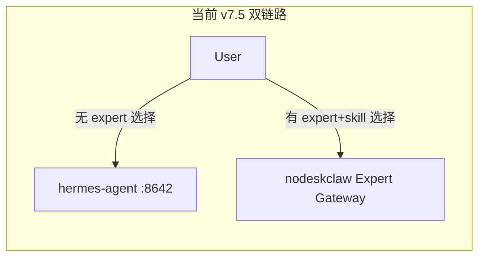
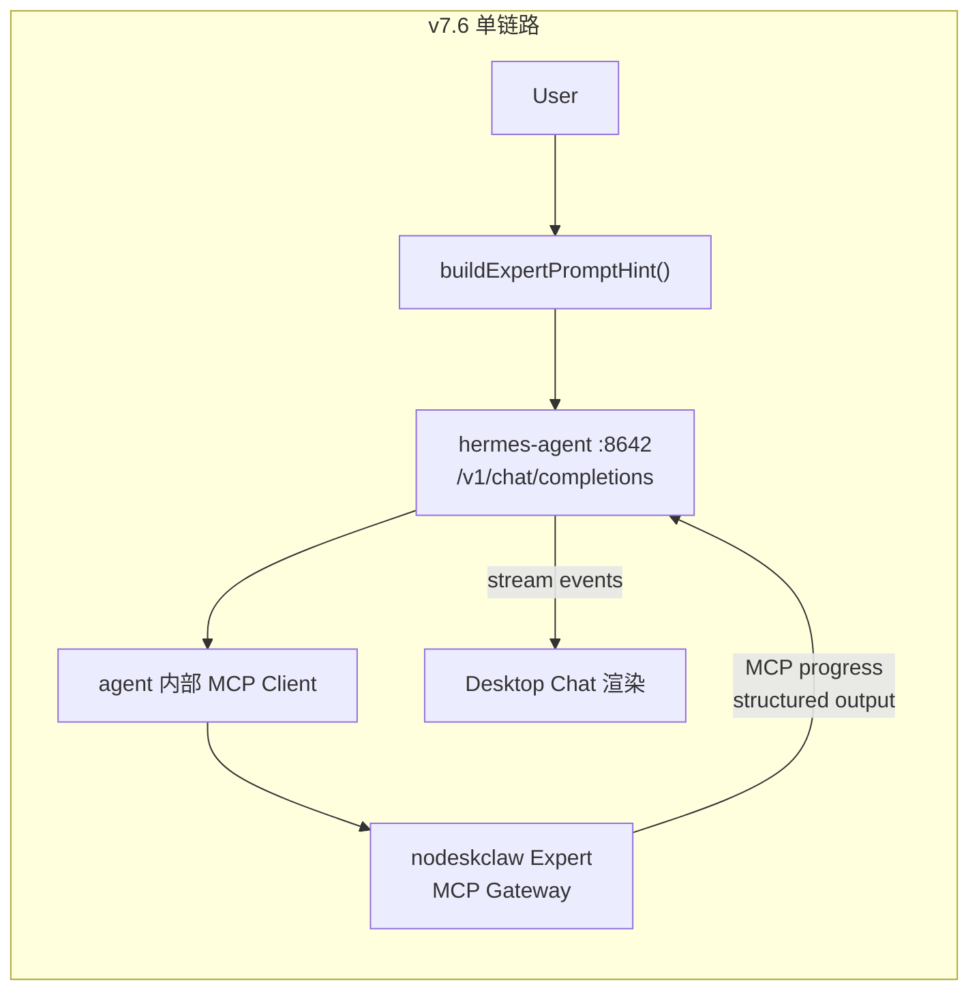

# v7.6 Hermes Agent MCP Host Mode 实施计划

## 当前现状

Desktop Chat 页存在**两条发送链路**：



关键文件与职责：

- `useWorkChatContext.ts` — 维护 `useExpertGateway` 布尔值，当 `selectedExpert + selectedSkill + gatewayStatus === "remote"` 时为 true
- `HermesDefaultWebChatSurface.tsx` — `handleSend()` 根据 `workContext.useExpertGateway` 分叉：true 走 `runtimeSkillSend.sendToRuntimeSkill()`，false 走 `stream.send()`
- `useRuntimeSkillSend.ts` — 调用 `workExpertGatewayApi.callExpertSkill()` 直连 nodeskclaw
- `workExpertGatewayApi.ts` — 封装 `window.hermesExperts.callCatalogSkill()`（直连 nodeskclaw Expert MCP Gateway）
- `useExpertTaskStream.ts` — 订阅 nodeskclaw SSE task events
- `WorkComposerControls.tsx` — 展示 Expert/Skill/Permission 选择器 + "Use Expert Gateway" 提示

## 目标架构



---

## Phase 1：移除 direct gateway 主链路

**目标**：Chat 发送不再分叉，所有消息统一走 hermes-agent。

### 1.1 修改 `HermesDefaultWebChatSurface.tsx` 的 `handleSend`

- 移除 `if (workContext.useExpertGateway)` 分支
- 当有 expert+skill 选择时，先调 `buildExpertPromptHint()` 生成增强 prompt，再统一走 `stream.send()`

### 1.2 修改 `useWorkChatContext.ts`

- `useExpertGateway` 始终返回 `false`（或移除该字段）
- 保留 `selectedExpert` / `selectedSkill` / `permissionMode` 状态（用于 prompt hint 生成）

### 1.3 停用 `useRuntimeSkillSend` 和 `useExpertTaskStream`

- `HermesDefaultWebChatSurface` 不再调用 `runtimeSkillSend.sendToRuntimeSkill()`
- 不再引用 `expertTaskStream.startStream` / `previewArtifact` / `downloadArtifact`
- 不再渲染 nodeskclaw task accepted 卡片和 artifact 面板

### 1.4 修改 `WorkComposerControls.tsx`

- 移除 "Use Expert Gateway" 提示
- 保留 Expert/Skill/Permission 选择器（用于 prompt hint）

**涉及文件**：

- [`src/renderer/src/screens/Hermes/pages/Chat/HermesDefaultWebChatSurface.tsx`](src/renderer/src/screens/Hermes/pages/Chat/HermesDefaultWebChatSurface.tsx)
- [`src/renderer/src/screens/Hermes/pages/Chat/hooks/useWorkChatContext.ts`](src/renderer/src/screens/Hermes/pages/Chat/hooks/useWorkChatContext.ts)
- [`src/renderer/src/screens/Hermes/pages/Chat/components/work/WorkComposerControls.tsx`](src/renderer/src/screens/Hermes/pages/Chat/components/work/WorkComposerControls.tsx)
- [`src/renderer/src/screens/Hermes/types/work-chat.ts`](src/renderer/src/screens/Hermes/types/work-chat.ts)

---

## Phase 2：MCP 配置写入 hermes-agent

**目标**：新增 `hermes-mcp-config` 模块，让 Desktop 管理 hermes-agent 的 `config.yaml` 中 `mcp_servers` 段。

### 2.1 新增 Main 模块

创建 `src/main/hermes-mcp-config/`：

- `hermes-mcp-config-types.ts` — `McpServerConfig` / `McpServerEntry` 类型
- `hermes-mcp-config-service.ts` — 读写 `config.yaml` 的 `mcp_servers` 段 + `.env` 中 token
- `hermes-mcp-config-validator.ts` — 校验配置合法性
- `hermes-mcp-config-ipc.ts` — 注册 8 个 IPC handler

**IPC 通道**：`hermes-mcp:get-servers` / `save-server` / `remove-server` / `enable-server` / `disable-server` / `test-server` / `reload` / `list-tools`

### 2.2 config.yaml 写入逻辑

利用现有 [`hermes-config-yaml.ts`](src/main/hermes-config/hermes-config-yaml.ts) 的 `readHermesConfig()` / `writeHermesConfig()` 扩展：

- 在 `HermesConfigDocument` 类型中新增 `mcp_servers` 字段
- 保存后触发 gateway restart（复用现有 `restartGateway()`）

### 2.3 Preload + Renderer

- `src/preload/hermes-mcp-config-api.ts` — 封装 IPC
- `src/preload/index.d.ts` — 新增 `window.hermesMcpConfig` 类型声明
- `src/shared/hermes-mcp-config/` — 共享类型

**涉及文件**：

- 新建 `src/main/hermes-mcp-config/` 4 文件
- 新建 `src/shared/hermes-mcp-config/hermes-mcp-config-contract.ts`
- 新建 `src/preload/hermes-mcp-config-api.ts`
- 修改 [`src/main/hermes-config/hermes-config-yaml.ts`](src/main/hermes-config/hermes-config-yaml.ts) — 扩展 `HermesConfigDocument`
- 修改 [`src/main/index.ts`](src/main/index.ts) — 注册 IPC
- 修改 [`src/preload/index.ts`](src/preload/index.ts) — 暴露 API
- 修改 [`src/preload/index.d.ts`](src/preload/index.d.ts) — 类型声明

---

## Phase 3：Chat prompt hint 改造

**目标**：expert/skill 选择不再触发直连调用，而是生成 prompt hint 拼接到用户消息中。

### 3.1 新增 `buildExpertPromptHint.ts`

路径：`src/renderer/src/screens/Hermes/pages/Chat/utils/buildExpertPromptHint.ts`

```typescript
interface ExpertPromptHintInput {
  userMessage: string;
  expertName?: string;
  expertId?: string;
  skillName?: string;
  mcpServerName?: string;
  permissionMode?: "default" | "readonly" | "write";
  outputPreference?: "markdown" | "docx" | "pdf";
}

function buildExpertPromptHint(input: ExpertPromptHintInput): string {
  // 按 PRD 7.2 模板生成提示文本
}
```

### 3.2 新增 `PromptHintPreview.tsx`

路径：`src/renderer/src/screens/Hermes/pages/Chat/components/PromptHintPreview.tsx`

可折叠预览面板，展示即将发送的 prompt hint 内容。

### 3.3 集成到 `HermesDefaultWebChatSurface`

- `handleSend` 中：有 expert+skill 时调用 `buildExpertPromptHint()` → 拼接后统一 `stream.send()`
- ComposerBar 区域展示 `PromptHintPreview`

**涉及文件**：

- 新建 `src/renderer/src/screens/Hermes/pages/Chat/utils/buildExpertPromptHint.ts`
- 新建 `src/renderer/src/screens/Hermes/pages/Chat/components/PromptHintPreview.tsx`
- 修改 `HermesDefaultWebChatSurface.tsx`

---

## Phase 4：stream 过程展示

**目标**：利用 hermes-agent 的 `hermes.tool.progress` 事件展示 MCP 工具调用过程。

### 4.1 新增 `ToolProgressTimeline.tsx`

路径：`src/renderer/src/screens/Hermes/pages/Chat/components/ToolProgressTimeline.tsx`

映射规则：
- `hermes.tool.progress` → 工具执行进度条目
- `function_call` → Tool Started
- `function_call_output` → Tool Completed
- 最终 response → Assistant Message

### 4.2 扩展现有 SSE parser 支持

检查 [`src/main/sse-parser.ts`](src/main/sse-parser.ts) 是否已支持 `hermes.tool.progress` 事件类型，必要时扩展解析。

### 4.3 集成到 `ChatScrollArea`

`ChatScrollArea.tsx` 中增加 `ToolProgressTimeline` 渲染位置。

**涉及文件**：

- 新建 `src/renderer/src/screens/Hermes/pages/Chat/components/ToolProgressTimeline.tsx`
- 可能修改 `src/main/sse-parser.ts`
- 修改 `ChatScrollArea.tsx`

---

## Phase 5：文档卡片

**目标**：从 hermes-agent 最终回答中识别本地文件路径，展示文档卡片。

### 5.1 新增 `LocalDocumentCard.tsx`

路径：`src/renderer/src/screens/Hermes/pages/Chat/components/LocalDocumentCard.tsx`

识别模式：`file://...`、`C:\Users\...`、`~/.hermes/workspace/...`

功能：文件名 + 本地路径 + 打开 + 在文件夹中显示（通过 `window.hermesAPI.openExternal` / `shell.showItemInFolder`）

### 5.2 集成到消息渲染

在 assistant message 渲染中扫描本地路径，匹配时替换为 `LocalDocumentCard`。

**涉及文件**：

- 新建 `src/renderer/src/screens/Hermes/pages/Chat/components/LocalDocumentCard.tsx`
- 修改消息渲染组件

---

## Phase 6：清理旧代码

**目标**：移除已不再使用的 direct gateway 代码路径。

### 6.1 从业务入口移除引用

- `HermesDefaultWebChatSurface` 不再 import `useRuntimeSkillSend` / `useExpertTaskStream`
- `WorkComposerControls` 移除 gateway hint 相关 UI

### 6.2 标记废弃或删除

以下文件/函数降级为 debug-only 或删除：

- `workExpertGatewayApi.callExpertSkill` — 不再在业务路径调用
- `useRuntimeSkillSend.ts` — 废弃
- `useExpertTaskStream.ts` — 废弃
- `window.hermesExperts.callCatalogSkill` — 业务入口不再调用（保留 API 供调试）

### 6.3 类型清理

- `WorkChatContext.useExpertGateway` 移除
- `WorkExpertGatewayCallInput` / `WorkExpertGatewayCallResult` 标记 deprecated

**涉及文件**：

- 修改 `types/work-chat.ts`
- 修改多个引用了废弃函数的组件文件

---

## 验收标准

1. 发送 expert skill 消息时，Network / Main log 中不出现 desktop -> nodeskclaw `tools/call`
2. MCP 配置页能读写 `config.yaml` 的 `mcp_servers` 段
3. 选择 expert+skill 后，发送到 hermes-agent 的消息包含 prompt hint
4. hermes-agent tool progress 在 Chat 页面显示处理过程
5. 最终回答中的本地路径渲染为文档卡片
6. `npm run typecheck` 通过
