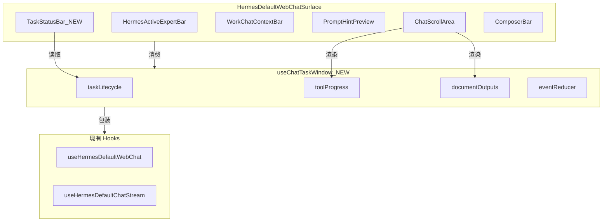

# v7.7 Chat 页面任务窗口化

## 现状分析

当前 Chat 页面已具备良好的组件化基础：

- `HermesDefaultWebChatSurface` 组合了 ChatScrollArea、ComposerBar、HermesActiveExpertBar、StatusToast
- `ComposerBar` 已预留 `workControlsSlot` 插槽，当前挂载 `WorkComposerControls`
- `ChatScrollArea` 已集成 `ToolProgressTimeline`、`LocalDocumentCard`、`extractLocalDocumentPaths`
- `useHermesDefaultChatStream` 已订阅 `onChunk / onToolProgress / onUsage / onDone / onError`
- `buildExpertPromptHint` + `PromptHintPreview` + `WorkChatContextBar` 已实现 prompt hint 生成与预览
- 发送链路统一走 `chatApi.chat.sendMessage()`，符合 v7.6 架构

**核心判断**：现有代码已覆盖 PRD 约 60% 的功能需求，v7.7 主要做**增强**而非重建。

## 架构决策



## 实施阶段

### P0: 核心能力（本次实施）

#### 阶段 1: 类型与数据层

**新增文件**: [`src/renderer/src/screens/Hermes/pages/Chat/types/chat-task-window.ts`](src/renderer/src/screens/Hermes/pages/Chat/types/chat-task-window.ts)

定义：
- `ChatTaskStatus` — `draft | ready | creating | running | waiting_tool | waiting_approval | completed | failed | cancelled`
- `ChatTaskEvent` — 统一事件 discriminated union
- `ToolProgressEntry` 增强版（新增 `title`, `message`, `taskId` 字段）— 与现有 `ToolProgressEntry`（在 `ToolProgressTimeline.tsx` 中）兼容扩展

```typescript
export type ChatTaskStatus =
  | "draft" | "ready" | "creating" | "running"
  | "waiting_tool" | "waiting_approval"
  | "completed" | "failed" | "cancelled";

export type ChatTaskEvent =
  | { type: "task.status"; status: ChatTaskStatus }
  | { type: "chat.chunk"; content: string }
  | { type: "tool.progress"; entry: ToolProgressEntry }
  | { type: "output.document"; path: string }
  | { type: "usage"; usage: unknown }
  | { type: "error"; error: string }
  | { type: "done"; sessionId?: string };
```

#### 阶段 2: useChatTaskWindow hook

**新增文件**: [`src/renderer/src/screens/Hermes/pages/Chat/hooks/useChatTaskWindow.ts`](src/renderer/src/screens/Hermes/pages/Chat/hooks/useChatTaskWindow.ts)

职责：
- 包装 `useHermesDefaultWebChat`，不改变其内部逻辑
- 从 `stream.runState` + 组合 composer/tool 状态 → 派生 `ChatTaskStatus`
- 从 `stream.streamingContent` + 已有消息 → 聚合 `documentOutputs: LocalDocumentRef[]`
- 从 `stream.toolProgressTimeline` → 转为增强版 timeline（增加折叠/合并逻辑）
- 暴露 `taskTitle`（从首条用户消息截取）、`taskDuration`（计时器）、`taskExpert`/`taskSkill`

状态映射逻辑（纯派生，不新增 state）：

```text
stream.runState === "idle" && messages.length === 0  → "draft"
stream.runState === "idle" && composer.text.trim()    → "ready"
stream.runState === "creating"                        → "creating"
stream.runState === "streaming" && !activeTool         → "running"
stream.runState === "streaming" && activeTool          → "waiting_tool"
stream.runState === "completed"                        → "completed"
stream.runState === "error"                           → "failed"
stream.runState === "cancelled"                       → "cancelled"
```

#### 阶段 3: TaskStatusBar 组件

**新增文件**: [`src/renderer/src/screens/Hermes/pages/Chat/components/TaskStatusBar.tsx`](src/renderer/src/screens/Hermes/pages/Chat/components/TaskStatusBar.tsx)

- 紧凑条形 UI，class 前缀 `hermes-webchat-task-status`
- 展示：任务标题（截断）、当前状态 badge、Expert/Skill 名、运行时长
- 仅在 `status !== "draft"` 时显示
- 无状态组件，所有数据由 `useChatTaskWindow` 传入

#### 阶段 4: ToolProgressTimeline 增强

**修改文件**: [`src/renderer/src/screens/Hermes/pages/Chat/components/ToolProgressTimeline.tsx`](src/renderer/src/screens/Hermes/pages/Chat/components/ToolProgressTimeline.tsx)

现有 `ToolProgressEntry` 类型保持兼容，新增可选字段 `title`, `message`。

增强渲染规则（PRD 7.3）：
- completed 状态折叠为一行（已有时间戳）
- failed 状态高亮展示（不另开 ErrorCard，由 ChatScrollArea 已有逻辑处理）
- 同一 `name` 连续 progress 合并
- final response 出现后 timeline 默认折叠（新增 `collapsed` prop）

#### 阶段 5: LocalDocumentCard 增强

**修改文件**: [`src/renderer/src/screens/Hermes/pages/Chat/components/LocalDocumentCard.tsx`](src/renderer/src/screens/Hermes/pages/Chat/components/LocalDocumentCard.tsx)

- 增加文件类型 icon（根据扩展名判断）
- 增加「复制路径」按钮
- 保持现有 class 命名 `hermes-local-document-card`

**修改文件**: [`src/renderer/src/screens/Hermes/pages/Chat/utils/extractLocalDocumentPaths.ts`](src/renderer/src/screens/Hermes/pages/Chat/utils/extractLocalDocumentPaths.ts)

- 增加 `.hermes/workspace/` 路径模式
- `LocalDocumentRef` 增加可选 `fileType` 字段

#### 阶段 6: PromptHintComposer 增强

**修改文件**: [`src/renderer/src/screens/Hermes/pages/Chat/components/PromptHintComposer.tsx`](src/renderer/src/screens/Hermes/pages/Chat/components/PromptHintPreview.tsx)

现有 `PromptHintPreview` 已有折叠/展开和预览功能，增强为 PRD 6.4 要求的 `PromptHintComposer`：
- 支持展开后编辑 prompt hint 文本
- 支持复制生成的 hint
- 支持恢复默认模板
- class 前缀改为 `hermes-webchat-prompt-hint`

#### 阶段 7: HermesDefaultWebChatSurface 集成

**修改文件**: [`src/renderer/src/screens/Hermes/pages/Chat/HermesDefaultWebChatSurface.tsx`](src/renderer/src/screens/Hermes/pages/Chat/HermesDefaultWebChatSurface.tsx)

- 引入 `useChatTaskWindow` 替代直接使用 `useHermesDefaultWebChat`（`useChatTaskWindow` 内部包装后者）
- 在 `HermesActiveExpertBar` 下方挂载 `TaskStatusBar`
- `ChatScrollArea` 传入增强后的 timeline 和 document props
- ComposerBar 的 `workControlsSlot` 保持现有 `WorkComposerControls`

#### 阶段 8: ChatScrollArea 微调

**修改文件**: [`src/renderer/src/screens/Hermes/pages/Chat/ChatScrollArea.tsx`](src/renderer/src/screens/Hermes/pages/Chat/ChatScrollArea.tsx)

- `ToolProgressTimeline` 接收 `collapsed` prop
- 在 streaming 区域与历史消息之间增加 `TaskLifecycleCard`（轻量状态卡片，仅在 completed/failed 时渲染一行摘要）

## 不改动的文件

- `useHermesDefaultChatStream.ts` — 发送链路不变（`chatApi.chat.sendMessage`）
- `ComposerBar.tsx` — toolbar 行为不变
- `ChatBubble.tsx` — 基础视觉不变
- 不新增 desktop direct nodeskclaw 调用
- 不恢复 `useExpertTaskStream` / `workExpertGatewayApi.callExpertSkill`
- 不新增 `artifactUrl` 逻辑

## 文件变更总览

| 操作 | 文件 |
|------|------|
| 新增 | `pages/Chat/types/chat-task-window.ts` |
| 新增 | `pages/Chat/hooks/useChatTaskWindow.ts` |
| 新增 | `pages/Chat/components/TaskStatusBar.tsx` |
| 修改 | `pages/Chat/components/ToolProgressTimeline.tsx` |
| 修改 | `pages/Chat/components/LocalDocumentCard.tsx` |
| 修改 | `pages/Chat/utils/extractLocalDocumentPaths.ts` |
| 修改 | `pages/Chat/components/PromptHintPreview.tsx` → 增强为 PromptHintComposer |
| 修改 | `pages/Chat/HermesDefaultWebChatSurface.tsx` |
| 修改 | `pages/Chat/ChatScrollArea.tsx` |

## 验收

```bash
npm run typecheck
```

- Chat 页面保持原有视觉风格
- Expert/Skill 选择仍只生成 prompt hint
- 发送走 `useHermesDefaultChatStream` -> `chatApi.chat.sendMessage`
- task 状态 draft -> creating -> running -> completed 正确变化
- tool progress 显示为 timeline 并支持折叠
- final response 中的本地文件路径显示为文档卡片
- Stop / 附件 / 模型选择 / 更多操作不被破坏
