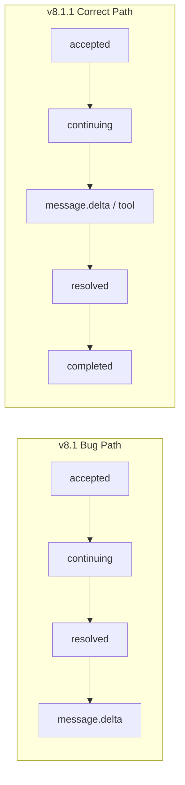

# v8.1.1 Durable Runtime Integration Closure (PR1–PR6)

## 基线与范围

- 基线：v8.1.0 PR1–PR5 已落地（`specs/current-agent-state.md` done）；基础设施在，**生产接线与一致性未闭环**
- 本次范围：**PR1–PR6**；**PR7 Deprecated 清理/Cutover 顺延**
- 状态机：每阶段更新 `specs/current-agent-task.md` / `current-agent-state.md` / `current-agent-log.md`
- 不改计划文件本身；不物理删除 Legacy Chat

## 已核实的关键缺口（对齐 PRD §一）

| # | 问题 | 关键位置 |
|---|---|---|
| 1 | Continuation 返回 Handle 后立刻 `resolved` | [`chat-runtime-ipc.ts`](src/main/chat-runtime/chat-runtime-ipc.ts) command handler + [`hermes-interaction-continuation-adapter.ts`](src/main/chat-runtime/hermes-interaction-continuation-adapter.ts) |
| 2 | Native API 与 Fallback 可同时执行 | adapter `continueClarify`/`continueApproval` |
| 3 | Capability 探测失败默认 `session_continuation: true` | adapter probe defaults |
| 4 | Continuation 未恢复 Expert/Team/Work/History 等 | `startStreamingContinuation` 仅 profile/session/model |
| 5 | Sequencer 纯内存，重启后 sequence 从 1 | [`chat-event-sequencer.ts`](src/main/chat-runtime/chat-event-sequencer.ts) |
| 6 | Store 用 `activeStateDbPath()`，多 Profile 串库 | [`chat-runtime-store.ts`](src/main/chat-runtime/chat-runtime-store.ts) → [`getDbConnection`](src/main/chat-files/platform/db.ts) |
| 7–8 | Recovery Hook/getState 未接线，无法重建 UI | [`useChatRuntimeRecovery.ts`](src/renderer/src/modules/chat/hooks/useChatRuntimeRecovery.ts) 未被 [`ChatSurface`](src/renderer/src/modules/chat/components/ChatSurface.tsx) 使用 |
| 9–10 | Queue 表存在但无 IPC/UI 接线 | `useChatQueue` 本地 reducer；[`QueuedMessages`](src/renderer/src/modules/chat/components/composer/QueuedMessages.tsx) 仅 text+count |
| 11–12 | Error Card 仍 `retryLastTurn`；无 `runContext` 传入 | ChatSurface ~L313；Host 未传 `ChatRunContextPort` |
| 13 | Diagnostics 无生产入口；`fileIds: []` | [`ChatDiagnosticsExportButton`](src/renderer/src/modules/chat/components/diagnostics/ChatDiagnosticsExportButton.tsx) 用 `<a download>` |
| 14–15 | 无 UNIQUE(sequence) 事务；Continuation 测试过浅；无 Playwright | — |

## PR1 — Interaction Correctness Hotfix

**目标**：一次 Approval/Clarify 只走一条路径；Resolved 仅在 continuation completion 之后。

**Main**
- 改造 [`hermes-interaction-continuation-adapter.ts`](src/main/chat-runtime/hermes-interaction-continuation-adapter.ts)：
  - 返回 `ChatContinuationExecution = { handle, completion }`（PRD §4.2）
  - Capability 三态 `supported | unsupported | unknown`；探测失败 = `unknown`，**禁止**默认 `session_continuation: true`
  - Native supported → **仅** Native（再订阅/等待其 continuation stream 或明确的 native completion）；unsupported + session_continuation supported → **仅** streaming fallback；否则 `GATEWAY_UNSUPPORTED`
  - Continuation 从 turn `request_snapshot_json` 恢复 profile/session/model/expert/team/expertRun/skill/workMode/permission/invocationSource，并接 expert bridge
- [`chat-runtime-ipc.ts`](src/main/chat-runtime/chat-runtime-ipc.ts) command：`accepted` → `continuing` → `await completion` → store `resolved` → emit `*.resolved` / `interaction.resolved`；失败走 `interaction.failed`
- Session 缺失时明确失败（PRD session 必填校验）
- 可选：事件增加 `segmentId`（initial/clarify/approval）

**验收单测**：`tests/chat-interaction-correctness-v811.test.ts`（native 与 fallback 互斥；resolved 在 completion 之后；unknown capability 不瞎走）

## PR2 — Profile-aware Transactional Store

**目标**：按 profile 路由 `state.db`；sequence 跨进程连续；关键写路径事务化。

**Main**
- 新增 [`utils.ts`](src/main/utils.ts) `stateDbPathForProfile(profileId)`（`join(profileHome(profile), "state.db")`）；Durable Store **禁止**仅依赖 `activeStateDbPath()`
- 新增 `chat-runtime-store-router.ts`：`getStore(profileId)` 缓存 per-profile 连接
- 重构 `chat-runtime-store.ts`：所有 API 显式 `profileId`；`CREATE UNIQUE INDEX ... (run_id, turn_id, sequence)`；暴露 `RuntimeStoreHealth`
- 新增 `chat-runtime-transaction.ts` + 改造 sequencer：`allocateAndAppendEvent` 在事务内 MAX(sequence)+1 → insert → update turn/run
- Sequencer 首次触达 turn 时从 DB 读 `MAX(sequence)` 初始化，不得硬编码从 1
- IPC/emitter/recovery 全链路传 `profileId`

**验收单测**：`tests/chat-runtime-store-profile-v811.test.ts`（两 profile 不串库；重启后 sequence 连续；unique 冲突拒绝）

## PR3 — Snapshot / Replay / Recovery 接线

**目标**：Renderer Reload 后可重建 pending/queue/partial/sequence。

**Shared / Main / Preload**
- Snapshot 契约：`ChatRuntimeSnapshot`（run/turns/pending/queue + replay events 窗口）
- Channel：`chat-runtime:get-snapshot`、`chat-runtime:replay-events`
- `chat-event-replay-service.ts`：按 `afterSequence` 回放；可截断并标 `truncated`

**Renderer**
- 新建 `recovery/ChatRuntimeRecoveryBridge.tsx`：挂载时 `recover` + `get-snapshot`，把 events 喂入现有 reducer 路径，恢复 `lastAppliedSequence`、pending cards、queue、partial assistant
- [`ChatSurface`](src/renderer/src/modules/chat/components/ChatSurface.tsx) / Host 接入 Bridge（`profileId`+`runId`）
- 扩展 `useChatRuntimeRecovery` 消费 snapshot（替换仅 getState 的不足）

**验收单测**：`tests/chat-runtime-snapshot-recovery-v811.test.ts`

## PR4 — Durable Queue + Turn-specific Retry UI

**目标**：Queue 归 Main；任意 Error Card 只 Retry 其 `turnId`；Edit-and-Retry 恢复 Work Context。

**Main / Preload / Shared**
- `chat-runtime-queue.ts` + `chat-queue-service.ts` + IPC（enqueue/remove/move/mark_running/complete/list/setAutoDrain）
- Preload `chatRuntime.queue.*`

**Renderer**
- `useDurableChatQueue.ts` 替代本地-only drain 权威源（本地可作乐观 UI，权威在 Main）
- Queue UI（扩展 `QueuedMessages` 或 `components/queue/`）：删除、改文本、拖动排序、暂停 auto-drain、立即执行
- ChatSurface：Error Card 用 `retryTurn(item.turnId)` / `editAndRetryTurn` / `retryTurnWithCurrentContext`（禁止默认 `retryLastTurn`）
- 新建 [`AiosChatRunContextAdapter.ts`](src/renderer/src/screens/Hermes/pages/Chat/AiosChatRunContextAdapter.ts)，Host 传入 `runContext` → Controller

**验收单测**：`tests/chat-queue-retry-wiring-v811.test.ts`

## PR5 — Diagnostics 与数据治理

**目标**：正式 Diagnostics 入口；脱敏导出；保留/加密策略落地。

**Main**
- `chat-diagnostics-service.ts`：组装 metadata / timeline / tool / errors / **真实 fileIds** / capability / store health；`dialog.showSaveDialog` 写 JSON（禁止 Renderer `<a download>`）
- Retention/compaction：completed 元数据默认 30 天、error 90 天、resolved interaction 30 天、queue 完成后删除、partial delta 可压缩删除（可配置）
- Request snapshot 敏感字段 AES-256-GCM，密钥经现有 keytar/token vault 模式管理；配置项 `retain_full_request` / `runtime_retention_days` / `diagnostics_include_message_preview`

**Renderer**
- 将 Diagnostics 挂到 Chat Header/浮动区或 Settings 可达入口；改用 Main save IPC

**验收单测**：`tests/chat-diagnostics-retention-v811.test.ts`

## PR6 — Electron E2E

**目标**：跨进程真实验收；截图基线进 CI。

- 依赖 `@playwright/test`；`playwright.electron.config.ts`
- scripts：`test:e2e:electron` / `test:e2e:chat` / `test:e2e:update`
- Harness：`tests/e2e/fixtures/{electronApp,mockHermesGateway,mockCapabilityServer,mockSessionDb,runtimeRecorder}.ts`
- Specs（PRD §17 优先）：native-clarify、fallback-clarify、approval、recovery、durable-sequence、multi-profile、queue、retry、diagnostics、screenshot
- CI：加入 `npm run test:e2e:electron` 与 artifacts（HTML report / screenshot diff / runtime trace）——**不**在本版本加 `check:no-deprecated-chat-api`（属 PR7）

## 收尾

- `npm run typecheck` + `npm test` + 新增/相关 vitest + E2E 绿
- 007 docs：`API_CONTRACTS.md`（新 channel）、`AGENTS.md`/`INDEX.md` 版本 v8.1.1、`docs/renderer/screens/Hermes.md`
- `lat.md/` 增量（continuation correctness、profile store、snapshot recovery、queue IPC、diagnostics、E2E）+ `lat check`
- specs 记录 **PR7 顺延**

## 风险与约束

- state.db 仍属 hermes-agent：只加新表/索引，不改 Python 表
- Native continuation stream：若 Gateway 无独立 SSE，Native 路径在确认成功后可挂同一 session 的 monitor stream，但**不得**再发 structured fallback message
- E2E 需可控 mock Gateway，避免依赖真实本机 Hermes 安装
- Legacy `submit` / `retryLastTurn` 本版本保留（PR7 再删），但 Copilot Error Card **不得**再默认走 last-turn API
