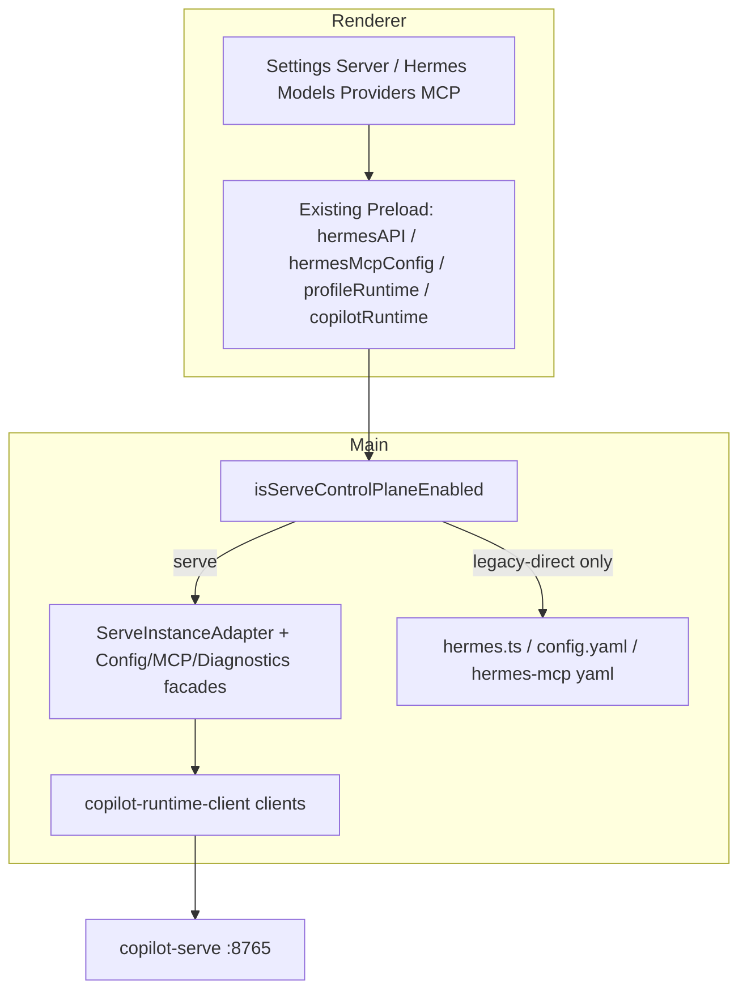

# v9.0 Phase 2 — Runtime / Instance / Config / MCP Cutover（Desktop-only）

## Scope

沿用 Phase 0/1：**只改 `copilot-desktop`**。Serve 侧 Instance / configuration / MCP / secrets / diagnostics API 已在 OpenAPI snapshot 中存在，按已交付契约对接；不改 `copilot-serve` 仓库。

**本阶段纳入（PRD §28 Phase 2）**

- Runtime 连接态之上的 **Instance 控制面**（list/resolve/start/stop/restart/health/logs）
- **Gateway 启停**改走 Serve Instance（不再 `hermes.ts` spawn CLI）
- **Models / Providers / Secrets** 改走 Serve Configuration + Secrets
- **MCP** 改走 `/instances/{id}/mcp/servers*`
- **Diagnostics** 改走 Serve diagnostics
- Feature flag：`runtime.controlPlane = serve`（默认开启，除非 legacy-direct）

**明确不做**

- Phase 3 Chat Runtime / SSE mux / `window.chatRuntime` cutover
- Phase 4 Session Catalog / Files / 停读 `state.db`
- Phase 5 Task/Expert/Approval
- Phase 6 Skill/Memory/Soul/Cron Resource 全量
- Phase 8 删除 `hermes.ts` / 硬门禁进 CI（可加强 soft 检查，但不删文件）

## Architecture

**默认控制面规则**（扩展 [`runtime-mode.ts`](src/main/copilot-runtime-client/runtime-mode.ts)）：

- `isServeControlPlaneEnabled()` = connection Ready **且** `!isLegacyHermesDirectAllowed()`
- production 永远 legacy-direct=false → 永远 Serve 控制面
- dev 仅当 `COPILOT_ALLOW_LEGACY_HERMES_DIRECT=true` 才允许 CLI/YAML

**Instance 身份（PRD §7）**：`profileId/profileName` → `GET /api/v1/instances/resolve?ref=` → `instanceId`；缓存于 Main adapter，UI 可继续传 profile 展示名。

## Implementation steps

### 1. Control-plane gate + typed client completion

- 在 [`runtime-mode.ts`](src/main/copilot-runtime-client/runtime-mode.ts)（或同目录新文件）增加 `isServeControlPlaneEnabled()`；导出到 [`index.ts`](src/main/copilot-runtime-client/index.ts)。
- 补全 Phase 2 客户端（替换 stub 行为，强类型化 response）：
  - [`instance-client.ts`](src/main/copilot-runtime-client/clients/instance-client.ts)：补 `restart` / `health` / `logs` / `create` / `patch` / `delete`
  - [`configuration-client.ts`](src/main/copilot-runtime-client/clients/configuration-client.ts)：补 `validate` / `apply` / `reload`；加 model-options / model-config GET+PUT
  - 新建 `secrets-client.ts`：`GET/PUT/DELETE /api/v1/secrets/{scope}/...`（响应不得含明文）
  - 新建 `mcp-client.ts`：list/create/put/delete/test/enable/disable
  - 充实 [`diagnostics-client.ts`](src/main/copilot-runtime-client/clients/diagnostics-client.ts)：summary / environment / logs / bundle
- Shared 契约：在 [`src/shared/copilot-runtime/`](src/shared/copilot-runtime/) 增加 `instance-contract.ts`（status 枚举、resolve 结果、list DTO）与必要时 MCP/config view models（手写稳定类型，不绑定 generated churn）。

### 2. `ServeInstanceAdapter` 落地

替换 stub [`src/main/runtime-adapters/index.ts`](src/main/runtime-adapters/index.ts)，拆出真实实现：

- `ServeInstanceAdapter.ts`：`resolveRef` / `list` / `get` / `start|stop|restart` / `health` / `logs`；`ready: true` when Serve CP enabled
- 将 Serve 状态映射到现有 Settings / profileRuntime 可消费的 shape（避免 Renderer 大改）
- 可选：`ServeConfigurationAdapter` / `ServeMcpAdapter` / `ServeDiagnosticsAdapter` 同目录，薄封装 clients

### 3. Gateway / Profile Runtime 切流（验收核心）

在 **不改 Preload 方法名** 的前提下改 Main 实现：

| 入口 | Serve 路径 | Legacy（仅 flag） |
|------|------------|-------------------|
| `ipcMain` `start-gateway` / `stop-gateway` / restart 调用点（[`index.ts`](src/main/index.ts) ~925+） | `resolve("default"\|profile)` → `instanceClient.start/stop/restart` | 现有 `startGateway`/`stopGateway` |
| `window.profileRuntime` start/stop/restart（`profile-runtime-manager`） | 同上，按 profile ref resolve | 现有 local adapter |
| 配置变更触发的 `restartGateway(profile)` | `instanceClient.restart` | `hermes.restartGateway` |

硬规则：Serve CP 开启时，**禁止**进入 [`hermes.ts`](src/main/hermes.ts) 的 `spawnHermesGatewayProcess` / `spawnHermesCli`。在 `startGateway`/`stopGateway`/`restartGateway` 入口加 guard：若 Serve CP → throw/return mapped `DesktopRuntimeError` 或委托 adapter（推荐委托，避免上层双分支散落）。

SSH remote gateway 路径：Phase 2 **保持现状**（标记非 Serve CP）；本地 local mode 必须走 Serve。

### 4. Models / Providers / Secrets

- Local Hermes Models / Providers 读写：Main 侧把现有 `hermesDefaultApi.models` / providers / config 写路径改为 Configuration + Secrets（具体 IPC 名可保留，实现换仓）。
- **禁止** Serve CP 下写 `config.yaml`、`custom_providers`、`session-models.json` 作为控制面（PRD §17）。Session 级 model 字段留给 Phase 3 Turn 请求；本阶段 Models 页「库管理 / default config」走 Serve `model-config`。
- Secrets：UI 只展示 `configured/source/updatedAt`；写入经 Main secrets-client。

### 5. MCP cutover

[`hermes-mcp-config-service.ts`](src/main/hermes-mcp-config/hermes-mcp-config-service.ts) 在 Serve CP 下：

- list/save/remove/enable/disable/test/reload → `mcp-client`（先 `resolve` instanceId）
- **不再**读写 `doc.mcp_servers` / 写 YAML
- **不再**调用 `restartGatewayAsync`；需要时调 `configurationClient.reload` 或 instance restart（以 Serve 契约为准）

Preload [`hermesMcpConfig`](src/preload/hermes-mcp-config-api.ts) API 形状不变，降低 UI 改动。

### 6. Diagnostics + Settings UI

- 扩展 [`window.copilotRuntime`](src/preload/copilot-runtime-api.ts)：`listInstances` / `getInstance` / `startInstance` / `stopInstance` / `restartInstance` / `getInstanceHealth` / `getInstanceLogs` / `getDiagnostics*`（无 token）
- Settings [`ServerPanel`](src/renderer/src/screens/SettingsDrawer/server/ServerPanel.tsx)：在已有 `CopilotRuntimeStatusSection` 下增加 **Instance 控制卡片**（启停/健康/日志摘要）；`HermesAgentSection` 的 Doctor/Update 中依赖 Hermes CLI 的动作：Serve CP 下改为 diagnostics/repair 文案或禁用并指向 Repair（避免继续 `runHermesDoctor` CLI）
- Runtime 未 Ready 时继续阻断 MCP/Config 写（复用 Phase 1 capability gate）

### 7. Gates / tests / docs

- Vitest `tests/copilot-runtime-phase2.test.ts`：
  - resolve profile → instanceId
  - Serve CP 时 start-gateway 不调用 spawn（mock）
  - MCP save 不触碰 yaml writer（mock）
  - legacy-direct=true 时仍走 hermes
  - secrets 响应无明文字段泄露到 IPC
- Soft script（仍不进 blocking CI）：扩展 `check-no-hermes-cli` 注释/路径清单，标明 Phase 2 控制面例外仅 legacy flag
- Docs：`AGENTS.md` 版本行 + Phase 2 说明；`docs/API_CONTRACTS.md` 增补 `copilot-runtime:*` instance/diagnostics；`docs/INDEX.md`；更新 `specs/current-agent-task.md` / `current-agent-state.md`
- 收尾跑：`npm run typecheck`、`npm test`（含 phase2）、`check:serve-contract-drift`、`check:no-renderer-runtime-http`

## Acceptance（对齐 PRD）

- Desktop Main 在默认（非 legacy-direct）路径下：**不**执行 Gateway CLI、**不**修改 Hermes `config.yaml` / MCP YAML 作为控制面
- Settings 可经 Serve 列出/启停 Instance，并看到 health/logs
- Models/Providers/MCP 写操作经 Serve；失败映射为 `DesktopRuntimeError`
- Phase 1 pairing/token 约束保持；Renderer 仍无 Device Token
- Chat 仍可用（执行面未切 Phase 3），但 Gateway 进程由 Serve Instance 管理

## Key files

| 区域 | 文件 |
|------|------|
| Clients | `src/main/copilot-runtime-client/clients/{instance,configuration,mcp,secrets,diagnostics}-client.ts` |
| Adapter | `src/main/runtime-adapters/ServeInstanceAdapter.ts`（及 Config/MCP/Diagnostics） |
| Cutover | `src/main/index.ts` gateway IPC；`hermes.ts` guard；`profile-runtime-manager.ts`；`hermes-mcp-config-service.ts` |
| Preload | `src/preload/copilot-runtime-api.ts` + `index.d.ts` |
| UI | `ServerPanel.tsx` + 新 Instance section；必要时 Hermes Models/MCP 页小改 |
| Tests/Docs | `tests/copilot-runtime-phase2.test.ts`；AGENTS / API_CONTRACTS / INDEX / specs |