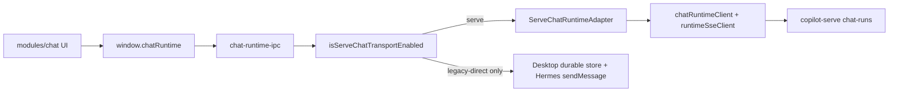

# v9.0 Phase 3 — Chat Runtime Cutover（Desktop-only / chat-runs*）

## Decision locked

- **路径 1**：按 PRD 对接 `/api/v1/chat-runs*`（与现有 stub [`chat-runtime-client.ts`](src/main/copilot-runtime-client/clients/chat-runtime-client.ts) 一致）。
- Serve Python 仓不改；OpenAPI snapshot **暂无**这些路径 → 本阶段用手写契约，**不**把 chat-runs 塞进 generated schema 硬 drift；后续 Serve 落地后再 `generate:serve-client` 对齐。
- Renderer / `window.chatRuntime` 表面 **不变**；只换 Main 执行适配器。

## Architecture

**传输门控**（对齐 Phase 2 控制面风格，落在 [`runtime-mode.ts`](src/main/copilot-runtime-client/runtime-mode.ts)）：

- `isServeChatTransportPreferred()` = `!isLegacyHermesDirectAllowed()`（production 永远 true）
- `isServeChatTransportEnabled()` = preferred **且** Runtime `Ready`
- 非 Ready + preferred → fail-closed（Chat start/command 返回 `RUNTIME_UNAVAILABLE`，不回落 Hermes）
- 仅 `COPILOT_ALLOW_LEGACY_HERMES_DIRECT`（非 production）走现有 Desktop durable + Hermes 路径

## Keep / Change / Out of scope

| Keep | Change | Out of scope |
|------|--------|--------------|
| Renderer `modules/chat/**`、`chat-workspace.db`、Preload `chatRuntime` API 形状 | Main：Serve adapter 接管 start/abort/command/snapshot/replay/queue/recover | Phase 4 Session Catalog / Files |
| [`ChatRunIdentity`](src/shared/copilot-runtime/chat-run-identity.ts) | Event Store 权威迁 Serve；Serve 模式下不再写 Desktop event sequence DB | Phase 5 Task/Expert |
| [`runtime-sse-client.ts`](src/main/copilot-runtime-client/runtime-sse-client.ts) scaffold | 补齐 client：events stream、queue CRUD、replay query | Phase 8 删除 `chat-runtime-store` / `hermes.ts` |
| Phase 2 Instance resolve | `profile` → `instanceId` 后再调 chat-runs | Desktop→Serve 历史 DB migration import（PRD §25，另开） |

## Implementation steps

### 1. Shared contracts + feature gate

- 新增 [`src/shared/copilot-runtime/chat-runtime-serve-contract.ts`](src/shared/copilot-runtime/chat-runtime-serve-contract.ts)：`ServeChatEvent`、createRun/turn 请求/响应、queue DTO、interaction respond body（对齐 PRD §8–§9）。
- 新增事件映射：`ServeChatEvent` → 现有 [`ChatRuntimeEvent`](src/shared/chat-runtime/chat-runtime-events.ts)（保证 Renderer 零改）。
- 扩展 [`runtime-mode.ts`](src/main/copilot-runtime-client/runtime-mode.ts)：`isServeChatTransportPreferred` / `isServeChatTransportEnabled`。
- 从 [`src/shared/copilot-runtime/index.ts`](src/shared/copilot-runtime/index.ts) 导出。

### 2. Complete Main HTTP/SSE clients

扩展 [`chat-runtime-client.ts`](src/main/copilot-runtime-client/clients/chat-runtime-client.ts)：

- `listEvents(runId, { afterSequence?, limit? })`
- `subscribeEvents(runId, { lastEventId, onMessage, signal })` → 包装 [`runtimeSseClient`](src/main/copilot-runtime-client/runtime-sse-client.ts) 路径 `/api/v1/chat-runs/{id}/events/stream`
- Queue：`listQueue` / `enqueue` / `patchQueue` / `deleteQueue`

规则：Bearer 仅 Main；写操作带 `Idempotency-Key`；SSE 支持 `Last-Event-ID` + 自动重连；同 `eventId` 去重后再 `emitChatRuntimeEvent`。

### 3. Implement `ServeChatRuntimeAdapter`

替换 stub（[`runtime-adapters/index.ts`](src/main/runtime-adapters/index.ts)）为真实模块 [`ServeChatRuntimeAdapter.ts`](src/main/runtime-adapters/ServeChatRuntimeAdapter.ts)：

- `resolveIdentity(profile?)` → Instance resolve → `ChatRunIdentity`
- `startTurn(input)`：`createRun`（若需要）+ `createTurn`，立即返回 `{ accepted, runId, turnId, eventCursor }`
- `subscribe(runId, …)`：SSE → map → callback
- `abort(runId)` / `respondClarify|respondApproval` / `getSnapshot` / `replayEvents` / queue ops / `recover`（Serve snapshot + replay，再订阅 live）

### 4. Wire `chat-runtime-ipc`（核心 cutover）

在 [`chat-runtime-ipc.ts`](src/main/chat-runtime/chat-runtime-ipc.ts) 的 `beginChatTurn` / `abort` / `command` / `getSnapshot` / `replayEvents` / queue IPC / `recover`：

- Serve enabled → **禁止**再走 `sendMessage` / Hermes continuation / 本地 `upsertRun` 事件持久化路径
- 改为 Adapter；IPC 仍 `emitChatRuntimeEvent` 给 Renderer
- Clarify/Approval：`command` → `respondInteraction`（不再 `hermes-chat-command-adapter` / continuation 直连 Gateway）
- Retry：UI 仍调现有 retry；Serve 模式下 enqueue/re-create turn 走 Serve queue/turn API，不在 Desktop 重放用户消息到 Hermes
- Legacy-direct：保留现有 durable + Hermes 行为（开发逃生舱）

不动 Preload 方法名；不改 Renderer Controller。

### 5. Soft gates + tests + docs

- 加强 [`scripts/check-no-legacy-profile-chat.mjs`](scripts/check-no-legacy-profile-chat.mjs)（禁止生产路径新增 `/profiles/*/chat`）；本阶段不强制删除旧实现文件。
- 新增 [`tests/copilot-runtime-phase3.test.ts`](tests/copilot-runtime-phase3.test.ts)：gate、event map、adapter start/abort/interaction（mock `runtimeFetch` + SSE）、IPC 在 Serve 模式下不调用 Hermes `sendMessage`。
- 更新 `docs/API_CONTRACTS.md`、`AGENTS.md`、`lat.md/domain/serve-runtime.md` + serve-runtime-tests；同步 `specs/current-agent-*`。
- 验收命令：`npm run typecheck`、phase1+2+3 Vitest、`lat check`。

## Acceptance (Phase 3)

- Serve preferred + Ready：`window.chatRuntime.start/abort/command/queue/getSnapshot/replay/recover` 全部经 Serve chat-runs*。
- Renderer Chat UI（多 Tab / Clarify / Approval / Queue / Retry 卡片）行为契约不变。
- Serve 模式下 Desktop **不再**把 Runtime Event sequence 写入本地 durable store 作为权威源。
- Legacy-direct 仍可本地跑旧路径；production 无回落。
- OpenAPI drift gate 仍针对现有 snapshot；chat-runs 以手写契约为准（文档注明待 Serve 对齐）。

## Risk note

若实际 Serve 尚未部署 chat-runs，集成环境会 fail-closed（预期）。本阶段以契约 + mock 单测验收；不回退到 Completions SSE 当生产 Runtime。
