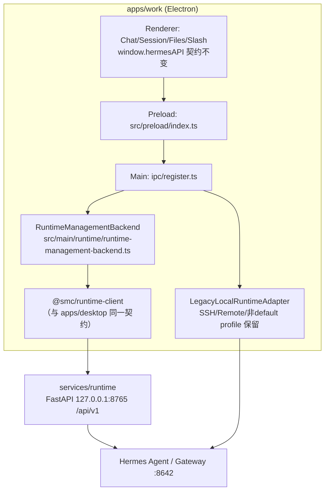

# apps/work × Runtime 对接实施计划（PRD v1.0）

## 目标架构

**核心不变式**：Renderer/preload 契约零改动；只替换 Main 实现；Runtime 管进程生命周期，Desktop 仍管 Chat SSE transport；v1.0 仅强制 default profile（Runtime 本地实例目前只支持 `default`，见 [local_hermes_profile_policy.py](services/runtime/src/runtime/local_hermes_profile_policy.py)）；Runtime 不可达时显示 ConnectionError，禁止偷偷回退到 Desktop spawn。

## 现状关键事实（已勘察）

- 迁移替换点已存在：`RuntimeManager` + `HermesRuntimeAdapter` 抽象（[runtime-manager.ts](apps/work/src/main/runtime/runtime-manager.ts)、[runtime-contract.ts](apps/work/src/shared/runtime/runtime-contract.ts)）
- 待替换实现：Gateway spawn 在 [hermes.ts](apps/work/src/main/hermes.ts)（`startGatewayDetailed` ~L3150、`stopGateway` ~L3324、`restartGateway` ~L3564）；version/doctor/update 在 [installer.ts](apps/work/src/main/installer.ts)
- IPC 注册单点：[register.ts](apps/work/src/main/ipc/register.ts)（runtime-* L671–705、version/doctor/update L722–799、gateway L1723–1773），每个 handler 含 local/ssh/remote 分支——**只改 local 分支**
- Runtime API：`/api/v1` 前缀，`127.0.0.1:8765`；readiness 四维域（service/execution/maintenance/expertMcp，见 [runtime_status_service.py](services/runtime/src/services/runtime_status_service.py)）；Job 进度走 SSE `GET /runtime/jobs/{id}/events`
- `@smc/runtime-client`（[packages/runtime-client-ts](packages/runtime-client-ts)）已覆盖 runtime/instances 全部所需端点；接入方式参照 apps/desktop：electron.vite Main alias + Main-only 单例 factory
- 无需改 contracts：所有端点已存在于 [openapi.yaml](contracts/runtime-api/openapi.yaml)；若发现缺口，按 [contract-flow.md](docs/architecture/contract-flow.md) 走 contract-first 流程

## Phase 0 — 建立基线（禁止功能修改）

- `npm install` + `typecheck` + `lint` + `test` + `build` 全绿
- 人工功能验证清单（Chat / Attachment / Session Resume / File Preview / Slash / /btw / Context Folder / Worktree / Model Switch）——自动检查由我执行，真实交互验证由你确认
- 产出 `apps/work/BASELINE_PASS.md` 记录结果
- Commit: `01 chore(work): establish copilot desktop baseline`

## Phase 1 — Runtime Client 接入（只读）

- 接入 `@smc/runtime-client`：
  - [apps/work/package.json](apps/work/package.json) 加依赖；[electron.vite.config.ts](apps/work/electron.vite.config.ts) Main 段加 alias（镜像 [apps/desktop/electron.vite.config.ts](apps/desktop/electron.vite.config.ts)）；[project.json](apps/work/project.json) 加 `implicitDependencies: ["runtime-client-ts"]`
- 新建 [apps/work/src/main/runtime/](apps/work/src/main/runtime) 下四个模块（PRD §39）：
  - `runtime-service-client.ts` — 单例 factory，`baseUrl` 默认 `http://127.0.0.1:8765`，env 覆盖 `HERMES_RUNTIME_SERVICE_URL`（与 desktop 的 8765 SOT 对齐），更新 [.env.example](apps/work/.env.example)
  - `runtime-management-backend.ts` — 实现 PRD §40 的 `RuntimeManagementBackend` 接口（probe/ensureReady/restart/startGateway/stopGateway/restartGateway/gatewayStatus/getVersion/doctor/update）
  - `runtime-management-mapper.ts` — Runtime 响应 → 现有 shared 契约类型（`HermesRuntimeProbe`、`HermesRuntimeConnectionResult`）；Profile→Instance resolver（`default`→instance `default`；非 default 返回"不支持→走 Legacy"）
  - `runtime-service-errors.ts` — `RuntimeApiError` → 现有 `RUNTIME_ERROR_CODES` 映射
- 本阶段仅接通只读链路（status/readiness/instances/health/state），Chat 与 Gateway 控制不动
- 验收：Settings RuntimePane 能展示 Runtime/Hermes/Gateway 状态
- Commit: `02 feat(work-runtime): add runtime service client`

## Phase 2 — Gateway Ownership 迁移

- 新增 `RuntimeServiceAdapter`（实现现有 `HermesRuntimeAdapter`），local 模式下替换 `LegacyLocalRuntimeAdapter` 为默认 adapter；`RuntimeManager` 注入点已存在
- [register.ts](apps/work/src/main/ipc/register.ts) local 分支改走 backend：`runtime-probe-local`、`runtime-ensure-local-ready`、`runtime-get-status`、`runtime-restart`、`start-gateway`、`stop-gateway`、`restart-gateway`、`gateway-status`；**ssh/remote 分支原样保留**；`runtime-validate-home`/`runtime-adopt-home` 保留 Legacy（PRD W1/R2）
- ensureReady 语义：readiness.execution（chatReady）不满足 → instance start → 轮询 health；Connection Ready 门控遵循 `readiness.service`（根 AGENTS.md 约束）
- Renderer 零改动
- Commit: `03 refactor(work-runtime): route runtime probe to service` + `04 refactor(work-runtime): move gateway lifecycle to runtime`

## Phase 3 — Chat 回归

- `send-message` handler 前置 `await runtimeManagementBackend.ensureReady(profile)`（仅 local 分支），之后走原 Chat SSE 链路
- 补/跑回归测试：CHAT-01/02/03、GW-01/02、RT-01/02/03
- Commit: `05 test(work-chat): prove chat regression baseline`

## Phase 4 — Install / Update / Doctor

- [register.ts](apps/work/src/main/ipc/register.ts) local 分支迁移：`get-hermes-version`/`refresh-hermes-version` → `/runtime/versions`；`run-hermes-doctor` → `/runtime/doctor`；`run-hermes-update` → `/runtime/update`
- SSE Job events（`job.started/progress/phase_changed/completed/failed`）→ 转换为现有 `install-progress` IPC 事件（mapper 中实现），preload/Renderer 不改
- SSH 分支保留；`runHermesBackup/Import/Dump` 保留 W1
- Commit: `06 refactor(work-runtime): move version doctor update`

## Phase 5 — SMC 增量迁入（仅 Login）

- **本阶段只迁入 Login**（从 apps/desktop 的 Portal Auth / Login 启动门控能力接入 apps/work）
- **明确不做（延后）**：Hermes Panel、JSSDK Bridge、Service Settings
- 禁止一次性 merge 整个 apps/desktop
- Commit: `07 feat(work): migrate login`

## CI 守卫与文档

- `check:work-renderer-contract`：强化 [preload-api-surface.test.ts](apps/work/tests/preload-api-surface.test.ts)，保证 `window.hermesAPI` 现有 API 不被无意删除
- `check:no-work-gateway-spawn`：迁移完成后生产代码禁止 `spawn hermes gateway`（[hermes.ts](apps/work/src/main/hermes.ts) 的 gateway spawn 路径在 local 模式下成为 dead code，标记 Legacy 或移除）
- **不**新增 `no-work-hermes-data` 检查（v1.0 有意允许 Session/File/Config 读 Hermes 数据）
- 每个 Phase 完成后按 [apps/work/AGENTS.md](apps/work/AGENTS.md) 要求更新 `apps/work/lat.md/` 并跑 `lat check`

## 风险与边界

- **多 Profile**：Runtime 仅支持 default profile；非 default profile 继续走 LegacyLocalRuntimeAdapter（与 PRD §43 一致，v1.1 再评）
- **双 Control Plane 防范**：local 模式下 Main 不再 spawn gateway；Runtime 不可达 → ConnectionError 界面（复用现有 `ConnectionError` screen + `RuntimeProvider`）
- **Hermes home 一致性**：Runtime 的 `hermesHome` 与 Desktop `HERMES_HOME` 需指向同一目录，Phase 1 验收时确认
- 测试基线：沿用并扩展 tests/runtime-adapter.test.ts、ipc-handlers.test.ts、gateway-restart.test.ts（改为 mock Runtime client）