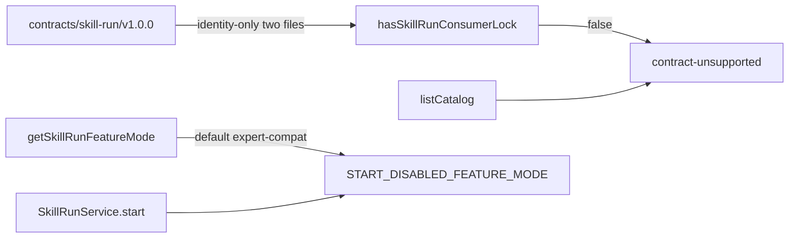

# WORK-SKILL-FIRST-LAYOUT-V4.0.1 Remaining Provider Gate

Mode: **CREATE**. Target path must not already exist: [`.cursor/plans/work-v4.0.1-remaining-provider-gate.plan.md`](.cursor/plans/work-v4.0.1-remaining-provider-gate.plan.md). Do not revise or edit [`.cursor/plans/work-v4.0.1-complete-bundle-lock-gate.plan.md`](.cursor/plans/work-v4.0.1-complete-bundle-lock-gate.plan.md) or [`.cursor/plans/lock_gate_status_3fd44b9c.plan.md`](.cursor/plans/lock_gate_status_3fd44b9c.plan.md). Do not re-implement C01/C02.

Uncommitted LOW hygiene on gateway/lock tests is **not** this Plan's write set. Grounding is committed baseline `c8af60fc` only.

## Approved PRD

[Approved PRD](../../docs/work/PRD-WORK-v4.0.1-skill-first-layout-run-integration.md)

`validate_prd.py --require-approved --require-evidence` already **PASS**.

## Scope

- In: Prove remaining Work-owned PRD Changes cannot proceed; retain blocker evidence; exit **BLOCKED**.
- Out: Re-implement C01/C02; C03 production-default `skill-first` (ROADMAP M5); C04 Expert default REMOVE (v4.2 Removal PRD); C05 Work-authored Provider Bundle files; enabling `SMC_SKILL_RUN_E2E=1`; P1 Approval/activity/forms/attachments.
- Production Owner inherited from PRD: existing Work Skill Run consumer-lock owner, existing Main `SkillRunGatewayClient` / `SkillRunService`. Do not ADD a parallel lock, parser, gateway, or Bundle author.



## Grounding Evidence Ledger

| Change ID | Target | Baseline State | Symbol / Entry Resolution | Caller / Callee Evidence | Existing Reuse Search | Result |
|---|---|---|---|---|---|---|
| C01 | `apps/work/src/main/skill-run/skill-run-consumer-lock.ts#hasSkillRunConsumerLock` | exists at `c8af60fc`; `isCompleteSkillRunBundleDir` requires lock + LF SHA256SUMS + `manifest.json` + P0 paths; repo `contracts/skill-run/v1.0.0/` is identity-only (`consumer-lock.json` + `SHA256SUMS` only) so lock is false | `hasSkillRunConsumerLock` / `isCompleteSkillRunBundleDir` / `findSkillRunConsumerLockDir` resolved | `createSkillRunGatewayClient` defaults `lockGate` from `hasSkillRunConsumerLock`; `SkillRunService.start` uses `gateway.hasConsumerLock()` | KEEP: no new lock module; tests already assert identity-only is false | PASS |
| C02 | `apps/work/src/main/skill-run/skill-run-gateway-client.ts#createSkillRunGatewayClient` | exists at `c8af60fc`; no-lock Catalog returns `contract-unsupported` without fetch; missing `capabilityKind` is unsupported | `createSkillRunGatewayClient` / `listCatalog` resolved | Renderer `hermesAPI.skillRun` → IPC → `SkillRunService` → gateway | KEEP: reuse existing `contract-unsupported`; do not add parser | PASS |

C03/C04/C05 are **not** in the Change Matrix (blocked / out / external). Grounding fact for the blocker: [`apps/work/src/main/skill-run/feature-mode-store.ts`](apps/work/src/main/skill-run/feature-mode-store.ts) `DEFAULT_MODE = "expert-compat"`; [`skill-run-service.ts#createSkillRunService`](apps/work/src/main/skill-run/skill-run-service.ts) `start` returns `START_DISABLED_FEATURE_MODE` unless `skill-first`; `git ls-files contracts/skill-run/v1.0.0` is two identity files only.

## Requirement Coverage Ledger

| Requirement | Source | Obligation | Classification | Change IDs | Todo | Verification IDs | Evidence Class | Blocking |
|---|---|---|---|---|---|---|---|---|
| AC-01 | AC | Layout 显示一级“使用技能”；空白 scratch 原地切 mode，已有内容时创建/激活独立 Skill Tab，不取消其它运行。 | BEHAVIOR | - | T1 | V05 | UNIT | yes |
| AC-02 | AC | View 不新增 Skill Chat 页面；现有 Chat/MessageList/ChatInput 被复用。 | BEHAVIOR | - | T1 | V05 | UNIT | yes |
| AC-03 | AC | ChatRun 只拥有 execution mode；Skill selection truth 在当前 Chat 中唯一，提交/排队保存不可变 snapshot。 | BEHAVIOR | - | T1 | V05 | UNIT | yes |
| AC-04 | AC | 未选择 Skill 时展示 Catalog 并禁用发送；选择后展示 Selection Bar；全部错误/空状态可恢复。 | BEHAVIOR | C02 | T1 | V02 | INTEGRATION | yes |
| AC-05 | AC | Skill mode 不渲染本地模型、Reasoning、Fast Mode、Context Folder 或 Expert 控件；附件未合同化时明确禁用。 | BEHAVIOR | - | T1 | V05 | UNIT | yes |
| AC-06 | AC | Catalog 只显示合同可证明为 Skill 的项；缺少 discriminator 时显示 contract unsupported，而不是猜测过滤。 | CONTRACT | C02 | T1 | V02 | INTEGRATION | yes |
| AC-07 | AC | Work locks only the complete, tag/release-identified and checksummed Skill Run Contract Bundle delivered by Provider Owner; identity-only consumer-lock.json + SHA256SUMS is not a closed lock and must surface contract-unsupported for Catalog, production start, and live-E2E. The old work-expert lock remains unchanged and Provider source is never a Contract input. | CONTRACT | C01 | T1 | V01 | CONTRACT_RELEASE | yes |
| AC-08 | AC | 新调用只使用 tool_name 与 run_id，不发送 Expert/Agent/Runtime/Profile/Workspace routing 字段。 | CONTRACT | - | T1 | V03 | INTEGRATION | yes |
| AC-09 | AC | Provider run_id、Renderer ChatRun.runId 与 clientRequestId 在类型、持久化和日志中不可互换。 | CONTRACT | - | T1 | V03 | INTEGRATION | yes |
| AC-10 | AC | Renderer 无法取得 JWT、Backend/Agent URL、raw Provider event、download token 或 absolute path。 | SECURITY | - | T1 | V04 | DIFF_SCOPE | yes |
| AC-11 | AC | Main 是唯一 Skill Run lifecycle owner；Renderer store 仅为 projection。 | BEHAVIOR | - | T1 | V03 | INTEGRATION | yes |
| AC-12 | AC | 不确定网络与 App 重启使用同一 idempotency identity 恢复，跨端证明只创建一个 Provider Run。 | LIFECYCLE | - | T1 | V05 | INTEGRATION | yes |
| AC-13 | AC | SSE replay 去重、terminal 单调、poll fallback 和 cleanup 可验证；旧事件不能回退终态。 | LIFECYCLE | - | T1 | V05 | INTEGRATION | yes |
| AC-14 | AC | 同一 Chat Tab 至多一个 active Skill Run；queue item 不因用户更换 Skill 而改路由。 | LIFECYCLE | - | T1 | V03 | INTEGRATION | yes |
| AC-15 | AC | 取消只调用 Skill Run cancel；不得误调用 Local Chat abort。Approval 未合同化时只读等待，不显示伪交互。 | LIFECYCLE | - | T1 | V03 | INTEGRATION | yes |
| AC-16 | AC | 只有合同枚举事件可产生 activity UI；unknown payload 不文本化、不触发不可逆 UI side effect。 | BEHAVIOR | - | T1 | V05 | INTEGRATION | yes |
| AC-17 | AC | Result 更新同一 assistant transcript；restart 后 session mode、在途 projection 与历史可恢复且不重复 start。 | LIFECYCLE | - | T1 | V05 | INTEGRATION | yes |
| AC-18 | AC | Artifact 进入现有 File Platform，以 run-scoped remote identity 去重，并通过现有 Preview/Save As/Materialize API 使用。 | BEHAVIOR | - | T1 | V05 | INTEGRATION | yes |
| AC-19 | AC | 不得新增 Skill conversation/file parallel SoT 或直接 Artifact download IPC。 | SCOPE | - | T1 | V04 | DIFF_SCOPE | yes |
| AC-20 | AC | Skill-first、Expert compatibility 与 Local Chat 路径显式互斥；一条消息不会同时创建 Skill Run 与 ExpertTask。 | BEHAVIOR | - | T1 | V03 | INTEGRATION | yes |
| AC-21 | AC | Skill-first 失败不自动 fallback；回滚停止新建但保留 Skill/Expert 各自 reader。 | BEHAVIOR | - | T1 | V03 | INTEGRATION | yes |
| AC-22 | AC | Expert 默认创建入口的最终删除满足 Compatibility Contract，并由独立 Removal PRD 执行。 | RELEASE | - | T1 | V06 | DOCUMENT_SEMANTIC | yes |
| DOD-01 | DOD | Provider Owner Contract Bundle and Work Consumer Lock are present and content-validated; no schema is unverified and no Work implementation/test input comes from Provider source. | CONTRACT | - | T1 | V07 | CONTRACT_RELEASE | yes |
| DOD-02 | DOD | Contract、Main、IPC、Renderer 与 Session 聚焦测试全部通过，无回归。 | EVIDENCE | C01<br>C02 | T1 | V03 | INTEGRATION | yes |
| DOD-03 | DOD | 生产切换前通过完整 Checklist，历史任务可独立恢复且无 silent fallback。 | OPERATIONS | - | T1 | V06 | DOCUMENT_SEMANTIC | yes |

Ledger `Change IDs` / `Todo` use `-` where this slice has no write. T1 is the verification owner, not a production WRITE_OWNER.

## Lifecycle Closure Matrix

| Journey | Requirements | Trigger | Nonterminal State | Success Writer | Failure / Cancel Writer | Evidence IDs |
|---|---|---|---|---|---|---|
| Skill Run start / recover | AC-12 | `SkillRunService.start` after complete Bundle and feature mode skill-first | pending-submit / accepted non-terminal | `apps/work/src/main/skill-run/skill-run-service.ts#createSkillRunService` | same owner cancel / terminal error; identity-only Bundle never leaves local fail-closed | V05 |
| SSE / poll projection | AC-13 | accepted run_id event stream or poll | running / reconnecting | `createSkillRunService` | same owner; unknown events fail-soft without terminal rollback | V05 |
| Single active run | AC-14 | second start on same session | existing non-terminal | `createSkillRunService` rejects `RUN_ALREADY_ACTIVE` | queue snapshot owned by Chat submit; cancel via skillRun.cancel | V03 |
| Cancel | AC-15 | user cancel | cancelling | `createSkillRunService` / `cancelRun` | Local Chat abort must not be called | V03 |
| Transcript restore | AC-17 | restart rehydrate | non-terminal continuation | `createSkillRunService` rehydrate; no second tools/call | terminal cleanup retains transcript | V05 |

This Plan does **not** change those writers. C03 default-switch is forbidden while V07 shows incomplete Bundle.

## Contract / Data Flow Closure Matrix

None

This slice does not add or change a producer/transport/consumer. Catalog/start fail-closed flows already landed under KEEP C01/C02.

## Verification Ledger

| Verification ID | Level | Entry Point / Command | Oracle | Negative / Regression | Evidence Output | Environment | Blocking |
|---|---|---|---|---|---|---|---|
| V01 | CONTRACT_RELEASE | `npm test -- src/main/skill-run/skill-run-consumer-lock.test.ts` (cwd `apps/work`) | identity-only `contracts/skill-run/v1.0.0` → `hasSkillRunConsumerLock() === false`; `contracts/work-expert/v1.0.2/consumer-lock.json` still present | SHA256 mismatch / missing manifest still false; no Provider source read | `artifacts/work-v4.0.1-remaining-provider-gate/v01-consumer-lock.txt` | local repo | yes |
| V02 | INTEGRATION | `npm test -- src/main/skill-run/skill-run-gateway-client.test.ts` (cwd `apps/work`) | no-lock Catalog `contract-unsupported` and fetch not called; missing capabilityKind is unsupported | injected complete-lock wire tests still list only capabilityKind=skill | `artifacts/work-v4.0.1-remaining-provider-gate/v02-gateway.txt` | local repo | yes |
| V03 | INTEGRATION | `npm test -- src/main/skill-run/skill-run-service.test.ts src/main/skill-run/skill-run-ipc.test.ts` (cwd `apps/work`) | default feature mode `expert-compat`; start without skill-first → `START_DISABLED_FEATURE_MODE`; no lock → `START_DISABLED_NO_LOCK`; no Expert fallback | cancel does not call local abort; no second SkillRunService | `artifacts/work-v4.0.1-remaining-provider-gate/v03-service-ipc.txt` | local repo | yes |
| V04 | DIFF_SCOPE | `npm run guard` (cwd `apps/work`) | renderer contract / no renderer runtime HTTP / no reference imports | no new Artifact download IPC; Expert lock path untouched | `artifacts/work-v4.0.1-remaining-provider-gate/v04-guard.txt` | local repo | yes |
| V05 | INTEGRATION | `npm test -- src/main/skill-run/skill-run-e2e.test.ts src/renderer/src/screens/Layout/chatRuns.test.ts --pool=threads --maxWorkers=1` (cwd `apps/work`) | fixture e2e still injects lock; chatRuns executionMode scratch preserved | live suite remains skipped unless `SMC_SKILL_RUN_E2E=1`; this slice must not force live on | `artifacts/work-v4.0.1-remaining-provider-gate/v05-regression.txt` | local repo; live env not required | yes |
| V06 | DOCUMENT_SEMANTIC | Confirm Scope.Out contains C04; `git grep -n createExpertRunService -- apps/work/src/main/expert/expert-run-service.ts`; ROADMAP M6 still names v4.2 Removal PRD | Expert Run Service still exists; this slice does not delete default Expert entry; production Checklist not claimed | no REMOVE of Expert IPC in this Change Matrix | `artifacts/work-v4.0.1-remaining-provider-gate/v06-c04-out.txt` | local repo | yes |
| V07 | CONTRACT_RELEASE | `git ls-files contracts/skill-run/v1.0.0` | only `consumer-lock.json` and `SHA256SUMS`; no `manifest.json` or P0 schema/fixture paths on disk | must not invent or copy Provider schemas into the tree | `artifacts/work-v4.0.1-remaining-provider-gate/v07-bundle-absent.txt` | local repo | yes |

## Immediate Read

- [`docs/work/PRD-WORK-v4.0.1-skill-first-layout-run-integration.md`](docs/work/PRD-WORK-v4.0.1-skill-first-layout-run-integration.md)
- [`apps/work/src/main/skill-run/skill-run-consumer-lock.ts#hasSkillRunConsumerLock`](apps/work/src/main/skill-run/skill-run-consumer-lock.ts)
- [`apps/work/src/main/skill-run/skill-run-gateway-client.ts#createSkillRunGatewayClient`](apps/work/src/main/skill-run/skill-run-gateway-client.ts)
- [`apps/work/src/main/skill-run/feature-mode-store.ts#getSkillRunFeatureMode`](apps/work/src/main/skill-run/feature-mode-store.ts)
- [`apps/work/src/main/skill-run/skill-run-service.ts#createSkillRunService`](apps/work/src/main/skill-run/skill-run-service.ts)
- [`contracts/skill-run/v1.0.0/`](contracts/skill-run/v1.0.0/)

## Triggered Read

- If V07 suddenly shows a complete Bundle: stop this Plan; return a **new** CREATE Plan for C03. Do not implement C03 here.
- If someone proposes Work-authored schema files: RETURN_PRD / reject; C05 is Provider-owned.
- Otherwise: do not read

## Change Matrix

| Change ID | File / Symbol | Kind | Action | Existing Owner | Todo Owner | Target State | PRD Capability | New File? |
|---|---|---|---|---|---|---|---|---|
| C01 | `apps/work/src/main/skill-run/skill-run-consumer-lock.ts#hasSkillRunConsumerLock` | PROD | KEEP | Work Skill Run consumer-lock owner | - | identity-only lock stays closed | Work Contract Bundle lock Gate | no |
| C02 | `apps/work/src/main/skill-run/skill-run-gateway-client.ts#createSkillRunGatewayClient` | PROD | KEEP | Main SkillRunGatewayClient | - | Catalog/start stay behind complete lock | Skill Run Gateway contract adapter | no |

PRD C03 REPLACE, C04 REMOVE, C05 ADD external are **out of this Matrix** (not KEEP-rewritten). Implementing them in this slice would violate AC-07 / DOD-01 / Compatibility Contract.

## Implementation Decisions

No non-KEEP Change IDs in this slice.

| Change ID | Strategy | Root-Cause / Reuse Evidence | Why This Is Minimum |
|---|---|---|---|

## Write Ownership Ledger

| Todo | Owns Changes | Writes | Reads | Depends On | Parallel Safe |
|---|---|---|---|---|---|
| T1 | - | - | `apps/work/src/main/skill-run/skill-run-consumer-lock.ts#hasSkillRunConsumerLock`<br>`apps/work/src/main/skill-run/skill-run-gateway-client.ts#createSkillRunGatewayClient`<br>`apps/work/src/main/skill-run/feature-mode-store.ts#getSkillRunFeatureMode`<br>`apps/work/src/main/skill-run/skill-run-service.ts#createSkillRunService` | - | no |

T1 has **zero production writes**. Parallel Safe is `no` because evidence collection is a single sequential ledger.

## Integration Hotspots

None

## Generated Outputs Ledger

None

## Todo T1 — Prove remaining Work slice BLOCKED

**Owns Changes**
- -

**Goal**

Persist this Plan, pass validators, run V01–V07, and stop. Do not change feature-mode default. Do not write files under `contracts/skill-run/`. Do not re-implement lock or gateway.

**Immediate anchors**
- `apps/work/src/main/skill-run/skill-run-consumer-lock.ts#hasSkillRunConsumerLock`
- `apps/work/src/main/skill-run/feature-mode-store.ts#getSkillRunFeatureMode`
- `contracts/skill-run/v1.0.0/consumer-lock.json`

**Changes**
- Write `.cursor/plans/work-v4.0.1-remaining-provider-gate.plan.md` with this contract (CREATE).
- Run generation integrity + `validate_plan.py` + `assess_plan_review.py` (expect NOT_REQUIRED because Contract Matrix is None and Matrix has no REPLACE / new files).
- Run V01–V07; retain outputs under `artifacts/work-v4.0.1-remaining-provider-gate/`.
- Record Completion = `BLOCKED` (DOD-01 / C03 cannot proceed while V07 is identity-only).

**Stop conditions**
- [ ] Plan file exists at the CREATE target and validators PASS
- [ ] V01–V07 evidence retained
- [ ] No production/test/contract file writes in this slice
- [ ] Completion Gate used is BLOCKED, not IMPLEMENTED_AND_PROVEN

**Triggered reads**
- If V07 shows a complete Bundle: stop; do not start C03 in this Plan
- Otherwise: none

## Verification

```bash
python .agents/skills/smc-plan-from-approved-prd-ponytail/scripts/validate_generation_integrity.py .cursor/plans/work-v4.0.1-remaining-provider-gate.plan.md
python .agents/skills/smc-plan-validator/scripts/validate_plan.py .cursor/plans/work-v4.0.1-remaining-provider-gate.plan.md
python .agents/skills/smc-plan-review/scripts/assess_plan_review.py .cursor/plans/work-v4.0.1-remaining-provider-gate.plan.md
```

Then V01–V07 from `apps/work` as in the Verification Ledger.

- AC mapping: AC-07 / C01 KEEP via V01; AC-06 via V02; C03 blocked via V03+V07; C04 out via V06; C05 absent via V07.
- Expected: tests pass; Bundle still identity-only; default mode still `expert-compat`.
- Negative: do not enable live E2E; do not add Bundle files.

## Completion Gate

| Exit State | Allowed When | Blocking Evidence |
|---|---|---|
| IMPLEMENTED_AND_PROVEN | Not expected for this slice. Only if a later Plan closes C05+C03 with all requirement evidence passed | V01,V02,V03,V04,V05,V06,V07 |
| IMPLEMENTED_NOT_PROVEN | Plan file written but V01–V07 not retained | pending V01–V07 |
| BLOCKED | V07 shows identity-only Bundle; C03 default-switch and DOD-01 cannot close; C04/C05 out of Work writes | V01,V02,V03,V07 prove fail-closed and missing Bundle; V06 proves C04 remains a Removal PRD |
| RETURN_PRD | Someone requires Work to author Provider Bundle files or to REMOVE Expert default inside this PRD | revision request recorded |

This slice's honest exit is **BLOCKED**. That does not reopen C01/C02. Next Work slice is a **new** Plan after Provider delivers a complete Bundle into `contracts/skill-run/<version>/`.
