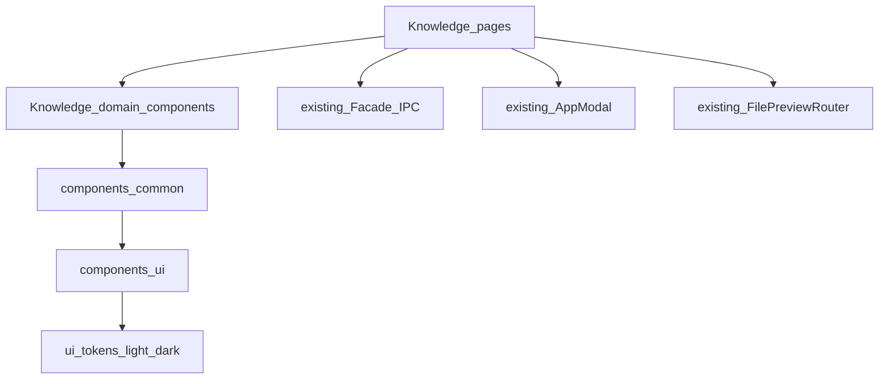

# Work Design System + Knowledge 首消费者

权威合同：[docs/knowledge/PRD-WORK-KNOWLEDGE-UI-v1.0-work-design-system-integration.md](docs/knowledge/PRD-WORK-KNOWLEDGE-UI-v1.0-work-design-system-integration.md) v1.1.1 `APPROVED_FOR_PLAN`。本计划按 PRD §28/§29 写；扫描来自 Knowledge 树与 Work renderer（[Knowledge 扫描](01bd97e3-f7a6-4133-ab02-0daeafe9863f) / [Work UI 扫描](e23c3e34-0842-43dd-a920-a2500f65c7d5)），todo 由 [Kimi K3 High](7a32fed7-d24b-48b6-8bc9-fb971791dd9b) 起草后按源码路径校正。

## 现状（必须按此开工）

- `apps/work/src/renderer/src/components/ui/` **不存在**。
- `components/common/` 只有 `BrandLogo` / `HermesLogo` / `ProfileAvatar`（**禁止改**）。
- 已复用、禁止再造：[AppModal.tsx](apps/work/src/renderer/src/components/modal/AppModal.tsx)（含 `submitting`）、[OrbLoader.tsx](apps/work/src/renderer/src/components/OrbLoader.tsx)、[FilePreviewRouter.tsx](apps/work/src/renderer/src/components/files/preview/FilePreviewRouter.tsx)。
- Knowledge 无本地 CSS；借用与 layout 在 [main.css](apps/work/src/renderer/src/assets/main.css)（约 14097–14211）。`.knowledge-card-grid` 现为 `repeat(auto-fill, minmax(220px, 1fr))`，宽屏会超过 4 列。
- Chrome 借用：`gateway-empty-state`、`discover-toolbar` / `discover-search*`、`settings-section-title`、`memory-tabs`。[KnowledgeModuleNav](apps/work/src/renderer/src/screens/Knowledge/KnowledgeModuleNav.tsx) 用 `memory-tabs`。[KnowledgePages](apps/work/src/renderer/src/screens/Knowledge/KnowledgePages.tsx) host 用 `settings-container` + `settings-card-badge`。
- 表单/卡片：`settings-field` / `settings-card*` + 裸 `input`/`select`/`textarea`/`checkbox`；FileJob 进度是手工 `div`。
- 主题 token 是 `[data-theme]` 下的 `--bg-*` / `--text-*` / `--border-*`，**没有** `--surface-*`。新 token 只补 light/dark。
- `test:knowledge-ui-visual` 与 `scripts/knowledge-ui-visual.mjs` **尚未存在**。
- i18n 只允许改 [en/knowledge.ts](apps/work/src/shared/i18n/locales/en/knowledge.ts)。
- 现有 `knowledge-*-page.test.ts` / `knowledge-arch-scan` / `knowledge-fail-closed` / `knowledge-page-host` / `layout-knowledge-view` 的 **data-testid 全部保留**。

## 硬约束

- Primitive 对外 class **只能** `.ui-*`；不改全局 `.btn`；Knowledge **不得**重定义 `.ui-*`。
- 禁止实现：Tooltip / Skeleton / Separator / IconButton / Pagination / DropdownMenu / Switch。
- 禁止改 IPC / Facade / FileJob / JWT；Sets/Chat **只换皮**，保留 `mutationsEnabled` / mock gate。
- Visual：Playwright 只渲 Knowledge 树，**不**接 Electron CDP、**不**跑 `test:live-visual`。8 张 card PNG，`maxDiffPixelRatio = 0.01`，夹具 **8+ bases + detail content**。
- 本 Gate 扫描：`screens/Knowledge/**` + 本次新增 `components/ui/**` + 冻结 Common。不迁 Discover/Memory/Settings。

## 实施顺序

Phase 1 必须先于页面。Phase 3–6 可在 chrome 完成后按页推进，但最终 Gate 前 Knowledge forbidden class 必须为 0。A-ARCH-004 **不是** Phase 2 的中间闸。

### TODO-01 ui-primitives

- requirement_refs: REQ-ARCH-001
- acceptance_refs: A-ARCH-001, A-ARCH-002, A-ARCH-003
- files: 新建 `apps/work/src/renderer/src/components/ui/` 下 Button / Input / Textarea / Select / Label / FormField / Checkbox / Badge / Card / Table / Tabs / SegmentedControl / Progress；`.ui-*` 样式可放同目录 CSS 或 `main.css` 新增段（不得改现有 `.btn` 规则）
- goal: 冻结 13 个 primitive；disabled / aria / className 可透传
- fail: 私加 catalog 外组件；非 `.ui-*` 前缀
- verify: primitive 单测 + typecheck；扫描 ui 目录仅 `.ui-*`

### TODO-02 common-and-tokens

- requirement_refs: REQ-ARCH-001, REQ-UI-008
- acceptance_refs: A-ARCH-001, A-THEME-001, A-THEME-002
- files: `components/common/` 新增 PageHeader / PageToolbar / SearchInput / FilterSelect / DataTable / EmptyState / StatusBadge；仅在 `[data-theme=light|dark]` 补新 token
- goal: Common 只组合 primitive；不碰三 logo
- fail: Common 再写一套裸控件皮肤；缺 light 或 dark 值
- verify: common 单测 + typecheck

### TODO-03 chrome-and-nav

- requirement_refs: REQ-UI-001
- acceptance_refs: A-UI-001
- files: [knowledge-page-chrome.tsx](apps/work/src/renderer/src/screens/Knowledge/knowledge-page-chrome.tsx)、[KnowledgeModuleNav.tsx](apps/work/src/renderer/src/screens/Knowledge/KnowledgeModuleNav.tsx)、[KnowledgePages.tsx](apps/work/src/renderer/src/screens/Knowledge/KnowledgePages.tsx) host chrome（去掉 `settings-container` / `settings-card-badge`，mock badge 改 StatusBadge）
- map: Loading→OrbLoader；Empty→EmptyState；Toolbar→PageToolbar；Search→SearchInput；SectionTabs/ModuleNav→Tabs；EntityModal 继续 AppModal
- verify: `knowledge-page-host` / `layout-knowledge-view`；这两/三个文件无 forbidden class（全目录清零仍等 TODO-10）

### TODO-04 home-bases-grid

- requirement_refs: REQ-UI-HOME, REQ-UI-002
- acceptance_refs: A-HOME-001, A-HOME-002, A-BASE-001..004
- files: [KnowledgeHomePage.tsx](apps/work/src/renderer/src/screens/Knowledge/pages/KnowledgeHomePage.tsx)、[KnowledgeBasesPage.tsx](apps/work/src/renderer/src/screens/Knowledge/pages/KnowledgeBasesPage.tsx)、[KnowledgeBaseList.tsx](apps/work/src/renderer/src/screens/Knowledge/features/bases/list/KnowledgeBaseList.tsx)、domain：KnowledgeBaseCard / KnowledgeBaseTable；改 `.knowledge-card-grid` 为内容宽 4/3/2/1（max 4）
- fail: 伪造 snapshot 没有的指标字段；1440/2048 列数 >4
- verify: `knowledge-home-page` / `knowledge-bases-page`

### TODO-05 base-detail-forms

- requirement_refs: REQ-UI-003
- acceptance_refs: A-BASE-DETAIL-001, A-BASE-DETAIL-002
- files: [KnowledgeBaseDetailPage.tsx](apps/work/src/renderer/src/screens/Knowledge/pages/KnowledgeBaseDetailPage.tsx)、[KnowledgeBaseCreateForm.tsx](apps/work/src/renderer/src/screens/Knowledge/features/bases/create/KnowledgeBaseCreateForm.tsx)、[KnowledgeBaseSettingsForm.tsx](apps/work/src/renderer/src/screens/Knowledge/features/bases/edit/KnowledgeBaseSettingsForm.tsx)、[KnowledgeBaseDeleteConfirm.tsx](apps/work/src/renderer/src/screens/Knowledge/features/bases/delete/KnowledgeBaseDeleteConfirm.tsx)
- goal: FormField/Input/Textarea/Select/Button；删除确认继续 AppModal + submitting 单飞
- verify: bases-page mutation / fail-closed

### TODO-06 uploads-progress

- requirement_refs: REQ-UI-006
- acceptance_refs: A-UPLOAD-001, A-UPLOAD-002
- files: [KnowledgeUploadsPage.tsx](apps/work/src/renderer/src/screens/Knowledge/pages/KnowledgeUploadsPage.tsx)、[KnowledgeFileJobQueue.tsx](apps/work/src/renderer/src/screens/Knowledge/features/file-job/KnowledgeFileJobQueue.tsx)、domain KnowledgeFileJobCard
- goal: Select + Button + Progress 替换手工 bar；不改 FileJob store
- verify: `knowledge-uploads-page`

### TODO-07 sets-documents

- requirement_refs: REQ-UI-004, REQ-UI-005
- acceptance_refs: A-SETS-001, A-SETS-002, A-DOCS-001, A-DOCS-002
- files: [KnowledgeSetsPage.tsx](apps/work/src/renderer/src/screens/Knowledge/pages/KnowledgeSetsPage.tsx)、[KnowledgeDocumentsPage.tsx](apps/work/src/renderer/src/screens/Knowledge/pages/KnowledgeDocumentsPage.tsx)
- goal: Checkbox/FormField/Card/Table；Documents 继续 FilePreviewRouter；permission 仍 display-only
- fail: 升真实 Sets CRUD；自造 preview
- verify: `knowledge-sets-page` / `knowledge-documents-page`

### TODO-08 chat-presentation

- requirement_refs: REQ-UI-007
- acceptance_refs: A-CHAT-001, A-CHAT-002
- files: [KnowledgeChatPage.tsx](apps/work/src/renderer/src/screens/Knowledge/pages/KnowledgeChatPage.tsx)
- goal: Textarea/Button/Select + Work list 模式；citation 在夹具 ≥1440 可见；零导入 Work Chat / Skill Run
- verify: `knowledge-chat-page`

### TODO-09 visual-harness

- requirement_refs: REQ-UI-010
- acceptance_refs: A-VIS-001, A-VIS-002, A-VIS-003
- files: [apps/work/package.json](apps/work/package.json) 增加 `test:knowledge-ui-visual` → `node scripts/knowledge-ui-visual.mjs`；baseline `apps/work/tests/visual/knowledge-ui/baselines/` 恰好 8 个文件名（PRD REQ-UI-010）；夹具 8+ bases + detail content、card mode、light/dark、1440/2048
- fail: 接 CDP / 调用 `test:live-visual` / 失败自动刷 baseline
- verify: `cd apps/work && npm run test:knowledge-ui-visual`；更新仅 `--update-baselines`

### TODO-10 final-scan-regression

- requirement_refs: REQ-ARCH-002, REQ-UI-009, REQ-MIGRATE-001, REQ-SEC-001/002
- acceptance_refs: A-ARCH-004, A-A11Y-001, A-MIGRATE-001/002, A-SEC-001/002
- goal: Knowledge 生产 TSX/CSS `discover-` / `memory-` / `gateway-` / `settings-card*` / `settings-section*` / `settings-field` == 0（测试文案除外）；键盘可达；`cd apps/work && npm run typecheck && npm run guard && npm test && npm run test:knowledge-ui-visual`
- A-A11Y-002 与 Desktop Golden 为 SHOULD，SKIPPED 不挡 Gate

## Non-goals

不改 nodeskclaw API、不新建 Knowledge store、不重做 Desktop Sidebar、不复制 shadcn 整包、不迁其它 feature CSS、不要求非 light/dark 主题等价。
