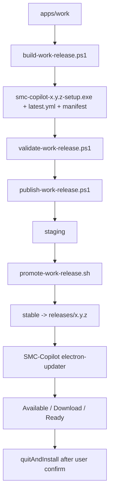

# Work v2.2 Release Lifecycle Closure

按 [docs/work/PRD-WORK-v2.2-release-lifecycle-closure.md](docs/work/PRD-WORK-v2.2-release-lifecycle-closure.md) 的 Phase 1–6 实施。不新增架构层；工程术语继续保留 `apps/work`、`/work/stable/`、`SMC_WORK_*`。

## 当前基线

v2.0 Updater Core 与 v2.1 Release Server 已在仓库中，但身份、脚本和 UX 仍停在 SMC Work：

- 打包身份仍是 `com.smc.work` / `smc-work`（[apps/work/electron-builder.yml](apps/work/electron-builder.yml)）
- 运行时仍是 `com.hermes.desktop`（[apps/work/src/main/app/start.ts](apps/work/src/main/app/start.ts)）
- `package.json` 仍暴露 `copilot-desktop` / `fathah` / hermes-desktop homepage
- `validate-work-release.ps1` / `publish-work-release.ps1` 把 `param()` 放在 `$ErrorActionPreference` 之后，PowerShell 会直接解析失败（P0）
- Feed 只校验 HTTPS + `/work/stable/`，未锁 `release.superic.com`
- 更新 UI 只有 Sidebar 按钮 + About，没有 Available/Ready 对话框
- `AppUpdateState.releaseNotes` 已存在，但 Build 没有 Release Notes 输入



## 边界

- 不改模块路径、不把 `/work/stable/` 改成 `/copilot/stable/`、不改 env 前缀。
- 不重写 GitHub `release.yml`（生产 feed 已切 Generic Provider）。
- 不把 Linux/mac 发布当成 v2.2 交付目标；只在碰到 `electron-builder.yml` 时清掉明显上游身份（如 `vendor: Nous Research`）。
- **Phase 6 真实 Windows 安装/升级、生产 TLS 证书、正式 Publisher Subject 不能由 Cursor 自动标为 proven。** 代码与门禁做到可执行；Live Evidence 由人工按清单验收。

---

## Phase 1 — Identity

结果：安装包、快捷方式、任务栏、窗口标题都是 **SMC-Copilot / `com.smc.copilot` / `smc-copilot.exe`**；默认目录为 `D:\Programs\SMC\Copilot`，无 D 盘时回退 `%ProgramFiles%\SMC\Copilot`；已有安装不搬家。

主锚点：

- [apps/work/electron-builder.yml](apps/work/electron-builder.yml)
- [apps/work/package.json](apps/work/package.json) + lockfile `name`
- [apps/work/src/main/app/start.ts](apps/work/src/main/app/start.ts)
- 新增 [apps/work/build/installer.nsh](apps/work/build/installer.nsh)（`nsis.include`）

身份字段：

```yaml
appId: com.smc.copilot
productName: SMC-Copilot
win.executableName: smc-copilot
nsis.artifactName: smc-copilot-${version}-setup.${ext}
nsis.shortcutName / uninstallDisplayName: SMC-Copilot
```

`package.json`：`name=smc-copilot`，`description=SMC-Copilot Desktop`，`author=SMC`，删除 upstream homepage。用户可见默认名同步：`start.ts` / `ipc/register.ts` / `index.html` / `main.tsx` / Runtime 与 ConnectionError 文案。

**userData 连续性（P0，必须做）**：`name` 从 `copilot-desktop` 改为 `smc-copilot` 会改变 `%APPDATA%\<name>`。在 [apps/work/src/main/index.ts](apps/work/src/main/index.ts) 里、`applyGpuPreferences()` 之前做一次性迁移：若新目录为空，则从已知旧目录（至少 `copilot-desktop`、`SMC Work`）搬到 `smc-copilot`。`HERMES_DESKTOP_USER_DATA_DIR` 仍优先。

NSIS `preInit`：已有 `InstallLocation` 保持；否则 D: 存在用 `D:\Programs\SMC\Copilot`，否则 `$PROGRAMFILES\SMC\Copilot`。

验证：更新 [apps/work/tests/release-builder-config.test.ts](apps/work/tests/release-builder-config.test.ts)；新增 installer.nsh 与 userData 迁移单测。不在本阶段改 `version`（保持 `0.7.4`）。

停止条件：仓库内不再出现生产身份 `com.smc.work` / `smc-work-*` / `com.hermes.desktop`；`portable` 仍不进入 Windows 默认 target。

---

## Phase 2 — Release Pipeline Repair

结果：PowerShell 可执行；artifact 全链 `smc-copilot-*`；生产 unsigned publish 拒绝；signer 与 packaged feed 成为硬门禁。

主锚点：

- [apps/work/scripts/validate-work-release.ps1](apps/work/scripts/validate-work-release.ps1)
- [apps/work/scripts/publish-work-release.ps1](apps/work/scripts/publish-work-release.ps1)
- [apps/work/scripts/build-work-release.ps1](apps/work/scripts/build-work-release.ps1)
- [apps/work/scripts/lib/work-release-guard.mjs](apps/work/scripts/lib/work-release-guard.mjs)

修复：

1. `param(...)` 必须是脚本第一句，然后再 `$ErrorActionPreference` / `Set-StrictMode`。
2. `getInstallerName()` 改为 `smc-copilot-${version}-setup.exe`；promote/rollback/README/测试同步。
3. `validateUpdateUrl()` 生产 Host Gate：`hostname === release.superic.com`，拒绝 localhost / IP / 其他域名。现有测试里的 `release.example.org` 改为官方 URL 作正例、其他 host 作反例。
4. **Build** 仍可用 `SMC_WORK_RELEASE_ALLOW_UNSIGNED=1` 做本地/CI fixture；**Publish** 若该变量为 `1` 或 `manifest.signed !== true` 立即 `PUBLISH_DENIED`。
5. Signer Gate：`Get-AuthenticodeSignature` 为 `Valid` 后，Subject 必须匹配 `SMC_WORK_EXPECTED_PUBLISHER`。正式 DN 未定时，生产 publish 要求该 env 非空，不把假 DN 写进仓库。
6. Packaged Feed Verification：构建后读取 `dist/win-unpacked/resources/app-update.yml`（electron-builder NSIS 会同时产出 unpacked），断言 `provider/generic`、`url=https://release.superic.com/work/stable/`、`channel=latest`。源码 yml 正确但 env 错误必须 fail。
7. 新增 [apps/work/tests/release-powershell-integration.test.ts](apps/work/tests/release-powershell-integration.test.ts)：真实执行 `validate` / `publish -LocalRoot`，断言 **ExitCode**（非 Windows CI `describe.skipIf`）。覆盖 valid、非法 version、缺 artifact、local staging、invalid config。

停止条件：未改 param 顺序的脚本无法运行；生产 publish 无法带着 unsigned 或错误 feed 出门。

---

## Phase 3 — Production Release Server

结果：Nginx 只服务 `release.superic.com`；`/healthz` 与 artifact 均仅 GET/HEAD；Compose 有 `healthcheck`；promote/rollback 在切 `stable` 前校验 latest.yml + manifest。

主锚点：

- [infra/release-server/nginx/default.conf](infra/release-server/nginx/default.conf)
- [infra/release-server/docker-compose.yml](infra/release-server/docker-compose.yml)
- [infra/release-server/scripts/promote-work-release.sh](infra/release-server/scripts/promote-work-release.sh)
- [infra/release-server/scripts/rollback-work-stable.sh](infra/release-server/scripts/rollback-work-stable.sh)

改动：

- `server_name release.superic.com;`
- `/healthz` 加 `limit_except GET HEAD`
- Compose `healthcheck` 打容器内 `https://127.0.0.1/healthz`（容器内可用 `--no-check-certificate`，不暴露给客户端）
- Promote 增加：`latest.yml.version == VERSION`、`path` 为 `smc-copilot-${VERSION}-setup.exe`、`manifest.version/updateUrl/signed=true`
- Rollback 切 symlink 前复用同一套 artifact/SHA256/manifest 校验；语义仍是“挡住未升级客户端”，不是已升级自动降级

TLS 证书本身不进 git。代码只保证配置与文档；生产 SAN=`DNS:release.superic.com` 由运维安装。更新 [infra/release-server/README.md](infra/release-server/README.md) 与现有 nginx/promote 测试。

---

## Phase 4 — Publish Closure

结果：远程 promote 成功不等于发布成功；必须 `POST_PUBLISH_VERIFY`。

落在 [apps/work/scripts/publish-work-release.ps1](apps/work/scripts/publish-work-release.ps1)：

1. 再次跑 validate（含 unsigned deny + signer）
2. scp → promote
3. `GET https://release.superic.com/work/stable/latest.yml`：version 匹配
4. `HEAD` installer：200 + Content-Length
5. 任一步失败输出 `PUBLISH_NOT_CONFIRMED`，禁止 “Published …”
6. `SMC_WORK_RELEASE_LOCAL_ROOT` 只做本地 staging smoke，不声称生产成功

Release Notes 输入在本阶段与 Build 对齐（见 Phase 5 文件），publish 不负责写 notes，但 promote 后的 `latest.yml` 必须仍指向正确 installer。

---

## Phase 5 — UX Closure

结果：用户能看到版本、日期、更新内容，并分别确认下载与安装。Main Snapshot 行为不变：`autoDownload=false`、`autoInstallOnAppQuit=false`。

新增（复用已有 [AppModal](apps/work/src/renderer/src/components/modal/AppModal.tsx) + `useAppUpdate()`，挂在 [App.tsx](apps/work/src/renderer/src/App.tsx) 的 `AppUpdateProvider` 内，不依赖 Settings）：

- `UpdateAvailableDialog.tsx`：`status=available` 弹出；稍后只关对话框，不改 Snapshot、不关检查、不下载
- `UpdateDownloadStatus.tsx`：`downloading` 展示 percent
- `UpdateReadyDialog.tsx`：`ready` 弹出稍后 / 立即安装

Sidebar 更新按钮保留。稍后用 session 级 dismissed key（`availableVersion` / `ready`），同一版本本次会话不再扰，新版本或进入 `ready` 仍提示。

Release Notes：新增 `apps/work/release-notes/<version>.md`。`build-work-release.ps1` 增加 `-ReleaseNotesPath`（默认该目录下当前 version）；缺失则 Build fail。把内容写入 `latest.yml` 的 `releaseNotes`，客户端已有 `AppUpdateState.releaseNotes`。

i18n：至少 `en` + `zh-CN` 的 `common`/`settings` 增加对话框文案；其他 locale 可回退 en。

About 桌面卡文案从 “Copilot Desktop” 收到 “SMC-Copilot”（产品名，不是模块名）。

---

## Phase 6 — Windows Live Test（人工 Gate）

代码侧交付：`lat.md/desktop-updates.md` 增加 Fresh Install / `0.7.4 → 0.7.5` / userData 连续性 / Release Server 失败用例清单。可选加 `tests/packaged-upgrade.manual.md` 风格的步骤索引（只放 lat，不新造文档体系）。

Cursor **不**执行、不标记：

- 真机 NSIS 安装到 `D:\Programs\SMC\Copilot`
- Authenticode 真证书签名
- 打 `0.7.5` 并 publish 到 `release.superic.com`
- 打包应用内点对话框完成升级

这些是 P0 DoD，由人工在 Windows 10/11 AMD64 验收。实施时 `package.json` version 保持 `0.7.4`，直到发版负责人显式升 `0.7.5`。

---

## 验证命令（代码阶段）

每个代码 Phase 结束后：

```bash
cd apps/work
npm test -- --run tests/release-builder-config.test.ts tests/work-release-scripts.test.ts tests/release-nginx-config.test.ts tests/work-release-promote.test.ts
npm test -- --run tests/release-powershell-integration.test.ts   # Windows
npm run typecheck
npm run guard
lat check
```

Phase 5 另跑对话框/Provider 测试与 `typecheck:web`。

## lat.md

更新 [apps/work/lat.md/desktop-updates.md](apps/work/lat.md/desktop-updates.md)：产品身份、官方 feed、unsigned/signer/packaged-yml 门禁、对话框与 userData 迁移。不把 Live Evidence 写成已 proven。
