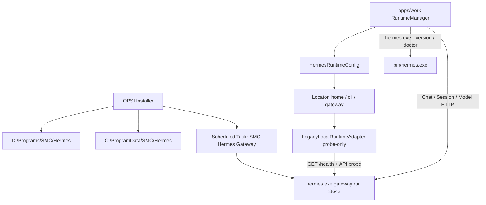

# Work v2.4 P0：Managed Hermes Runtime 对接调用

本次只做 PRD **P0**。目标：Work 作为 **Managed Hermes Consumer**，发现并调用本机 Hermes Agent（`hermes.exe` + Gateway HTTP），不再拥有 Gateway 进程。



## 现状缺口

当前 [`runtime-manager.ts`](apps/work/src/main/runtime/runtime-manager.ts) 仍按 `direct/salt/runtime` 选 Adapter；[`hermes-runtime-paths.ts`](apps/work/src/main/runtime/hermes-runtime-paths.ts) 用 `HERMES_HOME/hermes-agent/venv/python` 推导 Runtime；[`legacy-local-runtime-adapter.ts`](apps/work/src/main/runtime/legacy-local-runtime-adapter.ts) 在 Gateway 不可达时调用 `startGatewayWithRecovery()`；[`hermes.ts`](apps/work/src/main/hermes.ts) 的 `getApiUrl()` 按 profile 分配端口；[`installer.ts`](apps/work/src/main/installer.ts) 执行 `python -m hermes_cli.main`。

OPSI 布局下这些假设全部失败：CLI 是 `D:\Programs\SMC\Hermes\bin\hermes.exe`，Gateway 由 SYSTEM Scheduled Task 持有，PID 镜像是 `hermes.exe` 而不是 `python`。

## 1. Runtime Descriptor（SOT）

新增 [`apps/work/src/main/runtime/hermes-runtime-config.ts`](apps/work/src/main/runtime/hermes-runtime-config.ts)：

```ts
export interface HermesRuntimeConfig {
  schemaVersion: 1;
  hermes: {
    home: string;
    programRoot: string;
    cliPath: string;
    agentRoot?: string;
    scriptsRoot?: string;
  };
  gateway: { baseUrl: string; healthPath: string };
}
```

解析优先级（与 PRD §12 一致）：

1. Work `runtime.json`（`app.getPath("userData")`，例如 `%APPDATA%\SMC-Copilot\runtime.json`）
2. 企业描述符（可读则用 `%ProgramData%\SMC\hermes-runtime.json`）
3. 机器环境变量 `HERMES_HOME`
4. Windows 企业默认值：`C:\ProgramData\SMC\Hermes` / `D:\Programs\SMC\Hermes\bin\hermes.exe` / `http://127.0.0.1:8642`

提供 `getHermesRuntimeConfig()` / `getHermesHome()` / `getHermesCliPath()` / `getGatewayBaseUrl()`。禁止再新增 module-level `const HERMES_HOME = ...` 作为运行期 SOT。

[`hermes-runtime-paths.ts`](apps/work/src/main/runtime/hermes-runtime-paths.ts) 改为薄封装：删除 `defaultHermesHome()` 对 `%LOCALAPPDATA%\hermes` / `~\.hermes` 的自动扫描；删除 `HERMES_HOME → repo → venv → python` 作为 Valid 条件。`getEnhancedPath()` 仅在 subprocess 需要时注入 `programRoot\bin`、`scripts`、`node`，不改系统 PATH。

`HERMES_REPO` / `HERMES_PYTHON` / `hermesCliArgs()` 退出 Runtime 判定；P1 遗留调用点可暂时保留，但新路径一律走 `cliPath`。

## 2. Locator + CLI 调用

重写 [`hermes-runtime-locator.ts`](apps/work/src/main/runtime/hermes-runtime-locator.ts)：

- `runtimeFound` = home 存在 **或** `cliPath` 存在
- `runtimeValid` = `cliPath` 存在且可执行
- `cliAvailable` = `hermes.exe --version` 能成功（异步探测可缓存在 Adapter）
- 删除 Contract 中的 `repoPath` / `pythonPath` / `venvPath`
- `endpoint` 固定为 `getGatewayBaseUrl()`，不再 `getProfilePort()`

新增统一 CLI runner（供 Locator / `getHermesVersion` / `runHermesDoctor` 使用）：

```text
spawn/execFile(config.hermes.cliPath, args, { env.HERMES_HOME, env.PATH += bin/scripts/node })
```

改 [`installer.ts`](apps/work/src/main/installer.ts) 的 `getHermesVersion()` / `runHermesDoctor()`：从 `HERMES_PYTHON -m hermes_cli.main` 改为 `hermes.exe --version` / `hermes.exe doctor`。Install/update/migrate 不在 P0 生产路径启用（OPSI 拥有安装）。

## 3. Adapter 只探活，不启动 Gateway

改 [`legacy-local-runtime-adapter.ts`](apps/work/src/main/runtime/legacy-local-runtime-adapter.ts)：

- `probe()`：Config → CLI exists → version → `GET {baseUrl}{healthPath}` → 带鉴权的 API probe（例如 `GET /v1/models` 或现有 sessions 探针）
  - health 通：`gatewayHealthy`
  - API 200：`authenticated` + `ready`
  - API 401/403：`gateway_auth_failed`（**不再**用「读到 API_SERVER_KEY」当作已认证）
  - health 失败：`gateway_unreachable`（不再先看 python PID / `gateway.pid`）
- `ensureReady()` = `probe()`，禁止 `startGatewayWithRecovery()`
- `restart()` 保留但返回 `ok: false`，`errorCode: MANAGED_RUNTIME_RESTART_REQUIRED`，文案说明 Gateway 由 endpoint management 管理

Chat 请求仍走现有 [`hermes.ts`](apps/work/src/main/hermes.ts) HTTP 客户端。Bearer 仅在能解析到 key 时附加（`process.env` / 现有 secrets provider / **尽力读** `.env`）；读不到不视为配置失败，把 401 交给 probe/chat 错误面。完整 Credential Manager 不在 P0。

## 4. RuntimeManager 单 Adapter

[`runtime-manager.ts`](apps/work/src/main/runtime/runtime-manager.ts)：删除 `defaultAdapter()` 里的 `getHermesControlOwner()` switch。默认 `new LegacyLocalRuntimeAdapter()`。测试仍可注入 Adapter。

**不删除** `runtime-service-adapter.ts` / `availability-backend.ts` / `control-owner.ts`（P1），但它们退出生产 Runtime 路径。

Renderer [`RuntimeProvider.tsx`](apps/work/src/renderer/src/runtime/RuntimeProvider.tsx)：Connection Ready 不再按 `salt/direct/runtime` 分支；统一 `runtimeEnsureLocalReady`（现已是 probe-only）。`restart` UI 展示 `MANAGED_RUNTIME_RESTART_REQUIRED`。

IPC [`register.ts`](apps/work/src/main/ipc/register.ts) 的 `start-gateway` / `stop-gateway` / Runtime `restart`：本地 managed 路径拒绝 spawn/kill（与 Adapter 一致），避免 Gateway 设置页仍拉起第二进程。`generate-api-server-key` 不得 `stopGateway` + `startGateway`。

## 5. Gateway Endpoint 收敛

[`hermes.ts`](apps/work/src/main/hermes.ts) `getApiUrl()` 在 local 模式只返回 `getGatewayBaseUrl()`（默认 `http://127.0.0.1:8642`）。Chat / health / models / sessions / capabilities 全部吃同一 URL。

`gateway-ports.ts` 本轮不改文件语义（P1），但 P0 调用链不再用它解析生产 endpoint。Splash 的 remote/ssh 旁路保留（P0 不拆 Connection Mode UI），**local managed 生产路径**不再按 profile 换端口。

## 6. 测试与文档

新增/改写单测（PRD §31 中 P0 部分）：

- `hermes-runtime-config`：默认值、自定义 `runtime.json`、非法绝对路径、非法 Gateway URL、缺失配置回退
- locator：CLI 存在/缺失、home 存在/缺失、endpoint = 8642
- RuntimeManager：默认永远是 `LegacyLocalRuntimeAdapter`；不读 control-owner
- Adapter：health 200、unreachable、401、CLI missing；`ensureReady` 不调用 start/restart spawn；`restart` 返回 `MANAGED_RUNTIME_RESTART_REQUIRED`

更新现有：[`tests/runtime-adapter.test.ts`](apps/work/tests/runtime-adapter.test.ts)、[`tests/hermes-runtime-paths.test.ts`](apps/work/tests/hermes-runtime-paths.test.ts)。Salt/Runtime adapter 测试文件保留但不再作为生产路由依据。

更新 [`apps/work/lat.md/runtime-connection.md`](apps/work/lat.md/runtime-connection.md)：Work 只发现/探测/调用；OPSI 拥有 Gateway。完成后 `lat check`。

## 明确不做（P1 / PRD §29）

- `desktop.json` 迁出 `HERMES_HOME`（ACL 冲突仍在，作为已知 follow-up）
- 删除 `RuntimeServiceAdapter` / `HermesAvailabilityBackend` 源文件
- 冻结 `gateway-ports` 写 `config.yaml`
- `profiles.ts` / `dashboard.ts` / `cronjobs.ts` / `hermes-auth.ts` / `skills.ts` / `kanban.ts` 中剩余 `HERMES_PYTHON` spawn（下一轮切到 `runHermesCli`）
- Credential Manager / DPAPI 密钥发放
- 真机 OPSI ACL / Process Ownership 实验室验收
- Hermes Agent 打包、Remote/SSH 架构删除、`services/runtime` 恢复
