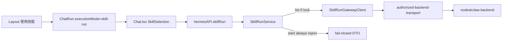

# Work v4.0.1 Checkpoint A Plan

**Mode：CREATE**（无既有 skill-first Plan）  
**切片：ROADMAP Checkpoint A = M1 + M2**  
**PRD：** [docs/work/PRD-WORK-v4.0.1-skill-first-layout-run-integration.md](docs/work/PRD-WORK-v4.0.1-skill-first-layout-run-integration.md)  
**基线：** `grounding_source: committed_baseline`，`grounded_commit: c10ae2fdc9bd7d286d828836c80fcbc2debb6257`  
**commit_policy：** `post_review`（禁止 Todo 完成即提交）

确认本 Cursor Plan 后，**先**把完整 v3.2 合同写入 `.cursor/plans/work-v4.0.1-skill-first-checkpoint-a.plan.md`，并跑 `validate_generation_integrity.py`、`validate_plan.py`、`assess_plan_review.py`。Contract/Data Flow 非 None，必须 **smc-plan-review PASS** 后才能改 `apps/work` 生产代码。

## Scope

**In**

- 从 Expert Gateway 抽取 Main 内部共享 authorized transport；Expert 行为不变
- Skill Run shared DTO、feature mode、IPC/Preload、Gateway list、Service 骨架
- `ChatRun.executionMode`、Layout「使用技能」、Catalog/Selection Bar、Chat 单一 selection 与 queue snapshot
- Skill mode 从 DOM 移除 Expert/本地模型/Reasoning/Fast Mode/Context Folder；附件 fail-closed
- 无 lock 时 Catalog=`contract-unsupported`；`start`/`cancel` 不发生产 HTTP

**Out（下一切片）**

- 生产 `tools/call`、SSE、poll、pending-submit 幂等、Result、`skill-run` continuation、File Platform `skill-run` provider、Approval、附件上传、Expert 默认入口 REMOVE（v4.2）
- 不改 `contracts/work-expert/v1.0.2`；不猜 Provider event/result schema；不改 `screens/Skills`

**Owner 继承**

- Transport：Main auth/shared fetch（不拥有 lifecycle）
- Lifecycle：Main `SkillRunService`（本切片只做拒绝 start）
- Tab mode：`Layout` / `chatRuns.ts`
- Selection/submit：`Chat.tsx`
- Catalog UI：`modules/skill-run`（无第二份 selection）
- 文件/会话 SoT：现有 File Platform / Session store（本切片不扩展）

## Change IDs 与写所有权

同一 production `path#symbol` 只有一个 Todo WRITE_OWNER。REPLACE 员工 Expert 路径本切片不执行。

- **C01** — 共享 authorized transport。Strategy：`MODIFY_EXISTING` + 最小新文件。T1。根因：`createExpertGatewayClient` 的 `authorizedFetch` / `joinUrl` / `withAuthRetry` 已是 JWT+same-origin+timeout 的唯一实现，Skill client 不得再复制。
- **C02** — Skill Run Main 面（DTO、feature mode、Gateway list、Service、IPC、preload）。Strategy：`MINIMAL_NEW`（新合同，不能塞进 `expert-run-service.ts`）。T2。
- **C03** — `ChatRun.executionMode` + Layout 转换。Strategy：`MODIFY_EXISTING`。T3。
- **C04** — `modules/skill-run` Catalog/Selection/projection store。Strategy：`MINIMAL_NEW`（对齐 `modules/expert`，Chat 保持 selection truth）。T4。
- **C05** — Chat 提交互斥、queue snapshot、工具条移除、ChatInput 附件/slash/发送门禁。Strategy：`MODIFY_EXISTING`。T5。
- **C06** — 12 个 locale 的 `navigation.useSkill` + `skillRun.*`。Strategy：`MODIFY_EXISTING`。T6（`shared/i18n` hotspot）。
- **C07** — `lat.md` 记录 Skill-first 边界。Strategy：`MODIFY_EXISTING`。T7。

## 关键实现决定（不得在 Execute 再发明）

1. **Feature mode 默认 `expert-compat`**（保持现有 Expert）。持久化在 Main `userData`（仿 [`auth-endpoint-config-store.ts`](apps/work/src/main/auth/auth-endpoint-config-store.ts)）。可选 env `SMC_WORK_SKILL_RUN_MODE` 仅开发覆盖。Renderer 只读投影；**Main 强制**。
2. **无 Skill Run consumer lock → 不发起 `tools/list` / `tools/call`。** Catalog IPC 返回 `contract-unsupported`。本切片**不**新增 `contracts/skill-run` lock（M0 的事）。
3. **`start` 一律拒绝**：缺 lock、或缺 `skill-first`、或本切片范围外。禁止 `authorizedFetch` POST `/api/v1/mcp`。`cancel` 无 in-flight run 时同样 fail-closed，且 **不得**调用 `Chat` 的 local `handleAbort`。
4. **三个 identity**：`ChatRun.runId`（Tab）、`clientRequestId`（本地相关）、Provider `run_id`（本切片 DTO 预留、不写入 `ChatRun`）。
5. **Transport 抽出到** [`apps/work/src/main/auth/authorized-backend-transport.ts`](apps/work/src/main/auth/authorized-backend-transport.ts)：origin、fresh JWT、401/403 单次 refresh、timeout、`joinUrl` same-origin、错误清洗。**不**导出 `getAccessToken` 给 Preload。Expert client 改为调用它；Expert JSON-RPC/catalog TTL 仍留在 `expert-gateway-client.ts`。
6. **Layout 转换**（[`Layout.tsx#handleNewChat`](apps/work/src/renderer/src/screens/Layout/Layout.tsx) 对称）：
   - 空白 scratch（`isScratchRun`，须含 `executionMode`）原地切 mode
   - 已有内容：激活同 profile 空白 Skill Tab，否则 `mintRun(..., executionMode: "skill-run")`
   - 已是空白 Skill Tab：只 `goTo("chat")`
   - **不 abort** 其它 Tab（沿用现有「不取消后台 run」）
7. **`isScratchRun` / `selectProfileRunTransition` / `handleNewChat`** 今日用 `!sessionId && !loading && !title`；必须改为带 `executionMode` 的 scratch，避免 local/skill 空白 Tab 互相吞掉。
8. **Chat 工具条**：Skill mode **不渲染** `ExpertContextControl`、`ModelPicker`、`ReasoningEffortPicker`、Fast Mode、`ContextFolderChip`（今天在 [`Chat.tsx` ~1607–1678](apps/work/src/renderer/src/screens/Chat/Chat.tsx) 用 opacity 藏 Expert 下的本地控件——Skill mode 要真正移出 DOM）。Slash 过滤掉 `/model` 等会重开这些面板的命令。
9. **Queue**：扩展现有 [`QueuedMessage.expertRequest`](apps/work/src/renderer/src/screens/Chat/Chat.tsx) 模式，增加不可变 `skillRequest: { toolName, arguments, clientRequestId }`；出队不得重读 `SkillSelection`。
10. **互斥**：`skill-run` Tab 不走 Expert/Local send；`skill-first` 下 local-chat Tab 也不得 `expert.start`。失败不 fallback Expert。
11. **IPC 名** `window.hermesAPI.skillRun`（不要叫 `skills`，避免与本地 Skills 管理混淆）。最小：list/refresh、start（拒绝）、cancel（拒绝）、getFeatureMode、subscribe 清洗后的 catalog/error projection。无 raw fetch、无 URL、无 credential。
12. **Projection store** 只缓存 Catalog/error/mode，不是 Provider Run SoT。
13. **Logout**：[`auth-ipc.ts` logout](apps/work/src/main/auth/auth-ipc.ts) 在 `disposeExpertSubsystem()` 旁 dispose Skill Run；[`start.ts` before-quit](apps/work/src/main/app/start.ts) 同样。

## 新文件（均须 New File Justification）

现有 Expert 文件不能同时拥有第二套 wire contract（PRD 已批准独立 Skill Run owner）。

- `apps/work/src/main/auth/authorized-backend-transport.ts`（+ test）
- `apps/work/src/shared/skill-run.ts`
- `apps/work/src/main/skill-run/feature-mode-store.ts`
- `apps/work/src/main/skill-run/skill-run-gateway-client.ts`
- `apps/work/src/main/skill-run/skill-run-service.ts`
- `apps/work/src/main/skill-run/skill-run-ipc.ts`
- `apps/work/src/preload/skill-run-api.ts`
- `apps/work/src/renderer/src/modules/skill-run/{index,store,SkillCatalogPanel,SkillSelectionBar}.tsx`
- 各 locale `apps/work/src/shared/i18n/locales/<locale>/skillRun.ts`（12 个 `APP_LOCALES`）
- 对应 `*.test.ts(x)` 与 `apps/work/lat.md/skill-run.md`

无 `NEW_DEPENDENCY`。无生成物。

## Integration Hotspots（file-level 单写者）

- [`expert-gateway-client.ts`](apps/work/src/main/expert/expert-gateway-client.ts) → T1
- [`start.ts`](apps/work/src/main/app/start.ts) → T2
- [`preload/index.ts`](apps/work/src/preload/index.ts) + [`index.d.ts`](apps/work/src/preload/index.d.ts) → T2
- [`auth-ipc.ts`](apps/work/src/main/auth/auth-ipc.ts) → T2
- [`Layout.tsx`](apps/work/src/renderer/src/screens/Layout/Layout.tsx) + [`chatRuns.ts`](apps/work/src/renderer/src/screens/Layout/chatRuns.ts) → T3
- [`Chat.tsx`](apps/work/src/renderer/src/screens/Chat/Chat.tsx) + [`ChatInput.tsx`](apps/work/src/renderer/src/screens/Chat/ChatInput.tsx) → T5
- [`shared/i18n/index.ts`](apps/work/src/shared/i18n/index.ts) 与 locale 目录 → T6

## Todo 切片与依赖

- **T1 C01** — 抽出 transport，Expert 回归绿灯。可与 T3 并行。
- **T2 C02** — Skill Run Main/IPC/preload；Depends T1。
- **T3 C03** — executionMode + 使用技能；与 T1 并行。
- **T4 C04** — Catalog 模块；Depends T2。
- **T5 C05** — Chat 接线；Depends T2、T3、T4。
- **T6 C06** — 文案；Depends T3、T4（key 已在本 Plan 冻结则可与 T5 并行，仍不与 T6 同时写 i18n）。
- **T7 C07** — lat.md；Depends T2、T5。

**Parallel Safe：** 仅 T1 与 T3 可为 yes。其余 no。

## 数据流闭环（本切片仅 3 条跨边界流）

1. **Catalog list（有 lock 时）**：Main SkillRunGatewayClient 生产清洗后的 `{ toolName, title, description, category, callability }` → IPC schema → Renderer store/Chat。校验 Owner=Main parser。失败：unauthorized / backend-unavailable / contract-unsupported。无幂等。无 lock 时 **不发 HTTP**，直接 contract-unsupported。
2. **Start/cancel**：Renderer 生产 `toolName`+prompt snapshot+`clientRequestId` → IPC → SkillRunService **拒绝**。无 Backend producer。Failure mapping 为稳定 errorCode。禁止生成第二次 HTTP。
3. **Feature mode**：Main store 权威 → IPC get/subscribe → Renderer UX。变更立即失效 catalog cache。

## Lifecycle（须闭环）

- Start 非终态不存在；writer=`SkillRunService` 写入 rejected projection。
- Catalog loading → ready | 上述错误态；logout 清 cache。
- Tab mode 转换不取消其它 run 的 loading/Expert task。

## AC 覆盖

**本切片实现并阻断验证：** AC-UI-01..06、AC-CONTRACT-01（expert lock 不变、无伪造 skill-run lock）、02（IPC 无 routing 字段）、03、04、AC-RUN-01（owner+projection）、04（queue snapshot）、05（cancel 不 abort local）、AC-FILE-02（无平行 DB/download IPC）、AC-COMPAT-01..03（03=不删除 Expert 入口）。

**本切片用负向门禁证明“未启用”：** AC-RUN-02/03、AC-OUT-01/02、AC-FILE-01 → 测试断言无 `tools/call`、无 SSE、`DesktopSessionContinuationItem` 仍无 `skill-run`、`ManagedFileRemoteProvider` 仍为 `"expert"`。

## 验证入口（须预检存在）

在 `apps/work`：

- `npm test -- src/main/expert/expert-gateway-client.test.ts`（已存在）
- `npm test -- src/renderer/src/screens/Layout/chatRuns.test.ts`（已存在）
- 新增 focused tests（Matrix ADD）后：`npm test -- src/main/auth/authorized-backend-transport.test.ts` 等
- `npm run typecheck`、`npm run typecheck:web`、`npm run guard`
- Evidence 目录：`artifacts/work-v4.0.1-checkpoint-a/`（Execute 落盘，Plan 只声明路径）

## Immediate Read（仅 T1 执行前）

- [`expert-gateway-client.ts#createExpertGatewayClient`](apps/work/src/main/expert/expert-gateway-client.ts)
- [`expert-gateway-client.ts` `authorizedFetch` / `joinUrl` / `withAuthRetry`](apps/work/src/main/expert/expert-gateway-client.ts)
- [`ensure-access-token.ts#ensureFreshAccessToken`](apps/work/src/main/auth/ensure-access-token.ts)
- [`auth-endpoint-config-store.ts#readAuthEndpointConfig`](apps/work/src/main/auth/auth-endpoint-config-store.ts)
- [`expert-gateway-client.test.ts`](apps/work/src/main/expert/expert-gateway-client.test.ts)

**Triggered Read：** 仅当 Expert 回归失败、出现第二 HTTP 入口、或 lock 文件实际落地时，再读 `expert-run-service.ts` / consumer-lock / Chat slash。

## Completion Gate

- **IMPLEMENTED_AND_PROVEN**：本切片 AC + 负向门禁测试全过，evidence 留存
- **IMPLEMENTED_NOT_PROVEN**：代码有、测试/typecheck 未留证
- **BLOCKED**：无 lock 导致 Catalog 只能 unsupported（这是 **预期产品态**，不阻塞切片完成）；真 BLOCKED 仅环境无法跑 vitest
- **RETURN_PRD**：若必须启用生产 `tools/call` 或把 Skill 塞进 Expert client

## 禁止

- 在 Expert 文件里分支两套 wire contract
- 无 lock 时解析/过滤 Catalog
- Renderer 持有 JWT/URL/raw event
- 把 `run_id` 写入 `ChatRun.runId`
- 本切片提交代码（`post_review`）
