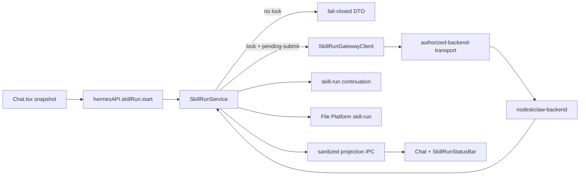

# Work v4.0.1 Checkpoint B Plan

**Mode：CREATE**（目标 `.cursor/plans/work-v4.0.1-skill-first-checkpoint-b.plan.md` 尚不存在；不得覆盖 Checkpoint A Plan）

**切片：ROADMAP Checkpoint B = M3 + M4**

**PRD：** [docs/work/PRD-WORK-v4.0.1-skill-first-layout-run-integration.md](docs/work/PRD-WORK-v4.0.1-skill-first-layout-run-integration.md)

**基线授权：** 用户已授权 `grounding_source: working_tree`（Checkpoint A 未提交）。`grounded_commit` 仍记录 PRD 的 `c10ae2fdc9bd7d286d828836c80fcbc2debb6257`；Execute 写 v3.2 文件时用 `create_plan_seed.py` 计算 `working_tree_fingerprint`。

**commit_policy：** `post_review`

确认本 Cursor Plan 后，**先**把完整 v3.2 合同写入 `.cursor/plans/work-v4.0.1-skill-first-checkpoint-b.plan.md`，并跑 `validate_generation_integrity.py`、`validate_plan.py`、`assess_plan_review.py`。Contract/Data Flow 非 None，必须 **smc-plan-review PASS** 后才能改 `apps/work` 生产代码。

## Approved PRD

[docs/work/PRD-WORK-v4.0.1-skill-first-layout-run-integration.md](docs/work/PRD-WORK-v4.0.1-skill-first-layout-run-integration.md)

ROADMAP 下一阶段是 Checkpoint B（M3 可执行 Run + 恢复，M4 Result + Artifact + Session Files）。Checkpoint A 已提供 Layout mode、Catalog/Selection、共享 transport、fail-closed `start`。

## Scope

**In**

- 把 Checkpoint A 的 `SkillRunService.start` / `cancel` stub 升级为真实 lifecycle owner：pending-submit 持久化、`clientRequestId` 幂等、Accepted `run_id`、SSE `Last-Event-ID` 去重、poll 兜底、terminal 单调、单 Tab 单 active run、queue snapshot 出队不重读 selection。
- versioned `skill-run` continuation + session transcript upsert + restart rehydrate（不重复 `tools/call`）。
- File Platform：`ManagedFileRemoteProvider` 增加 `"skill-run"`；远端唯一键改为 `(profile, provider, remoteRunId, remoteArtifactId)`；descriptor upsert、Preview/Save As/Materialize 复用现有 `files` IPC。
- Compact Run 状态行与最终 Result；`WAITING_APPROVAL` 只读。
- Feature mode 对齐 PRD：`skill-first | expert-compat | local-only`（替换 Checkpoint A 误用的 `skill-only`）。
- 无 `contracts/skill-run/*/consumer-lock.json` 时：**禁止**生产 `POST /api/v1/mcp`；Catalog 保持 `contract-unsupported`；lifecycle 用注入 fake gateway/parser 的单测证明。

**Out**

- M0 由 Provider Owner 发布 tag/checksum；本切片不伪造 lock、不把候选 schema 当生产合同。
- M5 生产默认 / 灰度 telemetry dashboard。
- M6 P1：Approval 决策卡、rich event（reasoning/tool/clarify/delta）、JSON Schema 表单、附件 upload。
- v4.2 Expert 默认入口 REMOVE。
- 不改 `contracts/work-expert/v1.0.2`；不改 `screens/Skills`；不新增 Skill Chat View / 平行 session DB / download IPC。

**Owner 继承**

- Lifecycle：Main `SkillRunService`（唯一 writer）
- HTTP：`SkillRunGatewayClient` + 已有 `authorized-backend-transport`
- Parser：Main Skill Run contract adapter（无 lock 则 fail-closed）
- Continuation / transcript：现有 Session store + 新 `kind:"skill-run"` item
- File identity / bytes：现有 File Platform
- Tab mode / Catalog UI：Checkpoint A 已完成，本切片 KEEP
- Selection/submit：`Chat.tsx`

## M0 生产门禁（写入每个 start 路径）

仓库现状：`contracts/` 只有 [contracts/work-expert/v1.0.2/consumer-lock.json](contracts/work-expert/v1.0.2/consumer-lock.json)；**没有** skill-run lock；也没有 `nodeskclaw-backend/contracts/skill-run` 快照。

`createSkillRunGatewayClient` 已按 `hasConsumerLock ?? false` 拒绝 Catalog HTTP。Checkpoint B 必须把同一门禁扩到 `tools/call`、`/api/v1/runs/*`、SSE、Artifact download。Lock reader 对齐 [apps/work/src/main/expert/expert-consumer-lock.test.ts](apps/work/src/main/expert/expert-consumer-lock.test.ts) 的 checksum pin；缺 lock 时 `hasConsumerLock=false`，`start` 返回稳定 `errorCode`（替换 `START_DISABLED_CHECKPOINT_A` 为 `CONTRACT_UNSUPPORTED` / `START_DISABLED_NO_LOCK`），**零生产 HTTP**。

有 lock 时才允许：Main 按当前 Catalog 二次确认 `toolName`、prompt-first schema 绑定、带 `X-Idempotency-Key=clientRequestId` 的 `tools/call`。

## 关键实现决定（不得在 Execute 再发明）

1. **在现有 `createSkillRunService` 上扩展，不新建第二 lifecycle class。** 复用 Expert 的 Map + emit + terminal lock + SSE 重连 + poll 流程（[expert-run-service.ts#createExpertRunService](apps/work/src/main/expert/expert-run-service.ts)），但 DTO/URL/事件名全部 Skill Run 自有。禁止 `task_id`、`expertSlug`、`/hermes/tasks/*`。
2. **Durable pending-submit = `kind:"skill-run"` continuation，不要新 SQLite 表。** Expert 的 `projectionToContinuationItem` 要求 `taskId`，Skill Run 允许 `providerRunId: null` + `phase: "pending-submit"`。`tools/call` 前先 `persistSessionContinuation`；重启用同一 `clientRequestId` replay，禁止新 key。
3. **三个 identity 永不混用：** `ChatRun.runId`（Tab）、`clientRequestId`（幂等）、`providerRunId`（Work DTO 字段名，不叫 `runId`）。
4. **SSE：** 复用 [run-stream.ts#parseRunSseBlock](apps/work/src/main/run-stream.ts)；`Last-Event-ID`；按 event id/seq 去重；unknown 只推进游标 + bounded telemetry，不文本化 payload。无 lock 时 parser 不解析生产字节。
5. **Cancel：** Skill Tab 的 Composer abort 只调 `hermesAPI.skillRun.cancel`，**不得**调用 `useChatActions.handleAbort` → `hermesAPI.abortChat`（[useChatActions.ts#handleAbort](apps/work/src/renderer/src/screens/Chat/hooks/useChatActions.ts)）。在 [Chat.tsx](apps/work/src/renderer/src/screens/Chat/Chat.tsx) 替换 `onAbort`，不改 `useChatActions`。
6. **Prompt-first：** 额外必填 / `$ref` / 组合 schema → `parameters-required` 或 `unsupported-schema`，不猜字段（P1）。
7. **WAITING_APPROVAL：** 只展示只读状态；不渲染允许/拒绝。Skill mode 不走 `/approve` `/deny`。
8. **File 唯一键迁移：** 今日 [ensureRemoteIdentityIndex](apps/work/src/main/files/file-association-store.ts) 是 `(profile_id, provider, remote_artifact_id)`。必须加 `remote_run_id` 列、新 UNIQUE、`findByRemoteIdentity` 四元组；Expert 旧行 `remote_run_id` backfill 为 `remote_task_id` 或稳定占位，**不得破坏** `provider="expert"` 行。
9. **Preview cache：** [resolvePreviewCachePath](apps/work/src/main/files/expert-artifact-transfer.ts) 键必须含 `remoteRunId`，避免两 Run 同 artifact id 串 cache。
10. **Transfer dispatch：** 不要把 Skill HTTP 写进 `expert-artifact-transfer.ts`。新增 `skill-run-artifact-transfer.ts`；[file-preview-service.ts#getRemotePreviewDescriptor](apps/work/src/main/files/file-preview-service.ts)、[file-service.ts#saveRemoteArtifactAs](apps/work/src/main/files/file-service.ts)、materialize 按 `file.provider` 分发。
11. **IPC 扩展（同一 `window.hermesAPI.skillRun`）：** start 可返回 accepted projection；`onProjectionChanged` / get / list / `rehydrateSession` / `retryArtifactDiscovery`。无 raw URL/JWT/event。
12. **Renderer store** 仍只是 projection cache；selection truth 仍在 Chat。
13. **Logout / quit：** 已有 `disposeSkillRunSubsystem` KEEP；dispose 必须 abort SSE/poll。

## Change IDs 与写所有权

同一 production `path#symbol` 只有一个 Todo WRITE_OWNER。

- **C01** — [apps/work/src/shared/skill-run.ts](apps/work/src/shared/skill-run.ts)：Projection / Continuation / accepted start / IPC 通道 / `local-only`。Strategy：`MODIFY_EXISTING`。T1。
- **C02** — [feature-mode-store.ts](apps/work/src/main/skill-run/feature-mode-store.ts)：`skill-only` → `local-only`，旧文件值映射。Strategy：`MODIFY_EXISTING`。T1。
- **C03** — lock reader `skill-run-consumer-lock.ts`。Strategy：`MINIMAL_NEW`（Expert lock 测试在另一路径，不能塞进 Expert）。T1。
- **C04** — `skill-run-contract-parser.ts`：有 lock 才 parse；无 lock fail-closed。Strategy：`MINIMAL_NEW`。T1。
- **C05** — [skill-run-gateway-client.ts](apps/work/src/main/skill-run/skill-run-gateway-client.ts)：call / run snapshot / SSE / cancel / artifacts；无 lock 不 HTTP。Strategy：`MODIFY_EXISTING`。T2。
- **C06** — [skill-run-service.ts](apps/work/src/main/skill-run/skill-run-service.ts)：lifecycle；注入 `upsertArtifact?`。Strategy：`MODIFY_EXISTING`。T2。
- **C07** — [skill-run-service.test.ts](apps/work/src/main/skill-run/skill-run-service.test.ts) + lifecycle 用例。Strategy：`MODIFY_EXISTING`。T2。
- **C08** — `skill-run-continuation.ts`。Strategy：`MINIMAL_NEW`。T3。
- **C09** — [session-continuation.ts](apps/work/src/shared/session-continuation.ts) union。Strategy：`MODIFY_EXISTING`。T3。
- **C10** — [session-continuation-store.ts#normalizeContinuationItems](apps/work/src/main/session-continuation-store.ts)。Strategy：`MODIFY_EXISTING`。T3。
- **C11** — `skill-run-session-materialize.ts`。Strategy：`MINIMAL_NEW`。T3。
- **C12** — [session-continuation-store.test.ts](apps/work/tests/session-continuation-store.test.ts)。Strategy：`MODIFY_EXISTING`。T3。
- **C13** — [skill-run-ipc.ts](apps/work/src/main/skill-run/skill-run-ipc.ts)。Strategy：`MODIFY_EXISTING`。T4。
- **C14** — [preload/skill-run-api.ts](apps/work/src/preload/skill-run-api.ts) + [index.d.ts](apps/work/src/preload/index.d.ts)。Strategy：`MODIFY_EXISTING`。T4。
- **C15** — [managed-file.ts#ManagedFileRemoteProvider](apps/work/src/shared/files/managed-file.ts) + `remoteRunId`。Strategy：`MODIFY_EXISTING`。T5。
- **C16** — [file-association-store.ts](apps/work/src/main/files/file-association-store.ts) 列/索引/`findByRemoteIdentity`/`rowToManagedFile`。Strategy：`MODIFY_EXISTING`。T5。
- **C17** — `upsert-skill-run-remote-artifact.ts`。Strategy：`MINIMAL_NEW`。T5。
- **C18** — `skill-run-artifact-transfer.ts` + preview cache key。Strategy：`MINIMAL_NEW`。T5。
- **C19** — file-preview-service / file-service / materialize-remote-expert-artifact provider dispatch。Strategy：`MODIFY_EXISTING`。T5。
- **C20** — [resolvePreviewCachePath](apps/work/src/main/files/expert-artifact-transfer.ts) 增加 run 分量（Expert 调用方补默认）。Strategy：`MODIFY_EXISTING`。T5。
- **C21** — [file-association-store.test.ts](apps/work/src/main/files/file-association-store.test.ts) 跨 Run 同 artifact id。Strategy：`MODIFY_EXISTING`。T5。
- **C22** — [Chat.tsx](apps/work/src/renderer/src/screens/Chat/Chat.tsx)：accepted projection、subscribe、rehydrate、skill cancel `onAbort`。Strategy：`MODIFY_EXISTING`。T6。
- **C23** — [modules/skill-run/store.ts](apps/work/src/renderer/src/modules/skill-run/store.ts) projection cache。Strategy：`MODIFY_EXISTING`。T6。
- **C24** — `SkillRunStatusBar.tsx` compact phase/result。Strategy：`MINIMAL_NEW`。T6。
- **C25** — 12 locale `skillRun.*` run/result 文案。Strategy：`MODIFY_EXISTING`。T7。
- **C26** — [lat.md/skill-run.md](apps/work/lat.md/skill-run.md) Checkpoint B 边界。Strategy：`MODIFY_EXISTING`。T8。

KEEP（不进 Writes）：Layout / `chatRuns.ts` / Catalog Panel / Selection Bar / `authorized-backend-transport` / Expert 默认入口 / `screens/Skills` / ChatInput 附件门禁（仍 fail-closed）。

## Grounding Evidence（摘要）

- `createSkillRunService.start` 今日恒返 `START_DISABLED_CHECKPOINT_A`，无 HTTP。
- Gateway `hasConsumerLock` 默认 false → `contract-unsupported`。
- Chat `submitSkill` 仅 toast 拒绝结果；`onAbort` 仍走 local `abortChat`。
- Continuation union 只有 `expert-run`；normalize 要求 `taskId`。
- `ManagedFileRemoteProvider = "expert"`；remote unique 不含 run id。
- Expert 无 HTTP 前 durable pending-submit；Skill Run 必须补（PRD AC-12）。
- `parseRunSseBlock`、`persistSessionContinuation`、`upsertExpertRemoteArtifact`、`computeRemoteCanPreview` 可复用模式。

## Requirement Coverage（本切片）

**实现并阻断验证：** AC-11 lifecycle；AC-12 idempotency/pending-submit；AC-13 SSE/poll/monotonic；AC-14 单 active + queue snapshot（A 已有 queue，B 补 active run）；AC-15 cancel 不 abort local；AC-16 unknown event fail-soft；AC-17 transcript + rehydrate；AC-18/19 File Platform + 无平行 SoT/download IPC；AC-09 identity 分离；AC-10 IPC 无 credential；AC-20/21 无 silent fallback。

**负向门禁（无 lock 时仍必须绿）：** AC-06/07 Catalog unsupported、无伪造 lock、无生产 `tools/call`；AC-08 请求体无 Expert routing 字段。

**本切片不宣称完成：** DOD-01 完整 Provider Gate（无 lock 则 Completion=`BLOCKED` 或 `IMPLEMENTED_AND_PROVEN` 仅限负向+fixture）；DOD-03 生产切换 Checklist（M5）；AC-22 Expert 删除。

AC-01..05 Layout/Catalog/DOM：Checkpoint A KEEP，B 回归 `chatRuns.test.ts` + Chat 聚焦测。

## Lifecycle Closure

- **Start：** trigger=Chat snapshot submit；非终态=`pending-submit` → `starting`/`running`/`waiting-approval`；success writer=`SkillRunService.updateProjection`；failure/cancel writer=同一 service（terminal lock，旧 SSE 不能回退）。
- **Pending-submit persist：** writer=continuation upsert **先于** gateway.call；retry identity=`clientRequestId`。
- **Rehydrate：** trigger=Chat `rehydrateSession`；非终态续 SSE/poll；**禁止**新 `tools/call`；terminal 不复活。
- **Artifact：** discovery 失败不把 succeeded 改 failed；retry 显式 IPC。
- **Cancel：** 无 in-flight → `NO_ACTIVE_RUN`；queued pending 只本地 abort；accepted 后调 Provider cancel。

## Contract / Data Flow Closure

1. **Start：** Chat 生产 `{toolName, prompt, clientRequestId, sessionId, profileId}` → IPC schema → Service 用 Main Catalog 校验 →（有 lock）Gateway `tools/call` + idempotency header → Accepted `{providerRunId}` → projection。无 lock：不发 HTTP。失败映射：unauthorized / contract-unsupported / unsupported-schema / backend-unavailable。幂等身份=`clientRequestId`。
2. **SSE/poll：** Gateway 生产清洗后的 phase/result/eventId → Service 去重 → IPC projection → store/Chat。Renderer 无 raw event。
3. **Continuation：** Service 生产 `SkillRunContinuationItem` → `persistSessionContinuation` → rehydrate 消费。
4. **Artifact：** Service 生产 descriptor `{providerRunId, remoteArtifactId, ...}` → `upsertSkillRunRemoteArtifact` → ManagedFileView → 现有 files IPC。Bytes 只走 File Platform transfer。

## Todo 切片

**T0 write-plan-md** — 落盘 v3.2 全表 + integrity/validator/assessor。Depends `-`。

**T1 C01–C04** — DTO、feature mode、lock reader、parser。Stop：无 lock 时 parser/lock 返回 unsupported；`local-only` 可读写。

**T2 C05–C07** — Gateway + Service lifecycle。Depends T1。Stop：无 lock 的 start 零 HTTP；fake lock + fake gateway 证明 pending-submit、幂等、SSE 单调、poll、cancel。

**T3 C08–C12** — continuation + materialize。Depends T1。Stop：pending 无 `providerRunId` 可 persist；rehydrate 不重复 start；Expert `expert-run` normalize 无回归。

**T4 C13–C14** — IPC/preload。Depends T2、T3、T5。Stop：subscribe/rehydrate/retryArtifact 可用；payload 无 URL/JWT。

**T5 C15–C21** — File Platform。Depends T1（artifact DTO）。Stop：两 Run 同 artifact id 不冲突；Expert remote 行仍可查找；无新 download IPC。

**T6 C22–C24** — Chat 接线。Depends T4。Stop：skill abort 不调 `abortChat`；queue 出队用 snapshot；rehydrate 恢复 projection。

**T7 C25** — i18n。Depends T1（key 在 Plan 冻结，可与 T6 并行，但不得与 T6 同时写同一 locale 文件；T7 独占 `locales/*/skillRun.ts`）。

**T8 C26** — lat.md。Depends T2、T5、T6。

**Parallel Safe：** 仅 T5 相对 T2/T3 可为 yes（不同文件）；T1 完成后 T5 才读 DTO。其余 no。

冻结 i18n keys（T7）：`runPending`, `runRunning`, `runWaitingApproval`, `runSucceeded`, `runFailed`, `runCancelled`, `cancelSkillRun`, `resultReady`, `artifactRetry`, `startDisabledNoLock`。

## New File Justification

- `skill-run-consumer-lock.ts` — Expert lock 路径不能拥有第二合同。
- `skill-run-contract-parser.ts` — 禁止在 Expert parser 分支两套 schema。
- `skill-run-continuation.ts` / `skill-run-session-materialize.ts` — 与 Expert continuation 并行 reader，不能写进 `expert-continuation.ts`。
- `upsert-skill-run-remote-artifact.ts` / `skill-run-artifact-transfer.ts` — File Platform 复用 store，但不能让 Expert transfer 拥有 Skill HTTP。
- `SkillRunStatusBar.tsx` — 对齐 Catalog 模块，Chat 不内嵌 Provider DTO。

无 `NEW_DEPENDENCY`。Generated Outputs：None。

## Integration Hotspots

- [shared/skill-run.ts](apps/work/src/shared/skill-run.ts) → T1
- [skill-run-ipc.ts](apps/work/src/main/skill-run/skill-run-ipc.ts) → T4
- [preload/index.d.ts](apps/work/src/preload/index.d.ts) → T4
- [session-continuation-store.ts](apps/work/src/main/session-continuation-store.ts) → T3
- [file-association-store.ts](apps/work/src/main/files/file-association-store.ts) / [file-service.ts](apps/work/src/main/files/file-service.ts) / [file-preview-service.ts](apps/work/src/main/files/file-preview-service.ts) → T5
- [Chat.tsx](apps/work/src/renderer/src/screens/Chat/Chat.tsx) → T6
- [shared/i18n/locales/*/skillRun.ts](apps/work/src/shared/i18n/locales/en/skillRun.ts) → T7

## Immediate Read（仅 T1 执行前）

- [skill-run-service.ts#createSkillRunService](apps/work/src/main/skill-run/skill-run-service.ts)
- [skill-run-gateway-client.ts#createSkillRunGatewayClient](apps/work/src/main/skill-run/skill-run-gateway-client.ts)
- [shared/skill-run.ts](apps/work/src/shared/skill-run.ts)
- [expert-run-service.ts#createExpertRunService](apps/work/src/main/expert/expert-run-service.ts)
- [expert-consumer-lock.test.ts](apps/work/src/main/expert/expert-consumer-lock.test.ts)
- [authorized-backend-transport.ts](apps/work/src/main/auth/authorized-backend-transport.ts)

**Triggered Read：** lock 文件实际落地时读 checksum/manifest；SSE fixture 不足时读 `parseRunSseBlock`；File 迁移失败时读 `migrateSchema`；Chat abort 回归失败时读 `useChatActions.handleAbort`。

## Verification Ledger（预检入口均已存在或由本 Plan ADD）

- **V01** UNIT `npm test -- src/main/skill-run/skill-run-service.test.ts` — 无 lock 零 HTTP；fake gateway 幂等/SSE/cancel。Evidence：`artifacts/work-v4.0.1-checkpoint-b/v01-service.txt`
- **V02** UNIT `npm test -- tests/session-continuation-store.test.ts` — skill-run pending 可 round-trip；expert-run 回归。Evidence：`artifacts/work-v4.0.1-checkpoint-b/v02-continuation.txt`
- **V03** UNIT `npm test -- src/main/files/file-association-store.test.ts` — 四元组唯一；Expert 行保留。Evidence：`artifacts/work-v4.0.1-checkpoint-b/v03-files.txt`
- **V04** UNIT Chat/skill-run store 聚焦测（T6 ADD）— abort 不调 `abortChat`；queue snapshot。Evidence：`artifacts/work-v4.0.1-checkpoint-b/v04-chat.txt`
- **V05** UNIT `npm test -- src/main/expert/expert-gateway-client.test.ts` — Expert 无回归。
- **V06** `npm run typecheck` + `npm run typecheck:web` + `npm run guard`
- **V07** `lat check`（在 `apps/work`）
- **V08** 负向：测试断言无 `POST /api/v1/mcp` 当 lock 缺席（spy transport）
- Live Catalog→Run→Artifact E2E：**环境依赖 M0**；无 lock 不得标 `IMPLEMENTED_AND_PROVEN` 的跨端 AC-12。

## Completion Gate

- **IMPLEMENTED_AND_PROVEN：** 本切片 AC + 负向门禁全过且 evidence 留存；若 lock 仍缺席，跨端“只创建一个 Provider Run”不得声称 proven（该项记 BLOCKED 子条，其余 fixture 可 proven）。
- **IMPLEMENTED_NOT_PROVEN：** 代码有、测试/typecheck 未留证。
- **BLOCKED：** 无 lock 导致不能跑真实 backend E2E（预期）；或 vitest 环境不可用。
- **RETURN_PRD：** 必须把 Skill 塞进 Expert client、或无 lock 仍要生产 `tools/call`、或 File 唯一键无法迁移且不破坏 Expert。

## 禁止

- 无 lock 时生产 `tools/call` / 猜测 event schema
- 把 `providerRunId` 写入 `ChatRun.runId`
- Renderer 持有 JWT/URL/raw event
- Skill cancel 调用 `abortChat`
- 第二套 Chat/Session/File SoT 或 Artifact download IPC
- 本切片提交代码（`post_review`）
- 覆盖 Checkpoint A 的 `.plan.md`
