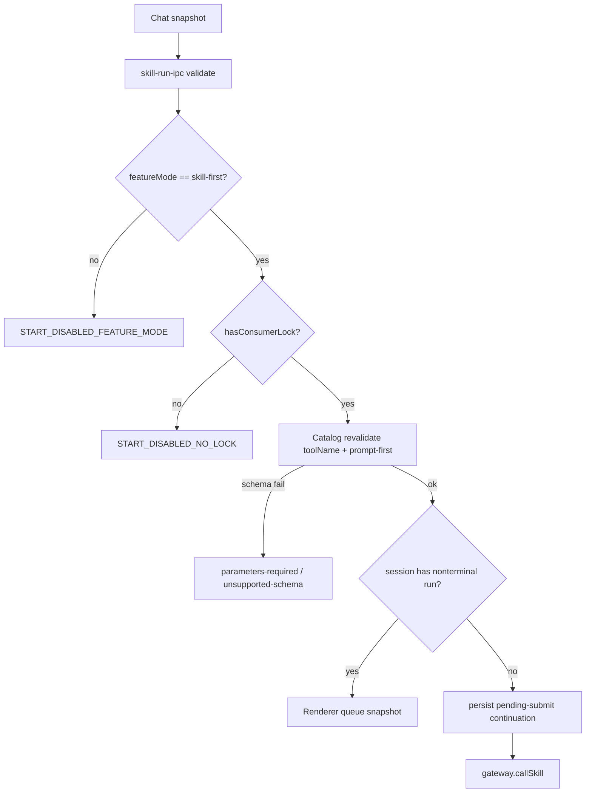

# Work v4.0.1 Checkpoint C Plan

**Mode：CREATE**（目标 `.cursor/plans/work-v4.0.1-skill-first-checkpoint-c.plan.md` 尚不存在；不得覆盖 A/B Plan）

**切片：Checkpoint C = 剩余 Work 侧 P0 hardening**（用户已选 `hardening-c`）

**PRD：** [docs/work/PRD-WORK-v4.0.1-skill-first-layout-run-integration.md](docs/work/PRD-WORK-v4.0.1-skill-first-layout-run-integration.md)

**接地：** 用户已选 **先提交 A+B，再用 `committed_baseline`**。不得把当前脏工作区静默当 C 的批准事实。Execute 第一步是 commit A+B，再用新 SHA 写入 v3.2 Plan。

**commit_policy：** `post_review`

确认本 Cursor Plan 后顺序固定：

1. Commit Checkpoint A+B（用户已授权此前提）
2. 用新 `grounded_commit` 落盘 `.cursor/plans/work-v4.0.1-skill-first-checkpoint-c.plan.md`
3. 跑 `validate_generation_integrity.py`、`validate_plan.py`、`assess_plan_review.py`
4. Contract/Data Flow 非 None → **smc-plan-review PASS** 后才能改 `apps/work` 生产代码

## Approved PRD

[docs/work/PRD-WORK-v4.0.1-skill-first-layout-run-integration.md](docs/work/PRD-WORK-v4.0.1-skill-first-layout-run-integration.md)

ROADMAP：A = M1+M2，B = M3+M4。仓库仍无 `contracts/skill-run/*/consumer-lock.json`。A/B 已有 Layout/Catalog、lifecycle 骨架、File Platform `skill-run` 身份，但下列 P0 AC 在源码中未闭环。M5/M6/M0 本切片 **Out**。

## 未执行功能（对照源码）

| PRD 义务 | 现状 | C 是否做 |
|---|---|---|
| Feature mode 只影响新提交；默认 `expert-compat` 不得生产 start | [`skill-run-service.ts#start`](apps/work/src/main/skill-run/skill-run-service.ts) 只查 lock，不查 `skill-first` | 做 |
| Prompt-first：额外必填 / `$ref` / 组合 schema → `parameters-required` / `unsupported-schema` | start 原样转发 `toolName`+prompt，无 Catalog 二次绑定 | 做 |
| Main 不信任 Renderer schema；按当前 auth scope Catalog 确认 `toolName` | IPC 只 `String()` 强制转换 | 做 |
| 每 Chat Tab 至多一个 active Skill Run；queue 出队不重读 selection | `submitSkill` 不置 `isLoading`；二次提交可并行；[`start`](apps/work/src/main/skill-run/skill-run-service.ts) 不按 `sessionId` 拒第二路 | 做 |
| `tools/call` 前持久化 pending-submit | persist 只在 IPC `broadcastProjection` 副作用里，不在 service start 内 | 做 |
| IPC sender + authGeneration + 必填字段 + 长度（对齐 Expert） | [`skill-run-ipc.ts`](apps/work/src/main/skill-run/skill-run-ipc.ts) 无 `requireAuthSession` / generation match | 做 |
| Catalog/pending/SSE 按 auth scope 分区；logout 失效 | Gateway 单份 `cachedCatalog`；logout 已 `dispose` | 做 cache key + 回归 dispose |
| 重开会话恢复 `executionMode` + 最后合法 Skill display | [`Layout.tsx`](apps/work/src/renderer/src/screens/Layout/Layout.tsx) `mintRun` 默认 `local-chat`；无 session mode 表 | 做 |
| Catalog 键盘 Arrow/Enter/Esc；搜索含 category | [`SkillCatalogPanel.tsx`](apps/work/src/renderer/src/modules/skill-run/SkillCatalogPanel.tsx) 仅 mouse；搜索漏 category | 做 |
| Queue 移除要 cancel skill | [`handleRemoveQueued`](apps/work/src/renderer/src/screens/Chat/Chat.tsx) 只 cancel expert | 做 |
| M0 consumer lock / 真实 `tools/call` E2E | 仍无 lock | **不做**（保持 fail-closed） |
| M5 灰度/遥测 dashboard / M6 P1 Approval·表单·附件 | ROADMAP 后续 | **不做** |

## Scope

**In**

- `skill-first` 才允许新 start；`expert-compat` / `local-only` 拒绝新 Skill Run，不 dispose 已有 reader
- prompt-first 绑定 + Main Catalog 二次确认 `toolName`
- 同 `sessionId` 非终态 Run 拒绝第二路 start；Chat 用 skill projection（非仅 `isLoading`）作为 busy
- start 内、`callSkill` 前显式 `upsertSkillRunContinuationProjection`
- IPC：`requireAuthSession`、必填 trim、authGeneration 与 `user:${id}` 对齐、prompt/toolName 长度上限
- Catalog cache key = Main 计算的 auth scope（origin+user+generation）；Renderer 不得自报 origin/org
- 重开会话：恢复 `executionMode=skill-run` 与最后合法 Skill display snapshot（须在 terminal continuation 清理后仍在）
- Catalog 键盘与 category 搜索
- 无 lock / 非 skill-first：**零生产 HTTP**（保持 B 的门禁）

**Out**

- M0 tag/checksum lock、真实 backend E2E
- M5 生产默认、灰度手册、analytics dashboard
- M6 P1：Approval 决策、rich events、JSON Schema 表单、附件 upload
- v4.2 Expert 入口 REMOVE
- 不改 `contracts/work-expert/v1.0.2`；不新增 Skill Chat View / 平行 session DB / download IPC

**Owner 继承：** Lifecycle = `SkillRunService`；HTTP = Gateway + 已有 transport；Selection = `Chat.tsx`；Tab mode = `Layout` / `chatRuns.ts`；Catalog UI = `modules/skill-run`

## Change Matrix（摘要）

同一 production `path#symbol` 一个 WRITE_OWNER。

- **C01** [`skill-run-service.ts#start`](apps/work/src/main/skill-run/skill-run-service.ts) — feature mode 门禁、同 session 单 active、call 前 persist、Main 侧 authGeneration。`MODIFY_EXISTING`。T1
- **C02** [`skill-run-contract-parser.ts`](apps/work/src/main/skill-run/skill-run-contract-parser.ts) — `bindPromptFirstTool`（单一 string prompt；否则 `parameters-required` / `unsupported-schema`）。`MODIFY_EXISTING`（不新建 binder 文件）。T1
- **C03** [`skill-run-service.test.ts`](apps/work/src/main/skill-run/skill-run-service.test.ts) — mode/schema/单 active/persist-before-call；注入 `sleep` 避免 SSE 重连挂死。`MODIFY_EXISTING`。T1
- **C04** [`skill-run-ipc.ts`](apps/work/src/main/skill-run/skill-run-ipc.ts) — Expert 同款校验 + session mode get/set 通道。`MODIFY_EXISTING`。T2
- **C05** [`skill-run-gateway-client.ts`](apps/work/src/main/skill-run/skill-run-gateway-client.ts) — catalog cache 按 auth scope；scope 变化 `clearCache`。`MODIFY_EXISTING`。T2
- **C06** ADD `apps/work/src/main/skill-run/skill-run-ipc.test.ts`（仿 [`expert-ipc-registration.test.ts`](apps/work/src/main/expert/expert-ipc-registration.test.ts)）。`MINIMAL_NEW`。T2
- **C07** [`Chat.tsx`](apps/work/src/renderer/src/screens/Chat/Chat.tsx) — busy = local loading **或** 非终态 skill projection；queue 出队用 snapshot；remove queued 调 `skillRun.cancel`；提交后写入 session mode snapshot。`MODIFY_EXISTING`。T3
- **C08** [`SkillCatalogPanel.tsx`](apps/work/src/renderer/src/modules/skill-run/SkillCatalogPanel.tsx) — 搜索含 category；listbox 键盘。`MODIFY_EXISTING`。T4
- **C09** ADD `skill-run-session-mode-store.ts`（对齐 [`session-context-folder-store.ts`](apps/work/src/main/session-context-folder-store.ts)）。`MINIMAL_NEW`。T5
- **C10** [`Layout.tsx`](apps/work/src/renderer/src/screens/Layout/Layout.tsx) + [`chatRuns.ts#mintRun`](apps/work/src/renderer/src/screens/Layout/chatRuns.ts) — 打开已存 session 时带 `executionMode`。`MODIFY_EXISTING`。T5
- **C11** [`chatRuns.test.ts`](apps/work/src/renderer/src/screens/Layout/chatRuns.test.ts) — 恢复 skill-run tab。`MODIFY_EXISTING`。T5
- **C12** 12 locale `skillRun.parametersRequired` / `unsupportedSchema` / `featureModeDisabled` 等。`MODIFY_EXISTING`。T6
- **C13** [`lat.md/skill-run.md`](apps/work/lat.md/skill-run.md) Checkpoint C 边界。`MODIFY_EXISTING`。T7

KEEP：File Platform 四元组、StatusBar 只读 WAITING_APPROVAL、authorized-backend-transport、Expert 默认入口、`screens/Skills`、附件 fail-closed。

## Implementation Decisions

| ID | Strategy | Evidence | Why minimum |
|---|---|---|---|
| C01 | MODIFY_EXISTING | `createSkillRunService.start` 已是唯一 lifecycle writer | 不新建第二 service |
| C02 | MODIFY_EXISTING | parser 已是合同形状 owner | 禁止新建 `*_binder` 文件 |
| C03 | MODIFY_EXISTING | 已有 service test | 修挂死 + 加门禁用例，不平行 harness |
| C04 | MODIFY_EXISTING | [`expert-ipc.ts#validateRequest`](apps/work/src/main/expert/expert-ipc.ts) / `assertAuthGeneration` | 复制校验模式，不抽共享 IPC 框架 |
| C05 | MODIFY_EXISTING | gateway 已有 `cachedCatalog` | 只加 scope key |
| C06 | MINIMAL_NEW | Expert 已有 registration test；skill-run 无对应文件 | 现有 expert 测试不能拥有 Skill IPC |
| C07 | MODIFY_EXISTING | Chat 已有 `skillRequest` queue | 根因是 busy 信号，不新建 queue 模块 |
| C08 | MODIFY_EXISTING | Catalog panel 已有 filter | 补键盘与 category |
| C09 | MINIMAL_NEW | context-folder 表模式；continuation 终态可清理 | 不能把 mode 只放 continuation |
| C10–C11 | MODIFY_EXISTING | `openSession` / `mintRun` 已是 tab owner | 不新增 View |
| C12 | MODIFY_EXISTING | 已有 `locales/*/skillRun.ts` | 只加 key |
| C13 | MODIFY_EXISTING | lat 已有 skill-run 页 | 更新边界 |

无 `NEW_DEPENDENCY`。Generated Outputs：None。

## Write Ownership Ledger

| Todo | Owns | Writes | Reads | Depends | Parallel |
|---|---|---|---|---|---|
| T0 | commit A+B | git commit（不改业务文件） | 工作区 A+B diff | - | no |
| T0b | 落盘 C Plan | `.cursor/plans/work-v4.0.1-skill-first-checkpoint-c.plan.md` | PRD + 新 SHA | T0 | no |
| T1 | C01–C03 | service + parser + service.test | feature-mode-store, continuation, gateway.hasConsumerLock | T0b | no |
| T2 | C04–C06 | skill-run-ipc + gateway + ipc.test | C01 start 错误码；token-store | T1 | no |
| T3 | C07 | Chat.tsx | skill projection store；C01 单 active | T1 | no |
| T4 | C08 | SkillCatalogPanel.tsx | - | - | yes（相对 T1；不与 T3 同文件） |
| T5 | C09–C11 | mode-store + Layout + chatRuns + chatRuns.test | C04 IPC get mode | T2 | no |
| T6 | C12 | locales/*/skillRun.ts + i18n/index.ts | C01/C02 冻结 key | T1 | no |
| T7 | C13 | lat.md/skill-run.md + lat.md | T1–T5 行为 | T1,T3,T5 | no |

## Integration Hotspots

- `apps/work/src/main/skill-run/skill-run-service.ts` → T1
- `apps/work/src/main/skill-run/skill-run-ipc.ts` → T2
- `apps/work/src/renderer/src/screens/Chat/Chat.tsx` → T3
- `apps/work/src/renderer/src/screens/Layout/Layout.tsx` → T5
- `apps/work/src/shared/i18n/index.ts` → T6

## New File Justification

- `skill-run-ipc.test.ts` — Expert IPC 测试不能成为 Skill 合同 owner
- `skill-run-session-mode-store.ts` — 须在 terminal continuation 清理后仍恢复 mode/display；context-folder 不能持有 Skill DTO

## Requirement Coverage（本切片阻断）

实现并验证：AC-04 键盘；AC-11 Main owner（start 门禁仍在 service）；AC-12 persist-before-call（fixture）；AC-14 单 active + queue；AC-17 session mode 恢复；AC-20/21 无 silent fallback + feature mode 互斥。

负向仍须绿：无 lock / 非 skill-first 零 `tools/call`（AC-06/07/08）。

**不宣称：** DOD-01 完整 Provider Gate；DOD-03 生产 Checklist；AC-22 Expert 删除；跨端“只创建一个 Provider Run”（仍 BLOCKED on M0）。

## Lifecycle Closure

- Start trigger = Chat snapshot；非终态 = pending-submit→starting→running→waiting-approval
- Success/failure/cancel writer = 仍为 `SkillRunService.updateProjection`（terminal lock KEEP）
- 新拒绝 writer = 同一 `start`：`START_DISABLED_FEATURE_MODE` / `START_DISABLED_NO_LOCK` / schema codes / `RUN_ALREADY_ACTIVE`
- Persist 发生在 `callSkill` 之前；retry identity = `clientRequestId`
- Rehydrate 不新 `tools/call`（B KEEP）；C 增加 session mode restore

## Contract / Data Flow

1. **Start：** Chat 生产 `{toolName, prompt, clientRequestId, sessionId, profileId}` → IPC 校验 + Main `authGeneration` → Service Catalog 绑定 → continuation persist →（skill-first **且** lock）Gateway。失败映射：feature-mode / no-lock / schema / unauthorized / already-active。幂等 = `clientRequestId`
2. **Session mode：** Chat 选择/提交生产 `{executionMode, toolName, title}` → mode-store → Layout 打开 session 消费。无 Renderer 自报 origin
3. **Catalog list：** 仍 Main 清洗 DTO；cache key 含 auth scope

## Immediate Read（仅 T1 前）

- [`skill-run-service.ts#start`](apps/work/src/main/skill-run/skill-run-service.ts)
- [`skill-run-contract-parser.ts`](apps/work/src/main/skill-run/skill-run-contract-parser.ts)
- [`feature-mode-store.ts`](apps/work/src/main/skill-run/feature-mode-store.ts)
- [`expert-ipc.ts#validateRequest`](apps/work/src/main/expert/expert-ipc.ts)
- [`skill-run-continuation.ts#upsertSkillRunContinuationProjection`](apps/work/src/main/skill-run/skill-run-continuation.ts)

**Triggered：** schema fixture 不足时读 Catalog tool `inputSchema` 形状；mode-store 迁移失败时读 `session-context-folder-store.ts`；Layout 恢复失败时读 `openSession`。

## Verification Ledger

- **V01** UNIT `npm test -- src/main/skill-run/skill-run-service.test.ts` — 非 skill-first 零 HTTP；schema fail-closed；同 session 第二 start 拒绝；fake gateway 时 persist 先于 call。Evidence：`artifacts/work-v4.0.1-checkpoint-c/v01-service.txt`
- **V02** UNIT `npm test -- src/main/skill-run/skill-run-ipc.test.ts` — 缺字段/generation mismatch 拒绝；无 URL/JWT 泄漏。Evidence：`artifacts/work-v4.0.1-checkpoint-c/v02-ipc.txt`
- **V03** UNIT `npm test -- src/renderer/src/screens/Layout/chatRuns.test.ts` — 打开 session 保留 skill-run mode
- **V04** `npm run typecheck` + `typecheck:web` + `guard`
- **V05** Expert 回归 `npm test -- src/main/expert/expert-gateway-client.test.ts`
- **V06** 无 lock spy：无 `POST /api/v1/mcp`

## Completion Gate

- **IMPLEMENTED_AND_PROVEN：** 上表阻断 V 全过且 evidence 留存；跨端 AC-12 仍不得声称 proven
- **IMPLEMENTED_NOT_PROVEN：** 代码有、证据未留
- **BLOCKED：** M0 缺失（预期，不阻塞本切片其余项）；或 vitest 环境不可用
- **RETURN_PRD：** 要求无 lock 生产 `tools/call`、或把 Skill 塞进 Expert client、或第二套 session DB

## 禁止

- 无 lock 或非 skill-first 时生产 HTTP
- `providerRunId` 写入 `ChatRun.runId`
- Renderer 持有 JWT/URL/raw event
- Skill cancel 调 `abortChat`
- 覆盖 A/B `.plan.md`
- 在 C Plan 未 validator+review PASS 前改生产代码（T0 commit A+B 除外）
