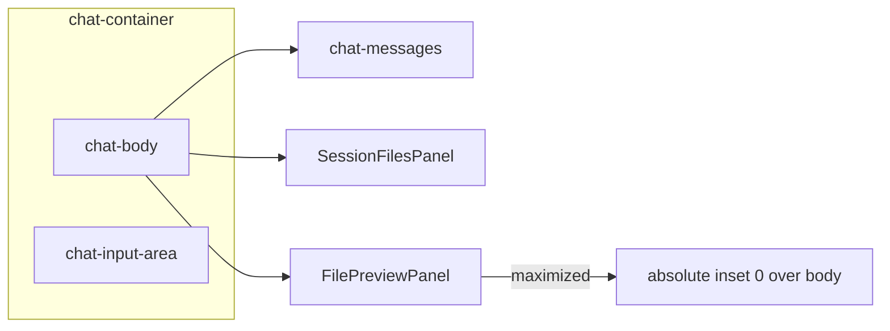

# Chat 三栏布局交互优化（PRD v1.3）

## Current state

[`Chat.tsx`](src/renderer/src/screens/Chat/Chat.tsx) already mounts:

```text
chat-body
├─ chat-messages
├─ SessionFilesPanel          (always when hermesSessionId)
├─ WorktreePanel              (optional)
├─ FilePreviewPanel           (optional, internal width + hermes:filePreviewWidth)
└─ WebPreviewPanel            (optional)
chat-input-area               (always below)
```

Gaps vs [`prd/v1.3_chat-filepanel-maxview.md`](prd/v1.3_chat-filepanel-maxview.md): no `sessionFilesVisible`, no `filePreviewMaximized`, no maximize button, no overlay CSS.

## Approach (concrete)

Layout ownership stays in `Chat.tsx`. Session Files hide/show is persisted; Preview maximize is ephemeral. Maximize = absolute overlay over `chat-body` only (not Fullscreen API, not covering ChatInput).



**Repo adaptations** (vs PRD sample written for copilot-desktop):

- Persistence key: `hermes:chat:session-files-visible` (match existing `hermes:filePreviewWidth`)
- CSS tokens: use `--border`, `--bg-primary`, `--bg-secondary`, `--text-primary`, `--text-secondary` (not PRD’s `--border-color` / `--surface`)
- When maximized, also inert-hide Worktree / WebPreview siblings (same `visibility: hidden; pointer-events: none` as messages/session files) so focus cannot land under the overlay

## Implementation

### 1. State + wiring in [`Chat.tsx`](src/renderer/src/screens/Chat/Chat.tsx)

Add near existing preview/worktree state (~248–311):

- `sessionFilesVisible` — init from localStorage (`!== "false"` → default shown); persist on change
- `filePreviewMaximized` — `useState(false)`; clear when `!activePreviewState`
- Esc listener only when `active && filePreviewMaximized` (same multi-Chat pattern as existing Cmd/Ctrl+N handlers ~543+)
- Import `PanelRightOpen`; import `./chat-layout.css`

JSX changes in `chat-body` (~1100–1163):

- Class `chat-body-preview-maximized` when maximized
- Floating restore button inside `chat-messages` when `!sessionFilesVisible && hermesSessionId && !filePreviewMaximized`
- Render `SessionFilesPanel` only when `hermesSessionId && sessionFilesVisible`; pass `onHide`
- Pass `maximized` / `onToggleMaximized` into `FilePreviewPanel`

Keep `refreshKey`, document/managed preview arbitration, Worktree/WebPreview as-is.

### 2. [`SessionFilesPanel.tsx`](src/renderer/src/screens/Chat/session-files/SessionFilesPanel.tsx)

- Add optional `onHide?: () => void`
- Replace bare title with header row: title + `PanelRightClose` toggle when `onHide` provided
- No changes to query/list/agent-output logic

### 3. Preview maximize in panel + header

[`FilePreviewPanel.tsx`](src/renderer/src/components/files/preview/FilePreviewPanel.tsx):

- Props: `maximized?`, `onToggleMaximized?`
- Root: add `file-preview-panel-maximized` class; `style={maximized ? undefined : { width }}` so stored width is untouched
- `startResize` early-return when maximized; do not render resize handle when maximized
- Forward maximize props to header

[`FilePreviewHeader.tsx`](src/renderer/src/components/files/preview/FilePreviewHeader.tsx):

- Add Maximize2 / Minimize2 button **before Close**
- Order: Reveal → Save As → Open External → Maximize/Restore → Close
- `aria-pressed={maximized}`

### 4. CSS — new [`src/renderer/src/screens/Chat/chat-layout.css`](src/renderer/src/screens/Chat/chat-layout.css)

Per PRD §8, adapted to this repo’s tokens:

- `.chat-body` → `position: relative`; flex children `min-width: 0` / `min-height: 0`
- `.session-files-panel` → `flex: 0 0 240px` (upgrade from current 220px in [`main.css`](src/renderer/src/assets/main.css) ~5508); header/toggle/show-button styles
- `.file-preview-panel-maximized` → `position: absolute; inset: 0; z-index: 30; width: 100%`
- `.chat-body-preview-maximized > .chat-messages|session-files|worktree|web-preview` → `visibility: hidden; pointer-events: none` (preserve React state under overlay)

Prefer putting the new layout rules in `chat-layout.css` and only trim/override conflicting width rules in `main.css` if both would fight (session-files width).

### 5. Tests (new colocated files; none exist for these components today)

| File | Cases |
|------|--------|
| `SessionFilesPanel.test.tsx` | hide button present/absent; click calls `onHide` |
| `FilePreviewHeader.test.tsx` | Maximize2 vs Minimize2; toggle callback; `aria-pressed` |
| `FilePreviewPanel.test.tsx` | normal uses width style; maximized no inline width / no resize handle; width state preserved after restore |
| `Chat.layout.test.tsx` (lightweight) | default session files shown; hide shows floating restore; Esc exits maximize when `active`; close preview clears maximize |

Mock `window.hermesAPI.files` as in [`AgentOutputFileCard.test.tsx`](src/renderer/src/screens/Chat/session-files/AgentOutputFileCard.test.tsx). Prefer testing layout behavior with a thin wrapper or focused render of the body fragment if full `Chat` mount is too heavy—still cover the Esc/`active` contract.

### 6. lat.md

Update [`lat.md/file-ui-components.md`](lat.md/file-ui-components.md) Preview panel section: Chat owns session-files visibility + preview maximize; maximize covers `chat-body` only; width persistence unchanged. Run `lat check` after edits.

## Explicit non-goals

- No Main / Preload / Files IPC / preview data API changes
- No Fullscreen API; no writing maximized width into `hermes:filePreviewWidth`
- No MessageList / ChatInput refactor
- Hide Session Files may remount the panel (search UI resets)—accepted; maximize uses `visibility: hidden` so lists/preview state survive

## Acceptance (manual + CI)

1. Hide Session Files → messages expand, floating restore appears, no empty column
2. Drag preview ~600px → maximize → covers body, ChatInput visible → Esc → ~600px restored
3. Close preview clears maximize; switching files while maximized stays maximized
4. Background Chat instances do not steal Esc
5. `typecheck` / lint / tests / build pass
