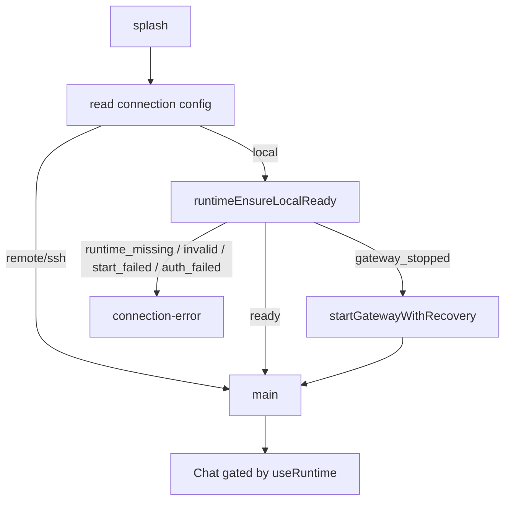

# Copilot Desktop v1.2 — 拆除 Hermes 安装、本地连接跑通 Chat + 更名

## 目标与范围（已确认）
- 完整功能切片 + 彻底清理安装代码/页面（PRD Phase 1-6）。
- 同时更名项目为 `copilot-desktop`（package.json name、`electron-builder.yml` productName、窗口标题、用户可见文案/About）。
- Remote/SSH 模式保持不变，不做重构。
- 每个 Phase 独立提交且可编译（PRD §24），完成后跑 `npm run typecheck && npm run lint && npm test && npm run build`。

## 当前架构关键事实（来自代码勘查）
- `App.tsx` 的启动分支：`type Screen = "splash"|"welcome"|"installing"|"setup"|"main"`；`runInstallCheck()` 调 `checkInstall()`，按 `installed`/`hasApiKey` 决定去 welcome/setup/main。
- [src/main/installer.ts](src/main/installer.ts)：既含运行时路径常量（`HERMES_HOME/REPO/VENV/PYTHON/SCRIPT/ENV_FILE/CONFIG_FILE/AUTH_FILE`、`hermesCliArgs`、`getEnhancedPath`、`setHermesHomeOverride`），也含安装执行（`runInstall`/`runInstallWindows`）与安装检测（`checkInstallStatus`/`inspectInstallTarget`/`validateHermesHome`/`verifyInstall`）。
- 共有 **21 个 `src/main/*.ts` 从 `./installer` 导入**（含 [hermes.ts](src/main/hermes.ts)、[config.ts](src/main/config.ts)、[profiles.ts](src/main/profiles.ts)、[gateway-ports.ts](src/main/gateway-ports.ts)、[utils.ts](src/main/utils.ts) 等）。
- Gateway 生命周期/健康检查在 [hermes.ts](src/main/hermes.ts)：`startGatewayWithRecovery`、`isGatewayHealthy`(=`isApiServerReady` GET `/health`)、`stopGateway`、`restartGateway`；端口在 [gateway-ports.ts](src/main/gateway-ports.ts) `getProfilePort()`；`API_SERVER_KEY` 在 [config.ts](src/main/config.ts) `getApiServerKey()`。
- IPC 全在 [src/main/ipc/register.ts](src/main/ipc/register.ts)；安装相关：`check-install`(670)、`verify-install`(674)、`start-install`(676→push `install-progress`)、`inspect-install-target`(688)、`validate-hermes-home`(689)、`adopt-hermes-home`(692)。Chat 事件名（`chat-chunk/chat-done/...`）保持不变。
- Preload [index.ts](src/preload/index.ts)/[index.d.ts](src/preload/index.d.ts) 暴露 `checkInstall/verifyInstall/startInstall/inspectInstallTarget/onInstallProgress` 等；无 `runtime*`。
- 契约测试：[tests/ipc-handlers.test.ts](tests/ipc-handlers.test.ts)（preload invoke ↔ ipcMain.handle 双向对齐）、[tests/preload-api-surface.test.ts](tests/preload-api-surface.test.ts)（index.ts ↔ index.d.ts 对齐）。这两个会强制安装 API 增删同步。
- Renderer 无 `runtime/` provider；Chat 门禁目前靠 `validateChatReadiness`。

## 目标数据流

---

## Phase 1 — 路径解耦（refactor(runtime)）
- 新建 [src/main/runtime/hermes-runtime-paths.ts](src/main/runtime/hermes-runtime-paths.ts)，迁入运行时路径能力：`HERMES_HOME/REPO/VENV/PYTHON/SCRIPT/ENV_FILE/CONFIG_FILE/AUTH_FILE`、`defaultHermesHome`、`readHermesHomeOverride`、`setHermesHomeOverride`、`hermesCliArgs`、`getEnhancedPath`、`installBinariesFor`、`canInvokeHermesCli`。
- 将 21 个 importer 的 `from "./installer"` 中的“路径类”导入改指向新文件（Remote/SSH 相关文件同样处理）。非路径项（`expectedEnvKeyForModel`、`listMcpServers`、`MemoryProviderInfo` 等）暂留 `installer.ts`。
- 完成判据：`rg 'from ["'"'"']\./installer["'"'"']' src/main/hermes.ts` 无结果。
- 新增路径单测（默认/自定义 Home、Win/非Win 分支）。

## Phase 2 — Runtime Adapter（feat(runtime)）
- 新建共享契约 [src/shared/runtime/runtime-contract.ts](src/shared/runtime/runtime-contract.ts)：`HermesRuntimeState`、`HermesRuntimeProbe`、`HermesRuntimeConnectionResult`、`HermesRuntimeAdapter`（PRD §8/§9，禁止出现 `installed/configured/hasApiKey`）。
- 新建 [runtime-errors.ts](src/main/runtime/runtime-errors.ts)（PRD §19 错误码）、[hermes-runtime-locator.ts](src/main/runtime/hermes-runtime-locator.ts)（只读探测 Home/Repo/Python/CLI/Profile/端口，不改系统）、[legacy-local-runtime-adapter.ts](src/main/runtime/legacy-local-runtime-adapter.ts)（`probe()` 只检查；`ensureReady()` 复用 [hermes.ts](src/main/hermes.ts) 的 `startGatewayWithRecovery`/`isGatewayHealthy`、[gateway-ports.ts](src/main/gateway-ports.ts) `getProfilePort`、[config.ts](src/main/config.ts) `getApiServerKey`）、[runtime-manager.ts](src/main/runtime/runtime-manager.ts)（持有 adapter，转发 probe/ensureReady/getStatus/restart）。
- 完成判据：probe 不执行安装；ensureReady 能连接已有 Hermes；缺失时返回结构化错误。补 Runtime 单测（PRD §22.1）。

## Phase 3 — IPC 与 Preload（refactor(ipc)）
- [register.ts](src/main/ipc/register.ts) 新增：`runtime:probe-local`、`runtime:ensure-local-ready`、`runtime:get-status`、`runtime:restart`、`runtime:validate-home`、`runtime:adopt-home`、推送 `runtime:status-changed`（PRD §13，返回值仅用共享类型）。
- 删除安装 IPC：`check-install`、`verify-install`、`start-install`、`inspect-install-target`、`install-progress`；`validate-hermes-home`/`adopt-hermes-home` 改名为 `runtime:validate-home`/`runtime:adopt-home`。
- Preload [index.ts](src/preload/index.ts)/[index.d.ts](src/preload/index.d.ts)：删除 `checkInstall/verifyInstall/startInstall/inspectInstallTarget/onInstallProgress`；新增 `runtimeProbeLocal/runtimeEnsureLocalReady/runtimeGetStatus/runtimeRestart/runtimeValidateHome/runtimeAdoptHome/onRuntimeStatusChanged`。
- 同步更新 [tests/ipc-handlers.test.ts](tests/ipc-handlers.test.ts)、[tests/preload-api-surface.test.ts](tests/preload-api-surface.test.ts)，并断言旧安装通道不存在（PRD §22.2）。

## Phase 4 — 启动流程 + RuntimeProvider + Connection Error（feat(bootstrap)）
- 新建 [src/renderer/src/runtime/](src/renderer/src/runtime/)：`RuntimeProvider.tsx`、`runtime-context.ts`、`use-runtime.ts`、`runtime-reducer.ts`（Context 形如 PRD §14：`connect/refresh/restart`，App 启动即 `connect()`，Profile 切换重连，卸载时注销监听）。
- 新建 [src/renderer/src/screens/ConnectionError/](src/renderer/src/screens/ConnectionError/)：`ConnectionErrorScreen.tsx`、`ConnectionErrorDetails.tsx`、`connection-error.css`（展示连接状态/错误/Home/Endpoint/Profile/版本；按钮：重新连接/选择目录/打开日志/打开连接设置/退出；禁止“安装/重装/修复/输入 API Key”）。
- 重构 [App.tsx](src/renderer/src/App.tsx)：`Screen` 改为 `"splash"|"main"|"connection-error"`；删除 welcome/installing/setup 分支与 `installError/verifyWarning` 安装态、`handleInstallComplete/Failed/RetryInstall/VerifyReinstall`；local 模式改走 `runtime.connect()`；Remote/SSH 分支保持原样（不做本地探测）。
- 完成判据（PRD §23.1）：有 Hermes+Gateway 运行→main；Gateway 停止→自动启动→main；Runtime 缺失→connection-error。

## Phase 5 — Chat 门禁（fix(chat)）
- [Chat.tsx](src/renderer/src/screens/Chat/Chat.tsx)/[ChatInput.tsx](src/renderer/src/screens/Chat/components/ChatInput.tsx)：接入 `useRuntime()`，非 `ready` 时禁用输入；发送前 `if(!runtime.ready){showConnectionError();return;}`。
- Main 侧 `send-message`(register.ts 1399) 发送前再 `ensureReady()`，仍失败返回明确错误（防竞态）。
- 模型错误留在 Chat 内展示，不跳 Setup、不判定固定 API Key；保持全部 `chat-*` 事件名与载荷不变（PRD §17）。Profile 切换先停当前请求再 `connect(newProfile)`（PRD §18，端口用 `getProfilePort`，禁止写死 8642）。

## Phase 6 — 安装代码/页面清理（refactor(installer)）
- 删除 `installer.ts` 中安装执行：`runInstall`/`runInstallWindows` 及 PowerShell/venv/依赖下载逻辑；删除安装检测 `checkInstallStatus`/`inspectInstallTarget`/`validateHermesHome`/`verifyInstall`（保留/迁移仍需的 `validateHermesHome` 逻辑到 runtime locator 供 `runtime:validate-home` 用）。保留非安装能力（备份/日志/版本/memory/MCP 列表）。
- 删除页面：[Welcome](src/renderer/src/screens/Welcome/Welcome.tsx)、[Install](src/renderer/src/screens/Install/Install.tsx)、[Setup](src/renderer/src/screens/Setup/Setup.tsx)（Setup 的展示信息迁入 Settings→Hermes：Runtime 状态/Home/Gateway 地址/当前 Profile/当前模型/重新连接/打开日志，PRD §12；Provider/模型录入交由现有 Providers/Models 设置页与 Hermes Agent）。
- 删除安装专用组件/类型/i18n 文案/安装测试（[tests/installer-*.test.ts](tests) 中纯安装执行用例）。
- 完成判据（PRD §23.3）：`rg 'start-install|install-progress|hasApiKey|runInstall' src` 除迁移说明/兼容测试外无结果。

## Phase 7 — 更名 copilot-desktop（chore(rename)）
- [package.json](package.json) `name` → `copilot-desktop`。
- [electron-builder.yml](electron-builder.yml) `productName: Copilot Desktop`（`appId: com.nousresearch.hermes` 建议保留，避免改动 userData 目录导致 Hermes Home override/更新数据迁移；如需彻底改 appId 单独确认）。
- 窗口标题（`src/renderer/index.html` `<title>`、`BrowserWindow` 创建处、[app/menu.ts](src/main/app/menu.ts) 应用名）与 [AboutPane.tsx](src/renderer/src/components/settings/AboutPane.tsx)、用户可见 i18n 文案改为 Copilot Desktop（保留 “Hermes Agent/Gateway” 作为被连接的后端名，不改）。

## 收尾（每 Phase 与最终）
- 按 PRD §24 每阶段独立 commit；最终跑 `npm run typecheck && npm run lint && npm test && npm run build`。
- 补齐 PRD §22 测试：Runtime 单测、IPC 契约、Renderer（Splash→Main / Splash→ConnectionError / Chat 禁用启用 / 模型错误不跳 Setup）、回归（SSE/Session/Profile/Remote/SSH/MCP）。
- 遵守项目规则：更新 `lat.md/` 反映 runtime 架构变化，运行 `lat check` 通过。

## 风险与决策
- `installer.ts` 承载大量非安装能力，Phase 1/6 需谨慎只迁路径、只删安装，避免误删备份/日志/MCP。
- 契约测试会强制 preload↔IPC↔d.ts 三方同步，删除/新增 API 必须一次到位。
- Remote/SSH 路径零回归是硬性验收项。