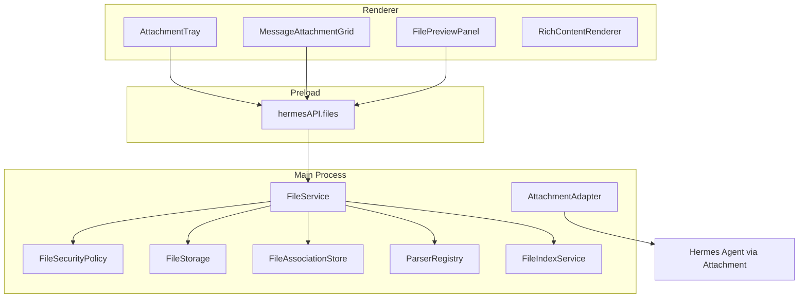

# File Platform Phase 0–6 实施路线图

依据 [prd/v1.0_clone-from-chatbox.md](prd/v0.1_clone-from-chatbox.md)：能力复刻、独立实现、保持 Hermes 架构兼容。不复制 Chatbox 源码（GPL→MIT）。

## 目标与边界

最终四层：

```text
File Domain → File UI Components → Rich Content Components → File Context Adapter
```

明确不做：模型管理 / Chatbox 会话存储 / 云服务 / 联网搜索 / 主题完整复制 / 替换 Hermes Agent 文件工具 / 改 Chat SSE 与 Message 顺序。

安全硬约束（全程）：

- Renderer 无 `fs`/`path`；只走 `window.hermesAPI.files`
- 禁止任意路径读写/删除/执行 IPC
- Profile 隔离；路径经 Profile Resolver
- 保留现有 `Attachment` 兼容；Phase 0–1 不改 Hermes Agent
- Main canonicalize 路径 + 符号链接真实路径校验；扩展名与 Magic Bytes 同时检查（PRD §23）
- 所有 `files:*` IPC 参数走 schema 校验；Renderer 提交的 MIME 不可信
- 错误经 `FileError` 结构返回，禁止把 Node Stack Trace/敏感完整路径暴露到 UI 或日志（PRD §25/§23）

横切约束（贯穿多个 PR，见下方专章）：

- **配置**：`desktop.files.`* 全部在 Main 读取，Renderer 只拿裁剪后的能力标志（PRD §28）
- **Local/Remote 传输**：远程模式不发本地绝对路径；PDF/Office 本地解析成文本后发送；超限明确提示（PRD §24/§27）

## 现状锚点（复用，不推倒）


| 现有                                                                                   | 去向                                             |
| ------------------------------------------------------------------------------------ | ---------------------------------------------- |
| `[src/shared/attachments.ts](src/shared/attachments.ts)`                             | 保留；经 `AttachmentAdapter` 双向转换                  |
| `[src/main/attachment-staging.ts](src/main/attachment-staging.ts)`                   | 包装进 `file-storage.ts`，兼容导出                     |
| `[src/main/session-attachment-store.ts](src/main/session-attachment-store.ts)`       | 保留图片历史；后续加 `file_associations`                 |
| `[src/main/media.ts](src/main/media.ts)`                                             | 继续管图片 open/save；通用操作进 `file-operation-service` |
| `[AttachmentChip](src/renderer/src/components/AttachmentChip.tsx)` / ChatInput chips | Phase 1 收敛为 Tray / Grid                        |
| `[AgentMarkdown.tsx](src/renderer/src/components/AgentMarkdown.tsx)`                 | Phase 3 拆出 RichContent，行为不回归                   |
| IPC 注册 `[register.ts](src/main/ipc/register.ts)`                                     | 新增 `files/*` 命名空间，不拆散现有 handler                |


## 目标架构




目录以 PRD §6 为准：`src/shared/files/`、`src/main/files/`、`src/preload/files-api.ts`、`src/renderer/src/components/files|rich-content/`、`hooks/files/`。

---

## PR 拆分（对应 Phase）

按 PRD §35，每 PR：可单独跑、可回滚、旧会话不坏、测试自足。


| PR        | Phase | 交付                                                                            |
| --------- | ----- | ----------------------------------------------------------------------------- |
| **PR-01** | 0     | `shared/files` 契约 + `HermesFilesAPI` 类型 + IPC 骨架（stub/no-op 安全）               |
| **PR-02** | 0     | `FileStorage` + `FileSecurityPolicy`（包装 staging；路径穿越/Profile 测试）              |
| **PR-03** | 0     | `AttachmentAdapter` + 旧 `Attachment` 双向兼容；现有附件路径零回归                           |
| **PR-04** | 1     | Composer：`FilePickerButton` / `FileDropZone` / `AttachmentTray` / hooks       |
| **PR-05** | 1     | `MessageAttachmentGrid` + `FileContextMenu` + 状态机 UI                          |
| **PR-06** | 2     | `FilePreviewPanel`（text/md/code/image/pdf/unsupported + Open/Reveal/Save As）  |
| **PR-07** | 3     | 从 `AgentMarkdown` 抽出 `RichContentRenderer` / `MarkdownRenderer` / `CodeBlock` |
| **PR-08** | 3     | `MermaidBlock` + `SvgBlock`（错误回退；SVG 不执行脚本）                                   |
| **PR-09** | 3     | `ArtifactBlock` / `ArtifactFrame` 本地沙箱（无 Node/Electron）                       |
| **PR-10** | 4     | Parser Registry + text/md/code + parse cache                                  |
| **PR-11** | 4     | Office / PDF / EPUB adapters                                                  |
| **PR-12** | 5     | `file_associations` + Session Files Panel                                     |
| **PR-13** | 5     | FTS5 chunks + `searchSessionFiles`                                            |
| **PR-14** | 5     | Context builder + token budget + 来源引用                                         |
| **PR-15** | 6     | Agent 输出路径 → 文件卡片（仅 Workspace/授权目录）                                           |
| **PR-16** | 收尾    | Legacy 迁移清理、文档与 lat.md 定稿                                                     |
| **PR-17** | 收尾    | `file-cleanup-service` 孤儿回收 + 引用计数 + temp 保留期（PRD §10/§23/§28）                |


> 服务模块归属（PRD §6.2）：`file-operation-service`（openExternal/reveal/saveAs）随 **PR-06** 落地；`file-preview-service` 随 **PR-06**；`file-index-service` 随 **PR-13**；`file-cleanup-service` 随 **PR-17**。

---

## 横切需求（贯穿多个 PR）

以下为 PRD 中的横切章节，不属于单一 Phase，逐 PR 织入。

### 配置 `desktop.files.*`（PRD §28）

Phase 0 建配置骨架，各阶段按需读取；Main 读取，Renderer 只获能力标志。

```yaml
desktop:
  files:
    managed_storage: true
    copy_picker_files: false
    max_import_mb: 100
    max_parse_mb: 50
    max_inline_text_chars: 40000
    parsing: { enabled, concurrency, office_parser, pdf_parser, ocr_enabled }
    indexing: { enabled, provider: fts5, chunk_chars, overlap_chars, max_results }
    preview: { markdown, mermaid, svg, artifact, pdf, external_network }
    cleanup: { orphan_retention_days: 30, temp_retention_hours: 24 }
```

- PR-01：`shared/files` 定义配置 DTO + Renderer 能力标志类型
- PR-02：Main 配置读取器（storage/security 段）
- PR-10/11：parsing 段；PR-13/14：indexing 段；PR-06/08/09：preview 段；PR-17：cleanup 段

### Local / Remote 传输策略（PRD §24/§27）

`AttachmentAdapter` 与 Parser 必须 remote-aware，避免向远程 Hermes 发送本地路径。

- 图片：沿用现有传输机制
- 小型文本：直接内联
- PDF/Office：本地解析成文本后发送（依赖 Phase 4）
- 大文件超限：明确提示 `FILE_REMOTE_UNSUPPORTED`，不静默失败
- PR-03：Adapter 加 mode 参数（local/remote）；PR-10/11：远程模式回填解析文本；PR-06/UI：Remote 提示文案（PRD §27）

### 错误模型 `FileError`（PRD §25）

统一错误结构，PR-01 落入 `file-contracts.ts`，全链路复用。

`code ∈ { FILE_NOT_FOUND, FILE_TOO_LARGE, FILE_TYPE_DENIED, FILE_READ_FAILED, FILE_PARSE_FAILED, FILE_PREVIEW_UNSUPPORTED, FILE_ENCODING_FAILED, FILE_REMOTE_UNSUPPORTED, FILE_PATH_OUTSIDE_POLICY, FILE_STORAGE_FAILED }`，含 `message / retryable / detail`。

### 性能与并发（PRD §26）

作为对应 PR 的验收项，不单列 PR。

- Main：流式哈希、大文件不整读、Parser 支持 AbortSignal、`MAX_CONCURRENT_PARSE_JOBS=2`/`MAX_CONCURRENT_HASH_JOBS=3`、按 parserVersion 失效、索引异步
- Renderer：不存大 Base64、缩略图与原图分离、大文本虚拟滚动、预览关闭释放 Object URL、Session 切换取消未完成预览请求

---

## 首批执行：Phase 0（PR-01 → PR-03）

**目标**：建契约与 Main 模块，**不改用户界面**；现有图片/文本/path-ref 测试全绿。

### PR-01 — Contracts + IPC skeleton

新增 `[src/shared/files/](src/shared/files/)`：

- `file-types.ts` — `ManagedFile`、`ManagedFileStatus/Source/Category`、`FileAssociation`
- `file-contracts.ts` — 含 `FileError`（PRD §25）、`FileSecurityPolicy`、`desktop.files.*` 配置 DTO 与 Renderer 能力标志类型
- `file-status.ts` / `file-preview.ts`（`FilePreviewDescriptor`）/ `parser-contract.ts`
- `ipc-contract.ts` — PRD §13 `HermesFilesAPI` DTO（`FileImportContext` 含 `mode: "local" | "remote"`）
- `index.ts` 统一导出；**禁止** Electron/React/Node

Main：

- `src/main/files/index.ts` + 最小 `FileService`（方法签名齐全，未实现能力返回明确错误码）
- 在 `[register.ts](src/main/ipc/register.ts)` 注册 `files:*` handlers（白名单）
- `[src/preload/files-api.ts](src/preload/files-api.ts)` 挂到 `window.hermesAPI.files`；更新 `index.d.ts`

测试：未知 channel 拒绝、DTO 形状、Profile 缺省使用当前 Profile。

### PR-02 — Storage + Security + 核心表 + 配置读取

- `file-security.ts` — 路径 canonicalize、穿越拒绝、符号链接真实路径校验、扩展名+Magic Bytes 双检、denied 扩展名（.exe/.dll/.bat/.ps1/.sh… 只引用不解析）
- `file-storage.ts` — 包装现有 staging；兼容导出 `stageAttachment` / `clearStagedAttachments`；内容哈希去重（objects/ 布局，流式哈希）
- `**managed_files` 表**（PRD §11）+ ManagedFile 持久化在此建立（file-index.db）；`copy_picker_files` 决定引用原路径或复制受管目录
- Main 配置读取器（storage/security 段），Renderer 只拿能力标志
- 存储布局按 PRD §10（`objects/` `parsed/` `previews/` `temp/` `file-index.db`）
- 单测：路径穿越、符号链接、同名、特殊文件名、Magic Bytes、Profile 隔离、内容哈希去重

### PR-03 — AttachmentAdapter

- `AttachmentAdapter.toManagedFile` / `toHermesAttachment`（PRD §8 映射表）
- **remote-aware**：Adapter 接收 `mode`；remote 时不产出本地 `path-ref`，图片/小文本按现有机制，PDF/Office 待 Phase 4 回填文本，超限抛 `FILE_REMOTE_UNSUPPORTED`（PRD §24）
- Chat 发送路径仍产出现有 `Attachment[]`；内部可先走 ManagedFile 再适配
- 不删除 `session-attachment-store`；加载时「新表优先，旧图片表回退」（PRD §32）

验收：现有 `attachmentUtils` / staging / 发送路径回归；UI 外观不变；Remote 模式不泄漏本地绝对路径。

---

## 后续阶段摘要（规划，Phase 0 合并后再开）

### Phase 1 — File UI（PR-04/05）

- 新建 `components/files/*`；ChatInput 改为组合 Tray + DropZone，逻辑迁到 `hooks/files/*`
- Composer 与 Message 附件组件分离（消息卡无移除按钮）
- 入口：Picker / Drag-drop / Clipboard；多文件、移除、状态显示、Lightbox 不回归

### Phase 2 — Preview（PR-06）

- 右侧统一 `FilePreviewPanel`（Header/Body/Footer，PRD §16）；点击 Composer/消息附件打开
- Body：Image / Text（虚拟滚动·搜索·编码）/ Markdown（复用 RichContentRenderer）/ Code / **Pdf（内置 Viewer 或受控 iframe）** / **Html** / Unsupported
- **Office 预览（docx/pptx/xlsx）** 与 **Footer「加入/移出上下文·重新解析」** 依赖 Phase 4/5，在对应 PR 接通（PR-06 先留占位与禁用态）
- `file-operation-service`（Open/Reveal/Save As）+ `file-preview-service` 在此落地
- 复用/收敛现有 `FileViewer` / lightbox；Session 切换重置并取消未完成预览请求；Renderer 不持大文件 Base64

### Phase 3 — Rich Content（PR-07–09）

- 拆 `AgentMarkdown` → `RichBlockRenderer` 类型路由；保留 GFM / Diff / 折叠代码块 / 流式围栏（见 [lat.md/code-blocks.md](lat.md/code-blocks.md)）；补 Math/KaTeX（PRD §17）
- Mermaid 失败回退源码；SVG sanitize（禁 `<script>`/事件属性/外部资源）；Artifact `app://hermes-artifact` + `sandbox="allow-scripts allow-forms"`（无 same-origin/Node/Electron），`resources/artifact-preview/`

### Phase 4 — Parsers（PR-10/11）

- Registry + text 编码检测；Office/PDF/EPUB 适配
- Parser 失败仍可 path-ref 发送；向量库不进本阶段（PRD：FTS5 先）

### Phase 5 — Session Context（PR-12–14）

- SQLite：`file_associations` / `parsed_documents` / `file_chunks` + FTS5
- Session Files Panel；用户显式控制进上下文；大文件分段检索；不污染消息历史

### Phase 6 — Agent output（PR-15）+ Cleanup（PR-17）

- 识别 Agent 输出路径 → `AgentOutputFileCard`；存在性检查；仅 Workspace/授权目录自动注册
- `file-cleanup-service`（PR-17）：孤儿物理文件回收、关联引用计数、`orphan_retention_days`/`temp_retention_hours`；删关联不删物理文件（PRD §10/§23/§28）

---

## 文档与 lat.md（每 PR 必做）

新增/演进 wiki（首批至少建骨架）：

- `lat.md/file-platform.md` — File Platform 总览与四层
- `lat.md/file-domain.md` — ManagedFile / Association / Security / Storage
- 后续按阶段补：`file-ui-components.md`、`rich-content.md`、`session-file-context.md`、`file-config.md`（配置/Remote 策略）

每任务结束：`lat check`（环境需可用 `lat` CLI；当前 shell 未装则安装 `lat.md` 或配置 PATH）。

---

## 测试矩阵（PRD §30）

各 PR 附带对应测试；下列为整体覆盖目标。

- **Unit（Main）**：`file-security` / `file-storage` / `file-parser-registry` / `file-association-store` / `attachment-adapter` / `file-preview-service` / `file-context-builder`
- **Renderer**：`AttachmentTray` / `MessageAttachmentGrid` / `FilePreviewPanel` / `RichContentRenderer` / `MermaidBlock` / `ArtifactFrame`
- **IPC**：未知 channel 拒绝、参数 schema 失败、Renderer 不能传任意删除路径、Profile 缺省回退、Remote 不泄漏本地绝对路径
- **E2E（10 场景）**：DOCX 解析预览发送 / PDF 入上下文提问 / 截图粘贴恢复 Session / Agent Markdown 输出预览 / 切 Profile 隔离 / 删 Session 保留共享对象 / Remote 上传本地 PDF / 恶意 SVG 不执行 / 恶意 Artifact 无 Electron API / 100MB 文件 UI 不冻结

---

## 实施顺序与回滚

```text
PR-01 → PR-02 → PR-03   ← 首批（Phase 0，无 UI 变化）
       ↓
PR-04 → PR-05           ← Phase 1 UI
       ↓
PR-06                   ← Phase 2
       ↓
PR-07 → PR-08 → PR-09   ← Phase 3
       ↓
PR-10 → PR-11           ← Phase 4
       ↓
PR-12 → PR-13 → PR-14   ← Phase 5
       ↓
PR-15 → PR-17 → PR-16   ← Phase 6 + cleanup + 收尾
```

禁止单 PR：整文件重写 `AgentMarkdown`、删除 `Attachment`、删除 `session-attachment-store`、同时引入全部 Parser、RAG+UI 混提。

## 首批完成定义（Phase 0 Done）

- `hermesAPI.files` 类型与白名单 IPC 可用；`FileError`、配置 DTO、`mode` 参数已定义
- FileStorage/Security 覆盖 staging 行为；`managed_files` 表 + 内容哈希去重 + Magic Bytes 校验可用
- Main 配置读取器（storage/security 段）就位，Renderer 只拿能力标志
- AttachmentAdapter 保证发送/恢复路径兼容；Remote 模式不泄漏本地绝对路径
- 现有附件相关单测 + 新增 security/storage/adapter 测试通过
- Chat UI 无可见变化；Hermes Agent 未改
- `lat.md` 已记录 File Platform / Domain；`lat check` 通过

