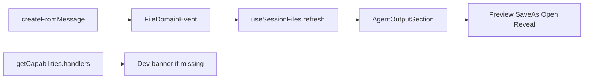

# PRD v1.1.2 Report Fileization Hotfix

## Context

v1.1.1 already shipped the core loop in this repo:

- `files:create-from-message` + [`AgentOutputService.createFromMessage`](src/main/files/agent-output/agent-output-service.ts)
- [`MessageDocumentActions`](src/renderer/src/components/files/message/MessageDocumentActions.tsx) wired through Chat → MessageList → MessageRow
- Message preview via `useFilePreview.openMessagePreview`
- Save As / open / reveal IPC already registered in [`register-file-ipc.ts`](src/main/files/register-file-ipc.ts)

**Do not reimplement those.** v1.1.2 P0 (PRD §31) closes the remaining holes that break the user loop and component capabilities.

Out of scope (PRD explicit): `chat.artifact` SSE, Hermes hooks, DOCX/PDF, path scanning.

## Gaps to close



| Gap | Current | Target |
|-----|---------|--------|
| Auto-refresh | Chat `refreshKey` only | Main emits `files:event`; `useSessionFiles` subscribes |
| Agent Output UI | Generic [`SessionFileRow`](src/renderer/src/screens/Chat/session-files/SessionFileRow.tsx) (preview + context only) | Dedicated section/cards with Preview / Save As / Open / Reveal |
| Capabilities | Config flags only ([`FilesCapabilities`](src/shared/files/file-contracts.ts)) | Also report P0 handler availability |
| Message actions gating | Requires `sessionId` before showing bar | Allow Preview without session; gate Save/Add on sessionId |
| Error model | Missing `IPC_HANDLER_NOT_REGISTERED` | Add + surface in UI when IPC fails |

## Phase 1 — FileDomainEvent + auto-refresh

New shared contract [`src/shared/files/file-events.ts`](src/shared/files/file-events.ts):

```ts
export type FileDomainEvent =
  | { type: "file:created"; fileId: string; sessionId?: string; role?: FileAssociationRole }
  | { type: "file:updated"; fileId: string }
  | { type: "file:association-created"; fileId: string; sessionId: string; role: FileAssociationRole };
```

Main:

- Add [`src/main/files/file-domain-events.ts`](src/main/files/file-domain-events.ts) — `emitFileDomainEvent(event)` via focused `BrowserWindow.webContents.send("files:event", event)`
- Call emit from `createFromMessage` after successful ManagedFile + association write
- Channel constant in `FILES_IPC_CHANNELS` / shared events module

Preload / API:

- Add `onFileDomainEvent(cb): () => void` to [`HermesFilesAPI`](src/shared/files/file-ipc.ts) and [`files-api.ts`](src/preload/files-api.ts)

Renderer:

- [`useSessionFiles`](src/renderer/src/screens/Chat/session-files/useSessionFiles.ts) subscribe when `sessionId` matches; keep `refresh` in `useCallback`
- Keep `refreshKey` as a secondary trigger, but event becomes the primary path

## Phase 2 — Agent Output component capabilities

Under [`src/renderer/src/screens/Chat/session-files/`](src/renderer/src/screens/Chat/session-files/):

- `AgentOutputSection.tsx` — section title + list / empty state
- `AgentOutputFileCard.tsx` (ManagedFileView) — distinct from path-only [`components/files/message/AgentOutputFileCard.tsx`](src/renderer/src/components/files/message/AgentOutputFileCard.tsx); name session-files card clearly (e.g. keep PRD name in session-files folder)
- `AgentOutputEmptyState.tsx`

Card actions (profile + fileId via existing IPC):

- Preview → existing `onPreview(fileId)`
- Save As → `files.saveAs`
- Open → `files.openExternal`
- Reveal → `files.revealInFolder`
- Click card body → Preview (not external open)

Wire into [`SessionFilesPanel`](src/renderer/src/screens/Chat/session-files/SessionFilesPanel.tsx): replace the Agent output `Section` + `SessionFileRow` with `AgentOutputSection`.

## Phase 3 — Handler diagnostics (component capability fix)

Extend capabilities (additive fields, keep existing config flags):

```ts
handlers: {
  listSession: boolean;
  getPreview: boolean;
  createFromMessage: boolean;
  saveAs: boolean;
  open: boolean;
  reveal: boolean;
}
available: boolean; // all P0 handlers true
```

Main `getCapabilities` returns `handlers: { ...: true }` once registered (handlers are registered synchronously in `registerFilesIpcHandlers`).

Chat (dev only, `import.meta.env.DEV`): if `!available`, show a compact banner listing missing handlers (PRD §26).

Add `IPC_HANDLER_NOT_REGISTERED` to [`file-errors.ts`](src/shared/files/file-errors.ts); MessageDocumentActions maps invoke failures that look like missing handlers to the user-facing “文件服务未初始化”.

## Phase 4 — Message / preview component fixes

In [`MessageRow.tsx`](src/renderer/src/screens/Chat/MessageRow.tsx):

- Show `MessageDocumentActions` whenever document-like + callbacks exist
- Pass `sessionId` optionally; Preview always works
- Disable Save / Add when `!sessionId` with clear title (need a session before create)

Extract thin [`useDocumentPreview.ts`](src/renderer/src/hooks/files/useDocumentPreview.ts) as PRD §18.1 (open/close message-document state). Chat composes it with `useFilePreview`: message preview uses document hook → `FilePreviewPanel` message mode; managed files keep `useFilePreview`. Avoid duplicating long Markdown in multiple React states — document hook holds the single source for message mode.

Optional polish (same PR): MessageDocumentActions after Save opens managed preview (already partially done via `onFileCreated` → `openPreview`).

## Phase 5 — Tests + lat.md

- Unit: `file-domain-events` emit shape; `useSessionFiles` refresh on matching session event (hook test or thin integration)
- Unit: AgentOutputFileCard click/actions invoke stubs
- Extend `agent-output-service` test to assert emit is called (mock)
- Update [`lat.md/file-platform.md`](lat.md/file-platform.md), [`file-ui-components.md`](lat.md/file-ui-components.md), [`session-file-context.md`](lat.md/session-file-context.md)
- Run `npx lat check`

## Key files

- New: `src/shared/files/file-events.ts`, `src/main/files/file-domain-events.ts`, session-files Agent Output components, `useDocumentPreview.ts`
- Edit: `file-ipc.ts`, `files-api.ts`, `agent-output-service.ts`, `useSessionFiles.ts`, `SessionFilesPanel.tsx`, `MessageRow.tsx` / `MessageDocumentActions.tsx`, `file-contracts.ts` / `file-config.ts`, `Chat.tsx`, lat.md
