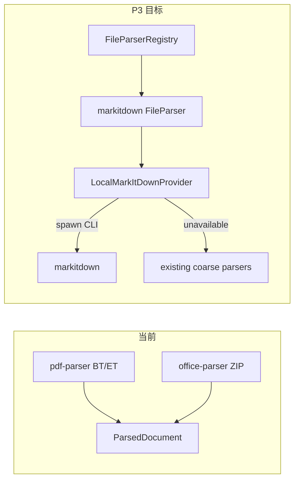

# PRD v1.1 MarkItDown 执行计划

## 现状结论

| 轮次 | 内容 | 状态 |
|------|------|------|
| P0 功能闭环 | pick/drop/paste → 发送双写双读 → Preview | DONE |
| P1 后续闭环 | Session Context wire 注入 + 搜索 UI | DONE |
| P2 解析队列 | FileJobQueue + `file-job:event` + Composer 进度 | DONE |
| **P3 本轮** | **MarkItDown Adapter** | **MISSING** |
| P4 | MessageRow `streaming`、fixtures、E2E | MISSING（下轮） |

配置默认已写 `officeParser: "markitdown"` / `pdfParser: "markitdown"`（[`file-contracts.ts`](src/shared/files/file-contracts.ts)），但实际仍是内联粗解析：[`office-parser.ts`](src/main/files/parsers/office-parser.ts)（ZIP+XML）、[`pdf-parser.ts`](src/main/files/parsers/pdf-parser.ts)（BT/ET）。**无** `DocumentConversionProvider` / `LocalMarkItDownProvider`。



## 本轮范围（P3，对应 PRD §14.3）

目标：Main 通过子进程调用 MarkItDown CLI 转换 Office/PDF → markdown；失败/不可用时安全回退粗解析；仍走现有 JobQueue。

**明确不做：** OCR、E2E-01..07、MessageRow `streaming`、改 Composer/Session Context、打包内嵌完整 Python 运行时（本轮依赖本机已安装的 `markitdown` CLI / `python -m markitdown`）。

### P3-1：Conversion Provider 契约

新建（建议目录）：

```text
src/main/files/conversion/
  document-conversion-provider.ts   # interface
  local-markitdown-provider.ts      # CLI spawn
  index.ts
```

`DocumentConversionProvider` 与 PRD §14.3 对齐：`convert({ path, mime, signal }) → { markdown, metadata? }`。

`LocalMarkItDownProvider` 约束：

- 仅 Main：`spawn` / `execFile`（对齐 [`skills.ts`](src/main/skills.ts) / [`mcp-servers.ts`](src/main/mcp-servers.ts) 风格）
- 解析 CLI：优先 `desktop.files.parsing.markitdown_bin`（若已有/新增配置），否则 `markitdown` on PATH，再试 `python -m markitdown`
- **超时**（默认 60s，可配置）、**stdout 上限**（例如 8–16MB）、**stderr 截断**、**AbortSignal → child.kill**、路径参数不经 shell（避免注入）、非 0 退出码 → `FILE_PARSE_FAILED`
- CLI 未安装：抛可识别错误（如 `FILE_NOT_IMPLEMENTED` / 带 `retryable: false`），供上层回退

### P3-2：MarkItDown FileParser + Registry

- 新增 parser（如 `markitdown-office-parser` / `markitdown-pdf-parser`，或单一 `markitdownParser` 覆盖 pdf+office 扩展名），`parserId: "markitdown"`，调用 Provider
- 在 [`file-parser-registry.ts`](src/main/files/file-parser-registry.ts) / [`parsers/index.ts`](src/main/files/parsers/index.ts) 注册：**当** `config.parsing.officeParser|pdfParser === "markitdown"` 时优先于现有 `office`/`pdf`；否则保持现有粗解析
- Provider 不可用或 convert 失败时：**回退**到现有 `officeParser` / `pdfParser`（不阻断 path-ref 发送；JobQueue 仍发 `file-job:failed` 仅当最终解析失败）

约定回退策略（固定）：MarkItDown 失败 → 调用现有 coarse parser → 成功则 `parsed`；两者都失败才 `failed`。

### P3-3：配置与能力面

- 读取已有 `office_parser` / `pdf_parser`；可选新增 `markitdown_bin`、`markitdown_timeout_ms`（写进 [`file-config.ts`](src/main/files/file-config.ts) / contracts，有默认值）
- `toFilesCapabilities` 可暴露 `markitdownAvailable`（探测一次缓存），便于 UI 日后提示；本轮 Composer 不强制新文案

### P3 验收

- 本机有 MarkItDown 时：导入 PDF/docx → Job 事件 → ParsedDocument 为 markdown 正文（优于粗 BT/ET/ZIP 占位）
- CLI 缺失：自动回退粗解析，应用不崩溃，path-ref 仍可发送
- Abort/超时：子进程被杀，状态 `failed` 或回退成功
- 单测：mock spawn（成功 / 超时 / 非 0 / abort）；不依赖真实 CLI
- `typecheck` / `test` / `build` / `lat check` 全绿
- 更新 [`lat.md/file-platform.md`](lat.md/file-platform.md)；`src` 无 `references/chatbox`

## 后续轮次（非本轮）

| 轮次 | 内容 | PRD |
|------|------|-----|
| P4 | MessageRow → RichContent `streaming={…}`；fixtures；E2E-01..07 | §10 / §25 / §26 |

## 约束

- Renderer 绝不调用 MarkItDown / `fs` / `path`
- 不 import `references/chatbox`
- 不删除现有 coarse office/pdf parsers（作回退）
- 转换走 JobQueue，不在 IPC handler 内同步阻塞
- 垂直切片：Provider → Parser/Registry → 测试 → `lat.md` → `lat check`
