# PRD v1.1 剩余垂直切片总计划

## 基线（已完成，不再重做）

| 轮次 | 能力 | PRD 锚点 |
|------|------|----------|
| P0 | Composer pick/drop/paste → 双写双读 → Preview | §5–§9 / §28 |
| P1 | Session Context 注入 + Session Files 搜索 UI | §17–§18 |
| P2 | FileJobQueue + Composer 进度事件 | §15 |
| P3 | LocalMarkItDown + coarse 回退 | §14.3 |
| P4 | MessageRow `streaming` + 最小 fixtures + Vitest E2E 核心断言 | §10.3 / §25 / §26 |

约束延续：不 import `references/chatbox`；不删旧 Attachment / 旧图片表；Renderer 不碰 `fs`/`path`；每切片后更新 `lat.md/` 并跑 `typecheck` / 相关 `test` / `build` / `lat check`（§24）。

```mermaid
flowchart LR
  done[P0_P4_done] --> P5[P5_tool_exclude]
  P5 --> P6[P6_history_attach]
  P6 --> P7[P7_composer_chip]
  P7 --> P8[P8_fixtures]
  P8 --> P9[P9_chunking]
  P9 --> P10[P10_artifact_protocol]
  P10 --> P11[P11_artifact_ast]
  P11 --> P12[P12_preview_page]
  P12 --> P13[P13_electron_e2e]
```

---

## 剩余缺口总览（相对 PRD）

| 缺口 | PRD | 现状 |
|------|-----|------|
| `references/**` / `wiki/**` 工具链排除 | §2.1 | 约定为主，未见强制 exclude |
| History 附件仍用 `AttachmentChip` | §8 | [`HistoryRow.tsx`](src/renderer/src/screens/Chat/HistoryRow.tsx) 未接 `MessageAttachmentGrid` |
| Composer 图片仍包一层 Chip | §5.2 | `ComposerAttachmentCard` 等仍依赖 Chip |
| §25 完整夹具 | §25 | 仅有 sample.txt/md/pdf/png + corrupt/remote-safe |
| 结构化 FTS chunking | §18.2 | [`chunkText`](src/main/files/file-parse-service.ts) 固定窗口 |
| Artifact 自定义协议 | §13.1–13.2 | [`artifact-host.ts`](src/renderer/src/components/rich-content/artifact-host.ts) 仍 srcDoc |
| Artifact html/css/js 组合器 | §13.5 | 无 AST combiner |
| 大文本预览分页 | §9.3 | 仅截断上限 |
| 真 Electron UI E2E | §26 | Vitest 核心断言，非完整 UI 流 |
| §3 源码映射文档 | §3 | `docs/chatbox-clone-analysis/` 不存在 |

**本路线图明确不做 / 延期（PRD 已标后续或非 MVP）：**

- §9.4 PDF.js + OCR
- §18.4 Agent 侧 file-search 工具
- 打包 MarkItDown Python 运行时进安装包（继续依赖本机 CLI + capabilities 探测）
- 为对齐字面量重命名 IPC / `context-file` 角色名（行为已满足）

---

## 执行规则（每个垂直切片 = 一个 PR）

1. 只做当前切片范围；不顺带改下一切片。
2. 切片内：实现 → 单测/场景测 → 更新 `lat.md` → `lat check` → typecheck/test/build。
3. **合并前开 PR**（标题建议 `feat(files|rich-content): P{n} …`），再开始下一切片。
4. 禁止从 `references/` 拷贝 Chatbox 实现进 `src/`。

---

## P5 — 参考目录保护（§2.1）

**垂直能力：** 构建/类型检查/lint 永不解析 `references/**`、`wiki/**`。

- 改 [`tsconfig*.json`](tsconfig.json)、eslint ignore、必要时 vite/electron-vite exclude
- CI 或脚本断言 `src/` 无 `references/chatbox` import（与 §24 一致）
- 验收：误加 import 会失败；现有 build 绿

**PR：** `feat: exclude references and wiki from product toolchains`

---

## P6 — History / 消息附件对齐 Message 组件（§8）

**垂直能力：** 历史与消息附件统一走 File UI，不再在 History 直接渲染旧 Chip。

- [`HistoryRow.tsx`](src/renderer/src/screens/Chat/HistoryRow.tsx)：`AttachmentChip` → [`MessageAttachmentGrid`](src/renderer/src/components/files) + Preview 回调（与 [`MessageRow.tsx`](src/renderer/src/screens/Chat/MessageRow.tsx) 对齐）
- 恢复后的 path-ref / image / stub ManagedFile id 仍可打开 Preview
- 单测：History 渲染含 ManagedFile id 时走 grid

**PR：** `feat(chat): HistoryRow uses MessageAttachmentGrid`

---

## P7 — Composer 彻底脱离 AttachmentChip（§5.2）

**垂直能力：** Composer 附件卡只依赖 ManagedFile 视图，图片也不再包 Chip。

- 改 [`ComposerAttachmentCard`](src/renderer/src/components/files) / 相关 image 分支，内联缩略图与状态，去掉对 [`AttachmentChip`](src/renderer/src/components/AttachmentChip.tsx) 的依赖
- 保留旧 Chip 供非 File Platform 路径（若仍有）；Chat Composer 路径零引用
- 验收：pick/paste 图片卡片状态、remove、preview 行为不变

**PR：** `feat(composer): ManagedFile cards without AttachmentChip`

---

## P8 — 补齐 §25 合成夹具 + 安全/解析回归（§25）

**垂直能力：** 完整合成 fixture 树驱动安全与 parser 回归（仍禁止客户文件）。

在 [`tests/fixtures/files/`](tests/fixtures/files/) 补齐 PRD 清单（可与现有 `sample.*` 别名共存）：

- 文本：`plain-utf8.txt`、`chinese-gbk.txt`、`sample.ts/csv/json`、`oversized.txt`、`no-extension`
- Office/电子书：最小合法 `sample.docx/xlsx/pptx/epub`（合成 ZIP/XML）
- 安全：`malicious.svg`、`malicious.html`、`fake-pdf.exe`、`scanned.pdf`（无可提取文本层）
- 图片：保留/别名 `image.png`

测试：denied extension、GBK 文本解析、malicious SVG sanitize、oversized import 拒绝；扩展现有 E2E fixture 读取。

**PR：** `test(files): complete PRD §25 synthetic fixtures`

---

## P9 — 结构化 FTS Chunking（§18.2）

**垂直能力：** 大文件索引按标题→段落→换行→句→字回退切分（保留 overlap 配置）。

- 抽/改 [`chunkText`](src/main/files/file-parse-service.ts)（或 `file-chunking.ts`），单测覆盖 markdown 标题边界
- 不改 UI；Session 搜索质量可感知即可
- 更新 [`lat.md/session-file-context.md`](lat.md/session-file-context.md) / file-platform

**PR：** `feat(files): structure-aware FTS chunking`

---

## P10 — Artifact 本地协议（§13.1–13.2）

**垂直能力：** 用自定义协议托管沙箱页，替换纯 srcDoc 作为主路径。

- Main 注册 `hermes-artifact://`（或 PRD 等价 `app://` 宿主），服务 [`resources/artifact-preview/`](resources/artifact-preview/)
- [`ArtifactFrame`](src/renderer/src/components/rich-content/ArtifactFrame.tsx) / [`artifact-host.ts`](src/renderer/src/components/rich-content/artifact-host.ts)：优先 protocol；失败可短暂回退
- 保持：无 `allow-same-origin`、固定 postMessage channel/origin allow-list
- 测：iframe src 协议、无法触达 `window.hermesAPI`（能自动化的部分）

**PR：** `feat(rich-content): hermes-artifact protocol host`

---

## P11 — Artifact AST 组合器（§13.5）

**垂直能力：** 多 fence（html/css/js）合成单文档 + CSP，再交给 Artifact 预览。

- 新增 `artifact-source-parser.ts`（或同级模块）：从消息片段/围栏提取并组合
- 接线 Markdown/Artifact 入口；流式未闭合仍 inert（沿用 P4）
- 单测：三 fence 合成；恶意 script 仍被沙箱/CSP 挡住

**PR：** `feat(rich-content): multi-fence artifact combiner`

---

## P12 — 大文本 Preview 分页读取（§9.3）

**垂直能力：** 超大文本预览可按偏移续读，而非只截断一次。

- 扩展 preview descriptor / IPC（如 `offset`/`limit` 或 `nextCursor`）
- Renderer Preview 文本视图「加载更多」
- 用 `oversized.txt` fixture 验收

**PR：** `feat(files): paginated text preview`

---

## P13 — Electron UI E2E 冒烟（§26 完整意图）

**垂直能力：** 对 E2E-01/03/05/06 做最小真实窗口冒烟（在 Vitest 核心断言之上）。

- 基于现有 [`scripts/e2e-attach.js`](scripts/e2e-attach.js) 或同类 harness，**不**引入完整 Playwright 重框架，除非现有脚本不足再最小扩展
- 覆盖：附件卡可见、streaming Mermaid 源码态、Artifact Preview 可点且无 hermesAPI
- 文档化本地/CI 运行方式；flaky 环境（WSL/cron）不阻塞合并门禁时可标 optional job

**PR：** `test(e2e): PRD §26 UI smoke for attach and rich content`

---

## 可选文档切片（插队规则）

**P5b — §3 源码映射报告（docs-only）**  
仅当需要新人 onboarding 时，在 P5 之后插入：产出 `docs/chatbox-clone-analysis/01–07` 差距矩阵。不阻塞功能切片。单独 PR：`docs: chatbox clone analysis map`。

---

## 建议落地顺序（严格串行）

1. P5 保护规则 → PR  
2. （可选）P5b 分析文档 → PR  
3. P6 History 附件 → PR  
4. P7 Composer 去 Chip → PR  
5. P8 夹具 → PR  
6. P9 Chunking → PR  
7. P10 Artifact 协议 → PR  
8. P11 Artifact AST → PR  
9. P12 Preview 分页 → PR  
10. P13 Electron E2E → PR  

**下一立刻执行的切片是 P5**（成本最低、满足 §2.1/§24 门禁，且不改产品行为路径）。

---

## 每 PR 验收清单（重复使用）

- 垂直能力可演示 / 可测
- `src` 无 `references/` 依赖
- 相关 vitest 绿；`npm run typecheck`；`npm run build`；`npx lat check`
- `lat.md` 已更新对应概念节
