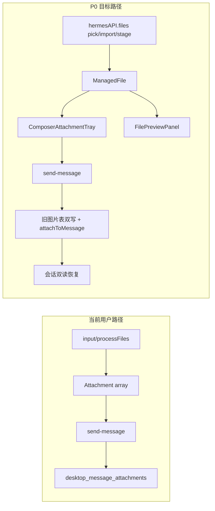

# PRD v1.1 功能闭环执行计划

## 现状结论

结构对齐（目录/命名）已落地，且 Main 侧 File Platform 基础设施大体齐全。对照 [prd/v1.1_features-with-component.md](prd/v1.1_features-with-component.md) §1 业务闭环，**用户侧仍未真正可用**：

| 能力 | 状态 | 关键证据 |
|------|------|----------|
| Shared ManagedFile / Adapter / IPC / FileService | 后端 DONE | [`src/shared/files/`](src/shared/files/)、[`file-service.ts`](src/main/files/file-service.ts)、[`register-file-ipc.ts`](src/main/files/register-file-ipc.ts)、[`preload/files-api.ts`](src/preload/files-api.ts) |
| Composer UI 外壳 | PARTIAL | [`ChatInput.tsx`](src/renderer/src/screens/Chat/ChatInput.tsx) 用 `AttachmentTray`，但附件仍经 `processFiles`（legacy） |
| 选择/拖放/粘贴走 `hermesAPI.files` | MISSING | 纸夹仍是隐藏 `<input type="file">`；无 `importDroppedFiles` / `stageClipboardFile` 调用方 |
| 发送写 ManagedFile association | MISSING | 发送只调 `persistPromptImageAttachments`（[`register.ts`](src/main/ipc/register.ts) ~1484） |
| 会话双读恢复 | MISSING | 恢复仍只读旧图片表 / vision path |
| Preview Panel | PARTIAL | Chat 已挂载，但仅 Session Files 能打开；消息/Composer 无 `fileId`→preview |
| Session Context 注入 | MISSING | [`buildSessionFileContext`](src/main/files/file-context-builder.ts) 有单测，发送路径未调用 |
| FileJobQueue / `file-job:event` | MISSING | `src/` 零命中 |
| MarkItDown Adapter | MISSING | 配置默认写 `"markitdown"`，实际仍是内联 office/pdf 粗解析 |
| `docs/chatbox-clone-analysis/`、fixtures、E2E-01..07 | MISSING | 目录/用例均不存在 |

## 本轮范围（P0，对应 PRD §28）

目标：打通「选择/拖入/粘贴 → 卡片显示 → 发送 → Session 恢复 → Preview」的真实链路。

**明确不做（下轮）：** JobQueue、MarkItDown、Context XML 注入、FTS 搜索 UI、分析文档全集、E2E-01..07、整文件改 AgentMarkdown。

### P0-1：Composer 接入 File Platform

关键文件：[`ChatInput.tsx`](src/renderer/src/screens/Chat/ChatInput.tsx)、[`Chat.tsx`](src/renderer/src/screens/Chat/Chat.tsx)、[`useFilePicker.ts`](src/renderer/src/hooks/files/useFilePicker.ts)、[`useFileDrop.ts`](src/renderer/src/hooks/files/useFileDrop.ts)

- 纸夹改为 `FilePickerButton` / `files.pickFiles`（带 `profile` + `sessionId` + `mode`）
- 拖放：Electron path 可用时走 `files.importDroppedFiles`；否则回退现有 `File` 处理
- 粘贴：无 path 的截图/文件走 `files.stageClipboardFile`
- Composer 状态以 `ManagedFileView`（或 `ManagedFile` id + legacy `Attachment` 适配结果）为主；发送前仍经 [`managedFileToAttachment`](src/shared/files/legacy-attachment-adapter.ts) / Main [`toHermesAttachment`](src/main/files/attachment-adapter.ts) 产出兼容 `Attachment[]`
- `ComposerAttachmentTray` 传入真实 `status`；失败可 `retryParse`

### P0-2：发送时写 association（旧表双写）

- 在 `send-message`（或紧随其后）对每个成功发送的附件调用 `files.attachToMessage`
- **保留** `persistPromptImageAttachments` 双写，不删旧图片表（PRD §7.2）
- Remote 模式继续走 adapter：禁止 path-ref 泄漏

### P0-3：会话双读恢复

- 加载消息时：先读 `desktop_file_associations` + `managed_files`；若无新记录则回退旧 `desktop_message_attachments`
- `MessageAttachmentGrid` 能渲染恢复后的附件；图片 lightbox 不回归

### P0-4：Preview 从 Composer / 消息可达

- 卡片点击传入 `fileId`，调用现有 `useFilePreview.openPreview`
- 验收：选 TXT/图片/PDF → 卡片 → Preview → 发送 → 重启/重开会话 → 再 Preview

### P0 验收（人工 + 自动化）

- 选图片/文本/PDF(path-ref) 发送
- 多文件、删除附件、数量超限提示
- 超大图片仍走现有压缩逻辑
- `typecheck` / `test` / `build` / `lat check` 全绿
- `src` 下无 `references/chatbox` 引用

## 后续轮次（路线图，非本轮编码）

| 轮次 | 内容 | PRD |
|------|------|-----|
| P1 | `buildSessionFileContext` 注入发送；Session Files 搜索 UI；消息 Preview 完善 | §17 / §18 |
| P2 | `FileJobQueue` + `file-job:event` + preload `onJobEvent`；进度 UI | §15 |
| P3 | `DocumentConversionProvider` / `LocalMarkItDownProvider`；替换粗 office/pdf | §14.3 |
| P4 | MessageRow 传 `streaming`；fixtures；E2E-01..07；可选补 `docs/chatbox-clone-analysis` | §10 / §25 / §26 / §3 |

## 约束（全程）

- 不 import `references/chatbox`；不复制 Chatbox Store/MUI
- Renderer 无 `fs`/`path`；路径只在 Main
- 不删除旧 `Attachment` 类型与旧图片表
- 每垂直切片：实现 → 接入 Chat → 测试 → 更新 `lat.md` → `lat check`
