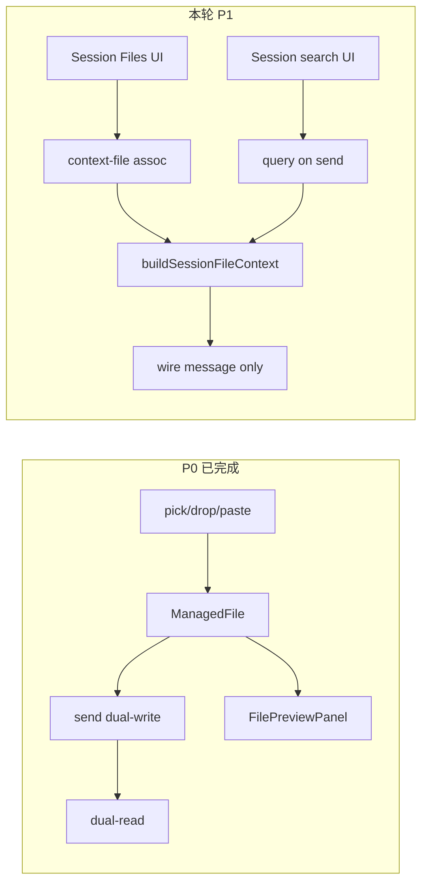

# PRD v1.1 后续功能闭环执行计划

## 现状结论（对照 [prd/v1.1_features-with-component.md](prd/v1.1_features-with-component.md) §1）

上一轮 P0 已把用户附件主链路打通。对照 §1 业务闭环，剩余缺口如下：

| §1 用户结果 | 状态 | 证据 |
|-------------|------|------|
| 选择 / 拖入 / 粘贴 → 卡片 → 发送 | DONE | [`composerFilePlatform.ts`](src/renderer/src/screens/Chat/composerFilePlatform.ts)、[`ChatInput.tsx`](src/renderer/src/screens/Chat/ChatInput.tsx) |
| 发送双写 association + 旧图片表 | DONE | [`register.ts`](src/main/ipc/register.ts) + [`persist-managed-message-associations.ts`](src/main/files/persist-managed-message-associations.ts) |
| Session 恢复附件 | DONE | [`load-managed-message-attachments.ts`](src/main/files/load-managed-message-attachments.ts) |
| Composer / 消息 Preview | DONE | [`Chat.tsx`](src/renderer/src/screens/Chat/Chat.tsx) `useFilePreview` |
| 加入/移除 Session Context（UI） | DONE | [`SessionFilesPanel.tsx`](src/renderer/src/screens/Chat/session-files/SessionFilesPanel.tsx) |
| **Context 注入到模型 wire** | **MISSING** | [`buildSessionFileContext`](src/main/files/file-context-builder.ts) 仅有单测，**发送路径未调用** |
| **大文件 Session 搜索 UI + 检索注入** | **PARTIAL** | FTS/`searchSessionFiles` 已有；面板无搜索框；发送未带 `query` |
| 解析进度推送 | MISSING | 无 JobQueue / `file-job:event` |
| MarkItDown 真转换 | MISSING | 仍是粗 PDF/Office 解析 |
| streaming fence / E2E / fixtures | MISSING / PARTIAL | `stream-fence` 有，MessageRow 未传 `streaming` |

## 本轮范围（P1，对应 PRD §17 / §18）

目标：打通「Session Files 加上下文 / 搜索 → 发送时 ephemeral 注入 → UI 原文不变」的真实链路。

**明确不做（下轮）：** FileJobQueue、MarkItDown、E2E-01..07、fixtures 全集、`docs/chatbox-clone-analysis`、MessageRow `streaming`（除非后续单独插队）。

### P1-1：发送路径注入 `buildSessionFileContext`

关键文件：[`src/main/ipc/register.ts`](src/main/ipc/register.ts)（`send-message`）、[`src/main/files/file-context-builder.ts`](src/main/files/file-context-builder.ts)、必要时 [`src/main/hermes.ts`](src/main/hermes.ts) 的 `buildUserContent` / `sendMessage*`。

约定实现：

- 在 `send-message` 调用 `sendMessage(...)` **之前**，若存在 `resumeSessionId`（或本轮将绑定的 session）且 profile 可知：
  - `await buildSessionFileContext({ profile, sessionId, query })`
  - 将返回的 `text` **前置/拼接到 wire message**（仅传给 agent 的字符串），**不改** renderer 展示用的用户原文
- `query`：优先用用户本轮输入的纯文本（截断到合理长度，如 200 字符），供大文件 FTS 路径（builder 已有）
- 持久化 dual-write（`persistPromptImageAttachments` / `persistManagedMessageAssociations`）继续用**原始** `message`，避免把 XML 写进匹配逻辑
- 无 `context-file` 关联时 builder 返回空 → 行为与今天一致
- Remote/SSH 同样走同一注入点（Main 侧统一处理，不在 Renderer 拼 XML）

### P1-2：Session Files 搜索 UI

关键文件：[`SessionFilesPanel.tsx`](src/renderer/src/screens/Chat/session-files/SessionFilesPanel.tsx)、[`useSessionFiles.ts`](src/renderer/src/screens/Chat/session-files/useSessionFiles.ts)；IPC 已有 [`searchSessionFiles`](src/main/files/file-service.ts)。

- 面板顶部增加搜索输入（debounce）
- 调用 `hermesAPI.files.searchSessionFiles({ profile, sessionId, query })`
- 结果列表展示 `fileName` + snippet；点击打开现有 Preview
- 空 query 时保持现有三段列表（Attachments / Context / Agent output）

### P1-3：消息 Preview 小完善（轻量）

- 确认恢复后的非图片附件（TXT/PDF path-ref）点击仍能 `openPreview(fileId)`（ManagedFile id 已作为 Attachment.id）
- 若恢复路径偶发缺 id，仅修双读映射，不扩 scope

### P1 验收

- 将文件「加入上下文」后发送：模型 wire 含 `<session_file>` / `<retrieved_file_context>`；聊天气泡仍是用户原文
- Session Files 搜索能命中已索引 chunk 并打开 Preview
- 无 context 文件时发送行为不变
- `typecheck` / `test` / `build` / `lat check` 全绿
- 更新 [`lat.md/session-file-context.md`](lat.md/session-file-context.md)：写明 send 路径已调用 builder

## 后续轮次（路线图，非本轮编码）

| 轮次 | 内容 | PRD |
|------|------|-----|
| P2 | `FileJobQueue` + `file-job:event` + preload `onJobEvent`；Composer 解析进度 | §15 |
| P3 | `DocumentConversionProvider` / `LocalMarkItDownProvider`；替换粗 office/pdf | §14.3 |
| P4 | MessageRow 传 `streaming`；fixtures；E2E-01..07；可选分析文档 | §10 / §25 / §26 / §3 |

## 约束（全程）

- 不 import `references/chatbox`；不复制 Chatbox Store/MUI
- Renderer 无 `fs`/`path`；路径只在 Main
- Context 只 ephemeral 注入 wire，不改写消息历史 / UI 原文
- 不删除旧 `Attachment` 与旧图片表
- 每垂直切片：实现 → 接入 Chat → 测试 → 更新 `lat.md` → `lat check`
