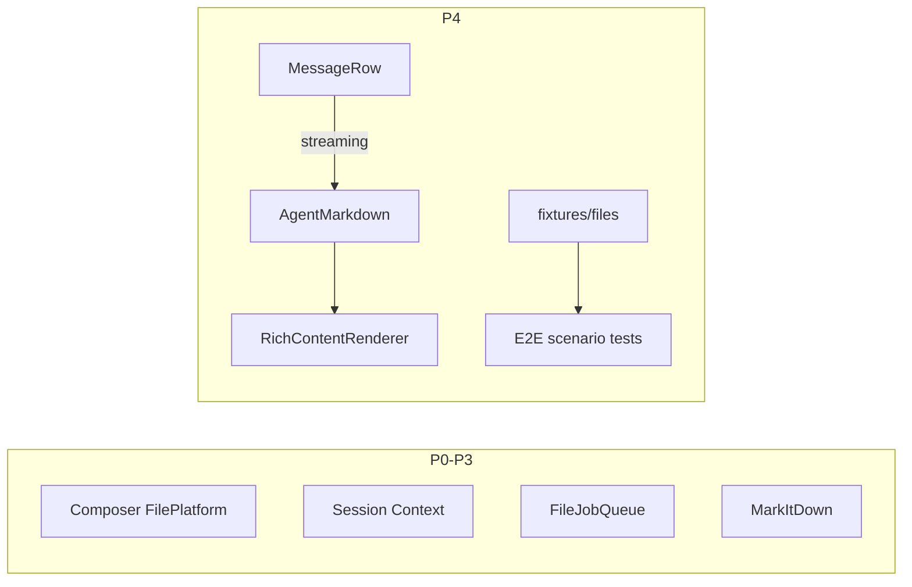

# PRD v1.1 流式验收执行计划

## 现状结论

| 轮次 | 内容 | 状态 |
|------|------|------|
| P0 功能闭环 | pick/drop/paste → 发送双写双读 → Preview | DONE |
| P1 后续闭环 | Session Context 注入 + 搜索 UI | DONE |
| P2 解析队列 | FileJobQueue + Composer 进度事件 | DONE |
| P3 MarkItDown | LocalMarkItDownProvider + 回退 coarse | DONE |
| **P4 本轮** | **streaming 接线 + fixtures + E2E 场景覆盖** | **MISSING** |

证据：

- Rich Content 已支持 `streaming`（[`RichContentRenderer`](src/renderer/src/components/rich-content/RichContentRenderer.tsx)、Mermaid/SVG/Artifact、[`stream-fence.ts`](src/renderer/src/components/rich-content/stream-fence.ts)）
- [`AgentMarkdown.tsx`](src/renderer/src/components/AgentMarkdown.tsx) **未**接收/转发 `streaming`
- [`MessageRow.tsx`](src/renderer/src/screens/Chat/MessageRow.tsx) 有 `isLoading`/`isLast`，但 `<AgentMarkdown>` 未传 `streaming={isLoading && isLast}`
- `tests/fixtures/files/` **不存在**；无 E2E-01..07 自动化套件

## 本轮范围（P4，对应 PRD §10.3 / §25 / §26）

目标：流式消息未闭合围栏不跑 Mermaid/SVG/Artifact；补齐合成 fixtures；用自动化测试覆盖 E2E-01..07 的核心断言（不引入完整 Electron UI 驱动框架）。

**明确不做：** 重写 Rich Content；补 `docs/chatbox-clone-analysis`；打包 MarkItDown 运行时；改 P0–P3 已闭合链路。

### P4-1：接通 MessageRow → streaming

- [`AgentMarkdown.tsx`](src/renderer/src/components/AgentMarkdown.tsx)：增加可选 `streaming?: boolean`，传给 `RichContentRenderer`
- [`MessageRow.tsx`](src/renderer/src/screens/Chat/MessageRow.tsx)：agent 气泡渲染时 `streaming={isLoading && isLast}`（仅尾部正在生成的助手消息）
- 确认 History / 非 last 行恒为 `false`，避免历史 Mermaid 被卡在源码态
- 组件单测：未闭合 \`\`\`mermaid 时显示源码/Streaming hint；闭合后可进入 preview 路径（可 mock mermaid.render）

### P4-2：合成 fixtures（§25）

创建 `tests/fixtures/files/`（禁止真实客户文件）：

| 文件 | 用途 |
|------|------|
| `sample.txt` / `sample.md` | E2E-01 文本 |
| `sample.pdf` | 最小合法 PDF（可含 BT/ET 或空文本层） |
| `sample.png` | 小图（或 1×1 PNG bytes） |
| `corrupt.docx` | 损坏 ZIP/DOCX 供失败解析 |
| `remote-safe.docx` 说明用元数据可选 | E2E-07 断言不泄漏 path |

可选 `README.md` 一句说明用途（非客户数据）。

### P4-3：E2E 场景自动化（vitest，非 Playwright）

在 `src/main/files/` 与/或 `tests/` 增加场景测试，映射 PRD §26：

| ID | 断言重点 |
|----|----------|
| E2E-01 | fixture TXT → import/parse → toHermesAttachment / preview descriptor 可达 |
| E2E-02 | PDF path-ref 可发送语义（adapter local 有 path；remote 无 path）+ parse 入队不抛 |
| E2E-03 | 图片 staging/toAttachment 含 dataUrl |
| E2E-04 | corrupt.docx → parse failed 或回退后仍可 path-ref；retry 不崩溃 |
| E2E-05 | RichContent `streaming=true` 未闭合 mermaid 不调用 render |
| E2E-06 | Artifact `streaming=true` 不挂 iframe / Preview disabled |
| E2E-07 | `toHermesAttachment(..., { mode: "remote" })` 对 office/pdf 不泄漏 `path`（已有 adapter 测可扩展 fixture） |

每个场景在 `lat.md` 用短节描述，测试旁 `// @lat:` 引用（若加 require-code-mention 则一并满足）。

### P4 验收

- 流式助手消息：未闭合 Mermaid/SVG/Artifact 显示源码；闭合后恢复现有行为
- fixtures 可被测试稳定读取
- 上述 E2E 场景测试全绿
- `typecheck` / `test` / `build` / `lat check` 全绿
- 更新 [`lat.md/rich-content.md`](lat.md/rich-content.md)（streaming 已从 MessageRow 接通）；`src` 无 `references/chatbox`

## 约束

- 不 import `references/chatbox`；不复制 Chatbox Markdown
- 不删除旧 Attachment / 旧图片表
- fixtures 仅合成数据
- 垂直切片：streaming 接线 → fixtures → 场景测试 → `lat.md` → `lat check`
