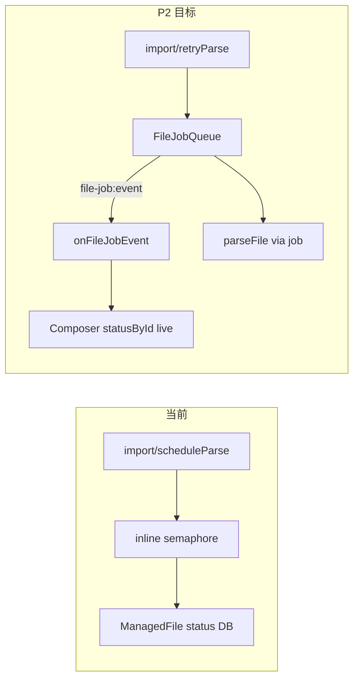

# PRD v1.1 解析队列执行计划

## 现状结论（对照 [prd/v1.1_features-with-component.md](prd/v1.1_features-with-component.md)）

| 轮次 | 内容 | 状态 |
|------|------|------|
| P0 功能闭环 | pick/drop/paste → 发送双写双读 → Preview | DONE |
| P1 后续闭环 | `buildSessionFileContext` wire 注入 + Session Files 搜索 UI | DONE |
| **P2 本轮** | **FileJobQueue + `file-job:event` + Composer 进度** | **MISSING** |
| P3 | MarkItDown / `DocumentConversionProvider` | MISSING（下轮） |
| P4 | MessageRow `streaming`、fixtures、E2E-01..07 | MISSING（下轮） |

当前解析仍是 [`file-parse-service.ts`](src/main/files/file-parse-service.ts) 内联 semaphore（concurrency=2）+ `scheduleParseAfterImport` 静默 `void parseFile()`，**无** `src/main/files/jobs/`、无 `file-job:event`、preload 无 `onFileJobEvent`。Composer [`statusById`](src/renderer/src/screens/Chat/ChatInput.tsx) 只在 ingest/retry 时快照，解析过程中不会推送 `parsing` → `parsed`/`failed`。



## 本轮范围（P2，对应 PRD §15）

目标：导入/重解析走队列；Main 广播 job 事件；Composer 卡片实时更新状态与失败。

**明确不做：** MarkItDown、Context/搜索改动、E2E、MessageRow `streaming`、改粗 PDF/Office 解析实现本身。

### P2-1：Shared job 类型 + 事件 channel

- 在 [`src/shared/files/`](src/shared/files/) 增加 `file-job.ts`（或并入 `file-ipc.ts`）：`FileJobEvent` 四态（started / progress / completed / failed）与 PRD §15.2 一致；`FileError` 复用现有类型
- channel 常量：`file-job:event`
- 扩展 `HermesFilesAPI`：`onFileJobEvent(cb): () => void`

### P2-2：Main `FileJobQueue`

按 PRD 目录创建：

```text
src/main/files/jobs/
  file-job-queue.ts
  parse-file-job.ts
  file-job-events.ts
```

约定实现：

- `FileJobQueue`：`concurrency = 2`（或读 `desktop.files.parsing.concurrency`）、`enqueue` / `cancel` / `subscribe`
- `parse-file-job.ts`：包装现有 [`parseFile`](src/main/files/file-parse-service.ts)，在 started / completed / failed（及可粗粒度 progress：`stage: "parse"|"chunk"`）时通过 `file-job-events` 广播
- [`scheduleParseAfterImport`](src/main/files/file-parse-service.ts) 改为 `queue.enqueue(parseJob)`，**去掉**独立 semaphore 双轨（队列即并发控制；`parseFile` 内 semaphore 改为可选或与 queue 统一，避免双重限流）
- [`retryParse`](src/main/files/file-service.ts) 同样入队
- 广播：`BrowserWindow.getAllWindows()` / 主窗口 `webContents.send("file-job:event", event)`（对齐现有 chat 事件风格）

### P2-3：Preload + Composer 订阅

- [`src/preload/files-api.ts`](src/preload/files-api.ts)：`onFileJobEvent` 返回 unsubscribe（对标 `onChatChunk` 等）
- Renderer：在 [`ChatInput.tsx`](src/renderer/src/screens/Chat/ChatInput.tsx)（或小 hook `useFileJobEvents`）订阅事件，更新 `statusById`：
  - started → `parsing`
  - completed → `parsed`
  - failed → `failed`（可顺带展示 error message，若 tray 已有入口）
- 进度：若 `ComposerAttachmentCard` 已有 status 展示则复用；本轮不强制新进度条 UI，至少状态文案/badge 随事件变化

### P2 验收

- 选 PDF/大文本 → 卡片出现 `parsing` → 完成后 `parsed`（无需手动 refresh）
- `retryParse` 同样推送事件
- 并发 ≥3 个解析时队列限流为 2
- cancel（若暴露）不崩溃；本轮可不做 Composer 取消按钮，但 queue API 具备 `cancel`
- `typecheck` / `test`（queue + event 单测）/ `build` / `lat check` 全绿
- 更新 [`lat.md/file-platform.md`](lat.md/file-platform.md) 记录 JobQueue；`src` 无 `references/chatbox`

## 后续轮次（非本轮）

| 轮次 | 内容 | PRD |
|------|------|-----|
| P3 | `DocumentConversionProvider` / `LocalMarkItDownProvider`；替换粗 office/pdf | §14.3 |
| P4 | MessageRow 传 `streaming`；fixtures；E2E-01..07 | §10 / §25 / §26 |

## 约束

- 不 import `references/chatbox`；Renderer 无 `fs`/`path`
- 解析仍在 Main；事件只推送脱敏字段（fileId/jobId/stage/error），不推绝对路径
- 不破坏现有 `parseFile` 缓存命中与 chunk 持久化
- 垂直切片：实现 → 接入 Composer → 测试 → `lat.md` → `lat check`
