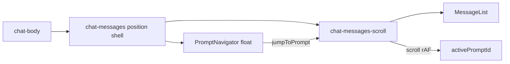

# Chat Prompt Navigator (PRD v1.4)

## Scope

Ship the v1 positioning loop only (PRD §2–§16, §20). Skip P1 extras (search, Alt+Shift shortcuts, copy/refill, branch, tool/file badges).

Renderer-only: no Main/Preload/IPC/shared contract changes.

## Architecture



Navigator is a sibling of the scroll area inside `.chat-messages`, not a flex child of `.chat-body`. File Preview maximize already hides `.chat-messages`, so the navigator disappears with it.

## Concrete adaptations from PRD text

- localStorage key: `hermes:chat:prompt-navigator-open` (match [`useChatPanelLayout.ts`](src/renderer/src/screens/Chat/useChatPanelLayout.ts) `hermes:chat:…` pattern; PRD’s `copilot:` prefix is outdated).
- Keep existing row classes (`chat-message` / `chat-message-user`); add `id`, `data-user-prompt-anchor`, and highlight class on the existing MessageRow root — do not rename to `message-row`.
- Scroll styles move to `.chat-messages-scroll`, which **must stay block flow** (not flex column) per [`lat.md/chat-performance.md`](lat.md/chat-performance.md) / `#748`.

## Implementation steps

### 1. New `prompt-navigator/` module

Under [`src/renderer/src/screens/Chat/prompt-navigator/`](src/renderer/src/screens/Chat/prompt-navigator/):

| File | Role |
|------|------|
| `promptNavigatorUtils.ts` | `PromptNavigationItem`, `isUserBubble`, `normalizePromptLabel`, `truncateLabel`, `buildPromptNavigationItems`, `getPromptAnchorId(runId, messageId)` |
| `usePromptNavigator.ts` | `findActivePrompt` (viewport top + 96px), rAF-throttled scroll/ResizeObserver **only when `active`**, `jumpToPrompt` + highlight timer cleanup |
| `PromptNavigator.tsx` | Hide if `< 2` items; closed trigger with count; open aside list; compact class; auto-scroll active nav item into view |
| `PromptNavigatorItem.tsx` | Single list button (`data-prompt-nav-id`, `aria-current`) |
| `prompt-navigator.css` | Floating panel / trigger / compact styles from PRD §12 |

Item filter (PRD §3/§5): `role === "user"` bubble (`!kind || kind === "user"`), non-empty normalized content **or** attachments. Exclude assistant / reasoning / tool / clarify / loaders.

### 2. Extend scroll + message anchors

[`hooks/useChatScroll.ts`](src/renderer/src/screens/Chat/hooks/useChatScroll.ts):

- Return `pauseAutoScroll`, `resumeAutoScroll`, `scrollToNode`.
- `scrollToNode` sets `userScrolledUpRef.current = true` then `scrollIntoView({ behavior: "smooth", block: "start" })`.
- Keep “new user message → force bottom” behavior.

[`MessageList.tsx`](src/renderer/src/screens/Chat/MessageList.tsx): accept `runId`; pass `anchorId={getPromptAnchorId(runId, id)}` for user bubbles only.

[`MessageRow.tsx`](src/renderer/src/screens/Chat/MessageRow.tsx): optional `anchorId`; set `id={anchorId}`, `data-user-prompt-anchor={msg.id}` for user rows; `scroll-margin-top: 18px` + jump highlight animation on `.chat-bubble`.

### 3. Wire `Chat.tsx` + CSS

[`Chat.tsx`](src/renderer/src/screens/Chat/Chat.tsx):

```tsx
<div className="chat-messages" ref={chatMessagesRef}>
  <div className="chat-messages-scroll" ref={containerRef}>
    {/* empty state | MessageList + runId */}
    <div ref={bottomRef} />
  </div>
  <PromptNavigator ... />
</div>
```

- `useMemo(() => buildPromptNavigationItems(messages), [messages])`
- Persist open state; `ResizeObserver` on shell → `compact` when width `< 900` (do not force-close open panel)
- `usePromptNavigator({ runId, active, containerRef, items, scrollToNode })`

CSS:

- [`main.css`](src/renderer/src/assets/main.css): move `overflow-y` / padding from `.chat-messages` → `.chat-messages-scroll`; outer shell `position: relative; overflow: hidden; flex: 1; min-height: 0`
- [`chat-layout.css`](src/renderer/src/screens/Chat/chat-layout.css): keep shell positioning; ensure maximize rules still hide `.chat-messages` (navigator included)
- Import `prompt-navigator.css` from Chat or main stylesheet entry

### 4. i18n

Add keys under `chat.*` in all locale `chat.ts` files (en source of truth; others can mirror EN initially if no translation yet), e.g.:

- `promptNavigator.title` / `show` / `hide` / `attachmentFallback` / `emptyFallback`

Use via `useI18n()` in `PromptNavigator` (PRD hardcodes English).

### 5. Tests (PRD §19)

- `promptNavigatorUtils.test.ts` — filter, markdown clean, truncate, sequence, attachments
- `PromptNavigator.test.tsx` — `<2` hidden, open/close, `aria-current`, `onSelect`
- `usePromptNavigator.test.ts` — jump pauses auto-scroll, active-line selection, inactive Chat skips listeners
- Light Chat integration where practical (second prompt shows navigator; streaming jump does not yank to bottom) — extend patterns from [`Chat.layout.test.tsx`](src/renderer/src/screens/Chat/Chat.layout.test.tsx)

### 6. lat.md

- Update [`lat.md/chat-performance.md`](lat.md/chat-performance.md): scroll container is now `.chat-messages-scroll` (still block flow).
- Add `lat.md/prompt-navigator.md` (or a section under a chat UI doc): floating outline inside chat-messages, runId-scoped anchors, active-line rule, independence from Session Files.
- Add `// @lat:` on key utils/hook/tests; run `npx lat check`.

## Out of scope

- P1 enhancements (§17)
- Main/preload/agent/SQLite
- Making navigator a chat-body column
- Changing Session Files / File Preview APIs
