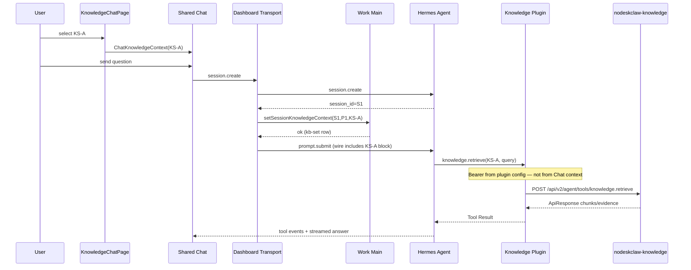
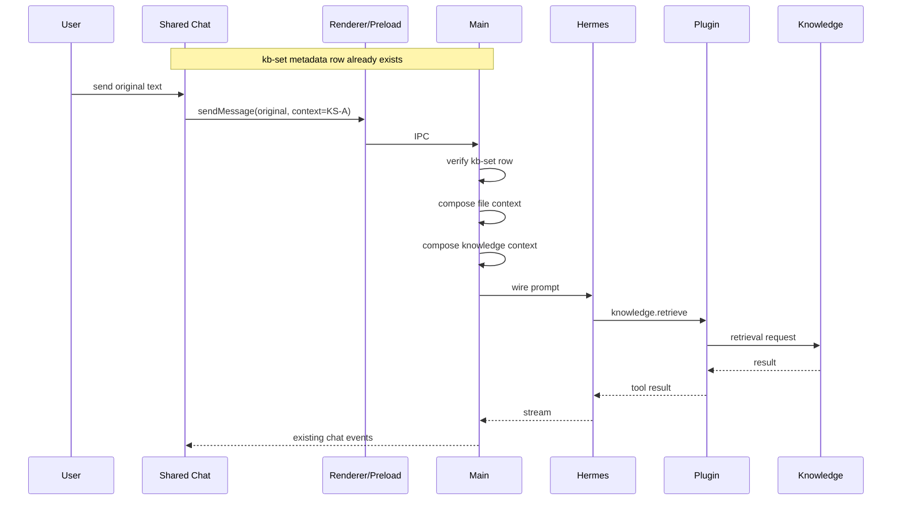

# 0. Document Meta / 规范约束

本 PRD 按《需求PRD工程模板.md》工程级规范编写，作为 `Requirement → Code → Test → Evidence` 的实施合同。

规范词义：

- `MUST`：必须实现、必须测试、必须有 Evidence。
- `MUST NOT`：违反即 Requirement FAIL。
- `SHOULD`：默认满足；偏离必须留下评审记录。
- `MAY`：可选，不进入本版本 Required Release Gate。

本 PRD 的基础代码版本固定为：

```text
smc-copilot
repo:   https://github.com/loudon84/smc-copilot
branch: work/prd-v6.0
HEAD:   17075827eb5d28ced054c03c9e53160a849ff44b

nodeskclaw
repo:   https://github.com/loudon84/nodeskclaw
branch: feat/knowledge-v2.0
HEAD:   1d29fac6383ce64e0d82dfe4d445b4fd549a14ec

Hermes Agent:
version: v0.21

Hermes Knowledge Tool:
name: knowledge.retrieve
endpoint behind plugin:
POST /api/v2/agent/tools/knowledge.retrieve
```

本 PRD 只定义 Work 侧 `KnowledgeChatPage + Shared Chat + KnowledgeSet Connector` 集成；`hermes-plugin-nodeskclaw-knowledge` 已作为外部运行依赖，不在本 PRD 中重新实现。

---

# 0.1 Grilling Amendment Lock (v1.1.0 / v1.1.1)

本节覆盖并修正下文中与之冲突的旧表述（尤其独立 `desktop_session_knowledge_context` 表、首 turn 后写 binding、普通 Chat 可打开已绑定会话）。冲突时以本节为准。

## Locked product decisions

```text
G1  Session classification
    Extend desktop_session_metadata (same profile state DB as chat | skill-run):
      session_kind = kb-set
      execution_provider = hermes-chat
      knowledge_set_id NOT NULL when kind = kb-set
    MUST NOT create a second desktop_session_knowledge_context table.
    Hermes sessions.source remains api_server (gateway provenance, not product kind).

G2  List / search membership
    Ordinary Sessions list MUST NOT include session_kind=kb-set.
    Sessions search MUST NOT return session_kind=kb-set.
    Skill-run lists MUST NOT include kb-set.
    Knowledge page lists only current Layout active profile's kb-set rows.
    KnowledgeSet display name comes from sets.get(); MUST NOT persist name as SOT.

G3  Realtime mount ownership
    Only KnowledgeChatPage may mount/subscribe a kb-set Hermes session.
    Ordinary Layout Chat resume/search/run mount MUST reject kb-set session ids.
    Knowledge page mounts at most one Chat at a time (current selection only).
    Navigating away within Work keeps that single connection for the active turn;
    switching to another kb-set session releases the previous subscription and resumes on return.

G4  First-create write order (Dashboard preferred; Local Legacy allowed)
    When Dashboard Transport is used (typically remote/SSH):
      session.create → Main sync-write kb-set metadata row → prompt.submit
      Write success is required before prompt.submit.
      Write failure: MUST NOT send; MUST delete the still-empty Hermes session.
    When Local mode has no Work-owned Dashboard (managed-local / attach unavailable):
      Legacy first create is ALLOWED:
        compose Knowledge wire → Legacy sendMessage → on session_id
        → Main sync-write kb-set (prefer onSessionStarted, before ensureChat demote)
      ChatKnowledgeContext still carries set id only (no token).
      If kb-set write fails after the Hermes turn started, surface
        KNOWLEDGE_BINDING_PERSIST_FAILED; do not leave the session listed as
        ordinary chat when metadata can still be repaired.
    Empty chat (message_count=0) MAY upgrade to kb-set once.
    Subsequent turns on an existing kb-set row MAY use Dashboard or Legacy
    with the same Knowledge wire semantics.

G5  Profile switch
    Knowledge page follows Layout activeProfile.
    Switching profile: abort in-flight Knowledge turn, release connection,
    unload current Knowledge Chat, show only the new profile's kb-set list.
    "New knowledge chat" uses the new active profile.
    MUST NOT rewrite an existing kb-set row's profile_id.

G6  Delete cleanup
    Deleting a Hermes session MUST delete all desktop_session_metadata rows
    matching that session_id (any profile_id). MUST NOT key delete solely on
    the currently active profile.

G7  Bound set unavailable
    If bound KnowledgeSet is deleted/disabled, or provider/auth fails while open:
      binding row unchanged; transcript remains read-only; Send disabled;
      only exit is "New knowledge chat" (new Hermes session + new active set).
    F-UI-103 "clear selection" applies only before session_id exists.

G8  Agent success bar (v1)
    Work MUST ensure every normal Knowledge turn wire-injects the correct
    knowledge_set_id block. Release Gate requires Golden Consumer to observe
    at least one knowledge.retrieve whose knowledge_set_id equals the bound id.
    Work MUST NOT claim per-turn forced tool invocation or plugin-enforced
    argument override (still NON-GOAL-004 / SEC-004).

G9  Portal token MUST NOT bind to KnowledgeSet selection
    Selecting or binding knowledge_set_id MUST NOT persist, wire, or forward
    Portal login JWT into ChatKnowledgeContext, kb-set metadata, or Renderer.
    Work Knowledge Provider continues to use Main token-store for sets.list/get.
    Plugin Retrieval Bearer is a separate credential-supply path (G9a):
      Work Main reads Portal login token-store (ensureFreshAccessToken) and
      syncs SMC_KB_API_URL + SMC_KB_API_TOKEN into Hermes Home for the
      hermes-plugin-nodeskclaw-knowledge process — NOT via Chat wire / set UI.

G9a Plugin credential supply (Portal login store → Hermes plugin)
    SMC_KB_API_TOKEN MUST be sourced from Work Main Portal/desktop auth
    token-store (refreshed), not from hand-edited operator .env as SOT.
    Main MAY write the synced values into Hermes `.env` / plugin config so
    the existing plugin contract (env/config.url|token) keeps working.
    MUST NOT put the token into ChatKnowledgeContextV1 or kb-set rows.
```

## Superseded prior assumptions

```text
- Ordinary Chat opening a bound Knowledge session and still injecting scope
- Independent desktop_session_knowledge_context table
- Persist binding only after first turn completes / may leave orphan Hermes session
- First Knowledge create Dashboard-only with no Local Legacy path
- Multiple simultaneous Knowledge Chat mounts
- Sessions search/list surfacing kb-set as ordinary chat
- Operator-maintained SMC_KB_API_TOKEN in .env as the long-term SOT
```

---

# 1. Goal

## 1.1 一句话目标

让 Work Knowledge 用户在已登录、Local Hermes v0.21 与 `knowledge.retrieve` 插件可用的前置条件下，通过 `KnowledgeChatPage` 复用 Work 原生 Chat 运行时选择并绑定一个 `KnowledgeSet`，使每个正常知识问答请求沿 `Work Chat → Hermes → knowledge.retrieve → nodeskclaw-knowledge RetrievalService → RAGFlow` 执行，同时保证 Work 不复制第二套 Chat Session、Message、Streaming、Tool Event、Citation 或 Retrieval 逻辑。

## 1.2 Observable Result

实现后必须可观察到：

```text
KnowledgeChatPage
  ↓
Shared Work Chat
  + KnowledgeSet Connector
  ↓
Hermes sendMessage / Dashboard prompt.submit
  ↓
Hermes Agent v0.21
  ↓
knowledge.retrieve
  ↓
hermes-plugin-nodeskclaw-knowledge
  ↓
nodeskclaw-knowledge Agent Tool API
  ↓
RetrievalService
  ↓
KnowledgeSet → N KnowledgeBase → RAGFlow
  ↓
Tool Result
  ↓
Hermes answer
  ↓
Existing Work MessageList / Tool Event / Reasoning / Streaming
```

并且：

```text
KnowledgeChatPage MUST NOT maintain:
- 独立 message thread state
- 独立 assistant generation
- 独立 citation state
- 独立 knowledge chat session backend
- 独立 SSE transport
- 直接 RetrievalService HTTP 调用
```

---

# 2. Background

## 2.1 Current State

### 2.1.1 Work Chat 已具备完整 Agent Runtime UI

当前 `apps/work/src/renderer/src/screens/Chat/Chat.tsx` 已具备：

- Hermes Session 管理；
- Dashboard Chat Transport；
- Legacy `window.hermesAPI.sendMessage` Transport；
- Streaming assistant content；
- Reasoning；
- Tool Progress / Tool Event；
- Clarify；
- Attachments；
- File Platform；
- Session files；
- Model / Reasoning / Fast Mode / Folder 等 Chat Toolbar Controls；
- Session resume；
- Hermes `state.db` transcript reconciliation。

`useChatActions.ts` 已将正常用户发送收敛到 `sendToAgent()`，优先 Dashboard，必要时回落 Legacy Transport。

### 2.1.2 ChatInput 已有可扩展 Toolbar

`ChatInput.tsx` 已有 `toolbarExtras` 插槽，现有 Chat 在输入区底部放置：

```text
ModelPicker
ReasoningEffortPicker
Fast Mode
ContextFolderChip
Web Preview
```

因此 KnowledgeSet 适合成为同一 Chat Runtime 下的 Context Connector，而非独立 Composer。

### 2.1.3 Work 已有真实 KnowledgeSet Provider

当前：

```text
window.hermesAPI.knowledgeJobs.sets.list()
window.hermesAPI.knowledgeJobs.sets.get()
```

已经通过 Renderer → Preload → Main → `KnowledgeHttpProvider` → nodeskclaw-knowledge 工作。

`KnowledgeSetSnapshot` 已包含：

```text
id
name
description
status
visibility
usageCount
lastUsedAt
knowledgeBases[]
```

### 2.1.4 当前 KnowledgeChatPage 仍是 synthetic/mock 逻辑

当前 `KnowledgeChatPage.tsx`：

- 只在 `dataMode === "mock"` 时走 session/set facade；
- 自己维护 `LocalMessage[]`；
- `assistant.text = userMessage.text`，属于 Echo；
- citation 通过 synthetic `mutateEntity()` 创建；
- 不调用 Local Hermes；
- 不调用 `knowledge.retrieve`；
- 不复用 Work Chat。

本 PRD 决定移除该 Chat 页面上的 synthetic/mock execution path。

### 2.1.5 Hermes Knowledge Plugin 已完成独立建设

既有插件合同：

```text
Tool: knowledge.retrieve

Tool args:
- knowledge_set_id
- query
- top_k

HTTP:
POST {origin}/api/v2/agent/tools/knowledge.retrieve

Auth:
Authorization: Bearer <backend user JWT>

Response:
nodeskclaw-knowledge ApiResponse body passthrough
```

插件不负责 Work UI、不创建 Knowledge Chat Session、不改 RetrievalService 语义。

## 2.2 Problem

当前同一产品存在两套 Chat 方向：

```text
A. Work Chat → Hermes
B. KnowledgeChatPage → synthetic mock facade
```

若继续给 B 增加真实 API、SSE、Message、Citation、Session，将造成：

1. Chat Runtime Owner 重叠；
2. Hermes transport 升级需要双实现；
3. Reasoning / Tool Event / Clarify / File / Attachment 能力不一致；
4. Knowledge Chat 与普通 Chat 会形成两套 Session SOT；
5. Agent Tool 调用无法自然复用 Hermes；
6. 前端绕过 Agent 直接调用 RetrievalService 会破坏既定 Agent 架构。

## 2.3 Impact

```text
业务影响：
KnowledgeSet 无法在真实 Agent 会话中验证。

工程影响：
KnowledgeChatPage 如果继续独立扩展，会复制 Work Chat 核心能力。

安全影响：
绕过 Hermes/Plugin 直接访问 Retrieval，会形成新的认证与权限链。

运维影响：
需要同时诊断 Work Chat、Knowledge Chat 两套 Transport。

AI Coding 影响：
Owner、State、Side Effect 边界不唯一，Plan Agent 容易生成重复实现。
```

---

# 3. Scope / Non-goal

## 3.1 In Scope

### SCOPE-001
将 `KnowledgeChatPage.tsx` 从 synthetic chat 改为 Work 原 `Chat` 的 Knowledge 场景宿主。

### SCOPE-002
新增可复用 `KnowledgeConnector`，用于列出、选择、展示当前 `KnowledgeSet`。

### SCOPE-003
为 Shared Chat 增加 `ChatKnowledgeContext` 输入，不新建第二套 Chat Runtime。

### SCOPE-004
正常 Knowledge Chat Prompt 必须在 Agent wire request 中携带选定 `knowledge_set_id` 的 Knowledge Scope 指令。

### SCOPE-005
已存在 `kb-set` 行的后续回合：Dashboard Transport 与 Legacy Transport 必须使用相同 Knowledge Scope 语义。本地无 Dashboard 时首次创建允许 Legacy（见 SCOPE-012 / G4）。

### SCOPE-006
将 Knowledge Session 持久分类写入既有 `desktop_session_metadata`：
`session_kind=kb-set` + `execution_provider=hermes-chat` + `knowledge_set_id`（与 `profile_id` / `session_id` 同行）。MUST NOT 新建第二张 binding 表。

### SCOPE-007
恢复 Knowledge Chat Session 时必须从 `desktop_session_metadata` 的 `kb-set` 行恢复 KnowledgeSet 与 profile；不得通过模型历史猜测。

### SCOPE-008
一个已创建 Hermes Session 必须绑定且仅绑定一个 KnowledgeSet；`kb-set` 行创建后 kind / knowledge_set_id / profile_id 不可改绑。

### SCOPE-009
删除 `KnowledgeChatPage` 对 `dataMode === "mock"`、synthetic message、synthetic citation 的依赖。

### SCOPE-010
保持 nodeskclaw-knowledge RetrievalService、KnowledgeSet、多 KB Retrieval、RAGFlow 语义不变。

### SCOPE-011
普通 Sessions 列表、Sessions 搜索、skill-run 列表 MUST NOT 包含 `session_kind=kb-set`；仅 Knowledge 页列出当前 active profile 的 `kb-set`。

### SCOPE-012
Dashboard 可用时 `kb-set` 首次创建 MUST：`session.create` → Main 同步写入 metadata → `prompt.submit`。
Local managed（无 Work-owned Dashboard）时允许 Legacy 首次创建：wire 注入 → sendMessage → session_id → Main 写入 kb-set（G4）。

### SCOPE-013
仅 `KnowledgeChatPage` 可挂载/订阅 `kb-set` session；普通 Layout Chat MUST 拒绝挂载。知识页同时最多一个 Chat 实例。

### SCOPE-014
Portal / Work login token MUST NOT 因选择或绑定 `knowledge_set_id` 而写入 Chat context、metadata、wire prompt 或 Renderer。
Plugin Retrieval Bearer 由 Main 从 Portal login token-store 同步到 Hermes plugin 凭据（G9a），与 set 选择解耦。

## 3.2 Out of Scope

### NON-GOAL-001
本版本 MUST NOT 在 Work Renderer 直接调用：

```text
/api/v2/agent/tools/knowledge.retrieve
RetrievalService
RAGFlow Retrieval API
```

### NON-GOAL-002
本版本 MUST NOT 新建：

```text
KnowledgeChatSession backend
KnowledgeChatMessage backend
Knowledge-specific SSE protocol
Knowledge-specific LLM answer service
desktop_session_knowledge_context (second binding table)
```

### NON-GOAL-003
本版本 MUST NOT 在 `KnowledgeChatPage` 单独维护 citation 列表。知识证据首先通过 Hermes Tool Result / Agent Answer 使用；专用 Evidence UI 另行立项。

### NON-GOAL-004
本版本 MUST NOT 改造 `hermes-plugin-nodeskclaw-knowledge` 的 Tool Schema、鉴权和 HTTP Contract。

### NON-GOAL-005
本版本 MUST NOT 修改 nodeskclaw-knowledge RetrievalService 的检索算法、Rerank、Merge、ACL、Evidence 语义。

### NON-GOAL-006
本版本 MUST NOT 将 KnowledgeSet 作为新的授权边界；最终数据授权仍由 nodeskclaw-knowledge Principal/ACL 判定。

### NON-GOAL-007
本版本 MUST NOT 自动把历史普通 Hermes Session（`session_kind=chat`）转换成 `kb-set`（空 session `message_count=0` 的一次性升级除外，见 G4）。

### NON-GOAL-008
本版本 MUST NOT 默认在普通 `Layout → Chat` 页面显示 Knowledge Connector；组件必须可复用，但 v1 的产品入口只在 `KnowledgeChatPage` 启用 `required` 模式。

### NON-GOAL-009
本版本 MUST NOT 在选择 `knowledge_set_id` 时绑定、转发或持久化 Portal login JWT；Work→Hermes plugin 凭据供给若需与 Portal 用户对齐，另行立项。

### NON-GOAL-010
本版本 MUST NOT 要求模型每一轮都成功调用 `knowledge.retrieve`；v1 强制保证的是 wire scope 注入与 Golden Consumer 至少一次正确 tool 观察（G8）。

---

# 4. Architecture Boundary

## 4.1 Architecture Decision

采用：

> **One Chat Runtime + Context Connector + Agent Tool**

禁止：

> **Work Chat + Knowledge Chat 两套 Runtime**

## 4.2 Target Architecture

```text
┌──────────────────────────────────────────────────────────────┐
│ SMC-Copilot Work                                             │
│                                                              │
│ KnowledgeView                                                │
│   ↓                                                          │
│ KnowledgePages                                               │
│   ↓                                                          │
│ KnowledgeChatPage                                            │
│   │                                                          │
│   ├─ Knowledge scope state                                  │
│   ├─ KnowledgeConnector                                     │
│   └─ Shared Chat                                             │
│        │                                                     │
│        ├─ existing MessageList                              │
│        ├─ existing ChatInput                                │
│        ├─ existing Reasoning                                │
│        ├─ existing Tool Event                               │
│        ├─ existing Attachments                              │
│        └─ existing Session runtime                          │
│              │                                               │
│              ├─ Dashboard Transport                         │
│              └─ Legacy Transport                            │
└──────────────┼───────────────────────────────────────────────┘
               │
               ▼
        Local Hermes Agent v0.21
               │
               ▼
        knowledge.retrieve
               │
               ▼
 hermes-plugin-nodeskclaw-knowledge
               │
               ▼
 nodeskclaw-knowledge
 Agent Tool API
               │
               ▼
 RetrievalService
               │
               ▼
 KnowledgeSet
   ├─ KnowledgeBase A → RAGFlow Dataset A
   ├─ KnowledgeBase B → RAGFlow Dataset B
   └─ KnowledgeBase C → RAGFlow Dataset C
```

## 4.3 Domain Ownership

| Domain | Owner | Input | Output | 不负责 |
|---|---|---|---|---|
| Knowledge selection | KnowledgeChatPage / Connector | user selection | `knowledge_set_id` | Retrieval |
| Chat transcript/runtime | Work Shared Chat | user message | streamed transcript | Knowledge storage |
| Hermes session | Hermes Agent | prompt/tool calls | session/state | KB management |
| Knowledge tool adapter | Hermes plugin | set id + query | ApiResponse Tool Result | Retrieval algorithm |
| Knowledge retrieval | nodeskclaw-knowledge | Principal + set id + query | chunks/evidence | Work UI |
| Vector retrieval | RAGFlow | dataset/document query | raw chunks | Work/Hermes session |
| Authorization | nodeskclaw-knowledge | user JWT + resource | allow/deny | Chat rendering |

## 4.4 Planned File Boundary

### New

```text
apps/work/src/shared/knowledge/chat-knowledge-context.ts
apps/work/src/renderer/src/screens/Chat/knowledge/KnowledgeConnector.tsx
apps/work/src/renderer/src/screens/Chat/knowledge/KnowledgeConnector.test.tsx
apps/work/src/renderer/src/screens/Knowledge/features/chat/useKnowledgeChatScope.ts
apps/work/src/renderer/src/screens/Knowledge/features/chat/useKnowledgeChatScope.test.tsx
```

### Modify

```text
apps/work/src/main/session-metadata-store.ts
apps/work/src/main/session-metadata-store.test.ts
apps/work/src/main/session-cache.ts
apps/work/src/main/sessions.ts
apps/work/src/main/chat-session-materialize.ts
apps/work/src/renderer/src/screens/Layout/chatRuns.ts

apps/work/src/renderer/src/screens/Knowledge/pages/KnowledgeChatPage.tsx
apps/work/src/renderer/src/screens/Knowledge/KnowledgePages.tsx
apps/work/src/renderer/src/screens/Knowledge/KnowledgeView.tsx
apps/work/src/renderer/src/screens/Layout/Layout.tsx

apps/work/src/renderer/src/screens/Chat/Chat.tsx
apps/work/src/renderer/src/screens/Chat/hooks/useChatActions.ts
apps/work/src/renderer/src/screens/Chat/hooks/useDashboardChatTransport.ts

apps/work/src/preload/index.ts
apps/work/src/preload/index.d.ts
apps/work/src/main/ipc/register.ts
```

允许 Plan 在不改变本 PRD Owner/Contract 的前提下调整测试文件拆分；业务 Owner 不得迁移。

`session-metadata-store` MUST 扩展既有 `chat | work` 分类以支持 `kb-set`（含 schema migration；`CREATE TABLE IF NOT EXISTS` 不足以改写既有 CHECK）。MUST NOT 新增 `session-knowledge-context-store.ts`。

---

# 5. Terminology

## 5.1 KnowledgeBase

Work `KnowledgeBase` 与一个可检索知识库对应；当前底层最终映射到 RAGFlow Dataset。

## 5.2 KnowledgeSet

由一个或多个 KnowledgeBase 构成的逻辑知识集合，是本 PRD 的 Chat Retrieval Scope。

## 5.3 Knowledge Connector

Work Chat 输入栏中的 KnowledgeSet 选择与状态展示控件。它只管理选择，不执行 Retrieval。

## 5.4 ChatKnowledgeContext

Work Chat 每个 Knowledge Turn 的应用侧上下文：

```text
version
knowledgeSetId
```

不包含 JWT，不包含 Retrieval Result。

## 5.5 Knowledge Session Binding (`kb-set`)

Desktop 本地持久分类，落在既有 `desktop_session_metadata`：

```text
session_scope + profile_id + session_id
→ session_kind = kb-set
→ execution_provider = hermes-chat
→ knowledge_set_id
```

与普通 Chat（`chat` / `hermes-chat`）及 skill-run（`work` / `skill-run`）并列。一经创建：

- MUST NOT 在原 `session_id` 上改绑其他 KnowledgeSet；
- MUST NOT 改写 `profile_id` 或降级为 `chat`；
- MUST NOT 存储 JWT / token / KnowledgeSet name。

## 5.6 Display Message

用户在 Work UI 输入和历史中看到的原始文本。

## 5.7 Wire Message

真正发送给 Hermes Agent 的 Prompt。允许附加：

- File Context；
- Knowledge Context；

但 MUST NOT 改写用户 UI bubble 的原始文本。
MUST NOT 在 Wire Message 中放入 JWT / access token。

## 5.8 Synthetic Chat

当前 KnowledgeChatPage 基于 mock facade 创建 LocalMessage / Citation 的实现。本版本删除其 Product Path。

---

# 6. Authoritative State / Source of Truth

| State | Role | Type | Authoritative | Writer | Reader | Auto Override |
|---|---|---|---:|---|---|---:|
| KnowledgeSet catalog | 可选择集合 | OBSERVED_STATE | YES | nodeskclaw-knowledge | Work Provider | NO |
| selected set before session | 首次发送前选择 | RUNTIME_STATE | YES, until session created | KnowledgeChat scope | Chat/Connector | YES by user |
| kb-set metadata row | 已创建会话的 kind/set/profile | LAST_APPLIED_STATE | YES | Work Main | KnowledgeChat scope / list filters | NO |
| Hermes transcript | 对话事实 | RUNTIME/OBSERVED | YES | Hermes | Work Chat | NO |
| Work visible chat state | 流式投影 | RESOLVED_STATE | NO | Shared Chat | Renderer | YES from Hermes events |
| Knowledge retrieval result | Tool Result | OBSERVED_STATE | YES for that tool call | nodeskclaw-knowledge | Hermes | NO |
| Retrieval ACL | 访问决策 | RESOLVED_STATE | YES | nodeskclaw-knowledge | Plugin/Hermes | NO |
| Work login auth | Set API 身份 | RUNTIME_STATE | YES | Auth subsystem | Knowledge Provider | NO |
| Plugin API token | Retrieval API 身份 | external config | YES for plugin | Hermes env/config | Plugin | NO |

## 6.1 SOT Rules

1. 已有 `session_id` 且存在 `kb-set` 行时，该行 MUST 优先于 route `knowledgeSetId`。
2. route `knowledgeSetId` 只在新 Session 尚未建立时是初始选择输入。
3. 已绑定 Session 与 route set 不一致时 MUST 返回 scope conflict，不得覆盖 metadata。
4. KnowledgeSet name MUST 从 Provider `sets.get()` 读取，不持久化为事实源。
5. Agent 输出不得反向改写 KnowledgeSet selection。
6. `ensureChatSessionMetadata` / sync backfill MUST NOT 把已有 `kb-set` 行改成 `chat`。缺分类的 Hermes session 仍可按既有规则补成 `chat`，但 G4 空 session 升级路径除外。
7. Portal token 与 `knowledge_set_id` 选择无绑定关系（G9）。

---

# 7. State Machine

## 7.1 Knowledge Chat Scope State

```text
UNBOUND
  │ select active KnowledgeSet
  ▼
READY
  │ send first normal user message (Dashboard available)
  ▼
STARTING_SESSION
  │ session.create returns session_id
  ▼
PERSISTING_KB_SET
  │ Main upsert kb-set metadata success
  ▼
BOUND
  │ prompt.submit + normal turns
  ▼
ACTIVE

BOUND / ACTIVE
  │ user wants another set
  ├─ MUST NOT mutate existing kb-set row
  └─ new Knowledge Chat
        ↓
      UNBOUND / READY

BOUND / ACTIVE / READY
  │ Layout activeProfile changes
  ├─ abort in-flight turn
  ├─ unload current Knowledge Chat
  └─ list filtered to new profile → UNBOUND (for previous session)
```

## 7.2 Resume State

```text
route has sessionId
  ↓
read desktop_session_metadata for session_id
  ├─ session_kind=kb-set + profile matches activeProfile
  │     → load knowledge_set_id → sets.get validate → BOUND or BLOCKED (read-only)
  ├─ session_kind=kb-set + profile mismatch
  │     → treat as not listed / MUST NOT mount under wrong profile
  └─ absent or not kb-set → RESUME_BLOCKED
```

`RESUME_BLOCKED` MUST NOT silently bind route-provided set to an ordinary `chat` session。

## 7.3 Legal Transitions

| Before | Event | After |
|---|---|---|
| UNBOUND | select active set | READY |
| READY | change set before first session | READY |
| READY | first send + Dashboard create | STARTING_SESSION |
| STARTING_SESSION | session.create returns id | PERSISTING_KB_SET |
| PERSISTING_KB_SET | metadata write success | BOUND |
| PERSISTING_KB_SET | metadata write failure | UNBOUND/READY after empty session deleted; send aborted |
| BOUND | prompt.submit / next user turn | ACTIVE |
| ACTIVE | next user turn | ACTIVE |
| BOUND/ACTIVE | new knowledge chat | UNBOUND |
| BOUND/ACTIVE | Layout profile switch | unload; previous session not mounted |
| any pre-bound | provider/set unavailable | BLOCKED (transcript read-only; Send disabled) |

## 7.4 Illegal Transitions

```text
BOUND(KS-A) → BOUND(KS-B) on same session_id
ACTIVE(KS-A) → ACTIVE(KS-B) on same session_id
ordinary historical session without kb-set → auto-adopt KS-X
disabled KnowledgeSet → READY (for new selection)
kb-set session → mount in ordinary Layout Chat
first create via Legacy when Dashboard path was chosen and session already created empty (must not dual-path)
kb-set row → rewrite profile_id on profile switch
```

均必须被拒绝。Local managed 无 Dashboard 时的 Legacy 首创（G4）是合法路径，不在上表。

---

# 8. Data / Schema Contract

## 8.1 `ChatKnowledgeContextV1`

Schema ID:

```text
work.chat.knowledge-context/1.0
```

TypeScript contract:

```ts
export interface ChatKnowledgeContextV1 {
  version: "1.0";
  knowledgeSetId: string;
}
```

### Field Semantics

| Field | Type | Required | Default | Authority | Meaning |
|---|---|---:|---|---|---|
| version | `"1.0"` | YES | none | Work | wire schema version |
| knowledgeSetId | string | YES | none | nodeskclaw ID | selected KnowledgeSet canonical id |

Rules:

```text
additionalProperties = false
knowledgeSetId.trim().length > 0
```

`knowledgeSetName` MUST NOT 进入 Wire Contract；名称仅用于 UI。

## 8.2 Session Classification (`desktop_session_metadata` + `kb-set`)

扩展既有表（须 migration，不能只靠 `CREATE TABLE IF NOT EXISTS`）：

```sql
-- Conceptual target after migration (exact DDL may use ALTER / rebuild):
-- session_kind IN ('chat', 'work', 'kb-set')
-- execution_provider IN ('hermes-chat', 'skill-run')
-- CHECK pairs:
--   chat    + hermes-chat
--   work    + skill-run
--   kb-set  + hermes-chat
-- knowledge_set_id TEXT NULL
--   CHECK ( (session_kind = 'kb-set' AND knowledge_set_id IS NOT NULL AND trim(knowledge_set_id) <> '')
--        OR (session_kind <> 'kb-set' AND knowledge_set_id IS NULL) )
```

Contract:

- `session_id`：Hermes canonical session id；
- `profile_id`：创建该 Session 的 Hermes profile；
- `knowledge_set_id`：仅 `kb-set` 行非空；该 Session 唯一 KnowledgeSet；
- same `(session_scope, profile_id, session_id)` + same classification + same `knowledge_set_id` 重复写入必须幂等；
- same `session_id` + different `knowledge_set_id` / different kind / different profile → 0 mutation + conflict error；
- MUST NOT store JWT / token / set name on this row；
- delete Hermes session → delete **all** metadata rows for that `session_id` (any profile)。

空 `chat` 升级（仅 G4）：

```text
existing row: session_kind=chat, message_count==0, no user turns
requested: kb-set + knowledge_set_id
→ MAY upgrade once to kb-set
else → conflict
```

## 8.3 Wire Prompt Contract

纯函数：

```ts
composeKnowledgeScopedPrompt(
  userOrPreparedPrompt: string,
  context: ChatKnowledgeContextV1 | null,
): string
```

`context == null`：

```text
output === input
```

有 Context 时：

```text
<smc_knowledge_context>
{"version":"1.0","knowledge_set_id":"<id>","tool":"knowledge.retrieve","policy":{"selected_set_fixed":true,"retrieve_for_enterprise_knowledge":true,"on_retrieval_failure":"report_failure_without_fabrication"}}
</smc_knowledge_context>

<original prompt>
```

规则：

1. JSON MUST 使用 `JSON.stringify` 生成，不允许字符串拼接未转义字段。
2. Knowledge block MUST 出现在用户实际 Prompt 之前。
3. 用户 UI bubble MUST 仍保存 original prompt。
4. 每个正常 Knowledge user turn MUST 重复携带该 block；不能依赖 Hermes Session 隐式记忆 selected set。
5. Slash/desktop-only command 不要求触发 Knowledge Retrieval。
6. Clarify response 继续走现有 Hermes Clarify contract，不创建新的 Knowledge binding。

## 8.4 IPC Contract

新增 / 扩展 Desktop API（名称可在 Plan 中贴合现有 preload 风格，语义不可变）：

```ts
type KbSetSessionBinding = {
  sessionId: string;
  profileId: string;
  knowledgeSetId: string;
  sessionKind: "kb-set";
  executionProvider: "hermes-chat";
};

window.hermesAPI.getSessionKnowledgeContext(
  sessionId: string
): Promise<KbSetSessionBinding | null>;
// null when row absent or session_kind !== "kb-set"

window.hermesAPI.setSessionKnowledgeContext(
  input: {
    sessionId: string;
    profileId: string;
    knowledgeSetId: string;
  }
): Promise<{ ok: true }>;
// Main: upsert kb-set classification; conflict → error + 0 mutation
```

Renderer MUST NOT 直接访问 SQLite。
Renderer / IPC payload MUST NOT 包含 Portal token。

普通 Sessions list/search IPC 路径 MUST 过滤掉 `session_kind=kb-set`。

---

# 9. Requirements

# REQ-UI-001 — KnowledgeChatPage 复用 Shared Chat

## Goal

消除 Knowledge 页面独立 Chat Runtime。

## Normative Requirement

```text
MUST 将 KnowledgeChatPage 的真实对话 UI 建立在现有 Chat 组件之上。
MUST 删除 LocalMessage synthetic thread。
MUST 删除 assistant echo generation。
MUST 删除 synthetic citation mutate。
MUST NOT 直接实现新的 SSE/stream handler。
MUST NOT 根据 dataMode === "mock" 才允许 Chat。
```

## Inputs

```text
KnowledgeRouteParams
active profile
Knowledge provider capability
```

## Preconditions

```text
PRE-UI-001 Work Knowledge route 可进入 page=chat。
PRE-UI-002 Shared Chat 可被 KnowledgeChatPage 作为组件复用。
```

## Authoritative State

```text
SOT: Shared Chat / Hermes session
Observed: Knowledge route
Derived: Knowledge page rendering state
```

## State Transition

```text
Before: synthetic KnowledgeChatPage
Event: page mount
After: Shared Chat mounted with knowledgeMode=required
```

## Allowed Side Effects

```text
ALLOW: renderer local component state
ALLOW: Knowledge route replace
```

## Forbidden Side Effects

```text
DENY: create synthetic session/citation entity
DENY: direct Retrieval HTTP
```

## Ownership Scope

```text
SECTION: KnowledgeChatPage composition only
```

## Idempotency

```text
Repeated mount with same route:
- MUST resolve same session binding if sessionId exists
- MUST NOT create a new Hermes Session before user sends
```

## Failure Semantics

```text
F-UI-001
trigger: Shared Chat runtime unavailable
expected: existing Chat readiness/error UI
error: existing runtime error
rollback: none
retryable: YES
```

## Postconditions

```text
POST-UI-001 KnowledgeChatPage has no LocalMessage domain model。
POST-UI-002 KnowledgeChatPage has no synthetic citation owner。
```

## Invariants

```text
INV-UI-001 Only one Chat runtime implementation exists.
```

## Acceptance

```text
A-UI-001
A-UI-002
```

## Evidence

```text
required test: KnowledgeChatPage integration test
required artifact: component tree snapshot / source diff
required runtime output: Shared Chat data-testid visible
```

---

# REQ-UI-002 — KnowledgeSet Connector

## Goal

让用户在 Shared Chat 输入区选择 KnowledgeSet。

## Normative Requirement

```text
MUST 使用现有 typed API knowledgeJobs.sets.list/get。
MUST 仅允许 status=active 的 set 成为新 Session selection。
MUST 在 ChatInput toolbar 区显示当前 Set。
MUST 在未绑定 Session 前允许切换 Set。
MUST 在已绑定 Session 后锁定该 Set。
MUST 提供“新建知识会话”路径以选择其他 Set。
MUST NOT 通过 Connector 调用 Retrieval。
```

## Inputs

```text
KnowledgeSetPage
route knowledgeSetId
session binding
```

## Preconditions

```text
PRE-UI-101 user authenticated
PRE-UI-102 Knowledge provider reachable
```

## Authoritative State

```text
Catalog SOT: nodeskclaw-knowledge
Bound selection SOT: desktop_session_metadata (session_kind=kb-set)
```

## State Transition

```text
UNBOUND → READY on select
BOUND → no mutation on selection attempt
```

## Allowed Side Effects

```text
ALLOW: selectedSet runtime state
ALLOW: route knowledgeSetId replacement before session
```

## Forbidden Side Effects

```text
DENY: binding overwrite
DENY: server KnowledgeSet mutation
```

## Ownership Scope

```text
OBJECT: current Knowledge selection UI
```

## Idempotency

列表重复刷新不得改变已有有效选择。

## Failure Semantics

```text
F-UI-101 unauthenticated → KNOWLEDGE_AUTH_REQUIRED, send disabled
F-UI-102 provider failure → KNOWLEDGE_UNAVAILABLE, send disabled
F-UI-103 selected set missing before session_id → KNOWLEDGE_SET_NOT_FOUND, selection cleared
F-UI-104 set disabled before session_id → KNOWLEDGE_SET_NOT_ACTIVE, send disabled
F-UI-105 bound set missing/disabled → BLOCKED read-only transcript; binding unchanged; new knowledge chat only
```

## Invariants

```text
INV-UI-101 Connector never authorizes access.
INV-UI-102 Bound session selection is immutable.
```

## Acceptance

```text
A-UI-101
A-UI-102
A-NEG-101
```

---

# REQ-STATE-001 — Persist kb-set Session Metadata

## Goal

保证 Knowledge Session 在首次 `prompt.submit` 之前已以 `kb-set` 分类落库，并与 Hermes profile / KnowledgeSet 绑定。

## Normative Requirement

```text
MUST 扩展 desktop_session_metadata 支持 session_kind=kb-set。
MUST 在 Dashboard session.create 返回 session_id 之后、prompt.submit 之前同步写入
    profile_id + knowledge_set_id + kb-set classification。
MUST 写入成功才允许 prompt.submit。
MUST 对相同 binding 幂等。
MUST 对同 session_id 不同 knowledge_set_id / kind / profile 返回 KNOWLEDGE_SESSION_SCOPE_CONFLICT。
MUST NOT 覆盖冲突行。
MUST 在删除 Session 时按 session_id 删除所有匹配 metadata 行（不限 active profile）。
MUST NOT 将 Portal token 写入该行。
MUST NOT 新建 desktop_session_knowledge_context 表。
```

## Inputs

```text
session_id
profile_id
knowledge_set_id
```

## Preconditions

```text
PRE-STATE-001 all values are non-empty
PRE-STATE-002 Dashboard session.create succeeded for first create
```

## Authoritative State

```text
SOT: desktop_session_metadata (session_kind=kb-set)
```

## State Transition

```text
none → kb-set row
same row → same row
chat + message_count=0 → MAY upgrade to kb-set (G4)
different set/kind/profile → unchanged row + conflict
session delete → all rows for session_id absent
```

## Allowed Side Effects

```text
ALLOW: exactly one local SQLite metadata upsert/delete path
ALLOW: on first-create write failure — delete empty Hermes session (no user turns)
```

## Forbidden Side Effects

```text
DENY: Hermes transcript mutation beyond empty-session cleanup on failed first create
DENY: Knowledge backend mutation
DENY: token persistence
```

## Ownership Scope

```text
ROW: desktop_session_metadata[session_scope, profile_id, session_id] where kind=kb-set
```

## Idempotency

```text
first same binding: INSERT or empty-chat upgrade
second same binding: NO semantic change
```

## Failure Semantics

```text
F-STATE-001
trigger: local DB unavailable/write failure on first create
expected: prompt.submit MUST NOT run; empty Hermes session deleted; no kb-set row visible
error: KNOWLEDGE_BINDING_PERSIST_FAILED
rollback: no partial kb-set row; no orphan empty Hermes session classified as chat
retryable: YES (user can send again → new session.create)

F-STATE-002
trigger: existing session_id bound to another set/kind/profile
expected: 0 mutation
error: KNOWLEDGE_SESSION_SCOPE_CONFLICT
rollback: not required
retryable: NO for same session
```

## Postconditions

```text
POST-STATE-001 successful kb-set row is readable immediately before prompt.submit。
POST-STATE-002 session deletion leaves no metadata row for that session_id。
```

## Invariants

```text
INV-STATE-001 one session_id → at most one knowledge_set_id when kind=kb-set。
INV-STATE-002 one session_id → one profile_id on its kb-set row。
INV-STATE-003 ordinary Sessions list/search never include kb-set。
```

## Acceptance

```text
A-STATE-001
A-STATE-002
A-NEG-201
```

---

# REQ-STATE-002 — Resume Knowledge Session

## Goal

恢复真实 Knowledge Chat，而不是依赖 route 或模型自行猜测 KnowledgeSet。

## Normative Requirement

```text
MUST 在有 sessionId 时先读取 desktop_session_metadata。
MUST 仅当 session_kind=kb-set 且 profile_id == Layout activeProfile 时恢复。
MUST 使用 binding.knowledgeSetId 恢复 Connector。
MUST 调用 sets.get 验证 Set 当前仍可见且 active。
MUST NOT 对没有 kb-set 行的历史 Session 自动创建 kb-set。
MUST NOT 在普通 Layout Chat 中 resume/mount kb-set session。
MUST 在 Set/Provider/Auth 不可用时保留 transcript 只读并禁用 Send（G7）。
```

## Failure Semantics

```text
binding missing / not kb-set:
  error = KNOWLEDGE_BINDING_NOT_FOUND
  state = RESUME_BLOCKED
  mutation = 0

set no longer accessible / provider / auth failure:
  error = KNOWLEDGE_SET_UNAVAILABLE | KNOWLEDGE_SET_NOT_ACTIVE | KNOWLEDGE_SET_NOT_FOUND
         | KNOWLEDGE_UNAVAILABLE | KNOWLEDGE_AUTH_REQUIRED
  state = BLOCKED
  mutation = 0
  UI = transcript read-only; Send disabled; offer new knowledge chat
```

## Invariants

```text
INV-STATE-101 route params cannot override persisted kb-set row。
```

## Acceptance

```text
A-STATE-101
A-NEG-202
```

---

# REQ-API-001 — Shared Knowledge Wire Context

## Goal

把应用选择的 KnowledgeSet 传给 Hermes，而不让 UI/History 文本污染。

## Normative Requirement

```text
MUST 使用 work.chat.knowledge-context/1.0。
MUST 将 selected knowledge_set_id 注入 Hermes wire prompt。
MUST 对每个正常 Knowledge turn 重复注入。
MUST 保留原始 display message。
MUST NOT 在 context 中放 JWT/token。
MUST NOT 在 context 中放 KnowledgeSet name 作为路由事实源。
```

## Inputs

```text
original prompt
ChatKnowledgeContextV1
```

## Authoritative State

```text
SOT: bound session row or pre-session selected set
```

## Allowed Side Effects

```text
NONE — pure compose function
```

## Ownership Scope

```text
NONE
```

## Idempotency

同一 input/context 调用必须输出字节相同字符串。

## Failure Semantics

```text
invalid/empty knowledgeSetId:
  error: KNOWLEDGE_SET_REQUIRED
  wire send: MUST NOT happen
```

## Invariants

```text
INV-API-001 display message != required to equal wire message。
INV-API-002 wire knowledge_set_id == selected/bound knowledge_set_id。
```

## Acceptance

```text
A-API-001
A-API-002
```

---

# REQ-API-002 — Dashboard Transport Knowledge Scope

## Goal

默认 Dashboard Transport 与 Knowledge Context 一起工作。

## Normative Requirement

```text
MUST 在 prompt.submit 之前注入 Knowledge Wire Context。
MUST 在 attachment refs 合成后再形成最终 Knowledge-scoped prompt。
MUST 对 Dashboard 首次 Knowledge 创建：session.create → kb-set metadata write → prompt.submit。
MUST 在 Local / Dashboard-unavailable 时允许 Legacy 完成首次创建（G4 / SCOPE-012）；不得要求 Dashboard token。
MUST 对已有 kb-set 行的后续回合保持现有 session.create/resume、model selection、attachments、clarify 行为不变；Legacy fallback 允许在已有 kb-set 行之后，或 Local 首创路径。
MUST NOT 新建 Knowledge WebSocket/SSE。
```

## Inputs

```text
dashboard prepared prompt
bound ChatKnowledgeContext
```

## Side Effects

仅沿用现有 Dashboard Chat side effects，外加首次创建的 kb-set metadata write（G4）。

## Failure Semantics

Dashboard 不可用（含 Local managed）：
- 首次创建：允许 Legacy（G4 / SCOPE-012）；kb-set 在 session_id 出现后写入。
- 已有 kb-set 行：可按现有 Auto/Legacy fallback；Knowledge Context 不得因 fallback 丢失。

## Acceptance

```text
A-API-101
A-INT-001
```

---

# REQ-API-003 — Legacy Transport Knowledge Scope

## Goal

Legacy `window.hermesAPI.sendMessage` 与 Dashboard 在 Knowledge Scope 上语义一致；Local 无 Dashboard 时允许首创（G4）。

## Normative Requirement

```text
MUST 给 sendMessage 增加可选 ChatKnowledgeContext 参数。
MUST 在 Main process 仅对 wireMessage 注入 Knowledge Context。
MUST 继续使用 original message 做 UI/session visible metadata。
MUST 与 composeWireMessageWithSessionContext 兼容。
MUST NOT 把 Knowledge block 当作用户可见 title/preview。
MAY 在 Local / Dashboard-unavailable 时使用 Legacy 完成 kb-set 首次创建（G4）：
  无 resumeSessionId 时允许发送；onSessionStarted/onDone 取得 session_id 后写入 kb-set。
MUST 在已有 resumeSessionId 时确认 session 已有 kb-set 行（或拒绝）。
MUST NOT 将 Portal token 放入 wire / ChatKnowledgeContext。
```

## Wire Composition Order

```text
original user message
  ↓
composeWireMessageWithSessionContext
  ↓
composeKnowledgeScopedPrompt
  ↓
Hermes sendMessage
```

最终 wire 顺序：

```text
Knowledge Context
File Context (if any)
User Prompt
```

## Acceptance

```text
A-API-201
A-API-202
```

---

# REQ-AGENT-001 — Hermes knowledge.retrieve 调用

## Goal

由 Hermes 负责 Agent reasoning 与 Tool Calling，由插件连接 Knowledge Gateway。

## Normative Requirement

```text
MUST 确保每个正常 Knowledge turn 的 wire prompt 注入正确 knowledge_set_id 块（G8）。
MUST NOT 由 Work 声称或实现“模型每一轮都必须调用 knowledge.retrieve”。
MUST 在 Golden Consumer 中至少观察到一次 knowledge.retrieve，且 tool arg
    knowledge_set_id 等于绑定 id。
MUST 由 Hermes 在实际发生 Tool Call 时使用 Tool Result 继续生成最终回答。
MUST NOT 由 Work Renderer 生成 RAG answer。
MUST NOT 由 Work Renderer 解析 chunks 后替模型生成答案。
MUST NOT 在 tool/wire 路径放入 Portal token。
```

## External Contract

```text
Tool: knowledge.retrieve
Args:
  knowledge_set_id: string
  query: string
  top_k?: integer

Plugin:
  POST /api/v2/agent/tools/knowledge.retrieve
  Bearer user JWT   # supplied by Hermes plugin config — NOT by ChatKnowledgeContext
  response body passthrough
```

## Failure Semantics

```text
Tool missing / not invoked on a given turn:
  Work still satisfied wire-injection MUST; no direct retrieval fallback
  Golden Consumer release still requires ≥1 successful retrieve observation

Plugin/API 401:
  plugin response/ops hint surfaced through Tool Result
  Work does not substitute a different credential / Portal token into the plugin

Retrieval 403/deny:
  tool failure/deny surfaced
  no direct bypass
```

## Invariants

```text
INV-AGENT-001 Work never bypasses Hermes to obtain answer。
INV-AGENT-002 nodeskclaw ACL remains final authorization authority。
INV-AGENT-003 Work v1 success bar is wire scope + Golden observe-once, not per-turn force。
```

## Acceptance

```text
A-INT-001
A-INT-002
```

---

# REQ-UI-003 — Knowledge Chat Send Guard

## Goal

避免在没有确定 KnowledgeSet 时创建“伪知识会话”。

## Normative Requirement

```text
MUST 在 knowledgeMode=required 且没有有效 set 时禁用正常 Send。
MUST 显示可操作原因。
MUST 保持普通 Chat 默认行为不变。
MUST 保持 Knowledge Connector 可操作。
```

## Failure Semantics

```text
no set:
  code = KNOWLEDGE_SET_REQUIRED
  Hermes send count = 0
```

## Acceptance

```text
A-NEG-001
```

---

# REQ-MIGRATE-001 — Remove KnowledgeChat Synthetic Path

## Goal

移除旧 synthetic Chat owner，避免并行逻辑继续存活。

## Normative Requirement

```text
MUST 删除 KnowledgeChatPage 对 facade session/citation synthetic mutations 的 Product Path。
MUST 删除 dataMode === "mock" 对 Chat send availability 的条件。
MUST 保留 Knowledge 模块其他页面既有 Provider/Mode 行为，除非代码编译需要最小调整。
MUST NOT 为旧 synthetic Knowledge Chat 做数据迁移，因为其数据不是生产 SOT。
```

## Acceptance

```text
A-MIGRATE-001
A-NEG-301
```

---

# 10. Side-Effect Contract

| Operation | Local DB | Renderer State | Network | Hermes State | Knowledge Backend Write | Retrieval |
|---|---:|---:|---:|---:|---:|---:|
| list sets | NO | YES | YES | NO | NO | NO |
| select set before session | NO | YES | NO | NO | NO | NO |
| first create (Dashboard) | YES kb-set write before submit | YES | YES | YES create | NO | YES via Agent Tool after submit |
| first create write fail | NO lasting kb-set row; empty Hermes delete | YES | MAY create-then-delete | cleanup | NO | NO |
| later send (kb-set exists) | NO metadata mutation | YES | YES | YES | NO | YES via Agent Tool |
| resume | NO | YES | sets.get MAY | read | NO | NO until user sends |
| new knowledge chat | NO | YES | NO | NO | NO | NO |
| Layout profile switch | NO | unload Knowledge Chat; abort | NO | abort in-flight | NO | NO |
| delete session | YES delete all metadata for session_id | YES | existing behavior | existing delete | NO | NO |

Rules：

```text
Telemetry/logging is allowed but MUST NOT include JWT or full retrieved document content.
KnowledgeSet catalog read is read-only.
Connector selection MUST NOT mutate KnowledgeSet backend.
Selecting a KnowledgeSet MUST NOT bind or forward Portal token (G9).
```

---

# 11. Ownership Contract

## 11.1 Ownership

| Resource | Ownership |
|---|---|
| KnowledgeChatPage composition | Work Knowledge |
| Shared Chat runtime | Work Chat |
| Knowledge Connector UI | Work Chat reusable component |
| Knowledge route | Work Knowledge |
| kb-set metadata row | Work Desktop (`session-metadata-store`) |
| Hermes messages/session | Hermes Agent |
| KnowledgeSet metadata | nodeskclaw-knowledge |
| Retrieval chunks/evidence | nodeskclaw-knowledge |
| RAGFlow datasets | RAGFlow / Knowledge backend |
| Portal JWT (sets API) | Work Auth / Main token-store |
| Plugin Retrieval Bearer | Hermes plugin env/config (external) |

## 11.2 User-owned Content

用户原始 prompt 是 USER_OWNED。

Knowledge Wire Context 是 GENERATED_ONLY。

规则：

```text
MUST preserve user display prompt byte content except existing UI normalization.
MUST NOT persist generated Knowledge block as the Work-owned display title.
```

## 11.3 Drift

Session binding 不支持 drift merge。

```text
current binding == requested binding
→ safe/idempotent

current binding != requested binding
→ BLOCK / 0 mutation
```

---

# 12. Identity / Hash Contract

本版本不引入 content hash。

Canonical identities：

```text
Hermes Session Identity:
  session_id returned/stored by Hermes

KnowledgeSet Identity:
  KnowledgeSetSnapshot.id from nodeskclaw-knowledge

Profile Identity:
  Work/Hermes profile id
```

MUST NOT：

```text
- 根据 KnowledgeSet name 生成 id
- 对 session_id 再 hash 后作为 binding key
- 用 route order/index 作为 KnowledgeSet identity
```

---

# 13. Transaction Contract

## 13.1 kb-set Metadata Write Transaction

T0：

```text
existing metadata row for session identity, or no row
```

Operation：

```text
validate input (no token fields)
→ read existing row
→ if same kb-set binding: success/idempotent
→ if chat + message_count=0: MAY upgrade to kb-set
→ if different kind/set/profile: conflict + 0 mutation
→ if absent: INSERT kb-set
→ read-after-write verify
```

## 13.2 Commit Order (first create)

```text
Dashboard session.create → session_id
→ validate selected set context
→ persist kb-set metadata
→ verify row
→ prompt.submit with Knowledge wire context
```

写入失败时 MUST NOT `prompt.submit`；MUST 删除仍无用户回合的 Hermes session。

## 13.3 Failure Atomicity

```text
If INSERT/upgrade fails:
visible metadata state == T0
empty Hermes session from this create attempt == deleted
```

## 13.4 Delete Transaction

删除 Hermes Session 的现有 Desktop cleanup transaction 中 MUST：

```text
delete all desktop_session_metadata rows WHERE session_id = ?
```

不得仅按 active profile 删除。删除 metadata 失败不得造成主 Session delete 只完成一半；必须沿用同一 DB transaction/error semantics。

---

# 14. Failure Contract

| Error | Trigger | Expected State | Mutation | Retryable |
|---|---|---|---:|---:|
| KNOWLEDGE_SET_REQUIRED | no valid selected set | UNBOUND | 0 | YES |
| KNOWLEDGE_AUTH_REQUIRED | Work auth absent | BLOCKED (read-only if transcript exists) | 0 | YES |
| KNOWLEDGE_UNAVAILABLE | provider unavailable | BLOCKED (read-only if transcript exists) | 0 | YES |
| KNOWLEDGE_SET_NOT_FOUND | route/binding set no longer exists | BLOCKED (read-only) | 0 | YES after new knowledge chat |
| KNOWLEDGE_SET_NOT_ACTIVE | set disabled | BLOCKED (read-only) | 0 | YES after new knowledge chat |
| KNOWLEDGE_BINDING_NOT_FOUND | resume non-kb-set / unbound | RESUME_BLOCKED | 0 | NO for that session |
| KNOWLEDGE_SESSION_SCOPE_CONFLICT | same session different set/kind/profile | prior row unchanged | 0 | NO |
| KNOWLEDGE_BINDING_PERSIST_FAILED | first-create metadata write failed | no submit (Dashboard) or surface after Legacy session_id; repair kb-set | 0 lasting wrong kind | YES |
| KNOWLEDGE_DASHBOARD_REQUIRED | remote/SSH first create needs Dashboard when Legacy path not selected | Send blocked on that transport | 0 | YES when Dashboard returns / Local Legacy |
| KNOWLEDGE_PLUGIN_AUTH | Portal token-store missing for G9a sync | Send blocked before retrieve | 0 | YES after login |
| KNOWLEDGE_PLUGIN_GATEWAY_RELOAD_FAILED | token changed but local gateway reload failed | `.env` updated; retrieve may still 401 until restart | env written | YES |

External Tool/API failures MUST be preserved through Hermes Tool Result and MUST NOT trigger direct Retrieval fallback.

---

# 15. Conflict Contract

| Conflict | Detection | Default Behavior | Error | Mutation |
|---|---|---|---|---:|
| route KS != persisted KS | resume scope resolution | persisted wins; surface conflict | KNOWLEDGE_SESSION_SCOPE_CONFLICT | 0 |
| same session new set | metadata write/read | BLOCK | KNOWLEDGE_SESSION_SCOPE_CONFLICT | 0 |
| same session new profile | metadata write/read | BLOCK | KNOWLEDGE_SESSION_SCOPE_CONFLICT | 0 |
| selected set disabled | sets.get | BLOCK send; read-only if bound | KNOWLEDGE_SET_NOT_ACTIVE | 0 |
| old session no kb-set | get metadata null/not kb-set | BLOCK resume as Knowledge | KNOWLEDGE_BINDING_NOT_FOUND | 0 |
| kb-set opened via ordinary Chat | resume/mount guard | REJECT mount | existing / scope error | 0 |
| Dashboard fallback on first create (remote/SSH preferring Dashboard) | transport decision | may fail closed on Dashboard path; Local MAY Legacy | KNOWLEDGE_DASHBOARD_REQUIRED or Legacy G4 | 0 or kb-set after session_id |
| Dashboard fallback after kb-set exists | transport decision | preserve same context | existing transport status | existing only |

禁止：

```text
last writer wins
silent rebind
best-effort choose another set
choose first available set for an existing bound session
bind Portal token to knowledge_set_id selection
```

---

# 16. Compatibility / Migration

## 16.1 Existing State

现有：

```text
KnowledgeChatPage synthetic mock thread
Knowledge route supports knowledgeSetId/sessionId
Shared Chat has no Knowledge context prop
Desktop has desktop_session_metadata with chat | work only
Desktop has context-folder/model-override session stores
historical Hermes sessions have no kb-set row
```

## 16.2 Migration Rules

1. 不迁移 synthetic KnowledgeChat messages/citations。
2. `desktop_session_metadata` MUST migrate CHECK / columns to support `kb-set` + `knowledge_set_id`；不得另建 `desktop_session_knowledge_context`。
3. 历史普通 Hermes Session 不自动绑定 KnowledgeSet（空 chat 升级仅限首次创建竞态，G4）。
4. 当前普通 Chat 行为必须保持：
   - no Knowledge block；
   - no connector；
   - same transport；
   - same messages；
   - list/search 不含 kb-set。
5. Knowledge 模块其他 Base/Set/Document 页面保持 Provider 行为。
6. `KnowledgeChatPage` Product Path 不再依赖 `dataMode === "mock"`。
7. Session delete cleanup MUST 改为按 `session_id` 删除全部 metadata 行。

## 16.3 Unknown Ownership

对没有 kb-set 行的历史 Session：

```text
PRESERVE session
REPORT binding missing when opened as Knowledge
MUST NOT create kb-set row
MUST NOT delete session
```

---

# 17. External Dependency Contract

## 17.1 Hermes Agent

```text
name: hermes-agent
version: v0.21
required:
- local gateway/dashboard chat
- tool calling
- session persistence
- tool events
failure:
- use existing Work Chat runtime readiness/error behavior
```

## 17.2 Hermes Knowledge Plugin

```text
name: hermes-plugin-nodeskclaw-knowledge
required tool: knowledge.retrieve
tool args:
- knowledge_set_id
- query
- top_k

required endpoint:
POST /api/v2/agent/tools/knowledge.retrieve

auth:
Bearer backend user JWT

plugin behavior:
ApiResponse passthrough
```

Pre-release Golden Consumer 环境 MUST 证明：

```text
hermes tools list
```

可发现 `knowledge.retrieve`。

## 17.3 nodeskclaw-knowledge

```text
branch baseline: feat/knowledge-v2.0
commit baseline: 1d29fac6383ce64e0d82dfe4d445b4fd549a14ec

required behavior:
KnowledgeSet retrieval contract reachable through plugin endpoint
```

本 PRD 不 pin RAGFlow 版本；Work 不直接依赖 RAGFlow API，因此 RAGFlow 属于 nodeskclaw-knowledge 内部 dependency。

---

# 18. Security Contract

## SEC-001 Credential Exposure

Threat：

```text
Knowledge Connector/Context/metadata 泄露 Portal JWT 或 plugin JWT
```

Control：

```text
ChatKnowledgeContext MUST NOT include token。
kb-set metadata MUST NOT include token。
Selecting knowledge_set_id MUST NOT bind or forward Portal login token (G9)。
Renderer MUST NOT 读取 plugin token 或 Portal token。
Plugin auth 继续由 Hermes env/config 管理。
Work sets.list/get 继续仅由 Main token-store 注入 Authorization。
```

Acceptance：

```text
A-SEC-001
```

## SEC-002 Cross-Set Scope Confusion

Threat：

```text
同一 Hermes Session 在多个 KnowledgeSet 间切换导致旧上下文污染。
```

Control：

```text
one session → one set (kb-set row immutable)
binding conflict = 0 mutation
switch requires new session
ordinary Chat cannot mount kb-set
```

Acceptance：

```text
A-NEG-201
```

## SEC-003 Authorization Boundary

Threat：

```text
UI selection 被误认为服务器授权；或把 Portal token 塞进 Chat 当作授权。
```

Control：

```text
KnowledgeSet selection only scopes retrieval intent。
nodeskclaw-knowledge ACL remains final authorization。
Work MUST NOT direct-call Retrieval bypassing plugin/auth。
Work MUST NOT place Portal token in wire/context/metadata to “help” the plugin。
```

Acceptance：

```text
A-INT-002
A-SEC-001
```

## SEC-004 Prompt Injection

Threat：

```text
用户 prompt 试图要求 Agent 使用其他 KnowledgeSet。
```

Control：

```text
App prepends selected_set_fixed policy。
kb-set row remains immutable。
Server ACL still enforces permission。
```

说明：

Knowledge Context 是 Agent routing contract，不替代强制授权边界。若未来要求“即使模型恶意也不能调用其他有权 Set”，必须在 Plugin 增加 enforced session scope；不在本 v1 变更范围（G8 / NON-GOAL-004）。

## SEC-005 Retrieved Content Leakage

Control：

```text
Work logs MUST NOT log full Tool Result/chunk body。
Existing MessageList may display Tool Result per current Chat behavior。
Knowledge backend ACL determines retrievable content。
```

## SEC-006 Explicit Non-Requirement — Token ↛ KnowledgeSet Selection

```text
MUST NOT add Portal token fields to ChatKnowledgeContextV1。
MUST NOT persist token on kb-set metadata。
MUST NOT treat “user selected a set” as a trigger to copy token into Hermes session state。
Credential supply for plugin Retrieval (if it must equal current Portal user) is OUT OF SCOPE
and MUST NOT be smuggled into this PRD via set-selection binding.
```

---

# 19. Observability

## 19.1 Stages

```text
SCOPE_LOAD
SET_SELECT
SESSION_START
BIND_PERSIST
WIRE_COMPOSE
HERMES_SEND
TOOL_RUNNING
TOOL_COMPLETE
TURN_COMPLETE
RESUME
```

## 19.2 Work-owned Log Fields

允许记录：

```text
operation
stage
status
timestamp
session_id
profile_id
knowledge_set_id
error_code
transport = dashboard | legacy
```

禁止记录：

```text
JWT
plugin token
full user prompt
full retrieved chunk/evidence content
```

## 19.3 Existing Chat Observability Reuse

Tool execution继续通过：

```text
chat-tool-progress
chat-tool-event
Hermes dashboard stream event
```

进入现有 MessageList，不新建 Knowledge event bus。

---

# 20. Acceptance

# A-UI-001 — KnowledgeChatPage mounts Shared Chat

### Requirement Refs
`REQ-UI-001`

### Given
进入 Knowledge `page=chat`，Provider 可用。

### When
页面 mount。

### Then
Shared `Chat` 被渲染；旧 synthetic thread 不存在。

### Oracle

```text
knowledge-chat-page source does not define LocalMessage
knowledge-chat-page source does not create synthetic citation
Shared Chat root present
```

### Evidence

```text
test id: TEST-A-UI-001
command: npm test -- src/renderer/src/screens/Knowledge/pages/KnowledgeChatPage.test.tsx
exit code: 0
artifact: test output
```

---

# A-UI-002 — Chat no longer gated by mock mode

### Requirement Refs
`REQ-UI-001`, `REQ-MIGRATE-001`

### Given
`dataMode = provider`

### When
Knowledge Chat page loads。

### Then
页面可进入真实 Chat；不因 `mode !== mock` 返回 `no-session`。

### Oracle

```text
provider fixture → Chat composer rendered
source contains no dataMode === "mock" chat gate
```

### Evidence
`TEST-A-UI-002`

---

# A-UI-101 — Connector lists active KnowledgeSets

### Requirement Refs
`REQ-UI-002`

### Given
Provider 返回 active/disabled Set 各至少一个。

### When
打开 Connector。

### Then
active 可选；disabled 不可作为 selection。

### Oracle

```text
selectable active count == expected
disabled option cannot become selected context
```

### Evidence
`TEST-A-UI-101`

---

# A-UI-102 — Bound Set is locked

### Requirement Refs
`REQ-UI-002`, `REQ-STATE-001`

### Given
session 已绑定 KS-A。

### When
Connector 打开。

### Then
当前 Set 显示 KS-A；原 Session 不允许选择 KS-B；UI 提供新会话动作。

### Oracle

```text
binding remains KS-A
setSessionKnowledgeContext(KS-B) call count == 0
```

### Evidence
`TEST-A-UI-102`

---

# A-STATE-001 — kb-set metadata persists before first prompt.submit

### Requirement Refs
`REQ-STATE-001`

### Given
READY(KS-A, profile=P1)，Dashboard available。

### When
first send → session.create returns S1 → metadata write → prompt.submit。

### Then
DB 在 prompt.submit 之前已有：

```text
session_kind=kb-set, execution_provider=hermes-chat, profile_id=P1, knowledge_set_id=KS-A
```

### Oracle

```sql
SELECT session_kind, execution_provider, profile_id, knowledge_set_id
FROM desktop_session_metadata
WHERE session_id='S1'
```

exactly one matching kb-set row；prompt.submit 调用发生在该行可见之后。

### Evidence
`TEST-A-STATE-001`

---

# A-STATE-002 — Metadata deletion follows session deletion

### Requirement Refs
`REQ-STATE-001`

### Given
Session S1 和 kb-set metadata 均存在（任意 profile_id）。

### When
执行现有 session delete。

### Then
该 session_id 的 metadata 行数为 0（不依赖当时 active profile）。

### Oracle

```text
row count for session_id S1 == 0
```

### Evidence
`TEST-A-STATE-002`

---

# A-STATE-101 — Resume restores set for active profile

### Requirement Refs
`REQ-STATE-002`

### Given
`desktop_session_metadata` 行 `S1 → kb-set + P1 + KS-A`，KnowledgeSet KS-A active，Layout activeProfile=P1。

### When
以 `sessionId=S1` 进入 KnowledgeChatPage。

### Then

```text
Chat profile = P1
Connector = KS-A
Knowledge context = KS-A
ordinary Sessions list/search does not include S1
```

### Oracle
组件 props / state exact match；Sessions search for S1 title returns 0 kb-set hits。

### Evidence
`TEST-A-STATE-101`

---

# A-API-001 — Knowledge prompt composition is deterministic

### Requirement Refs
`REQ-API-001`

### Given
message `"查询 RK3568"` 与 KS-A。

### When
调用 `composeKnowledgeScopedPrompt` 两次。

### Then
输出相同，包含 `knowledge_set_id=KS-A`，原文完整位于 block 后。

### Oracle

```text
output1 === output2
JSON block parses
parsed.knowledge_set_id === KS-A
output endsWith original input
```

### Evidence
`TEST-A-API-001`

---

# A-API-002 — Null context is zero-change

### Requirement Refs
`REQ-API-001`

### Given
普通 Chat，context=null。

### When
compose。

### Then

```text
output === input
```

### Evidence
`TEST-A-API-002`

---

# A-API-101 — Dashboard sends selected KnowledgeSet

### Requirement Refs
`REQ-API-002`

### Given
Dashboard enabled，KS-A selected。

### When
发送 `"客户政策是什么"`。

### Then
`prompt.submit.text` 包含 knowledge block + KS-A + user prompt。

### Oracle
mock Dashboard client captured request exact predicate PASS。

### Evidence
`TEST-A-API-101`

---

# A-API-201 — Legacy sends selected KnowledgeSet

### Requirement Refs
`REQ-API-003`

### Given
Legacy transport，KS-A selected。

### When
调用 Chat send。

### Then
Hermes wire message 包含 KS-A；main-process visible title/message path仍使用原始用户文本。

### Oracle

```text
Hermes sendMessage arg contains knowledge block
recordVisibleChatSession arg == original message
```

### Evidence
`TEST-A-API-201`

---

# A-API-202 — File context composes with Knowledge context

### Requirement Refs
`REQ-API-003`

### Given
Session 有 context folder/files 且 KS-A selected。

### When
Legacy send。

### Then

```text
wire contains Knowledge Context
wire contains File Context
wire contains User Prompt
ordering == Knowledge → File → User
```

### Evidence
`TEST-A-API-202`

---

# A-INT-001 — Golden Consumer executes knowledge.retrieve

### Requirement Refs
`REQ-AGENT-001`, `REQ-API-002`, `REQ-API-003`

### Given

```text
Work real app
Hermes v0.21
knowledge.retrieve installed
valid plugin API config
active KnowledgeSet with retrievable content
```

### When
在 KnowledgeChatPage 选择该 Set 并问一个其内容可回答的问题。

### Then

```text
Hermes Tool Event name == knowledge.retrieve
Tool completes
Assistant streams final answer
```

### Oracle

```text
at least one completed knowledge.retrieve event
tool arg knowledge_set_id == bound KnowledgeSet id
turn final state == completed
Work does not require every subsequent turn to invoke the tool
```

### Evidence

```text
test id: TEST-A-INT-001
artifact:
- Hermes tool list output
- Work runtime transcript/event capture
- backend retrieval request correlation
repo commit: required
```

---

# A-INT-002 — Retrieval uses selected Set and backend ACL

### Requirement Refs
`REQ-AGENT-001`, `REQ-UI-002`

### Given
KS-A selected，用户无 KS-B 访问权限。

### When
正常 Knowledge query（Golden path that invokes the tool）。

### Then
实际 retrieval request 的 `knowledge_set_id` 为 KS-A；Work 不发任何 direct Retrieval request；请求 Authorization 不来自 ChatKnowledgeContext / Renderer。

### Oracle

```text
backend observed knowledge_set_id == KS-A
renderer direct /agent/tools/knowledge.retrieve request count == 0
ChatKnowledgeContext / kb-set metadata contain no token fields
```

### Evidence
`TEST-A-INT-002`

---

# A-MIGRATE-001 — Synthetic Knowledge chat removed

### Requirement Refs
`REQ-MIGRATE-001`

### Oracle

```text
KnowledgeChatPage does not call facade.mutateEntity(kind=session)
KnowledgeChatPage does not call facade.mutateEntity(kind=citation)
KnowledgeChatPage does not construct assistant echo
```

### Evidence
`TEST-A-MIGRATE-001`

---

# A-SEC-001 — Knowledge context and kb-set metadata contain no credential

### Requirement Refs
`SEC-001`, `SEC-006`, `SCOPE-014`

### Oracle

```text
serialized ChatKnowledgeContext keys subset of {version, knowledgeSetId}
wire JSON keys subset of {version, knowledge_set_id, tool, policy}
kb-set metadata columns exclude token/JWT/Authorization
token/JWT/Authorization substring absent from context + metadata fixtures
selecting knowledge_set_id does not call any token-bind API
```

### Evidence
`TEST-A-SEC-001`

---

# 21. Acceptance Input / Edge-case Matrix

| Case | Session | Route Set | Binding | Set Status | Provider | Transport | Expected |
|---|---|---|---|---|---|---|---|
| 1 | none | none | none | n/a | OK | Dashboard | send disabled |
| 2 | none | KS-A | none | active | OK | Dashboard | READY |
| 3 | none | KS-A | none | active | OK | Legacy | READY |
| 4 | none | KS-A | none | disabled | OK | any | blocked |
| 5 | none | missing id | none | missing | OK | any | blocked/clear |
| 6 | S1 | KS-A | S1→KS-A | active | OK | Dashboard | resume |
| 7 | S1 | KS-B | S1→KS-A | active | OK | any | conflict; persisted KS-A |
| 8 | S1 | KS-A | none | active | OK | any | resume blocked |
| 9 | S1 | KS-A | S1→KS-A | missing | OK | any | blocked |
| 10 | none | KS-A | none | active | auth missing | any | blocked |
| 11 | none | KS-A | none | active | down | any | blocked |
| 12 | S1 | KS-A | S1→KS-A | active | OK | Dashboard drops before connect | existing fallback semantics + KS preserved |
| 13 | S1 | KS-A | S1→KS-A | active | OK | Legacy | KS preserved |
| 14 | S1 | KS-A | S1→KS-A | active | OK | Dashboard | attachment + text |
| 15 | S1 | KS-A | S1→KS-A | active | OK | any | normal slash command does not rebind |
| 16 | S1 | KS-A | S1→KS-A | active | OK | any | plugin 401 surfaced, no direct fallback |

---

# 22. Negative Acceptance

# A-NEG-001 — No Set means zero Hermes send

Refs：`REQ-UI-003`

```text
Given: required knowledge mode, no set
When: user attempts send
Then:
  sendViaDashboard call count = 0
  window.hermesAPI.sendMessage call count = 0
  error code = KNOWLEDGE_SET_REQUIRED
```

# A-NEG-101 — Disabled Set cannot be selected

Refs：`REQ-UI-002`

```text
Given: KS-D status=disabled
When: user selects/route loads KS-D
Then:
  context = null
  send disabled
  error = KNOWLEDGE_SET_NOT_ACTIVE
```

# A-NEG-201 — Same Session cannot rebind

Refs：`REQ-STATE-001`, `SEC-002`

```text
Given: S1 → kb-set KS-A
When: set binding S1 → KS-B
Then:
  error = KNOWLEDGE_SESSION_SCOPE_CONFLICT
  desktop_session_metadata still S1 → kb-set KS-A
  changed rows = 0
```

# A-NEG-202 — Old Session is not auto-adopted

Refs：`REQ-STATE-002`

```text
Given: Hermes S1 exists, no kb-set metadata
When: KnowledgeChatPage route carries sessionId=S1 and knowledgeSetId=KS-A
Then:
  no insert
  resume state = RESUME_BLOCKED
  error = KNOWLEDGE_BINDING_NOT_FOUND
```

# A-NEG-301 — Provider mode never falls back to synthetic Chat

Refs：`REQ-MIGRATE-001`

```text
Given: provider unavailable
Then:
  show unavailable/error
  synthetic session/message/citation count = 0
```

---

# 23. Failure Injection

| Injection Point | Requirement | Expected Postcondition |
|---|---|---|
| before kb-set INSERT | REQ-STATE-001 | no row; prompt.submit not called; empty Hermes session deleted |
| during kb-set INSERT | REQ-STATE-001 | T0 preserved; persist failure; no submit |
| after INSERT before readback | REQ-STATE-001 | retry read; if verify fails, error + no submit |
| same session conflicting write | REQ-STATE-001 | 0 mutation |
| sets.list network failure | REQ-UI-002 | connector unavailable, no send |
| sets.get resume failure | REQ-STATE-002 | transcript read-only if present; no set guess; no send |
| Dashboard unavailable on first create (Local) | REQ-API-002 / G4 | Legacy first create ALLOWED; kb-set after session_id |
| Dashboard unavailable after kb-set exists | REQ-API-002 | existing fallback; context preserved |
| Legacy first create (Local / Dashboard-unavailable) | REQ-API-003 / G4 | allow send; write kb-set on session_id; no JWT in wire |
| ordinary Chat resume kb-set | REQ-STATE-002 / G3 | mount rejected |
| Hermes tool missing | REQ-AGENT-001 | turn/tool failure surfaced; wire still injected |
| plugin HTTP 401 | REQ-AGENT-001 | plugin error/hint surfaced; no Portal token injection |
| retrieval 403 | REQ-AGENT-001 | no direct bypass |
| profile switch mid-stream | G5 | abort + unload |
| renderer destroyed mid-stream | REQ-UI-001 | existing Chat abort/cleanup behavior |

---

# 24. Evidence Contract

每个 Required Acceptance Evidence MUST 包含：

```json
{
  "acceptance_id": "A-...",
  "status": "PASS | FAIL | BLOCKED | SKIPPED",
  "requirement_ids": ["REQ-..."],
  "test_ids": ["TEST-A-..."],
  "repo": "loudon84/smc-copilot",
  "branch": "work/prd-v6.0 or implementation branch",
  "commit_sha": "<implementation commit>",
  "command": "<executed command>",
  "exit_code": 0,
  "oracle": {
    "type": "<exact machine predicate>",
    "expected": "<value>",
    "actual": "<value>"
  },
  "evidence_files": [],
  "timestamp": "<ISO-8601>"
}
```

Required validation commands：

```bash
cd apps/work
npm test
npm run typecheck
npm run guard
```

Golden Consumer 额外 Evidence：

```text
Hermes v0.21 version output
hermes tools list output showing knowledge.retrieve
Work real KnowledgeChat turn event capture
nodeskclaw-knowledge correlated request/result evidence
```

`SKIPPED` / `BLOCKED` 不计 PASS。

---

# 25. Requirement Traceability Matrix

| Requirement | Invariant | Acceptance | Test | Evidence | Gate |
|---|---|---|---|---|---|
| REQ-UI-001 | INV-UI-001 | A-UI-001, A-UI-002 | TEST-A-UI-001/002 | EVID-UI | REQUIRED |
| REQ-UI-002 | INV-UI-101/102 | A-UI-101, A-UI-102, A-NEG-101 | TEST-A-UI-101/102, TEST-A-NEG-101 | EVID-CONNECTOR | REQUIRED |
| REQ-UI-003 | send guard | A-NEG-001 | TEST-A-NEG-001 | EVID-GUARD | REQUIRED |
| REQ-STATE-001 | INV-STATE-001/002 | A-STATE-001/002, A-NEG-201 | TEST-A-STATE-001/002, TEST-A-NEG-201 | EVID-BIND | REQUIRED |
| REQ-STATE-002 | INV-STATE-101 | A-STATE-101, A-NEG-202 | TEST-A-STATE-101, TEST-A-NEG-202 | EVID-RESUME | REQUIRED |
| REQ-API-001 | INV-API-001/002 | A-API-001/002 | TEST-A-API-001/002 | EVID-WIRE | REQUIRED |
| REQ-API-002 | same scope | A-API-101, A-INT-001 | TEST-A-API-101, TEST-A-INT-001 | EVID-DASH | REQUIRED |
| REQ-API-003 | original display | A-API-201/202 | TEST-A-API-201/202 | EVID-LEGACY | REQUIRED |
| REQ-AGENT-001 | INV-AGENT-001/002 | A-INT-001/002 | TEST-A-INT-001/002 | EVID-AGENT | REQUIRED |
| REQ-MIGRATE-001 | one runtime | A-MIGRATE-001, A-NEG-301 | TEST-A-MIGRATE-001, TEST-A-NEG-301 | EVID-MIGRATE | REQUIRED |
| SEC-001 | no credential | A-SEC-001 | TEST-A-SEC-001 | EVID-SEC | REQUIRED |

---

# 26. Release Gate

Release Gate 只有以下全部成立才为 PASS：

```text
[ ] npm test exit 0
[ ] npm run typecheck exit 0
[ ] npm run guard exit 0

[ ] A-UI-001 PASS
[ ] A-UI-002 PASS
[ ] A-UI-101 PASS
[ ] A-UI-102 PASS
[ ] A-STATE-001 PASS
[ ] A-STATE-002 PASS
[ ] A-STATE-101 PASS
[ ] A-API-001 PASS
[ ] A-API-002 PASS
[ ] A-API-101 PASS
[ ] A-API-201 PASS
[ ] A-API-202 PASS
[ ] A-INT-001 PASS
[ ] A-INT-002 PASS
[ ] A-MIGRATE-001 PASS
[ ] A-SEC-001 PASS

[ ] A-NEG-001 PASS
[ ] A-NEG-101 PASS
[ ] A-NEG-201 PASS
[ ] A-NEG-202 PASS
[ ] A-NEG-301 PASS

[ ] Golden Consumer Hermes version == v0.21
[ ] Golden Consumer can discover knowledge.retrieve
[ ] Golden Consumer observes ≥1 knowledge.retrieve with knowledge_set_id == bound id
[ ] Real KnowledgeSet query reaches nodeskclaw-knowledge
[ ] Real assistant answer completes through existing Chat stream
[ ] Sessions list/search exclude kb-set
[ ] First create path never uses Legacy
[ ] ChatKnowledgeContext / kb-set metadata contain no Portal token
```

任何 Required Acceptance：

```text
FAIL
BLOCKED
SKIPPED
```

均导致 Release Gate FAIL。

---

# 27. Plan Generation Gate

## 27.1 No-Inference Decisions Locked

Plan Agent 不得自行改变以下决策：

```text
1. One Chat Runtime。
2. KnowledgeChatPage 不再走 mock synthetic Chat。
3. Work 不 direct-call RetrievalService。
4. KnowledgeSet 通过 Hermes Tool 进入 Retrieval。
5. 一个 Session 只能绑定一个 KnowledgeSet。
6. 已绑定 Session 切 Set 必须新建 Session。
7. Session classification SOT 是 desktop_session_metadata（kb-set 行），不是第二张 binding 表。
8. 已有 kb-set 行后 Dashboard 与 Legacy 都必须传递相同 Knowledge Context；首次创建仅 Dashboard。
9. UI display message 保留原始文本。
10. 普通 Chat 默认不启用 Knowledge Connector，且 MUST NOT mount kb-set。
11. 不迁移旧 synthetic Chat 数据。
12. 历史普通 Session 不自动 adopt KnowledgeSet（G4 空 chat 升级除外）。
13. Ordinary Sessions list/search 不含 kb-set。
14. 知识页同时只挂一个 Chat。
15. 首次创建：session.create → kb-set write → prompt.submit；写失败不发送并清理空 session。
16. Layout profile 切换：abort + unload Knowledge Chat；跟随新 profile 列表。
17. Delete metadata by session_id（任意 profile）。
18. BLOCKED 时 transcript 只读；不改绑。
19. v1 Agent 成功标准 = wire scope + Golden observe-once（非每轮强制 tool）。
20. Portal token MUST NOT 绑定到 knowledge_set_id 选择 / context / metadata。
```

## 27.2 Plan Todo Minimum Contract

生成 `.plan.md` 时每个 Todo MUST 含：

```yaml
id:
requirement_refs:
acceptance_refs:
files_or_symbols:
implementation_goal:
preconditions:
state_transition:
side_effect_scope:
failure_cases:
verification:
status:
evidence:
```

`implemented` 与 `verified` 必须分离。

---

# 28. Engineering Implementation Sequence

本节是约束性实施顺序，不代替 `.plan.md`。

## Phase 1 — Pure Contract + Metadata

```text
P1. ChatKnowledgeContextV1
P2. composeKnowledgeScopedPrompt
P3. session-metadata-store kb-set migration + APIs
P4. IPC/preload get/set kb-set binding
P5. session delete cleanup by session_id
P6. Sessions list/search filter out kb-set
```

先通过 unit tests，再进入 UI。

## Phase 2 — Shared Chat Knowledge Capability

```text
P7. Chat props: knowledgeContext / knowledgeRequired / knowledgeControl
P8. Chat send guard
P9. Dashboard first-create: create → metadata → submit (remote/SSH)
P10. Legacy Local first-create (G4) + subsequent-turn Knowledge wire; G9a Portal→SMC_KB_*
P11. Ordinary Chat mount reject for kb-set
```

必须证明 ordinary Chat null-context zero-change。

## Phase 3 — Knowledge Connector + Scope

```text
P12. KnowledgeConnector
P13. useKnowledgeChatScope
P14. route initial selection
P15. kb-set restore + profile filter
P16. set lock / new session / single Chat mount
P17. profile switch abort+unload
```

## Phase 4 — Replace KnowledgeChatPage

```text
P18. Remove mock/synthetic message/citation path
P19. Mount Shared Chat (single instance)
P20. profile threading Layout → KnowledgeView → KnowledgeChatPage
```

## Phase 5 — Integration

```text
P21. Dashboard real Hermes test (first create path)
P22. Legacy subsequent-turn test
P23. knowledge.retrieve Golden Consumer observe-once
P24. nodeskclaw request correlation
P25. BLOCKED read-only transcript
```

---

# 29. Detailed UI Contract

## 29.1 Composer Toolbar

KnowledgeChatPage 下的 Shared Chat：

```text
[Attach] [Mic] | [Model] [Reasoning] [Fast] [Folder] [KnowledgeSet] [Web] ... [Send]
```

Knowledge Connector：

### No Selection

```text
Knowledge: Select
```

Send：

```text
disabled
reason = KNOWLEDGE_SET_REQUIRED
```

### Selected / No Session

```text
Knowledge: <Set Name> ▼
```

允许切换。

### Bound Session

```text
Knowledge: <Set Name> [locked]
```

不得直接切换。

提供：

```text
New knowledge chat
```

用于创建新 run/session 后重新选择。

## 29.2 No Separate Citation Rail

本版本删除旧 Knowledge Chat 右侧 synthetic citation rail。

Knowledge Tool execution 继续显示为现有 Chat Tool Event；Assistant answer继续由 MessageList 展示。

## 29.3 Empty State

没有 KnowledgeSet 时：

```text
没有可用知识集
请先在“知识集”中创建或启用 KnowledgeSet
```

不得创建 synthetic Set。

---

# 30. Runtime Sequence

## 30.1 New Knowledge Chat / Dashboard



## 30.2 Legacy (subsequent turn only; kb-set row already exists)



---

# 31. Test Design

## 31.1 Unit Tests

```text
chat-knowledge-context.test.ts
- null context
- normal context
- escaping
- deterministic output
- no token field

session-metadata-store.test.ts (kb-set)
- insert kb-set
- read
- same-value idempotent
- conflict on set/kind/profile
- empty chat upgrade (message_count=0)
- delete by session_id across profiles
- DB write failure
- no token columns

KnowledgeConnector.test.tsx
- active list
- disabled
- selection
- lock
- no sets
- provider failure

useKnowledgeChatScope.test.tsx
- route set
- route session restore
- route/binding conflict
- old session no kb-set
- profile filter / profile switch unload
```

## 31.2 Chat Integration Tests

```text
Chat.knowledge-context.test.tsx
useDashboardChatTransport.knowledge.test.tsx (create→metadata→submit)
main/ipc knowledge send test (Legacy subsequent only)
sessions list/search exclude kb-set
sessions delete cleanup by session_id
ordinary Chat mount reject kb-set
```

## 31.3 Regression Tests

必须证明：

```text
ordinary Chat without knowledge context unchanged
skill-run unchanged
expert flow unchanged
attachments unchanged
folder context unchanged
model override unchanged
dashboard/legacy fallback unchanged for ordinary chat
Sessions search does not return kb-set
```

---

# 32. Performance Contract

本版本不增加直接 Retrieval 请求，因此 Work 侧新增开销只允许来自：

```text
new chat:
- one sets.list / sets.get as required

resume:
- one local binding read
- one sets.get validation

send:
- pure string compose
- no additional Work network request
```

Acceptance：

```text
composeKnowledgeScopedPrompt must be synchronous and O(prompt_length)。
normal send MUST NOT call sets.list on every turn。
bound session MUST NOT write binding on every turn。
```

---

# 33. PRD Quality Gate

## Architecture

```text
[x] Goal 唯一明确
[x] Scope / Non-goal 完整（含 grilling v1.1.0）
[x] Owner 不重叠
[x] System Boundary 明确
[x] kb-set 分类 vs chat/skill-run 明确
[x] Portal token 不随 set 绑定（SEC-006）
```

## State

```text
[x] 所有新增持久状态有 SOT
[x] runtime selection / persisted binding 分离
[x] State transition 明确
```

## Semantics

```text
[x] default 行为明确
[x] required KnowledgeSet 语义明确
[x] conflict 行为明确
[x] ownership 明确
[x] identity scope 明确
```

## Side Effects

```text
[x] mutation operation 有 side-effect contract
[x] provider read-only 行为明确
```

## Failure

```text
[x] Work-owned failure 有 error code
[x] binding write atomicity 明确
[x] conflict 0 mutation 明确
[x] retryable / non-retryable 已区分
```

## Acceptance

```text
[x] 每个 MUST 有 Acceptance 映射
[x] MUST NOT 有 Negative Acceptance
[x] 高风险 session binding 有输入矩阵
[x] Oracle 可机器判断
```

## Evidence

```text
[x] Required AC 有 Evidence schema
[x] Evidence 要求绑定 commit
[x] BLOCKED/SKIPPED 不算 PASS
[x] Release Gate 明确
```

## Plan Readiness

```text
[x] 无未定义语义缺口
[x] Traceability 完整
[x] PRD status = APPROVED_FOR_PLAN
```

---

# 34. Definition of Done

```text
[x] 所有 MUST 唯一语义
[x] 新增状态有明确 SOT
[x] mutation 有 side-effect contract
[x] ownership scope 已定义
[x] identity 规则已定义
[x] binding transaction / conflict 行为已定义
[x] Requirement 有 AC
[x] MUST NOT 有 Negative AC
[x] 高风险需求有 edge-case matrix
[x] failure path 有 failure injection
[x] AC 有 machine-readable Oracle
[x] Required AC 有 Evidence Contract
[x] Golden Consumer 与 synthetic test 分开
[x] Traceability 完整
[x] PRD 状态 = APPROVED_FOR_PLAN
```

实施完成后的 DoD：

```text
[ ] KnowledgeChatPage 不再包含 synthetic/mock Chat runtime
[ ] KnowledgeChatPage 复用 Shared Chat（同时最多一个实例）
[ ] Knowledge Connector 可选择真实 KnowledgeSet
[ ] no set 时 Send 被阻止
[ ] first create (Dashboard): session.create → kb-set metadata → prompt.submit
[ ] first create (Local Legacy G4): wire → sendMessage → session_id → kb-set
[ ] kb-set row readable before subsequent Knowledge turns
[ ] Sessions list/search 不含 kb-set
[ ] ordinary Chat 拒绝 mount kb-set
[ ] resume 仅在 active profile 的 kb-set 行上恢复 set
[ ] same session rebind 被拒绝
[ ] Local 无 Dashboard 时允许 Legacy 首创；Remote Dashboard 路径仍 create→write→submit
[ ] ordinary Chat zero-change
[ ] profile 切换 abort + unload Knowledge Chat
[ ] BLOCKED 时 transcript 只读
[ ] delete session 按 session_id 清 metadata
[ ] ChatKnowledgeContext / kb-set metadata 无 token；G9a 同步 Portal JWT → SMC_KB_*
[ ] Hermes v0.21 发现 knowledge.retrieve
[ ] Golden Consumer 至少一次 knowledge.retrieve 且 set id 匹配
[ ] nodeskclaw 收到选定 knowledge_set_id
[ ] 最终回答通过现有 Chat stream 展示
[ ] npm test / typecheck / guard 全部 exit 0
[ ] Required Acceptance 全部 PASS
```

---

# 35. Final Engineering Decision

本 PRD（含 v1.1.0 / v1.1.1 Plan B amendment）锁定以下架构：

```text
KnowledgeChatPage  (sole mount for kb-set)
    ↓
Shared Work Chat  (single instance)
    +
KnowledgeSet Connector
    ↓
ChatKnowledgeContext  (set id only — no token)
    ↓
Dashboard first create (remote/SSH): create → kb-set → submit
Local Legacy first create (G4): wire → send → session_id → kb-set
G9a: Portal token-store → Hermes SMC_KB_API_URL/TOKEN (not Chat wire)
    ↓
Local Hermes Agent v0.21
    ↓
knowledge.retrieve
    ↓
hermes-plugin-nodeskclaw-knowledge  (Bearer from synced SMC_KB_*)
    ↓
nodeskclaw-knowledge RetrievalService
    ↓
KnowledgeSet → KnowledgeBase[] → RAGFlow
```

核心原则：

> **Knowledge 是 Chat 的 Context + Tool Capability，不是第二套 Chat Runtime。**  
> **`kb-set` 是与 `chat` / skill-run 并列的 session 分类，不是第二张 binding 表。**  
> **Portal token 不随 KnowledgeSet 选择绑定；plugin Bearer 由 G9a 从 Portal login token-store 同步到 Hermes `SMC_KB_*`。**

Work 负责：

```text
选择哪个 KnowledgeSet
将 scope 写入 wire（无 token）
在 prompt.submit 前持久化 kb-set metadata
过滤普通 Sessions 列表/搜索
仅在 Knowledge 页挂载 kb-set
展示 Hermes 原生 Chat/Tool 结果
```

Hermes 负责：

```text
对话
推理
Tool Calling
最终回答
```

nodeskclaw-knowledge 负责：

```text
KnowledgeSet 展开
ACL
Retrieval Plan
RAGFlow Retrieval
Merge/Rerank/Evidence
```

任何后续 Plan 若引入第二套 Knowledge Chat Session、Message、Streaming、Citation、直接 Retrieval 通道、第二张 binding 表，或把 Portal token 绑进 set 选择 / Chat context，均视为违反本 PRD Architecture Boundary。
