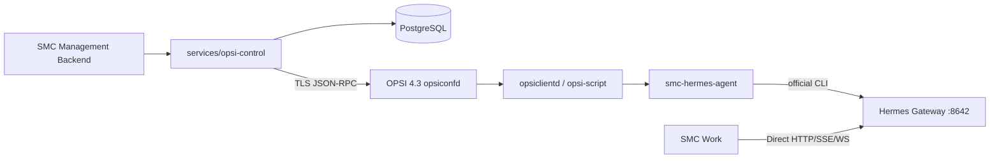

# SMC Copilot OPSI Endpoint Control Plane v1.1 PRD

## Real Endpoint Closure + Pilot Readiness

版本：v1.1  
日期：2026-08-14  
基线分支：`opsi/prd-v1.0`  
基线提交：`a2e6b2426f88ebb073c9d6f87b2148d1f82e3030`  
目标平台：OPSI 4.3、Windows 10、Windows 11

## 1. 文档定位

v1.0 已建立 OPSI 平行 Endpoint Control Plane 的仓库结构、契约、FastAPI 服务骨架、OPSI Product 脚本骨架，以及 Work `opsi` Availability-only 模式。

v1.1 不扩大功能目录，而是把 v1.0 从“代码已实现”推进到“真实 Endpoint 可运行、结果可收敛、证据可签署、具备 Pilot 准入条件”。

本版本的最终交付不是大规模生产推广，而是：

```text
真实 OPSI 4.3 Server
    → 真实 .opsi Package
    → Windows 10 / Windows 11 Endpoint
    → Hermes 精确版本安装与用户态启动
    → Gateway :8642 Healthy
    → Work Direct Hermes Ready
    → Action Result / Diagnostic 可关联
    → 24h Development Observation
    → v1.2 Pilot Go / No-Go
```

## 2. v1.0 基线结论

### 2.1 已完成的工程基础

- `infra/opsi`、`services/opsi-control`、`contracts/opsi`、`docs/opsi` 已建立。
- Work 已支持 `direct | salt | opsi | runtime` control owner，OPSI 与 Salt 共用外部托管 Availability-only 语义。
- OPSI Control 已具备 Client、Product、Action、Policy、Result、Diagnostics API 骨架。
- JSON Schema、OpenAPI、Alembic、OIDC/JWKS 骨架和隔离检查已加入。
- Product 已定义 `setup | update | uninstall | custom` 与基础 PowerShell Adapter。

### 2.2 2026-08-14 实测基线

```text
services/opsi-control pytest       17 passed / 1 skipped
services/opsi-control ruff         passed
Work OPSI/Salt owner tests         13 passed
Product Pester                     4 passed
Product Python contract tests      1 failed / 4 passed
npm run contracts:check            failed: contracts/opsi/openapi.yaml drift
Live OPSI 4.3 Lab                  NO-GO / not_proven
Windows 10/11 Live Matrix          NO-GO / not_proven
```

### 2.3 必须修复的真实性缺口

1. 当前 `makepackage.py` 生成的是 ZIP smoke artifact，只是使用 `.opsi` 后缀；没有调用真实 `opsi-makepackage`。
2. Artifact 缺失时 `Install-Hermes.ps1` 仍会写入版本和 owner 并返回成功，存在 false success。
3. Machine/User Bootstrap 路径不一致；Scheduled Task 未绑定明确用户 SID，用户脚本也未实际安装/启动 Hermes。
4. setup/update/custom 没有完整传递 `client_id`、Gateway、Config、Repair 等 client-specific Properties。
5. `Write-SmcActionResult` 的 checksum 在写入最终 `sha256/bytes` 前计算，无法证明最终文件内容。
6. Redaction 是文本正则替换，可能修改字段名但保留字段值，不构成结构化 Secret Redaction。
7. Managed Config 只写 OPSI 自身 `current.json`，未合并到 Hermes 配置、未运行 `hermes config check`、未按需重启。
8. Health 仅检查本地版本 marker 和 HTTP health，未覆盖 CLI、config、doctor、disk、profile、port ownership。
9. Diagnostics 只尝试读取一个并未持续生产的 `adapter.log`，服务端也没有 Diagnostic Result producer。
10. OPSI Control 在 HTTP 请求内同步 dispatch；`action_dispatcher` / `result_reconciler` 没有通过 lifespan/worker 启动。
11. Policy API 忽略 `keys`，仅传递 Revision，终端无法取得受管配置内容。
12. SQL Repository 每次操作独立 commit，无 Request UoW、唯一约束、FK、lease 和并发幂等保护。
13. OPSI RPC 对象字段与调用仍未通过真实 Server 证明；`productPropertyState` 的 `values` 语义和 `log_read(logType, objectId, maxSize)` 必须按 OPSI 4.3 实际接口修正。
14. `/ready` 未检查 PostgreSQL、Secret Provider、Migration Head；OPSI 凭据仍直接来自 Settings。
15. v1.0 plan 将实机验收 todo 标成 completed，但 Evidence 仍是 `NO-GO / not_proven`；代码状态不得替代现场证据。

## 3. 产品目标

v1.1 必须完成：

```text
Real OPSI Package
Signed Artifact Verification
Transactional Install / Update / Rollback
Explicit User Binding and User-context Bootstrap
Gateway Autostart / Health / Recovery
Revision-based Hermes Config Apply
Deterministic Health and Diagnostics
Durable Async Action Dispatch
Result Reconciliation and Aggregate Status
Production Readiness / Secret Provider
Windows 10 + Windows 11 Live Proof
24h Development Observation
```

## 4. 非目标

v1.1 不建设：

```text
OPSI Server HA
Multi-depot rollout orchestration
10~20 台 Pilot 批次编排
Production 全量发布
Salt ↔ OPSI 自动迁移
Runtime ↔ OPSI 自动迁移
实时日志 Streaming
完整 5 MiB Bundle 中央下载通道
AI/LLM RCA
Skills / Plugins / MCP Catalog 管理
Work OPSI Job UI
Renderer OPSI Credentials / RPC Client
```

这些能力进入 v1.2 或后续版本评估。

## 5. 架构冻结



固定规则：

- OPSI 与 Salt 实现继续完全隔离。
- Runtime Endpoint Control Plane 继续冻结。
- `opsi-control` 不直接连接 Windows Endpoint、Hermes 或 Work。
- Work 不调用 `opsi-control`，不显示 OPSI Job，不持有 OPSI 凭据。
- `smc-hermes-agent` 不常驻、不监听端口、不承载 Chat。
- Endpoint 只能有一个 lifecycle owner。
- OPSI/Control 离线不能影响已经运行的 Gateway 与 Chat。

## 6. 状态与证据模型

v1.1 强制区分：

```text
implemented  代码、自动化、模板已经存在
verified     自动化在干净环境通过
proven       授权操作员在真实 OPSI/Windows 环境执行并归档证据
```

规则：

- Cursor/CI 可以写 `implemented`、`verified`。
- 只有授权操作员可写 `proven`、Live `PASS` 和 Go/No-Go 签署。
- Mock/Fake、ZIP smoke、Template、Dry Run 不得作为 Live Evidence。
- 历史 plan 的 `completed` 只代表代码任务完成，不改变 `docs/opsi/evidence/**` 的结论。

## 7. 功能需求

### 7.1 F1 — Real OPSI Package and Release Artifact

#### 真实包

- CI smoke archive 改用 `.zip` 或 `.smoke.zip` 后缀，禁止伪装成 `.opsi`。
- 在受控 OPSI Linux Builder 使用真实 `opsi-makepackage` 生成 `.opsi`。
- 用 `opsi-package-manager -i` 只发布到明确 Lab Depot；生产发布仍需人工审批。
- `control.toml` 必须由 OPSI 4.3 工具解析验证。

#### Hermes Artifact

- Product 必须包含或引用精确版本的 Hermes Artifact、SHA256、大小、平台、发布 Revision 和 Ed25519 签名。
- Endpoint 在写 active version 前验证完整 manifest、SHA256 和签名。
- Artifact 缺失、签名无效、版本不一致必须 fail closed，不能写 owner、version 或 success result。
- 私钥不得进入仓库、OPSI Package、Product Property 或 Endpoint。

#### 版本治理

```text
productVersion = Hermes exact version
packageVersion = SMC package revision
```

- 禁止 `latest`。
- 同版本重打包必须增加 packageVersion。
- 保留 current / previous 两个可回退 Package 与 manifest。

### 7.2 F2 — Endpoint Transaction Engine

安装与更新状态机：

```text
PRECHECK
→ VERIFY_ARTIFACT
→ STAGE_MACHINE
→ PREPARE_USER_BOOTSTRAP
→ WAIT_USER_CONTEXT
→ INSTALL_USER_RUNTIME
→ START_GATEWAY
→ VERIFY_GATEWAY
→ COMMIT_OWNER
→ SUCCEEDED
```

失败路径：

```text
FAILED
→ RESTORE_PREVIOUS_VERSION
→ RESTORE_PREVIOUS_OWNER
→ RESTORE_PREVIOUS_GATEWAY
→ VERIFY_ROLLBACK
```

要求：

- Journal 按 `request_id` 持久化 phase、attempt、previous/target version、previous owner、error code。
- 相同 request/payload 是幂等 replay；相同 request/different digest 拒绝。
- `USER_CONTEXT_PENDING` 是非终态，不能写 SUCCEEDED。
- `control-owner=opsi` 只能在目标用户 Gateway health 成功后原子提交。
- 当前 owner 为 `salt` 或 `runtime` 时 fail closed；v1.1 不自动做 Provider Migration。
- Uninstall 只删除 OPSI-managed machine files/tasks，保留所有 Hermes 用户数据。

### 7.3 F3 — Explicit User Binding

Action Target 增加显式 User Binding：

```json
{
  "clientId": "client-a.example",
  "userBinding": {
    "sid": "S-1-5-21-...",
    "account": "DOMAIN\\user"
  }
}
```

要求：

- setup/update 必须有已验证 binding；禁止使用 `LastLoggedOnUserSID` 作为生产真值。
- `managed_user_sid`、`managed_user_account` 只写 client-specific Properties，不得成为 Product Default。
- SYSTEM 通过 SID 从 ProfileList 解析路径；不按用户名猜 `C:\Users\...`。
- Scheduled Task 明确绑定目标 Principal、Interactive Logon、Least Privilege；不得以 SYSTEM 运行 User Bootstrap。
- 无用户登录时保持 `WAIT_USER_CONTEXT`，用户登录后继续同一 request。
- 双用户并发时只处理绑定 SID，不影响其他用户 Hermes Home。

### 7.4 F4 — Hermes Install, Gateway and Health

- User Bootstrap 必须实际执行 Hermes 安装/激活、版本验证、配置检查和 Gateway 启动。
- 优先使用 Hermes 官方 CLI，不修改内部数据库，不按进程名强杀 Python。
- Gateway port 必须为 `127.0.0.1:<managed_port>`；默认 8642。
- Health 必须检测 installed/version/CLI/config/profile/doctor/process/port/HTTP/disk。
- 端口被未知进程占用时返回 `GATEWAY_PORT_CONFLICT`，不自动 kill。
- Scheduled Task/native autostart 必须在 reboot、logout/login 后恢复 Gateway。

### 7.5 F5 — Revision Config Apply

- Policy API 必须持久化完整、已验证的 `managed-config` payload，不再丢弃 `keys`。
- Endpoint 通过 request-specific manifest 或批准的 OPSI client-specific property reference 获取配置内容。
- 配置应用顺序固定：backup → merge allowlist → write temp → `hermes config check` → atomic commit → optional restart → health。
- 仅写 Enterprise Managed keys；用户模型、Profile、Skills、Plugins、Memory、Session、Workspace 不变。
- stale revision 拒绝；same revision + same digest 幂等；same revision + different digest 冲突。
- 失败恢复 backup，并验证旧 Gateway 可用。

### 7.6 F6 — Diagnostics and Redaction

- 建立结构化 recursive redaction：按 key、value pattern、Authorization header、URI credential 处理。
- Redaction 后再计算最终 bytes/SHA256；文件内容、marker、服务端记录三者必须一致。
- 收集 Hermes status/doctor/config check、Gateway health、OPSI Adapter logs 和受控日志尾部。
- 禁止读取 Chat、Session、Memory、Workspace、User Documents、`.env`。
- Endpoint 保留最大 5 MiB 本地 Bundle；通过 instlog 回传最大 256 KiB 的 redacted compact diagnostic sections 和 manifest。
- `opsi-control` 解析 compact result，生成 DiagnosticRecord；API 返回服务器已恢复的 summary、files、checksum 与 endpoint-local bundle reference。
- 完整 Bundle 中央下载留到 v1.2。

### 7.7 F7 — OPSI RPC Fidelity

- 在真实 OPSI 4.3 Server 固化 request/response fixtures。
- `productPropertyState` 使用真实对象字段和 `values` list 语义。
- `log_read` 使用 `logType=instlog`、`objectId=clientId`、bounded `maxSize`。
- Dispatch 前验证 client、depot product version/package version、target user binding 和 exact Hermes version。
- 写 Property 后按 `(productId, propertyId, objectId)` 精确回读，比较 normalized values。
- `productOnClient` 状态映射必须覆盖 actionRequest/actionProgress/actionResult/installationStatus/lastAction/modificationTime。
- 写 RPC 不盲目自动重试；超时后通过 read-after-write 判断是否已应用。

### 7.8 F8 — Durable Action Control

API 请求只负责验证和持久化：

```text
POST /actions
→ transactionally create request + targets + audit
→ return QUEUED
```

后台 Worker：

```text
Dispatcher
→ claim target lease
→ validate OPSI state
→ write properties
→ read-back
→ set actionRequest
→ persist dispatch snapshot

Reconciler
→ poll productOnClient
→ read bounded instlog
→ validate marker/result checksum
→ update target/result/diagnostic
→ recompute aggregate status
```

要求：

- Worker 在 FastAPI lifespan 中启动/停止，或作为独立 worker 进程；部署模型必须唯一且可观察。
- PostgreSQL 增加 FK、唯一约束、attempt、lease、deadline、updated_at、property digest、OPSI observation。
- 使用 Request-scoped UoW；idempotency create 在数据库事务中完成。
- 多实例 Worker 通过 lease/`SKIP LOCKED` 防止重复 dispatch。
- 服务重启后恢复 QUEUED/DISPATCHED/RUNNING。
- UNKNOWN 在 deadline 后成为可审计终态，不无限轮询；人工重试使用新 request_id。
- Aggregate：全部成功→SUCCEEDED；任一运行→RUNNING；终态混合含失败→FAILED；超时无结果→UNKNOWN。

### 7.9 F9 — Production Composition

- `/ready` 检查 DB、Alembic Head、OPSI RPC、Secret Provider 和 Worker heartbeat。
- OPSI Service Credential 必须来自 Secret Provider，禁止 production `.env` plaintext password。
- JWKS Client 缓存与刷新，验证 issuer/audience/exp/nbf/kid；scope 保持最小权限。
- `HttpOpsiJsonRpc` 使用复用连接池、TLS 校验、response size、request correlation 和脱敏错误。
- 生产模式拒绝 Fake/InMemory、默认 secret、HTTP RPC、缺失 Secret Provider、未迁移 DB。

### 7.10 F10 — Work Compatibility

- Work 继续只探测 Hermes Gateway，不访问 OPSI Server/Control。
- OPSI owner 下所有本地 install/update/doctor/restart 入口继续拒绝。
- Gateway 从 unavailable 恢复后 Retry/定时 probe 可进入 READY。
- OPSI Server/Control 离线且 Gateway Healthy 时 Chat、Session、Attachment 不受影响。
- v1.1 不新增 `window.opsiApi` 或 OPSI Job UI。

## 8. API 与契约版本

- `opsiControlApi`：`1.0.0 → 1.1.0`。
- 现有路径保持兼容；新增字段优先 optional。
- Action Request 增加 target `userBinding`、payload digest/attempt/deadline 等服务端投影。
- Endpoint State、Action Result、Diagnostic、Managed Config 必须在 Product 和 Service 两侧使用同一 JSON Schema fixtures。
- OpenAPI 必须由 FastAPI 重新生成并通过 drift check。
- 如必须删除/重命名公开字段，改为 `opsiControlApi 2.0.0` 并单独 ADR；不得在 v1.1 静默 breaking。

## 9. 安全要求

- Product scripts 使用 manifest hash + signature 验证，不声称“signed”但实际未签名。
- ProgramData OPSI 目录 ACL：SYSTEM/Administrators write；目标用户只读所需 staging，用户结果目录按最小权限。
- 禁止 `ExecutionPolicy Bypass` 作为生产信任机制；使用签名脚本或显式 hash verification 后执行。
- 所有外部字符串先做 schema/allowlist/length validation，再进入 CLI argv。
- 不在日志写 OPSI password、OIDC token、signed URL、Hermes credential。
- Diagnostic secret canary 测试必须证明 key/value/URI/header 均被删除。

## 10. 测试与证据

### 自动化

- `pytest infra/opsi/tests` 必须在 CI 真正执行，不能只直接运行测试文件。
- Windows Runner 执行 Pester 行为测试，不只做文本存在性断言。
- Contract fixtures 验证 Product 输出、Pydantic 输出和 JSON Schema 一致。
- PostgreSQL 做 migration cycle、并发 idempotency、双 worker lease、restart recovery。
- Mock JSON-RPC 增加真实 OPSI fixtures，验证 `values`、`log_read` 参数和状态映射。
- `npm run contracts:check` 必须通过。
- Work OPSI/Salt regression 必须通过。

### 实机

至少两台：

```text
Endpoint A: Windows 10
Endpoint B: Windows 11
OPSI Server: 4.3, version/license/modules recorded
```

覆盖：

- 两 Client 不同 operation/request_id 并发隔离。
- Fresh setup、user logon continuation、Gateway health、Work connect。
- exact update、失败 rollback、用户数据 hash 不变。
- config 12→13、invalid config rollback。
- status、restart-gateway、collect-log、diagnose、L1/L2 repair。
- reboot、logout/login、port conflict、disk low、OPSI offline、Control restart。
- Uninstall 保留用户数据。
- Secret canary 在 Property、instlog、result、diagnostic、service log 中均不可出现。

### 观察期

- 两台 Development Endpoint 连续 24 小时。
- Gateway availability、action success、reconcile latency、unknown rate、secret leak 均有记录。
- 任一 P0/P1、Secret Leak、owner conflict、false success 立即 NO-GO。

## 11. v1.1 验收场景

### AC-01 Real Package

真实 `opsi-makepackage` 生成包并安装到 Lab Depot；OPSI 能读取 Product/Properties，Package manifest 与签名验证通过。

### AC-02 Fresh Install with User Handoff

SYSTEM staging 后无用户时保持 pending；目标 SID 登录后安装 Hermes、启动 Gateway、健康通过，最后才提交 owner=opsi。

### AC-03 Durable Dispatch

创建 200-target request 时 API 快速返回 QUEUED；Worker 分批 claim；服务重启后继续且每 target 不重复 dispatch。

### AC-04 Result Closure

API → Property → ActionRequest → Endpoint result → instlog → Reconciler → API 使用同一 request/client/checksum，最终 aggregate 正确。

### AC-05 Config Rollback

合法 12→13 成功；非法 14 自动恢复 13，并保持 Gateway healthy。

### AC-06 Update Rollback

新版本 health 失败后恢复 previous version、previous owner 和 Gateway；用户数据 hash 不变。

### AC-07 Diagnostics

Compact diagnostic 可从 API 获取；本地 Bundle 完整；所有 secret canary 和用户业务数据均未出现。

### AC-08 Control Plane Offline

断开 OPSI Server 与 `opsi-control`，已运行 Gateway 和 Work Chat 继续工作；恢复后 action reconciliation 收敛。

## 12. 发布阶段

```text
Phase A  Engineering Closure
Phase B  OPSI 4.3 Lab / 2 endpoints
Phase C  24h Development Observation
Phase D  Security + Release Signoff
Phase E  v1.2 Pilot Go / No-Go
```

v1.1 不自动进入 10~20 台 Pilot。只有 Phase E = GO 后，v1.2 才建设 Pilot rollout、批次、暂停和回滚编排。

## 13. Definition of Done

- [ ] Product Contract test、OpenAPI drift 和全量 CI 通过。
- [ ] 真实 `.opsi` 包由 OPSI Builder 生成并安装到 Lab Depot。
- [ ] Artifact 缺失/签名失败无法产生 version/owner/success。
- [ ] User Binding、pending continuation、Gateway start/health 完成。
- [ ] Config、Health、Diagnostics、Repair 是真实 Hermes 动作，不是仅写 marker。
- [ ] Action API 异步持久化，Worker lease/restart/reconcile 完成。
- [ ] Result/Diagnostic checksum 与最终内容一致。
- [ ] Production readiness 检查 DB/OPSI/Secret/Worker。
- [ ] Windows 10 + Windows 11 实机矩阵 proven。
- [ ] 24h Development Observation proven。
- [ ] Salt/Runtime 实现路径无 OPSI 功能改动。
- [ ] Work Direct Hermes 与 OPSI Offline AC 通过。
- [ ] Security 与 Release Signoff 完成。
- [ ] v1.2 Pilot Go/No-Go 归档。

