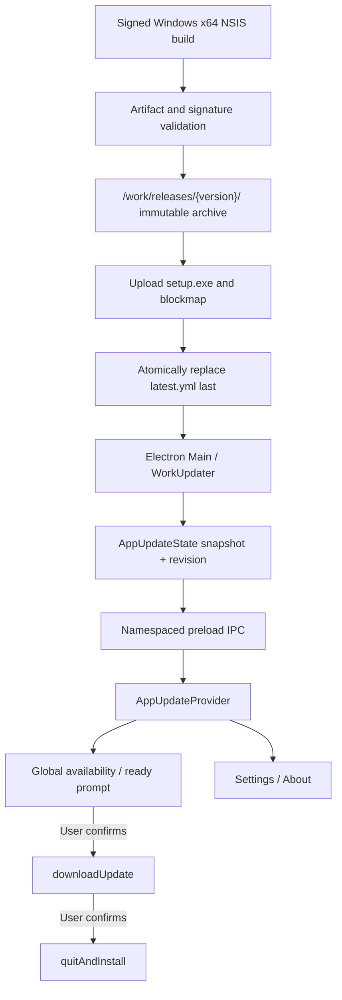

# PRD-WORK-v2.0 实施方案 — Windows Release & Internal Auto Update

- **项目**：SMC Copilot
- **模块**：`apps/work`
- **文档类型**：实施方案 PRD（优化版）
- **文档状态**：Draft / 待 IDM-01、CUTOVER-01 评审
- **基线版本**：`0.7.4`
- **目标平台**：Windows 10/11 AMD64
- **技术栈**：Electron 39 + React 19 + electron-builder 26 + electron-updater 6 + NSIS
- **编制日期**：2026-08-18

## 1. 执行摘要

本方案将 `apps/work` 的桌面应用更新收敛为 Windows 专用、用户确认下载、用户确认安装、Main Process 持有状态真相、企业 HTTPS 静态源分发的更新链路。

与输入版 `PRD-WORK-v2.0` 相比，本实施方案新增或修正以下关键设计：

1. **下载与安装分别授权**：同时固定 `autoDownload=false` 和 `autoInstallOnAppQuit=false`；“稍后安装”后正常退出不得偷偷安装。
2. **无丢事件同步**：Main Snapshot 增加单调递增 `revision`；Renderer 先订阅、再取快照并按 revision 合并，关闭订阅/快照之间的竞态。
3. **后台失败不打断业务**：启动/周期检查失败只记日志并保留可操作状态；仅手工检查或下载失败进入用户可见错误。
4. **企业端负载打散**：启动检查为 15–60 秒抖动，周期检查为 6 小时并带 ±10% 抖动，避免客户端同时请求 `latest.yml`。
5. **Windows 边界明确**：v2.0 Updater 只在 packaged Windows NSIS 构建启用；开发、portable legacy、macOS、Linux 不访问生产更新源。
6. **补齐升级源切换的启动悖论**：已安装的 `0.7.4` 只认识旧 GitHub feed，无法自行发现仅存在于内网的新版本；必须使用一次性 Bridge Release 或人工/企业部署迁移。
7. **应用身份迁移设门禁**：直接更改 `appId`、`productName`、安装范围会影响 NSIS 升级识别、快捷方式和 `userData` 路径，不能当作普通 YAML 改名。
8. **签名顺序修正**：签名必须在 electron-builder 生成 blockmap/metadata 的构建链路内完成；禁止在生成 `latest.yml` 后再修改安装包而不重建 metadata。
9. **回滚语义澄清**：stable 指针回退只能阻止未升级客户端继续升级，不能自动降级已升级客户端；生产恢复采用 forward-fix。

## 2. 当前实现核验

以下结论已基于当前仓库核验，不是仅引用输入 PRD：

| 领域         | 当前事实                                                   | 风险                                |
| ------------ | ---------------------------------------------------------- | ----------------------------------- |
| 包身份       | `package.json` 为 `copilot-desktop@0.7.4`                  | 与 SMC Work 品牌不一致              |
| Windows 构建 | 同时生成 NSIS 和 portable                                  | portable 不适合作为企业自动更新目标 |
| 安装范围     | `oneClick=true`、`perMachine=false`                        | 当前为 per-user                     |
| 发布源       | `electron-builder.yml` 指向 `fathah/hermes-desktop` GitHub | 企业客户端依赖外部 feed             |
| Main Updater | `src/main/app/updater.ts::setupUpdater`                    | 可配置自动下载、仅启动后检查一次    |
| 自动安装     | 当前 `autoInstallOnAppQuit=true`                           | 与“用户决定安装时机”冲突            |
| Preload      | 暴露四类离散事件和 auto-upgrade preference                 | 契约重复且状态不完整                |
| Renderer     | `Layout.tsx` 与 `useSettingsData.ts` 各维护一套状态        | 丢事件、状态漂移、重复下载风险      |
| 日志         | `<userData>/logs/updater.log`，512 KB 轮转                 | 可复用，但需结构化字段              |
| App 身份     | Windows AppUserModelId 仍为 `com.hermes.desktop`           | 改名范围不止 builder 配置           |
| 用户数据     | auth、GPU、配置等依赖 `app.getPath("userData")`            | productName 改名可能表现为数据丢失  |

`apps/work/lat.md/desktop-updates.md` 也记录了当前 GitHub feed、Settings auto-upgrade preference 和 Layout/Settings 双监听模型；代码实施后必须同步更新该知识节点。

## 3. 目标、非目标与不变量

### 3.1 目标

- `apps/work` 使用独立 SemVer，版本唯一来源为 `apps/work/package.json`。
- Windows AMD64 正式包只发布 NSIS 安装包、blockmap 和 `latest.yml`。
- 新客户端只从企业 HTTPS Generic Provider 检查更新。
- 应用自动检查，但未经用户操作不下载、不安装。
- Main Process 是更新状态唯一真相；Renderer 可恢复任意已发生事件后的最新状态。
- 更新失败不阻塞 Hermes、Chat、Files、Task 或应用启动。
- 发布产物经过 Authenticode 签名、metadata/hash 验证和上一版本到新版本实机升级。

### 3.2 非目标

- 不增加 Windows Service、Update Agent、FastAPI Update API 或 OPSI 更新链路。
- 不绑定 Hermes Agent 版本，不制作 Work/Hermes 合并安装包。
- 不在 v2.0 实现静默下载、静默安装或强制重启。
- 不承诺自动降级；回退 stable 指针不等于客户端 rollback。
- 不让 Renderer 传入任意 feed URL、文件路径、认证 header 或签名策略。
- 不为 macOS/Linux 发布 v2.0 Generic feed；这些平台的现有构建脚本不代表具备该更新能力。

### 3.3 强制不变量

```text
Auto Check     = Enabled on packaged Windows NSIS only
Auto Download  = Disabled
Auto Install   = Disabled
Download       = Explicit user action
Install        = Explicit user action after READY
State SOT      = Electron Main Process
Release Source = Internal HTTPS Generic Provider
Artifact Trust = sha512 metadata + Authenticode verification
```

## 4. 关键产品与架构决策

### 4.1 DEC-UPD-01：Main Snapshot + revision

`electron-updater` 事件只在发生时广播，不能作为可恢复状态。Main 维护完整 Snapshot，并在每次可见变更时递增 `revision`。

Renderer 初始化顺序固定为：

```text
注册 app-update:state-changed
        ↓
调用 app-update:get-state
        ↓
只接受 revision 更大的状态
```

即使事件发生在 React 挂载前、订阅后取快照期间或 Settings 从未打开，最终状态都可收敛。

### 4.2 DEC-UPD-02：两个用户确认点

- 发现版本：只提示，不下载。
- 用户点击“下载更新”：进入下载。
- 下载完成：提示“稍后”或“立即重启安装”。
- 用户点击“稍后”：不调用 installer，普通退出也不安装。
- 用户点击“立即重启安装”：才调用 `quitAndInstall(false, true)`。

因此 Main 必须设置：

```ts
autoUpdater.autoDownload = false;
autoUpdater.autoInstallOnAppQuit = false;
```

### 4.3 DEC-UPD-03：后台检查静默、用户操作可见

启动/周期检查失败不得把已有 `available`、`downloading` 或 `ready` 状态覆盖为错误。后台失败记录 `updater.log`，等待下一轮。

手工检查、用户发起下载或用户发起安装失败时，返回可重试的用户安全错误；详细堆栈只进 Main 日志。

### 4.4 DEC-UPD-04：调度与并发

- 首次检查：应用 ready 后 15 秒基础延迟 + 0–45 秒随机抖动。
- 周期检查：6 小时 + ±10% 抖动，每次重新计算下一次定时器。
- `checking` 时复用同一检查 Promise；`downloading` 时复用同一下载 Promise。
- `available`、`downloading`、`ready`、`installing` 时跳过后台检查，避免覆盖可操作状态。
- 应用退出时清理 timer；Updater timer 不得阻止进程退出。

### 4.5 DEC-UPD-05：Windows-only capability

只有同时满足以下条件才初始化真实 Updater：

```text
process.platform === "win32"
app.isPackaged === true
PORTABLE_EXECUTABLE_DIR 未设置
```

其他环境返回 `supported=false` 的 Snapshot，且不读取生产 feed。

### 4.6 IDM-01：应用身份迁移门禁

直接从以下旧身份切换：

```text
appId          com.nousresearch.hermes
productName    Copilot Desktop
executableName copilot-desktop
perMachine     false
```

到新身份会同时改变安装注册、卸载项、快捷方式、AppUserModelId 和默认 `userData` 目录。必须在以下两种路径中评审选择一种：

**推荐路径 A：保留技术升级身份。** v2.0 保留 legacy `appId` 作为不可见的升级兼容 ID，只改变可见品牌、产物名和应用内文案；显式迁移或固定 `userData`。`appId` 的最终更名另走受管重装。

**路径 B：强制新 appId。** 若必须使用 `com.smc.work`，本次视为产品迁移而不是普通 auto-update：签名 bootstrap installer 检测旧安装、备份并迁移 `userData`、确认新应用可启动后再卸载旧项。不得默认认为 electron-updater 会完成无副作用的原位升级。

在 IDM-01 完成两个真实安装版本的验证前，不得发布新身份到 stable。

### 4.7 CUTOVER-01：旧 GitHub feed 迁移门禁

已安装的 `0.7.4` 只会查询其包内配置的 GitHub Provider。把新版本只上传到内网不会触达这些客户端。

可接受的迁移路径：

1. **一次性 Bridge Release（推荐）**：构建一个包内已指向 Generic Provider 的签名版本；相同的安装包、blockmap、`latest.yml` 仅一次上传旧 GitHub feed 和内网 stable。安装 Bridge 后，后续只访问内网。
2. **绝对禁止 GitHub 时**：通过人工或企业部署安装一次签名迁移包。此路径不是 auto-update，必须单独记录覆盖率和回退方案。

禁止长期保留双 feed，也禁止客户端运行时在 GitHub 与内网之间自动 fallback。

### 4.8 INST-01：安装目录

`oneClick=false + perMachine=true + allowToChangeInstallationDirectory=true` 只表示管理员安装和允许选择目录，并不能保证默认目录是 `D:\Programs\SMC\Work`。

推荐默认使用 `%ProgramFiles%\SMC Work`，允许管理员选择企业目录。若组织强制 D 盘，必须新增经过签署的 NSIS include，并处理无 D 盘、磁盘不足、旧路径升级、UAC 和卸载；不能只修改 YAML 后宣称验收通过。

### 4.9 SIGN-01：签名与 metadata 顺序

证书必须在 electron-builder 构建时可用，使最终安装包先签名，再基于最终字节生成 blockmap 和 `latest.yml`。发布脚本只验证，不在 metadata 生成后原地修改 EXE。

若安装包在构建后被重新签名，必须重新生成 blockmap、sha512 和 `latest.yml`，否则下载校验必然失配。

## 5. 目标架构



Release Server 只提供匿名只读 HTTPS GET，不持有客户端 Secret，不提供业务 API。

## 6. 统一 App Update Contract v2

新增 `apps/work/src/shared/app-update.ts`，由 Main、Preload、Renderer 共同引用。

```ts
export type AppUpdateStatus =
  | "idle"
  | "checking"
  | "available"
  | "downloading"
  | "ready"
  | "installing"
  | "uptodate"
  | "error";

export type AppUpdateErrorCode =
  | "CHECK_FAILED"
  | "DOWNLOAD_FAILED"
  | "UPDATE_METADATA_INVALID"
  | "SIGNATURE_INVALID"
  | "INSTALL_FAILED";

export interface AppUpdateError {
  code: AppUpdateErrorCode;
  operation: "check" | "download" | "install";
  source: "startup" | "scheduled" | "manual";
  message: string;
  retryable: boolean;
  at: string;
}

export interface AppUpdateState {
  schemaVersion: 2;
  revision: number;
  supported: boolean;
  status: AppUpdateStatus;
  currentVersion: string;
  availableVersion: string | null;
  releaseDate: string | null;
  releaseNotes: string | null;
  percent: number | null;
  transferred: number | null;
  total: number | null;
  bytesPerSecond: number | null;
  error: AppUpdateError | null;
  checkedAt: string | null;
  updatedAt: string;
}
```

约束：

- `revision` 仅由 Main 增加，Renderer 不生成 revision。
- `releaseNotes` 在 Main 归一化为字符串并限制长度；兼容 electron-updater 的 string/array 形态。
- 进度数值在 Main 校验为有限非负数，percent 限制在 0–100。
- IPC 返回结构化克隆，不暴露 Updater instance、文件路径、证书信息或请求 header。
- Channel 名集中定义为 `app-update:get-state`、`app-update:check`、`app-update:download`、`app-update:install`、`app-update:state-changed`。

## 7. Main WorkUpdater 行为

### 7.1 状态映射

| electron-updater / 操作 | AppUpdateState   | 关键数据                         |
| ----------------------- | ---------------- | -------------------------------- |
| 初始化                  | `idle`           | currentVersion、supported        |
| `checking-for-update`   | `checking`       | 清理旧 check error               |
| `update-available`      | `available`      | version、date、notes             |
| `update-not-available`  | `uptodate`       | checkedAt                        |
| 用户调用 download       | `downloading`    | 初始化 progress                  |
| `download-progress`     | `downloading`    | percent、transferred、total、bps |
| `update-downloaded`     | `ready`          | 保留 availableVersion            |
| 用户调用 install        | `installing`     | 写 installRequested 日志         |
| 手工操作 error          | `error`          | 结构化、可重试错误               |
| 后台 check error        | 保持原可操作状态 | 只写日志；idle/checking 回 idle  |

### 7.2 合法操作

- `check`：允许从 `idle`、`uptodate`、check error 发起；可选允许 `available` 手工刷新，但不得清除已知版本。
- `download`：只允许 `available` 或明确的 download error；其他状态返回当前 Snapshot，不重复启动。
- `install`：只允许 `ready`；其他状态拒绝且不启动任意进程。
- `error -> download` 必须确认错误的 operation 为 `download` 且 availableVersion 仍存在，不能把 check error 误当下载重试。

### 7.3 日志

继续复用 `updaterLogger`，增加结构化字段：

```text
event, currentVersion, availableVersion, providerKind,
source, revision, durationMs, result, errorCode
```

不得记录 token、cookie、证书私钥、请求认证 header 或用户聊天内容。

## 8. Preload 与 Renderer

### 8.1 Preload API v2

```ts
getUpdateState(): Promise<AppUpdateState>;
checkForUpdates(): Promise<AppUpdateState>;
downloadUpdate(): Promise<AppUpdateState>;
installUpdate(): Promise<AppUpdateState>;
onUpdateStateChanged(callback: (state: AppUpdateState) => void): () => void;
```

`getAppVersion()` 可保留为通用应用信息 API。旧 auto-upgrade preference 和四类离散 updater listeners 在所有 Renderer 消费者迁移后同一发布内删除，不形成长期兼容层。

### 8.2 AppUpdateProvider

Provider 挂载在 `ThemeProvider`、`FontProvider` 内，业务 Screen、Runtime 和 Settings 生命周期外。它负责：

- 订阅后取 Snapshot，并按 `revision` 单调合并。
- 提供 `check`、`download`、`install` action 和 derived capability。
- 记录本运行周期 `dismissedVersion`；“稍后提醒”只关闭相同版本弹窗，不改变 Main Snapshot。
- 新 availableVersion 到达时自动清除旧 dismissedVersion。
- `ready` 提示可稍后关闭，但保留全局状态入口。

Provider 不自行推导下载完成、不虚构版本、不保存 feed URL。

### 8.3 Release Notes 安全

Release Notes 视为不可信发布内容：

- 默认使用纯文本或 ReactMarkdown 的安全子集。
- 不启用 raw HTML，不执行脚本，不渲染 iframe/object。
- 链接仅允许 `https:`；外链仍通过现有 Main 安全边界打开。
- 限制长度，超限截断并写日志。

### 8.4 Settings 与全局提示

- `Layout`、全局提示、Settings/About 只调用 `useAppUpdate()`。
- `useSettingsData` 删除 desktop update 本地 state、listeners 和 auto-upgrade preference。
- About 继续显示当前版本、最新版本、状态、检查、下载进度、安装和错误。
- Hermes Agent Update 保持独立，不与 SMC Work Update 合并。

## 9. Windows 构建与发布

### 9.1 Builder 目标配置

在 IDM-01 决策落地后，Windows 可见配置目标为：

```yaml
productName: SMC Work
win:
  executableName: smc-work
  target:
    - nsis
nsis:
  artifactName: smc-work-${version}-setup.${ext}
  shortcutName: SMC Work
  uninstallDisplayName: SMC Work
  oneClick: false
  perMachine: true
  allowElevation: true
  allowToChangeInstallationDirectory: true
  createDesktopShortcut: always
  createStartMenuShortcut: true
publish:
  provider: generic
  url: ${env.SMC_WORK_UPDATE_URL}
  channel: latest
```

`SMC_WORK_UPDATE_URL` 在正式构建时注入并必须为企业 HTTPS stable 根路径。Release script 对缺失、非 HTTPS、含占位符或非 stable 路径的值 fail closed。

### 9.2 构建入口

新增 `apps/work/scripts/build-work-release.ps1`，正式链路为：

```text
读取 package.json version
  → npm ci
  → npm run guard
  → npm run typecheck
  → npm test
  → electron-builder --win nsis --x64 --publish never
  → Authenticode verify
  → latest.yml schema/version/file/sha512 verify
  → blockmap 与文件名 verify
  → SHA256SUMS.txt
  → release/work/{version}/
```

脚本不得上传生产文件；上传是独立授权步骤。Secret 只从 CI Secret Store/证书存储读取，不写入仓库、日志或产物目录。

### 9.3 产物

```text
release/work/{version}/
├── smc-work-{version}-setup.exe
├── smc-work-{version}-setup.exe.blockmap
├── latest.yml
└── SHA256SUMS.txt
```

package version、安装包文件名和 `latest.yml.version` 必须一致。正式构建不存在 portable 产物。

### 9.4 Release Server

```text
/work/stable/
├── latest.yml
├── smc-work-{version}-setup.exe
└── smc-work-{version}-setup.exe.blockmap

/work/releases/{version}/
└── 同版本不可变归档
```

- EXE/blockmap 使用版本化 URL，可长期缓存并启用 immutable。
- `latest.yml` 使用短缓存或 `no-cache` + ETag，不使用 immutable。
- 先上传 EXE，再上传 blockmap，服务端验证后最后原子替换 `latest.yml`。
- 发布后从客户端所在网络执行 HTTPS GET、长度、sha512 和 Authenticode 验证。
- 客户端只读，不持有上传凭据。

## 10. 迁移与发布阶段

### Phase 0 — 决策与基线

- 完成 IDM-01、CUTOVER-01、安装目录、正式 URL、证书 publisher identity 的签署。
- 保存 `0.7.4` 安装包和可恢复测试环境。
- 建立当前 package/typecheck/test/guard 基线。

### Phase 1 — Updater Core

- 统一 Contract、Main Snapshot/revision、手工下载/安装、调度、日志。
- Preload v2 和全局 Provider。
- Layout/About 迁移并删除 auto-upgrade preference。
- 此阶段不发布生产包。

### Phase 2 — Windows Packaging

- 按 IDM-01 实施身份方案、NSIS、x64、generic provider、portable 移除。
- 同步 package-lock、AppUserModelId、窗口/托盘/i18n 可见名称。
- 完成 legacy userData/安装项迁移测试。

### Phase 3 — Release Pipeline

- 完成签名构建、产物验证、只读归档和原子 stable 发布 runbook。
- 用临时测试 HTTPS 源验证，不直接操作生产 stable。

### Phase 4 — Bridge / Bootstrap

- 按 CUTOVER-01 执行一次迁移。
- Bridge 路径须证明安装后 `app-update.yml` 只指向企业 Generic Provider。
- 记录迁移覆盖率；禁止长期双 feed。

### Phase 5 — Live Update

- 真实安装旧版本，发布新版本，完成发现、稍后、下载、进度、稍后安装、重启安装和版本确认。
- 真实验证 userData、登录状态、Hermes 配置、Chat/Files 不丢失。
- 人工签署后才允许 stable 面向全部客户端。

## 11. 测试策略

### 11.1 Unit / Component

- Main：事件到状态映射、revision 单调、后台错误不覆盖 ready、重复 check/download、状态非法操作、scheduler jitter、dev/non-Windows no-network。
- Preload：方法与 type surface 一致，回调 cleanup 正确，无任意 URL/路径参数。
- Provider：订阅/快照竞态、旧 revision 拒绝、dismiss 同版本、新版本重新提示。
- UI：available、progress、ready、retry、release notes、安全链接、键盘焦点和按钮 disabled。

### 11.2 Packaged Integration

必须覆盖：

1. 当前版本低于 latest。
2. 当前版本等于 latest。
3. 当前版本高于 latest，不自动 downgrade。
4. server offline、metadata 404/invalid、installer 404、中断、hash 错误、signature 错误。
5. 下载完成选择稍后，普通退出不安装。
6. 再次启动后可继续发现或复用已下载版本，行为可解释且不损坏当前版本。
7. per-user 到 per-machine / identity 迁移路径。
8. 自定义目录与默认目录的原位升级。
9. Release Server 使用客户端真实代理、TLS 和 DNS 环境。

### 11.3 Release Gate

```text
npm ci                         PASS
npm run guard                  PASS
npm run typecheck              PASS
npm test                       PASS
Windows x64 NSIS build         PASS
Authenticode signature         PASS
latest.yml / blockmap / hash   PASS
Installed smoke               PASS
Previous → new live update     PASS
userData continuity            PASS
ordinary quit after Later      DOES NOT INSTALL
```

## 12. 验收标准

| AC    | 验收结果                                                     |
| ----- | ------------------------------------------------------------ |
| AC-01 | packaged Windows 启动后 60 秒内开始首次检查；抖动范围可测试  |
| AC-02 | available 后网络层没有 installer GET，直到用户点击下载       |
| AC-03 | 提示显示当前版本、新版本、安全 release notes、稍后和下载     |
| AC-04 | 稍后只抑制同版本当前运行周期提示，不下载、不禁用检查         |
| AC-05 | 点击下载进入 downloading，并防止重复调用                     |
| AC-06 | 进度显示 percent、transferred、total；非法数值不进入 UI      |
| AC-07 | ready 后显示稍后和立即重启安装                               |
| AC-08 | 选择稍后后普通退出不安装；只有明确安装操作才调用 installer   |
| AC-09 | 从未打开 Settings 也能通过 Main Snapshot 收到更新状态        |
| AC-10 | Layout、全局提示、About 的 revision 和状态一致               |
| AC-11 | feed 不可用时 Work、Hermes、Chat、Files 正常运行             |
| AC-12 | dev、portable legacy、non-Windows 不访问 production feed     |
| AC-13 | 正式目录含已签名 setup、blockmap、latest.yml，版本/hash 一致 |
| AC-14 | IDM-01 路径证明无并存僵尸安装、无 userData 丢失              |
| AC-15 | CUTOVER-01 后新客户端只访问企业 Generic Provider             |

## 13. 预计代码影响面

| 位置                                                  | 目标改动                                        |
| ----------------------------------------------------- | ----------------------------------------------- |
| `apps/work/src/shared/app-update.ts`                  | 新增共享 Contract 与 channel 常量               |
| `apps/work/src/main/app/updater.ts`                   | Snapshot、revision、状态机、手工授权、scheduler |
| `apps/work/src/main/updater-log.ts`                   | 结构化安全日志                                  |
| `apps/work/src/preload/index.ts` / `index.d.ts`       | 收敛 IPC v2                                     |
| `apps/work/src/renderer/src/update/`                  | Provider、hook、全局提示                        |
| `apps/work/src/renderer/src/App.tsx`                  | Provider 全局挂载                               |
| `Layout.tsx` / `AboutPane.tsx` / `useSettingsData.ts` | 删除重复状态与 preference                       |
| `apps/work/package.json` / `package-lock.json`        | 产品版本与包身份同步                            |
| `apps/work/electron-builder.yml`                      | Windows NSIS / Generic Provider / artifact      |
| `apps/work/src/main/app/start.ts`                     | 可见名称、AppUserModelId、必要的迁移入口        |
| `apps/work/scripts/build-work-release.ps1`            | 签名构建和产物验证                              |
| `apps/work/lat.md/desktop-updates.md`                 | 实现完成后记录真实新架构                        |

该表是影响面，不是一次提交必须同时修改的文件清单。实施必须按阶段拆分，每阶段保持可验证。

## 14. 风险与缓解

| 风险                              | 缓解                                              |
| --------------------------------- | ------------------------------------------------- |
| 旧客户端无法发现内网 feed         | CUTOVER-01 Bridge 或人工 bootstrap                |
| 改 appId 导致并存安装             | IDM-01 独立门禁和真实迁移测试                     |
| productName 改变 userData         | 显式迁移/固定路径，迁移前备份，失败不删除旧数据   |
| per-machine 更新需要 UAC          | signed NSIS、elevation 实机测试、无管理员权限负例 |
| 同时检查造成源站峰值              | startup/interval jitter 与缓存策略                |
| 后签名破坏 sha512                 | builder 内签名，metadata 对最终字节生成           |
| 恶意 release notes                | 不渲染 raw HTML，https link allow-list            |
| stable 指针回退被误认为 downgrade | 文档明确 forward-fix，禁用 allowDowngrade         |
| 背景错误遮蔽 ready                | 背景错误不覆盖可操作状态                          |
| 普通退出意外安装                  | `autoInstallOnAppQuit=false` + packaged test      |

## 15. Definition of Done

Work v2.0 只有在以下条件全部满足后才完成：

- Main Snapshot 是唯一更新状态源，所有 Renderer 消费者使用同一 revision。
- packaged Windows 自动检查；所有平台都不自动下载或安装。
- “稍后安装”后的普通退出已证明不会安装。
- Internal Generic HTTPS 是迁移后唯一运行时 feed，无 token、无 GitHub fallback。
- IDM-01 与 CUTOVER-01 有书面选择、测试证据和签署。
- 最终安装包签名有效，blockmap/latest.yml 与最终字节一致。
- 旧到新实机升级成功，用户数据和核心业务能力不丢失。
- `npm run guard`、`npm run typecheck`、`npm test` 与 `lat check` 全部通过。
- 生产 stable 发布由人工授权，Cursor/CI 不伪造签署或 Live Evidence。

## 16. 当前 Cursor 实施切片

本 PRD 对应的首份 Cursor plan 为 `.cursor/plans/work-v2.0-updater-core.plan.md`，只实施 Phase 1 的 Contract、Main Snapshot、Preload 和 Renderer SOT 收敛。

身份迁移、生产签名、Bridge Release、stable 上传和实机签署必须在 IDM-01/CUTOVER-01 决策后另建计划，不得由首个代码切片提前执行。
